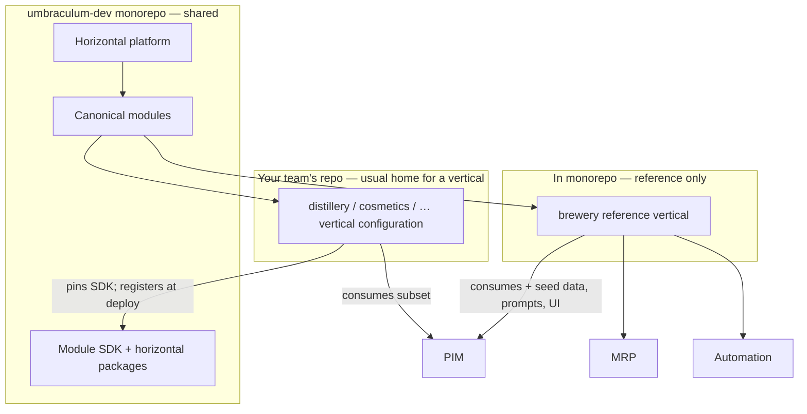

# Umbraculum glossary

**Tier:** Public  
**Status:** v1.2 — living document (2026-05-31; optional/uninstall FAQ for reference vertical)  
**Audience:** new contributors, evaluators, module developers, self-hosting operators — anyone who hits unfamiliar words in other docs before reading the full architecture stack.

> **Start here when confused.** This page defines the words Umbraculum uses *precisely*. They are not interchangeable. For the module ecosystem catalog and decision tree, continue to [`MODULES.md`](MODULES.md). For platform vision and AI consultant depth, continue to [`PLATFORM-ARCHITECTURE.md`](PLATFORM-ARCHITECTURE.md).

---

## How to use this page

1. **Skim the [Core taxonomy](#core-taxonomy)** first — `vertical`, `canonical`, and `brewery` account for most first-week confusion.
2. **Read [Where code lives](#where-code-lives--shared-backbone-vs-your-vertical)** if you wonder whether your product belongs in this GitHub repo (usually: no — backbone yes, vertical no).
3. **Follow the source-of-truth link** in each row when you need governance detail (RFCs, code paths).
4. **Apply the [documentation convention](#documentation-convention--citing-brewery)** when you write or review docs that mention brewery.

Topic-scoped glossaries still exist elsewhere and complement this page:

| Doc | Scope |
|---|---|
| [`MODULES.md`](MODULES.md) §2 | Module ecosystem vocabulary (`package`, reserved codes, module SDK) |
| [`design/application-surfaces-vs-platform-backbone.md`](design/application-surfaces-vs-platform-backbone.md) §3 | Product layering (workspace web UI, API service, storefront vs marketing) |
| [`PLATFORM-ARCHITECTURE.md`](PLATFORM-ARCHITECTURE.md) §9 | AI, billing, and platform engineering terms (BYOK, RAG, soft cap, …) |
| [`TENANCY-AND-ACL.md`](TENANCY-AND-ACL.md) §2 | Workspace, membership, roles |

---

## Documentation convention — citing brewery

**When a doc says *brewery* (or *brewery vertical*) without another qualifier, it means the shipped reference vertical configuration in this monorepo** — module `code: "brewery"`, Tier 6, under [`modules/verticals/brewery/`](modules/verticals/brewery/README.md).

It does **not** mean:

- Umbraculum is a brewery-only product (the platform is industry-agnostic; manufacturing is a stress test, not the boundary — see [`PLATFORM-ARCHITECTURE.md`](PLATFORM-ARCHITECTURE.md) §1.1).
- Every deployment must run the brewery vertical (workspaces install the vertical configurations they need).
- `brewery` is a canonical module (it is **not** — see [vertical configuration](#vertical-configuration) below).

**Preferred phrasing in new prose:** *brewery (reference vertical)* or *the brewery reference vertical* on first mention in a doc that is not brewery-specific. Brewery-domain docs may use *brewery* alone after the header establishes context.

**Examples of what brewery demonstrates:** seed data (BJCP styles, BeerJSON), vertical-flavored packages (`@umbraculum/brewery-*`), brew-day UX, OpenPLC sister-repo coupling — all as a **worked example** of how a team builds a specific product on Umbraculum, not as the platform identity.

---

## Core taxonomy

These terms are the minimum set for reading any other doc without getting lost.

| Term | Plain-language meaning | Umbraculum-specific meaning | Source of truth |
|---|---|---|---|
| **Umbraculum** | The open-source project and monorepo you are in. | A **toolset** (not just a library): code, modules, SDKs, shared layout code, docs, CI, and the Cursor authoring apparatus — the whole foundation for workspace-shaped operational apps. | [`README.md`](../README.md); [`PLATFORM-ARCHITECTURE.md`](PLATFORM-ARCHITECTURE.md) §1.1 |
| **Toolset** | A complete toolbox plus discipline for using it. | Deliberate positioning vs "framework": includes canonical boundaries, quality gates, and contributor apparatus — not only runtime packages. | [`PLATFORM-ARCHITECTURE.md`](PLATFORM-ARCHITECTURE.md) §1.1 |
| **Horizontal platform** | Shared backbone every product built here reuses. | Auth, workspace, billing, AI orchestrator, i18n, navigation, rendering, notifications boundary, observability — **does not change** when you add a new vertical product. | [`PLATFORM-ARCHITECTURE.md`](PLATFORM-ARCHITECTURE.md) §2; [`application-surfaces-vs-platform-backbone.md`](design/application-surfaces-vs-platform-backbone.md) |
| **Canonical module** | *(technical)* A reserved operational domain the platform owns at most one shipped implementation of. | Registered with a **`code` from a closed set** (`automation`, `pim`, `mrp`, `crp`, `wms`, `crm` today). Four coordinated slices: API + web + native + contracts package. Tier 1, mini-RFC gated. | [RFC-0001](rfcs/0001-modules-tiers-governance-and-automation-placement.md); [`MODULES.md`](MODULES.md) §2–§3.1 |
| **Vertical configuration** | *(plain)* **A specific product a developer team builds with Umbraculum** — e.g. a brewery ops suite, a distillery suite, a cosmetics batch tracker. | Same physical **β shape** as a canonical module (four slices), but the `code` is **not** in the reserved set. Tier 6, permissionless. **Consumes** canonical modules; does not reimplement their domains. **Usually ships in the builder's own repo/deployment**, not in the Umbraculum monorepo — see [Where code lives](#where-code-lives--shared-backbone-vs-your-vertical). | [RFC-0001](rfcs/0001-modules-tiers-governance-and-automation-placement.md) §5; [`MODULES.md`](MODULES.md) §3.2 |
| **Vertical** (short) | The industry or domain flavor of a vertical configuration. | Shorthand for *vertical configuration* in docs — **not** a separate tier name. "Brewery vertical" = the `brewery` vertical configuration. | This page; [`PLATFORM-ARCHITECTURE.md`](PLATFORM-ARCHITECTURE.md) §1.1.1 |
| **Reference vertical (`brewery`)** | The **example product** shipped in-repo to prove the toolset. | First vertical configuration on the platform: brew-day logging, recipes, water chemistry, etc. **Showcase**, not platform identity. Sister-repo OpenPLC is the multi-runtime pattern example. | [`modules/verticals/brewery/README.md`](modules/verticals/brewery/README.md); [`PLATFORM-ARCHITECTURE.md`](PLATFORM-ARCHITECTURE.md) §1.1 |
| **Reserved canonical code** | A string only the core team may allocate to a new canonical domain. | Closed set in `RESERVED_CANONICAL_MODULE_CODES`; collision at `registerModule()` is a boot error. | [`packages/module-sdk/src/reservedCodes.ts`](../packages/module-sdk/src/reservedCodes.ts); [RFC-0001](rfcs/0001-modules-tiers-governance-and-automation-placement.md) §4 |
| **Package** | An npm workspace under `packages/<name>/`. | A **build/publish unit** — not necessarily a module. Horizontal infrastructure packages have no module `code`. | [`MODULES.md`](MODULES.md) §2; [`REPOSITORY-STRUCTURE.md`](REPOSITORY-STRUCTURE.md) |
| **Module SDK** | The npm package third-party module authors pin. | `@umbraculum/module-sdk` — `registerModule()`, reserved-code validation, `ValidatedSchema<T>`, document templates. MIT-licensed. | [`packages/module-sdk/README.md`](../packages/module-sdk/README.md) |
| **β layout (beta layout)** | The four-slice physical shape of every module. | API slice (`services/api/src/modules/<code>/`), web slice (`apps/web/app/[locale]/(<code>)/`), native slice (`apps/native/src/modules/<code>/`), contracts package (`packages/<code>-contracts/` or vertical-flavored names). | [RFC-0002](rfcs/0002-canonical-module-physical-layout.md) |
| **Workspace** | A tenant boundary — the org/team using the app. | Replaces older "Account" wording in API routes (`/workspaces`, `active_workspace_id`). AI consultant and billing are workspace-scoped. | [`TENANCY-AND-ACL.md`](TENANCY-AND-ACL.md) |
| **Workspace web UI** | The app workspace members use daily. | Federated web + native (and UT webapp) UI — **not** a shopper storefront, **not** the marketing site. | [`application-surfaces-vs-platform-backbone.md`](design/application-surfaces-vs-platform-backbone.md) §3 |

### Three clarifications people stumble on

1. **"Is `brewery` a canonical module?"** **No.** It is a **vertical configuration**. The category mistake: building "a CRM for a hotel and calling it `Hotel` instead of `crm`" — the hotel is the vertical; CRM is the canonical domain ([RFC-0001](rfcs/0001-modules-tiers-governance-and-automation-placement.md) §4; [`MODULES.md`](MODULES.md) §2).

2. **"Is `@umbraculum/i18n` a module?"** **No.** It is a horizontal **package** — no `code`, no registration. Modules consume it.

3. **"Does canonical mean official/s blessed in English?"** Here it means **one reserved domain, one shipped implementation shape** — peer operational modules (`mrp`, `wms`, …), not "more important than verticals." Vertical configurations are first-class products; they are non-canonical only in the **governance/code-allocation** sense.

4. **"Does my vertical belong in the Umbraculum GitHub repo?"** **Usually no.** Canonical modules and the horizontal **core/backbone** are what this monorepo shares with everyone. Your vertical product is what **your team** ships — typically its **own repository**, npm packages, and deployment — pinned to `@umbraculum/module-sdk` and the canonical modules you consume. **`brewery` in this repo is the exception** (reference + stress test), not the default home for every vertical. See [Where code lives](#where-code-lives--shared-backbone-vs-your-vertical).

5. **"Can I uninstall the brewery reference vertical?"** **Not as a one-click product feature today** — see [`BUILDING-YOUR-VERTICAL.md`](BUILDING-YOUR-VERTICAL.md) (Magento `SampleData` parallel, today vs target). Short version: stock monorepo build always boot-registers brewery; omitting it is custom-deploy/fork territory until **H1 2027 F-mod** (optional reference vertical / platform-without-brewery install) lands with workspace entitlements — [`ROADMAP.md`](ROADMAP.md) post-α wave table + H1 2027 mature scope.

---

## Where code lives — shared backbone vs your vertical

**Yes, this distinction makes sense — and it is easy to misread the repo.**

Because **`brewery` lives inside `umbraculum-dev`**, newcomers often assume every vertical will land here. That is **not** the normal model. The monorepo is the **shared toolset**: platform core, canonical modules, SDKs, shared layout, native bootstrap, and docs. A **vertical configuration** is the **product a team sells or operates for one industry** — built *on* that backbone, **usually maintained and shipped separately**.

| Layer | Who owns it | Typical home | In `umbraculum-dev` today? |
|---|---|---|---|
| **Horizontal platform** (auth, workspace, billing, AI, i18n, rendering, …) | Umbraculum core / community | This monorepo | **Yes — shared** |
| **Canonical modules** (`pim`, `mrp`, `wms`, `crm`, `automation`, …) | Umbraculum core / community (Tier 1 governance) | This monorepo (β slices + contracts packages) | **Yes — shared** |
| **Module SDK + horizontal packages** | Umbraculum core (MIT SDK) + contributors | This monorepo; published to npm | **Yes — shared** |
| **Vertical configuration** (your industry product) | **Integrator, ISV, or in-house team** (Tier 6 — permissionless) | **Your repo**, your packages, your deploy | **Usually no** |
| **Reference vertical (`brewery`)** | Core team (worked example) | This monorepo + optional sister repos (OpenPLC) | **Yes — exception** |

**Integration shape:** your vertical registers into a runtime that already includes the platform and whichever canonical modules the workspace installed — via `registerModule()`, vertical-flavored npm packages, and HTTP/API boundaries. You do not fork Umbraculum core to add a distillery; you **compose** on top of it. Procedure: [`modules/contribute/vertical-configuration.md`](modules/contribute/vertical-configuration.md).

### Analogies from other ecosystems

These are **pedagogical parallels**, not one-to-one product comparisons. They clarify *where shared platform ends and your product begins*.

| Ecosystem | **Shared core** (everyone reuses) | **Vertical / industry product** (usually separate) | Umbraculum mapping |
|---|---|---|---|
| **[Odoo](design/ecosystem-case-study-odoo.md)** | Odoo platform + standard apps (CRM, Inventory, Accounting, …) in the community codebase | Partner/industry modules (OCA repos, integrator addons, customer-specific implementations) — e.g. a food-manufacturer workflow bundle maintained by an integrator, not merged into Odoo SA core | **Canonical modules + platform** ≈ shared domain apps; **your vertical** ≈ integrator's industry module set in **their** repo |
| **[Magento](design/ecosystem-case-study-adobe-magento.md)** | Magento Open Source core (`magento/magento2`) | Agency extensions, themes, and merchant stacks — Composer packages and project repos; **not** committed into core | **This monorepo** ≈ core + canonical surface; **your vertical** ≈ agency/vendor packages the merchant stack **depends on** |
| **[Omnis Studio](design/ecosystem-case-study-omnis.md)** | Studio platform (IDE + runtime) from the vendor | National/sector **vertical ERPs** owned by resellers and software houses — separate products, often proprietary, maintained for *their* customers | **Open Umbraculum backbone** ≈ what we refuse to lock inside one vertical owner; **vertical** ≈ what a software house ships **for its market** — ideally in **open, forkable** repos, not hidden `.lbs` libraries |

**Takeaway:** In all three stories, **platform and domain modules are shared infrastructure**; **the vertical is the integrator's product layer**. Umbraculum names that layer **vertical configuration** (Tier 6). The **`brewery` tree in this repo** exists so contributors can see a **complete, inspectable example** — the same role a reference implementation plays in Odoo training or a Magento sample module — **not** because every customer's vertical belongs in the core organization's monorepo.

**Multi-runtime note:** even when part of a vertical lives elsewhere (brewery's OpenPLC sister repo, firmware, PLC logic), the **TypeScript/API/web/native slices** of *your* vertical still normally live in **your** repository; only the reference vertical is co-located here for teaching and CI proof.

---

## Product surfaces and layering

| Term | Meaning | Do not confuse with |
|---|---|---|
| **API service** | HTTP monolith: Fastify routes, Prisma, jobs | Operator UI, "admin theme" |
| **Command-line shell** | bash/sh (or similar) for CI scripts, Docker Compose, and local dev commands | Platform shared layout, UT Morph wrapper |
| **Platform shared layout** | Persistent UI frame in `apps/web` (nav, footer, auth bar, providers). Path: `app/_shared-layout/` — see [backbone §3.7](design/pre-flip-application-surface-backbone.md) | Page-internal layout; `@umbraculum/native-shell` |
| **Workspace-member app** | Same as **workspace web UI** — one audience, one AI context | B2C shopper app |
| **Module registration** | Boot-time `registerModule()` / `registerWebModule()` / `registerNativeModule()` | Runtime shared layout registration (partially deferred) |
| **Public surface (marketing)** | Static orientation site (`apps/website`) | Operational "public API" |
| **Storefront / commerce** (future) | Separate deployable; read-only consumer of PIM/CRM | PIM admin UI inside workspace web UI |
| **UT Morph webapp wrapper** | Ubuntu Touch Click package wrapping `apps/web` in Morph | Native React Native on Linux mobile; Qt/QML rewrite |

See [`design/ubuntu-touch-shell-strategy.md`](design/ubuntu-touch-shell-strategy.md) for UT delivery terms.

---

## Canonical vs vertical — one picture

A **future vertical** (distillery, cosmetics, food-batch) would normally sit in **your repository**, same tier and β shape as `brewery`, still consuming canonical modules — not replacing them. Only **`brewery`** is co-located in `umbraculum-dev` as the shipped reference example.

---

## Platform, AI, and billing (index)

Full definitions: [`PLATFORM-ARCHITECTURE.md`](PLATFORM-ARCHITECTURE.md) §9.

| Term | One line |
|---|---|
| **AI consultant** | Workspace-scope assistant; cornerstone that motivates monorepo + canonical discipline |
| **BYOK** | Bring Your Own Key — workspace supplies provider API key |
| **Tool call** | Model-invoked read-only backend function (ACL-aware) |
| **RAG** | Retrieval-augmented generation — knowledge chunks in the prompt |
| **Managed AI** | Future mode where Umbraculum hosts the provider key and bills via credits |
| **Soft cap / hard cap** | Warn vs block on usage limits |
| **Vertical-flavored package** | npm scope `@umbraculum/<vertical>-<name>` (e.g. `@umbraculum/brewery-core`) — not a module by itself |

---

## Related docs (reading order)

1. [`GLOSSARY.md`](GLOSSARY.md) — terminology  
2. [`BUILDING-YOUR-VERTICAL.md`](BUILDING-YOUR-VERTICAL.md) — **start here if you build product X on Umbraculum** (vertical bootstrap + omitting brewery; Magento parallel)  
3. [`PLATFORM-ARCHITECTURE.md`](PLATFORM-ARCHITECTURE.md) — vision and shape  
3. [`MODULES.md`](MODULES.md) — ecosystem catalog  
4. [`ROADMAP.md`](ROADMAP.md) — what ships and what is next  
5. [`GETTING-STARTED.md`](GETTING-STARTED.md) — first-time contributor tutorial  

When editing docs, follow the brewery convention in [§ Documentation convention](#documentation-convention--citing-brewery) and the terminology tokens in [`DOCS-README-STANDARDS.md`](DOCS-README-STANDARDS.md) §3.
