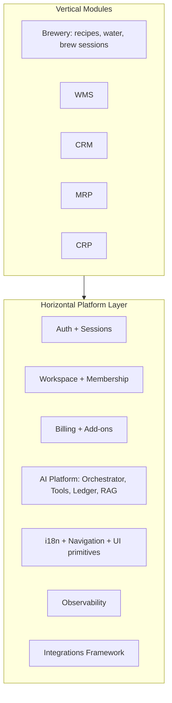
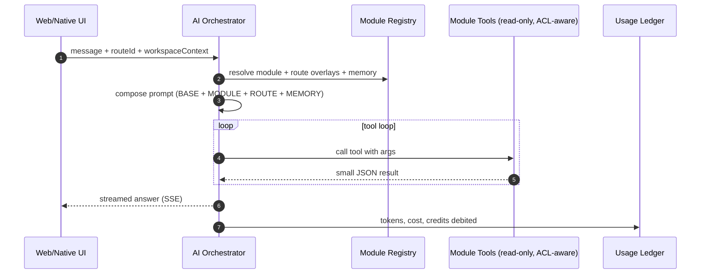

# `<PLATFORM_NAME>` — Platform Architecture & Vision

**Tier:** Public
**Status:** v1.0 (living document)
**Audience:** product, engineering, and architecture conversations.
**Token convention:** the placeholder `<PLATFORM_NAME>` is used everywhere the brand will appear. Search/replace it once a real brand is chosen — do not hand-edit individual occurrences.

---

## 1. Purpose and audience

This is the **high-level entry point** for any discussion about the shape of `<PLATFORM_NAME>`: where the system is today, where it is going, and how to keep new work consistent with that direction. It is intentionally **vision-and-shape** focused — implementation specifics still live in domain documents.

How it relates to the existing architecture log:

- [`docs/architechture-Rev02.md`](architechture-Rev02.md) remains the **implementation log of the brewery vertical** and the cross-platform (web + native) boundary decisions. It is still the source of truth for *what is implemented today* and the v0 phasing.
- This document owns the **platform/vision narrative**: the horizontal-platform-with-vertical-modules pattern, the AI consultant blueprint, and the pricing model for AI add-ons.

When the two disagree, this document wins for "where we are going" questions, and Rev02 wins for "what is already wired up" questions.

### 1.1 Positioning — process-manufacturing platform, brewery-configured by default

`<PLATFORM_NAME>` is a **process-manufacturing platform**. The brewery vertical is the **first vertical configuration** of that platform — it ships with brewery-specific data (BJCP styles, BeerJSON, hop bitterness math, water-chemistry models) and brewery-specific UI flows, but the *underlying primitives* — recipes-as-bills-of-materials, equipment profiles as constrained resources, brew sessions as scheduled production orders, ingredient-and-water inputs as process specifications — are the same primitives any batch process manufacturer needs.

This framing matters for three reasons:

1. **The market is much larger than "breweries".** Distilleries, kombucha producers, food manufacturers, cosmetics, supplement and nutraceutical producers, fine chemical batch operations, fragrance houses, and others all consume the same core primitives with different vertical configurations. Positioning the platform as "process-manufacturing, brewery-configured by default" rather than "a brewery app" expands the addressable market by roughly an order of magnitude **without changing the product** — the same code base, with vertical-specific seed data and prompts.
2. **MRP and CRP are not new modules — they are a generalization of what the brewery vertical already does.** Promoting the brewery production-planning subsystem to first-class generic capability is dramatically cheaper than building MRP/CRP from scratch. The trajectory in [`docs/ROADMAP.md`](ROADMAP.md) reflects this.
3. **The AI consultant story scales with this framing.** "An AI for breweries" sells one vertical. "An AI for your process-manufacturing operation, with brewery-domain knowledge included" sells the same product to a much larger pool of buyers, plus opens the door to community-contributed vertical configurations (cosmetics, food, distillery) without writing them ourselves.

The brewery vertical remains a first-class showcase — both as a working customer-facing product and as a reference implementation for how other vertical configurations should be shaped. Subsequent vertical configurations are expected to plug in primarily through **seed data, prompts, and configuration**, not by re-implementing the core.

---

## 2. Vision — horizontal platform + vertical modules

**Pattern.** `<PLATFORM_NAME>` is a **horizontal platform** (auth, workspace, billing, AI, i18n, navigation, observability, integrations) hosting one or more **vertical modules** (Brewery first; later WMS, CRM, MRP, CRP, …). A *module* is a self-contained vertical that owns its routes, services, Prisma models, AI tools, prompts, knowledge sources, UI screens, i18n strings, and tier-limit contributions, and registers all of those into the horizontal platform at boot.

**Why this pattern.** Modern ERP buyers expect AI-native, multi-module suites; legacy ERPs (SAP, Oracle, NetSuite) are bolting AI onto crusty foundations. A greenfield horizontal-platform-with-vertical-modules shape lets us:

- ship one vertical at a time without forking the codebase,
- reuse one billing engine, one auth stack, one AI layer across all verticals,
- charge per module as add-ons (matches modern SaaS purchasing patterns),
- treat the brewery vertical as the **first** vertical, not the product itself.



Brewery is **shipped**; WMS / CRM / MRP / CRP are **open doors** — explicitly anticipated in the architecture but not yet implemented.

### 2.1 Distribution & business model

`<PLATFORM_NAME>` is **open source** by design — not as a marketing tactic, but as the structural foundation for long-term sustainability with a small team, trust with operational customers, and a defensible position against hyperscaler capture.

**License posture** (rationale in [`docs/LICENSING.md`](LICENSING.md)):

- **Core platform**: AGPLv3.
- **SDK / contracts / public interface packages** (the surface third-party modules depend on): MIT.
- **Commercial dual license** available for enterprises whose policies cannot accommodate AGPLv3 (same source, alternative terms).

**Revenue lines** (target: bread-and-butter sustainability for a small team, not venture-scale exit):

1. **Managed hosting** — `<PLATFORM_NAME>` operated as a service. The dominant revenue line; pairs with the AGPL stance because hyperscaler imitation is structurally deterred.
2. **AI credits** — usage-metered AI consultant access for hosted customers (see §7).
3. **Enterprise support contracts** — for self-hosters and hosted customers that need SLAs, dedicated infrastructure, or operator support.
4. **Optional commercial license** (§6.3 of [`docs/LICENSING.md`](LICENSING.md)) — for enterprises whose legal teams cannot adopt AGPLv3.

**Self-host posture (first-class, not an afterthought).** The platform must be installable on commodity Postgres + Node + a single VPS; no AWS-specific or other cloud-vendor-specific dependencies in the core. Every external service (AI providers, Stripe, RevenueCat, S3-compatible storage, error reporting) is configured via environment variables and can be swapped or omitted. Self-hosters bring their own keys.

**AI provider integration — BYOK and resold credits both supported, from day one.** This is the explicit decision that resolves §8 open question 1: *both* paths exist in parallel. Hosted customers use resold credits as described in §7; self-hosters bring their own OpenAI / Anthropic / etc. keys. The orchestrator code is identical in both modes; only the billing wrapper differs.

**What is *not* in the business model:**

- No closed-source replacement of public modules.
- No enterprise-only paywall on bug fixes or security patches.
- No future-dated re-licensing of existing source code.

These are explicit commitments documented in [`docs/LICENSING.md`](LICENSING.md) §9, changeable only via the public RFC process there.

### 2.2 Governance & community

The single biggest determinant of an open-source project's long-term health is **how welcome contributors feel** — not the license, not the technology, not the marketing. The Magento → Mage-OS history makes this concrete: Adobe inherited a permissive license and a thriving community, and lost the community by making contribution unwelcome.

Governance principles, in priority order:

1. **Public contribution from day one.** All meaningful changes go through public PRs with public review, including changes made by founders and core maintainers. The "private fork that occasionally pushes large drops" pattern is not used.
2. **RFC process for breaking changes.** Public-comment RFCs (minimum 30 days) for any change that affects: license terms, governance, the module SDK's public surface, the AI tool contract, billing model, or anything else that downstream depends on. RFC process is the same one used for license changes ([`docs/LICENSING.md`](LICENSING.md) §10).
3. **No CLA that grants unilateral re-licensing rights.** Contributors retain their copyright; the project signs commits via Developer Certificate of Origin (DCO). This is a deliberate constraint against the failure mode that enabled the HashiCorp / Elastic re-licensings.
4. **Code of conduct from the first public release.** Modeled on Contributor Covenant.
5. **Decision transparency.** Major decisions are recorded — in RFCs for changes, in this document for architectural direction, in [`ROADMAP.md`](ROADMAP.md) for trajectory. New contributors should be able to read why something is the way it is, not just *that* it is.
6. **Trademark protection separate from license.** The platform name and logo remain commercial property of the founding entity (eventually possibly a foundation); the source license does not include trademark rights. This is the same separation used by WordPress, Linux Foundation projects, and Plausible.

The aim is to be **honest about commercial realities** (this is a project that pays for groceries, not a foundation-only effort) while keeping community contribution genuinely first-class — the opposite of the open-core trap that fragmented the Magento ecosystem.

---

## 3. Where we are today — audit (read-only snapshot)

Honest inventory of what is already platform-shaped versus what is brewery-coupled. File references are deliberately concrete so this doc remains trustworthy without re-reading the codebase.

### 3.1 Backend — `services/api/`

**Already horizontal:**

- All cross-cutting plugins under [`services/api/src/plugins/`](../services/api/src/plugins/): `prismaPlugin`, `redisClientPlugin`, `sessionAuthPlugin`, `requestContextPlugin`, `errorHandlerPlugin`, `webhookRawBodyPlugin`.
- Authentication and session management: [`services/api/src/routes/auth.ts`](../services/api/src/routes/auth.ts).
- Workspace + membership: [`services/api/src/routes/workspaces.ts`](../services/api/src/routes/workspaces.ts).
- Billing intents and workspace billing summary: [`services/api/src/routes/billing.ts`](../services/api/src/routes/billing.ts).
- Stripe + RevenueCat webhook ingestion: `webhooksStripe.ts`, `webhooksRevenuecat.ts`.
- Health: `health.ts`.

**Brewery-vertical (fine for now, but flagged):**

- `recipes.ts`, `recipesImport.ts`, `recipesExport.ts`, `platformRecipes.ts`.
- `waterCalc.ts`, `waterProfiles.ts`, `recipeWaterSettings.ts`, `recipeWaterHubSummary.ts`, `recipeWaterComputeAndSave.ts`.
- `equipmentProfiles.ts`, `brewdaySettings.ts`, `brewSessions.ts`.
- `ingredients.ts`, `styles.ts`, `inventory.ts`.
- Brewing-device integrations: `integrationsTilt.ts`, `integrationsTiltIngest.ts`, `integrationsReveal.ts`, `integrationsGeneric.ts`.
- Ads: `ads.ts`, `platformAds.ts` (the framework is reusable, the placements are brewery-flavored).

**Cross-cutting today, but brewery-shaped:**

- [`services/api/src/services/tierLimitsService.ts`](../services/api/src/services/tierLimitsService.ts) defines limits as `{ maxRecipesPerWorkspace, maxVersionsPerRecipe }`. Correct shape for a brewery-only product, wrong shape for a multi-module suite (WMS will want `maxWarehouses`, CRM will want `maxContacts`, AI will want `monthlyCredits`).

**Registration shape:**

- [`services/api/src/app.ts`](../services/api/src/app.ts) registers every route group flat — no module-bundle pattern yet. This is a **gap, but cheap to add later** because Fastify is already plugin-composed and the route groups are already isolated.

### 3.2 Frontend — `apps/web/app/[locale]/`

**Horizontal:**

- `(auth)`, `about`, `contact`, `accessibility`, `i18n-contributing`, `contributing`, `platform`.

**Brewery-vertical:**

- `recipes`, `inventory`, `equipment`, `water-profiles`, `brewday-steps-settings`, `ferm-data-integration`.

**No Next.js route grouping by module today.** All paths sit at the top level under `[locale]`. Adopting `(brewery)/recipes`, `(wms)/stock`, etc. is a zero-URL-change reorganization (Next.js route groups don't appear in URLs), worth doing once a second module ships.

### 3.3 Shared packages — `packages/*`

All packages currently share the npm scope `@brewery/*`. Functionally they already split into two groups:

**Already horizontal (will become "platform" packages):**

- `@brewery/i18n` — locales + shared messages.
- `@brewery/i18n-react` — universal `useT` hook (web + native).
- `@brewery/navigation` — route IDs + cross-platform routing policy.
- `@brewery/api-client` — fetch boundary + auth (cookie web, bearer native).
- `@brewery/ui` — Tamagui primitives.
- `@brewery/media` — shared image assets + manifest.
- `@brewery/contracts` — DTOs / shared types.
- `@brewery/test-mcp` — testing tools server.

**Brewery-vertical (will become "module" packages):**

- `@brewery/core` — brewing calculations and unit conversions.
- `@brewery/recipes-ui` — domain UI for recipes, water, yeast.
- `@brewery/beerjson` — BeerJSON schema layer.

The `@brewery/*` scope is a **historical artifact** of starting with the brewery vertical. A neutral platform scope (e.g. `@<platform-name>/*`) is the right end-state, but renaming touches hundreds of import sites and several user-visible i18n strings — so it is deferred until the second module is on the table.

### 3.4 Prisma schema

Single flat namespace at [`services/api/prisma/schema.prisma`](../services/api/prisma/schema.prisma) (33 models today). Loose taxonomy:

**Horizontal models:**

`User`, `Workspace`, `WorkspaceMember`, `Session`, `WebviewExchangeCode`, `EmailVerificationToken`, `Ad`, `WorkspaceBilling`, `BillingPurchaseIntent`, `BillingUserWorkspaceBinding`, `BillingEvent`, `Integration*` (the framework — devices/attachments/readings).

**Brewery-vertical models:**

`Recipe`, `BrewSession`, `BrewSessionStep`, `BrewSessionLog`, `BrewdaySettings`, `BeerStyle`, `BeerStyleAlias`, `RecipeWaterSettings`, `WaterProfile`, `EquipmentProfile`, `Fermentable`, `Hop`, `Yeast`, `IngredientSource`, `IngredientImportRun`, `IngredientStagingRow`, `IngredientSourceMap`, `InventoryItem`.

There is **no multi-schema split** today and **no naming convention** separating horizontal from vertical. This is fine at 33 models; it becomes painful around 80–100. Prisma supports `multiSchema` (preview but stable) when we want to draw the line.

### 3.5 Cross-platform boundaries

This is the strongest part of the current architecture and the part that makes the multi-module vision realistic without a rewrite. See [`docs/architechture-Rev02.md`](architechture-Rev02.md) §0.1–0.7 for full detail. Summary:

- **Locale-prefixed routing** is enforced by middleware; default locale `en`.
- **Route IDs + typed params** in `@brewery/navigation` (no Next.js / Expo Router leakage into shared screens).
- **Universal `useT` hook** in `@brewery/i18n-react` (web uses next-intl adapter; native uses ICU directly).
- **Auth split**: web uses cookie sessions, native uses bearer tokens; the API client picks the right strategy via injection.
- **Webview bridge**: short-lived single-use exchange codes mint a cookie session for "Continue on web" flows from native.
- **Database routing foundation**: pgpool-II in front of primary + hot standby; auto-degrade to primary-only when the replica lags. Prisma uses `directUrl` for migrations to bypass the pool.

These boundaries mean: a new vertical module (WMS, CRM, …) can be added without touching the routing/i18n/UI layers — they just plug in.

### 3.6 Billing + tier model

- `WorkspaceBilling` + `BillingTier` (`free | premium | pro | pro_plus`) + `BillingPurchaseIntent` + `WorkspaceBillingService` is **workspace-scoped** — exactly the right shape for a multi-module suite, since each module's value applies to a workspace.
- Tier limits live in [`services/api/src/services/tierLimitsService.ts`](../services/api/src/services/tierLimitsService.ts) but are brewery-shaped (see §3.1).
- **Add-on shape is missing.** There is no `WorkspaceBillingAddon` model, so per-module entitlements (e.g. "this workspace has the WMS module installed") and usage-metered features (e.g. "AI credits") have no home today.

### 3.7 Verdict

**Strong foundations (keep as-is):**

- Workspace tenancy, plugin-composed Fastify, billing service with proper `brewery_admin`-only purchasing, cross-platform boundary packages, Redis cache pattern with Postgres fallback, accessibility-first UI policy.

**Open doors (no migration needed yet, just discipline):**

- Fastify is plugin-composed → adding a `registerModule()` helper is a small refactor, not a rewrite.
- Web routes can be wrapped in `(brewery)` / `(wms)` / etc. route groups without changing URLs.
- Postgres supports multiple schemas; Prisma `multiSchema` preview is stable.
- Tier-limits service is small enough that making it module-aware is a contained change.

**Real gaps to plan for (catalog, not commit):**

- Flat Prisma namespace will hurt around 80–100 models.
- Brewery-shaped `tierLimitsService` needs a module-aware shape before any second module's limits can be expressed.
- No module registry → modules can't currently declare "I contribute these routes / tools / prompts / limits / add-on codes" as a unit.
- No AI platform layer → no orchestrator, no tool registry, no usage ledger, no provider adapters, no pricebook.
- No `WorkspaceBillingAddon` → cannot sell AI credits or per-module entitlements.
- No semantic / reporting DSL → AI cannot answer ad-hoc data questions safely.
- No per-workspace operational memory → AI can't "remember the brewery" between sessions.

---

## 4. Target architecture

### 4.1 Horizontal platform layer

The horizontal layer owns everything that does not change when a new vertical is added:

- **Identity & sessions**: auth, magic-link / email verification, webview bridge, role-based access at the workspace boundary.
- **Tenancy**: Workspace + WorkspaceMember + role enforcement.
- **Billing & entitlements**: tier subscription, **add-ons**, Stripe + RevenueCat adapters, source-of-truth in Postgres.
- **AI platform**: orchestrator, tool registry, usage ledger, provider adapters (Anthropic / OpenAI / …), router, pricebook, RAG store.
- **Internationalization**: locales, messages, ICU formatting, locale-prefixed routing.
- **Cross-platform UI primitives**: Tamagui tokens + components, route IDs, universal hooks.
- **Observability**: structured logs, error reporting, usage metrics.
- **Integrations framework**: generic device/sensor ingestion (today: Tilt, Reveal; tomorrow: anything that emits readings).

### 4.2 Module layer

A module owns end-to-end:

- HTTP routes (registered with a stable URL prefix).
- Service classes (business logic).
- Prisma models (eventually in their own Postgres schema).
- AI tools (read-only, ACL-aware functions exposed to the AI orchestrator).
- AI prompts (module overlay + per-route overlays).
- Knowledge sources (markdown / docs / per-workspace memory) for RAG.
- UI screens, components, and a private i18n namespace.
- Tier-limit contributions (e.g. `maxRecipesPerWorkspace` for brewery, `maxWarehouses` for WMS).
- Add-on codes (e.g. `wms_module`, `crm_module`).

### 4.3 AI platform sub-system

The AI consultant is not a feature of the brewery module — it is part of the horizontal platform, and modules feed it tools and knowledge.

**Three-layer model.** Build in this order; each layer multiplies the value of the previous one.

| Layer | Purpose | Mechanism | Risk | Build order |
|---|---|---|---|---|
| **A. Tools (function calling)** | Model acts on the user's actual data via your own endpoints | Read-only, ACL-aware functions. Model never sees the DB. | Low — every call goes through existing ACL. | v0 |
| **B. Semantic layer + reporting DSL tool** | Answer ad-hoc data questions ("top 10 customers last quarter") | Typed query DSL on a curated set of reporting views. Never raw SQL. | Medium — needs row caps, statement timeouts, allowlists. | v1 |
| **C. RAG over knowledge** | Answer "how does X work?" and "what is true about *this* workspace?" | pgvector store: product docs (global) + per-workspace operational memory + activity timeline summaries. | Medium — PII / cross-tenant isolation discipline required. | v1.5 |

**Module-pluggable.** Each module registers its `{ tools, prompts, knowledgeSources, perRouteOverlays }` into the platform registry at boot. The orchestrator never imports module code directly — it iterates the registry.

**System prompt composition.** Every model call is prompted with:

```
BASE                  ← "you are an ERP assistant for <PLATFORM_NAME>; never reveal raw IDs unless asked; …"
+ MODULE_OVERLAY      ← contributed by the active module ("WMS rules: never propose a stock write …")
+ ROUTE_OVERLAY       ← per-route hints ("user is on stock-movements; default tools to wms.lowStockItems")
+ WORKSPACE_MEMORY    ← distilled facts about this workspace ("brews lagers; weekly cadence; 2× 200L fermenters")
```

**Write-action policy.** In v0 and v1, the model can **propose** changes (drafts) but cannot apply them without explicit user confirmation. This avoids the entire class of "AI deleted my BOM" disasters that have hit early adopters of agentic ERP features.

**Provider access — BYOK and resold credits, both supported.** The orchestrator routes every model call through a provider adapter that accepts either:

- A **`<PLATFORM_NAME>`-managed key** (hosted customers) — usage is metered, credits are debited from the workspace's add-on allowance, and overages are billed via Stripe top-ups per §7.
- A **workspace-supplied key** (self-hosters, or hosted customers who prefer BYOK) — usage is unmetered by the platform; the provider bills the workspace directly.

The two modes share the same orchestrator, the same tool registry, the same prompt composition, the same audit log, and the same write-action policy. Only the billing wrapper and the rate-limiter differ. This is the deliberate symmetry that lets hosted-customer and self-host paths share the same code surface — and the same security posture — without duplication.

### 4.4 Module registration pattern

Sketch (TypeScript pseudocode — not a code spec, just shape):

```ts
registerModule({
  code: "wms",
  routes: [wmsStockRoutes, wmsLocationsRoutes, wmsMovementsRoutes],
  prismaSchema: "wms",
  aiTools: [
    wmsLowStockTool,
    wmsStockMovementHistoryTool,
    wmsLocationLookupTool,
  ],
  aiPrompts: {
    module: WMS_MODULE_OVERLAY,
    routes: {
      wmsStockMovements: WMS_STOCK_MOVEMENTS_OVERLAY,
    },
  },
  knowledgeSources: [
    "docs/wms/*.md",
  ],
  tierLimits: (tier) => ({
    maxWarehouses: { free: 1, premium: 3, pro: 10, pro_plus: 50 }[tier],
    maxSkus: { free: 100, premium: 1000, pro: 10000, pro_plus: 100000 }[tier],
  }),
  addonCodes: ["wms_module"],
});
```

The same shape will eventually apply to the brewery vertical too — the migration from "flat brewery routes" to "brewery is just another module" is mechanical once the helper exists.

**The module SDK is a first-class public artifact, not an internal convention.** A third-party developer — an indie consultancy, a vertical-specific software vendor, an in-house team at a customer — must be able to build a module **in their own repository**, depend on `<PLATFORM_NAME>`'s SDK as published npm packages, and ship the module independently of platform releases. The SDK packages are licensed under MIT (see [`docs/LICENSING.md`](LICENSING.md) §6.2) precisely so module developers can license their own module's source code however they want, including proprietary, without their choice being constrained by the platform's AGPL core.

Concretely, the SDK surface includes:

- `@<platform>/module-sdk` — the `registerModule()` contract, types, and helper utilities.
- `@<platform>/ai-tool-sdk` — the `AiTool<I, O>` interface, scope types, and `AiToolContext` definitions.
- `@<platform>/api-client` (public types subset) — DTO types and route-ID conventions third parties can pin to.
- `@<platform>/i18n-keys` — namespace conventions for module-owned message keys.

These names are illustrative; the actual scope and package boundaries land when the `@brewery/*` → platform scope rename happens. What matters today is that the *intent* is published as a stable public contract, not a private implementation detail.

### 4.5 Prisma schema strategy

Three options, ranked by readiness vs cost. Adopt them in order:

1. **Now**: keep flat namespace, but adopt the convention `<module>_<entity>` for **new modules' tables only** (e.g. `wms_stock_item`, `crm_contact`). Existing brewery tables stay as-is.
2. **When second module ships**: enable Prisma `multiSchema` preview, move the new module's tables to its own Postgres schema (`wms.*`). Legacy brewery tables stay in `public` until painful.
3. **Long-term**: full schema split — `platform.*` (auth, workspace, billing, …) / `brewery.*` / `wms.*` / `ai.*` — with Prisma multi-file split if/when one schema file becomes unreadable.

Note for replication: pgpool-II + streaming replication (already in the stack — see [`docs/Posgres-master-slave-replicas-architechture.md`](Posgres-master-slave-replicas-architechture.md)) is schema-agnostic, so the multi-schema move does not affect routing.

---

## 5. Migration map (catalog of future work, not for execution now)

A planning aid: when someone asks "what would it take to add WMS?", the answer comes from these three lists.

### 5.1 Stays as-is forever

- Workspace tenancy model (`Workspace`, `WorkspaceMember`, role-based ACL).
- Plugin-composed Fastify (cross-cutting via `app.register`).
- Cross-platform boundary packages (`@brewery/i18n`, `@brewery/i18n-react`, `@brewery/navigation`, `@brewery/api-client`, `@brewery/ui`, `@brewery/media`).
- Cookie/bearer auth split (web vs native).
- Redis cache pattern with Postgres source-of-truth.
- Stripe + RevenueCat as billing providers; Fastify as billing source-of-truth.
- pgpool-II + sync replication + auto-degrade.

### 5.2 Renamed / restructured when 2nd module ships

- `@brewery/*` scope split: horizontal packages move to a neutral platform scope; brewery-vertical packages stay branded as the brewery module package set (or re-scope under `@<platform-name>/brewery-*`).
- Web routes wrapped in `(brewery)` Next.js route group (no URL change).
- Brewery-vertical Postgres tables stay in place; new module gets its own Postgres schema via Prisma `multiSchema`.
- `tierLimitsService` becomes module-aware: each module contributes a `tierLimits(tier)` slice; the platform composes them.
- `app.ts` flat `register` calls become `registerModule(...)` calls (or a bridging helper that wraps the existing route groups).

### 5.3 Net-new before 2nd module ships

- `WorkspaceBillingAddon` Prisma model + service + Stripe subscription-item flow + RevenueCat consumable mapping.
- `registerModule()` helper in the API and a parallel registry on the web side.
- AI platform skeleton:
  - `services/api/src/services/ai/{registry,orchestrator,ledger,router,providers,tools}.ts`.
  - `packages/ai-platform-contracts` (Tool, ToolCall, Session, UsageRecord, Pricebook).
  - `packages/ai-platform-ui` (Tamagui chat panel + composer + streaming hook).
- `pricebook.json` convention with `creditValueMicroUsd` and per-model multipliers.
- Per-workspace operational memory store (Postgres + pgvector when available).
- Reporting DSL + curated reporting views (Layer B).
- One additional Postgres role (`ai_readonly`) with `SELECT`-only on the curated reporting views (only needed if/when we choose the SQL-tool variant of Layer B).

---

## 6. AI consultant blueprint

### 6.1 Three layers (recap with comparison)

| Aspect | Layer A: Tools | Layer B: Reporting DSL | Layer C: RAG |
|---|---|---|---|
| What it answers | "What's my mash pH?" | "Top 10 SKUs by movement last quarter" | "How does MRP work in `<PLATFORM_NAME>`?" |
| Mechanism | Function call → existing API endpoint | Typed DSL → curated views | Embedding search → context injection |
| Where the data is | Wherever the API normally reads it | Reporting replica, curated views | pgvector, separate from operational tables |
| ACL | Inherits user session | Inherits role + curated view restrictions | Per-workspace index isolation |
| Cost | Low (small JSON) | Low–medium (bounded result set) | Low (embeddings cached) |
| Hallucination risk | Very low (deterministic numbers) | Low (typed query, deterministic execution) | Medium (model paraphrases retrieved text) |
| Build order | v0 | v1 | v1.5 |

### 6.2 Module-pluggable tool registry (interface sketch)

```ts
interface AiTool<I, O> {
  name: string;                       // "wms.lowStockItems"
  description: string;                // shown to the model
  inputSchema: ZodSchema<I>;          // runtime-validated args
  outputSchema?: ZodSchema<O>;        // optional, for redaction policies
  ownerModule: ModuleCode;            // "wms", "brewery", "crm", ...
  scopes: AiToolScope[];              // ["read"], future: ["read","propose-write"]
  handler: (args: I, ctx: AiToolContext) => Promise<O>;
  // ctx carries { workspaceId, userId, sessionId, requestId } — same shape as a request
}
```

Tools never receive raw DB connections; they call existing services through the same DI/context the rest of the API uses. This is what keeps ACL inheritance free.

### 6.3 Prompt composition pipeline



### 6.4 Worked example — WMS yeast question

User on the WMS "stock movements" page asks: *"Why are we constantly running out of yeast Y?"*

```
1. UI sends:
   POST /api/ai/messages
   { sessionId, content: "Why are we constantly running out of yeast Y?",
     context: { routeId: "wmsStockMovements", workspaceId, skuHint: "yeast-y" } }

2. Orchestrator:
   - Loads system prompt:
       BASE("you are an ERP assistant for <PLATFORM_NAME> ...")
       + MODULE_OVERLAY("wms")
       + ROUTE_OVERLAY("wmsStockMovements")
       + WORKSPACE_MEMORY("they brew lagers; 2× 200L fermenters; weekly brew cadence")
   - Router picks Haiku (cheap, simple intent).
   - Tool loop begins.

3. Model calls (autonomously):
   wms.lowStockItems({ skuFilter: "yeast-y" })
     → returns 3 rows, current stock + reorder point
   wms.stockMovementHistory({ skuId: "...", days: 90 })
     → returns weekly consumption
   mrp.getMrpRequirements({ skuId: "..." })
     → returns planned vs actual consumption
   crm.recentOrdersForSku({ skuId: "..." })   # if CRM module installed
     → seasonal demand spike

4. Model answers in natural language, with numbers from the deterministic tools:
   "Your average weekly use of yeast Y is 1.2 kg, but your reorder point is set
    to 0.5 kg with a 7-day lead time from your supplier. Three brews back-to-back
    (which happened in weeks 12, 18, and 22) drain you below safety stock before
    your replenishment arrives. Two options: (a) raise reorder point to 1.5 kg,
    (b) increase order quantity from 2 kg to 5 kg per PO. Want me to draft a
    settings change for option (a)?"

5. Ledger writes:
   AiUsageLedger { tokensIn: 4200, tokensOut: 380, model: "claude-haiku-4.5",
                   costMicroUsd: 4760, creditsDebited: 5,
                   workspaceId, userId, sessionId }
   Redis INCRBY ai:workspace:<id>:credits:2026-05 5
```

**Notice what happened:**

- The model never saw the `stock_movements` table (potentially millions of rows). It saw three small JSON results.
- All numbers are deterministic — your Node code computed them, not the LLM.
- Authorization was the user's. If the user couldn't see CRM, that tool wasn't in the registry for this call.
- Cost was 5 credits ≈ €0.005 wholesale; the customer was charged ≈ €0.020 worth of allowance. Margin held.
- The "draft a settings change" offer is a **future write tool** — those need a confirmation step (model proposes, user clicks "Apply"). The model never writes directly in v0/v1.

### 6.5 Safety

- **ACL inheritance**: tools execute under the user's session; the model can never see what the user can't.
- **Zero data retention provider settings** (OpenAI ZDR, Anthropic no-train) wired at the API call level, with an explicit per-workspace toggle banner before first use.
- **PII redaction at the tool-result boundary**: tools may return scrubbed views of records (e.g. customer name without email/phone) when the AI scope doesn't require PII.
- **Per-message `max_output_tokens`** (sane default; model can request more if the user asks for a long report).
- **Per-user daily token cap** as a circuit breaker, separate from per-workspace credit budget.
- **Prompt-hash cache** (5–15 min TTL) for repeated identical prompts — saves money on common questions.
- **Write-action human-in-the-loop**: the model proposes a JSON patch / config diff, the UI renders it, the user confirms.
- **Audit trail**: every tool call is logged as `(workspaceId, userId, sessionId, toolName, argsHash, costMicroUsd, durationMs, providerRequestId)`. SOC2 / ISO friendly out of the box.

---

## 7. Pricing model — AI add-on

### 7.1 Glossary (defined precisely so future discussions don't drift)

- **COGS (Cost of Goods Sold)** — the per-unit *variable* cost we pay to deliver one unit of the feature. For an AI request:
  ```
  COGS_per_request =
      sum(provider_token_cost)            // input + output tokens × per-million-tokens price
    + stripe_fee_share                    // pro-rata share of the Stripe processing fee on the SKU
    + support_amortization                // expected support cost per request, amortized
    + (optional) infra_marginal_cost      // bandwidth, observability, RAG retrieval — usually << provider cost
  ```
  COGS does **not** include fixed costs (servers, salaries, marketing). Those are subtracted separately to get net margin.
- **Gross margin** — `(price − COGS) / price`, expressed as a percentage. Industry-typical for AI add-ons: 50–75%.
- **ARPU (Average Revenue Per User)** — total revenue / number of paying entities (in our case, paying *workspaces*) per period.
- **Soft cap** — usage limit that *warns* but allows continued use, billing the overage at retail.
- **Hard cap** — usage limit that *blocks* further use until a top-up is purchased or the period rolls over.
- **Retail overage** — buying more capacity *above* the included allowance, at a posted per-unit price (typically with volume discounts on larger packs).

### 7.2 Why we sell credits, not tokens

Selling "tokens" locks you to whichever provider's pricing the customer's mental model formed around. The day Anthropic drops prices 40% (it happens every 6–9 months) or you swap GPT-5 → GPT-5.3, customers either feel cheated or confused.

What everyone successful does instead:

| Vendor | What they sell | What it actually maps to internally |
|---|---|---|
| Cursor | "fast requests / month" | A weighted pool that the backend converts to model + tokens |
| Notion AI | "AI responses" | Same |
| GitHub Copilot Business | "Active user / month" (flat) | Same (flat, no per-call metering) |
| Vercel v0 | "messages" | Same |

`<PLATFORM_NAME>` will sell **AI Credits** (or a domain word — to be picked: "Consultations", "Queries", "Insights", …). Customers see "credits used / credits in plan"; internal accounting converts model + tokens → credits via a versioned pricebook.

### 7.3 Cursor-style hard-cap + retail unlock (chosen pattern)

Comparison of the three common patterns:

| Pattern | UX | Margin risk | Used by |
|---|---|---|---|
| Hard cap (block at 100%) | Predictable bill. Frustrating mid-task. | None. | GitHub Copilot Business |
| **Hard cap + retail overage** | Predictable + escape hatch. One-click top-up. | None. | **Cursor, Vercel v0** ← `<PLATFORM_NAME>` chooses this |
| Soft cap with overage | Smoothest UX. Bill shock risk. | Moderate. | OpenAI / Anthropic API |

**Mechanism:**

- Plan-included credits hard-cap at 100% of the monthly allowance.
- One-click top-up packs purchasable mid-session (e.g. €5 → 5,000 credits, €20 → 25,000 credits with ~25% volume discount).
- Top-ups go through Stripe one-off products on the existing `BillingPurchaseIntent` flow (`mode = "credit_topup"`), with a new webhook handler that increments the credit balance.
- Native iOS uses RevenueCat consumables for IAP compliance with App Store §3.1.1; web is preferred for top-ups.

### 7.4 Pricebook abstraction

A versioned `pricebook.json` in the repo defines:

```jsonc
// 1 credit = a fixed economic value, NOT a fixed token count
{
  "version": "2026-05",
  "creditValueMicroUsd": 1000,    // 1 credit = $0.001 of underlying provider cost (our COGS)
  "models": {
    "claude-sonnet-4.7":    { "inPerMTok": 3000000,  "outPerMTok": 15000000, "creditMultiplier": 1.0 },
    "claude-haiku-4.5":     { "inPerMTok": 800000,   "outPerMTok": 4000000,  "creditMultiplier": 1.0 },
    "gpt-5.3":              { "inPerMTok": 2500000,  "outPerMTok": 10000000, "creditMultiplier": 1.0 },
    "gpt-5.5-mini":         { "inPerMTok": 200000,   "outPerMTok": 800000,   "creditMultiplier": 1.0 }
  }
}
```

Internal accounting per request:

```
creditsDebited = ceil(
  (inputTokens  * model.inPerMTok / 1_000_000 + outputTokens * model.outPerMTok / 1_000_000)
  / creditValueMicroUsd
  * model.creditMultiplier
)
```

The customer-facing SKU (e.g. "+€20 / month for 5,000 credits") never references token counts or model names. Provider/model swaps update `pricebook.json` without breaking the SKU.

**Model basket assumption.** The bundled allowance is sized assuming a target mix (e.g. 70% Haiku, 30% Sonnet). If users hammer the expensive model, margin shrinks. **Mitigation: model auto-routing** (cheap model handles intent classification + simple Q&A; expensive model only when needed). Cursor does this aggressively.

### 7.5 Worked margin example

Take a +€20 / month add-on for 5,000 credits, with the pricebook above (1 credit = $0.001 ≈ €0.0009 wholesale):

```
Plan price (sell):       €20.00
Token-cost budget:        €5.00   (5,000 credits × ~€0.001 of COGS each)
Stripe fees (~3%):        €0.60
Provider price buffer:    €1.00   (~20% of token cost — protects margin against price moves)
Support / refund pool:    €0.50
EU VAT handling cost:     €0.30   (admin overhead; the VAT itself is collected separately)
                         ------
COGS + frictions:         €7.40
Gross margin:            ~63%
```

That's a healthy shape. **Explicit warning: do not target >80% gross margin on the AI line item.** You will either price yourself out, or be undercut the moment a competitor decides to subsidize AI from their seat revenue. Industry norm is 50–75%.

### 7.6 Module-decoupled add-on model

The pricing concept lives in one shared model and powers everything (AI credits, future per-module add-ons):

```ts
WorkspaceBillingAddon {
  workspaceId            String
  addonCode              String        // "ai_credits_5k", "ai_credits_25k", "wms_module", "crm_module"
  status                 String        // "active" | "canceled" | "past_due"
  periodStart, periodEnd DateTime
  monthlyAllowance       Json          // { credits: 5000 } for AI; {} or { seats: 5 } for module add-ons
  stripeSubscriptionItemId String?
}
```

Why decoupled:

- Customers can buy AI **without upgrading the base tier** (lots of small breweries on Premium will want AI; some Pro customers won't).
- The same shape will let us sell WMS / CRM as add-ons later — one Stripe subscription per workspace, multiple subscription items, one invoice.
- RevenueCat supports the same via "entitlements".

---

## 8. Open questions / decisions to confirm

These need explicit answers before any implementation PR is opened. Listed here so they don't get forgotten between conversations.

1. **BYOK first, or resold credits first?** (Working assumption: BYOK first, resold credits in v1.)
2. **Provider preference**: Anthropic only, OpenAI only, or both via an adapter? (Working assumption: both via an adapter — half-day extra, future-proof.)
3. **v0 prompt scope**: water + recipe coach only, or include style guidance / fermentation troubleshooting from day one?
4. **Default-on vs opt-in per workspace** for AI features (working assumption: opt-in, with a data-egress notice).
5. **Per-user role gating**: **(Resolved 2026-05-15.)** No role-gating in v0 — AI is available to *all* workspace members once the workspace admin has enabled AI for the workspace. Safety is enforced through three independent mechanisms instead of role-gated access: (a) per-role usage limits (admins can configure different monthly token / credit budgets per role), (b) per-user daily caps as a circuit breaker, (c) the workspace-level opt-in toggle. Rationale: `<PLATFORM_NAME>` is AI-first by design; gating AI behind a role contradicts the positioning. The combination of caps + audit ledger + workspace-level opt-in preserves operational safety without gatekeeping the feature.
6. **Refund policy** for unused credits — non-refundable / pro-rata / case-by-case?
7. **EU VAT handling** for resold credits — collect via Stripe Tax, or via a separate flow?
8. **Postgres multi-schema timing** — adopt at second-module ship, or earlier as preparation?
9. **Naming**: real `<PLATFORM_NAME>` brand to choose; npm scope decision deferred to that point.
10. **Model auto-routing policy** — heuristic (intent classifier → small model first) vs always-Sonnet vs user-choice?

---

## 9. Glossary

- **Add-on** — a billable extension to a workspace (e.g. AI credits, a module entitlement) that is independent of the base tier.
- **ARPU (Average Revenue Per User)** — total revenue divided by paying entities per period.
- **BYOK (Bring Your Own Key)** — workspace admin enters their own provider API key; the platform doesn't resell tokens.
- **COGS (Cost of Goods Sold)** — variable per-unit cost of delivering one unit of the feature (see §7.1).
- **Credit** — abstract internal unit for AI usage; converted from model + token usage via the pricebook.
- **Gross margin** — `(price − COGS) / price`.
- **Hard cap** — usage limit that *blocks* further use until top-up or period rollover.
- **Horizontal platform** — the layer of the system that does not change when a new vertical module is added.
- **Model basket** — assumed mix of model usage that pricing is sized against.
- **Module** — a self-contained vertical (Brewery, WMS, CRM, MRP, CRP, …) that registers routes / services / models / AI tools / prompts / knowledge / limits / add-on codes into the platform.
- **MRR (Monthly Recurring Revenue)** — sum of normalized monthly subscription revenue.
- **multiSchema** — Prisma preview feature that lets one Prisma client span multiple Postgres schemas.
- **pgvector** — Postgres extension storing vector embeddings for similarity search; powers RAG.
- **Pricebook** — versioned mapping of model + token usage → credits.
- **RAG (Retrieval-Augmented Generation)** — injecting retrieved knowledge chunks into the prompt to ground the model's answer.
- **Retail overage** — buying more capacity above the included allowance, at posted per-unit prices (typically with volume discounts on larger packs).
- **Route group** — Next.js convention `(name)/...` that groups routes for organization without changing the URL.
- **Semantic layer** — declarative description of entities, dimensions, metrics, and joins, given to the model so it can build typed reporting queries safely.
- **Soft cap** — usage limit that *warns* but allows continued use, billing the overage.
- **System prompt overlay** — a prompt fragment contributed by a module or route, composed with the base prompt and per-workspace memory.
- **Tool call** — model-invoked function that runs in our backend (read-only, ACL-aware) and returns small JSON.
- **Vertical** — synonym for "module" in this document.
- **Write-action** — a tool that would mutate state. In v0/v1, write-actions are *proposed* by the model and require explicit user confirmation in the UI before execution.
- **ZDR (Zero Data Retention)** — provider mode that disables training and short retention windows; configured per request or per account.

---

## 10. Document conventions and lifecycle

- **`<PLATFORM_NAME>` placeholder convention**: a single search/replaceable token used everywhere the brand will appear. Do not hand-edit individual occurrences.
- **This is the entry point.** When in doubt, link here from new docs and discussions; module-implementation details belong in domain docs (e.g. [`docs/architechture-Rev02.md`](architechture-Rev02.md), [`docs/TIER-PRICING-ANALYSIS.md`](TIER-PRICING-ANALYSIS.md), [`docs/Redis-architecture.md`](Redis-architecture.md), [`docs/org-billing-stripe-revenuecat-fastify.md`](org-billing-stripe-revenuecat-fastify.md)).
- **Update protocol**:
  - Structural changes (sections 2, 3, 4, 7) should be reviewed before merging — they change shared assumptions.
  - Glossary additions and pricing-example numeric updates can land in normal PRs.
  - Open-questions checklist (§8) should be appended to as new questions arise; resolved questions move to the relevant section with a brief decision note.

### 10.1 Open-source lifecycle

Because `<PLATFORM_NAME>` is open source and intended to be public-facing, this document and its sibling docs have additional lifecycle obligations beyond ordinary internal documentation.

- **Public-facing intent.** Treat every doc under [`docs/`](.) as potentially public-facing. The audience priority order set in [`docs/README.md`](README.md) applies: future maintainers and contributors first, self-hosting operators second, prospective module developers third. Avoid private-by-default tone, internal-only references, and unexplained jargon.
- **Semver discipline at the SDK boundary.** The SDK packages described in §4.4 follow [semantic versioning](https://semver.org/). Breaking changes to the SDK go through an RFC, get a deprecation window, and ship in a major version bump. The platform core has more flexibility — but any change visible to downstream modules counts as SDK surface.
- **License-change and governance-change RFCs.** Any change to the licensing posture in [`docs/LICENSING.md`](LICENSING.md) or the governance principles in §2.2 follows the RFC process documented in [`docs/LICENSING.md`](LICENSING.md) §10 — written RFC, minimum 30-day public comment, forward-only application.
- **Deprecation policy.** Public-surface deprecations (SDK types, AI tool contracts, route IDs, prompt-overlay keys) are announced in the RFC repository, marked with a `@deprecated` tag in source, and removed no earlier than one major version after announcement. The cost of a noisy deprecation is much lower than the cost of a silent breaking change for a module developer running a small consultancy.
- **No retroactive license changes.** Source code committed under AGPLv3 stays AGPLv3. Source code committed under MIT stays MIT. License-change RFCs apply only to code committed after the change date, preserving the terms downstream users relied on.
- **Brand and trademark separate from license.** As detailed in [`docs/LICENSING.md`](LICENSING.md) §8: the `<PLATFORM_NAME>` brand is not transferred by the source license. Forks, mirrors, and modified versions must use a different name. A formal trademark policy will be published before the first stable release.
- **Foundation question is deferred, not denied.** Transferring the trademark and governance to a foundation (e.g. Linux Foundation, Software Freedom Conservancy, a dedicated `<PLATFORM_NAME>` Foundation) is a real option, with real benefits for community trust and project longevity. It is not the right move at the current stage (pre-revenue, pre-community), but the architectural decisions on this page — AGPLv3, public SDK, DCO sign-off rather than CLA, governance principles in §2.2 — are deliberately compatible with a future foundation transfer if the project reaches that scale.
- **Audience-tier convention for documentation.** Each Markdown document in the repository carries an explicit `**Tier:**` marker on its first content line. Recognized values: `Public` (default for everything in [`docs/`](.) and the repo root — surfaceable on the public flip), and reserved values `Partner-restricted` and `Customer-restricted` for future authenticated audiences. Non-public business documentation (strategy notes, competitive analysis, pricing margins) is maintained separately and is not part of the public-mirror flip when it happens; documents that are not Tier: Public are intentionally not indexed from any public-tier doc to avoid one-way information leaks on the flip. Authors of new docs in [`docs/`](.) should add the marker and stick to the Tier: Public audience expectations.

#### 10.1.1 Go-public path (decision)

This subsection records the operational decision for *when and how* this repository becomes public.

- **Current state.** The repository is **developed privately**. The Phase 3 launch-readiness artifacts ([`LICENSE`](../LICENSE), [`CONTRIBUTING.md`](../CONTRIBUTING.md), [`CODE_OF_CONDUCT.md`](../CODE_OF_CONDUCT.md), [`SECURITY.md`](../SECURITY.md), and the public-facing [`README.md`](../README.md)) are already in place, written as if the repository were already public, so that the history is clean when the flip happens.
- **Decision.** Keep the repository private until `<PLATFORM_NAME>` is chosen — working assumption **H1 2027**. At the flip, **seed a fresh public repository from this one** rather than renaming this repository in place. The original repository remains as the private development history and is archived once the public seed catches up.
- **Why a fresh public seed (not a rename in place).**
  - **Avoids exposing the historical `@brewery/*` package naming, route IDs, and brewery-vertical-flavored class names on the public branch.** Those names are appropriate for the brewery vertical configuration but misleading on a public process-manufacturing platform.
  - Gives a clean opportunity to apply the `<PLATFORM_NAME>` resolution as a single atomic change across the codebase, rather than leaving rename artifacts scattered across git history.
  - Keeps the public commit history aligned with the public framing in [§1.1](#11-positioning--process-manufacturing-platform-brewery-configured-by-default), instead of having the public audience read backwards through brewery-only history.
- **Conditions that would justify an earlier flip.**
  - A community contributor or paying customer concretely needs public-source visibility to evaluate adoption — and waiting until H1 2027 would lose them.
  - A security or governance reason requires public auditability sooner than planned.
  - `<PLATFORM_NAME>` is chosen earlier than expected and the brand-rename work fits inside a single sprint.
- **Conditions that would justify a later flip.**
  - The brand is still not chosen by H1 2027 and the project is materially better served by another six months of focused, private iteration on the second vertical module.
  - A foundation-transfer conversation (see §10.1, *Foundation question*) is in flight and the public flip is best done together with the transfer rather than separately.
- **Pre-flip checklist** (kept here so the conditions are explicit, not folkloric):
  1. `<PLATFORM_NAME>` resolved everywhere — repo metadata, docs, package names, route prefixes, AI prompts, billing UI copy.
  2. `internal/**` audited and confirmed excluded from the public seed; cross-links from `docs/**` to `internal/**` removed.
  3. Contact email placeholders in [`CODE_OF_CONDUCT.md`](../CODE_OF_CONDUCT.md) and [`SECURITY.md`](../SECURITY.md) replaced with monitored, real addresses.
  4. Copyright header in [`LICENSE`](../LICENSE) resolved to the final entity name.
  5. Migration path documented for the few callers (if any) that depend on the `@brewery/*` package names.
  6. A short public-launch blog post / `docs/`-hosted announcement explaining the project, the licensing posture, and how to contribute.
- **Non-goals at the flip.** A coordinated marketing launch, a paid hosted service GA, or a v1.0 release are *not* required to flip the repo public. The flip is about source visibility and a contribution surface; commercial milestones can land on their own cadence afterwards.
