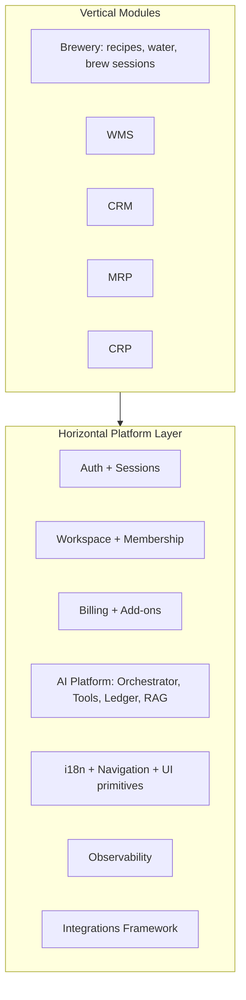

# Umbraculum — Platform Architecture & Vision

**Tier:** Public
**Status:** v1.0 (living document)
**Audience:** product, engineering, and architecture conversations.
**Brand:** **Umbraculum** (resolved 2026-05-18 from the historical `<PLATFORM_NAME>` placeholder convention; see §10 of this document and [`RENAME-DILIGENCE.md`](RENAME-DILIGENCE.md)).

---

## 1. Purpose and audience

This is the **high-level entry point** for any discussion about the shape of Umbraculum: where the system is today, where it is going, and how to keep new work consistent with that direction. It is intentionally **vision-and-shape** focused — implementation specifics still live in domain documents.

How it relates to the existing architecture log:

- [`docs/architecture-Rev02.md`](architecture-Rev02.md) remains the **implementation log of the brewery vertical** and the cross-platform (web + native) boundary decisions. It is still the source of truth for legacy context and detailed v0 phasing.
- This document owns the **platform/vision narrative**: the horizontal-platform-with-vertical-modules pattern, the AI consultant blueprint, and the AI monetization path from BYOK + paid tier unlock to optional managed AI later.

When the two disagree, this document wins for "where we are going" questions, and Rev02 wins for "what is already wired up" questions.

### 1.1 Positioning — process-manufacturing platform, brewery-configured by default

Umbraculum is a **process-manufacturing platform**. The brewery vertical is the **first vertical configuration** of that platform — it ships with brewery-specific data (BJCP styles, BeerJSON, hop bitterness math, water-chemistry models) and brewery-specific UI flows, but the *underlying primitives* — recipes-as-bills-of-materials, equipment profiles as constrained resources, brew sessions as scheduled production orders, ingredient-and-water inputs as process specifications — are the same primitives any batch process manufacturer needs.

This framing matters for three reasons:

1. **The market is much larger than "breweries".** Distilleries, kombucha producers, food manufacturers, cosmetics, supplement and nutraceutical producers, fine chemical batch operations, fragrance houses, and others all consume the same core primitives with different vertical configurations. Positioning the platform as "process-manufacturing, brewery-configured by default" rather than "a brewery app" expands the addressable market by roughly an order of magnitude **without changing the product** — the same code base, with vertical-specific seed data and prompts.
2. **MRP and CRP are not new modules — they are a generalization of what the brewery vertical already does.** Promoting the brewery production-planning subsystem to first-class generic capability is dramatically cheaper than building MRP/CRP from scratch. The trajectory in [`docs/ROADMAP.md`](ROADMAP.md) reflects this.
3. **The AI consultant story scales with this framing.** "An AI for breweries" sells one vertical. "An AI for your process-manufacturing operation, with brewery-domain knowledge included" sells the same product to a much larger pool of buyers, plus opens the door to community-contributed vertical configurations (cosmetics, food, distillery) without writing them ourselves.

The brewery vertical is a **showcase** — a reference implementation that demonstrates the toolset's potential, not the platform's identity. The platform-level commitment is to the **toolset surface** itself: the canonical-module set, the module SDK (§4.4), the AI-consultant context principle (§4.0), and the cross-platform infrastructure that lets one source of truth ship as both a web app and a native app almost out of the box — Tamagui as the cross-platform UI primitive layer (real DOM on web, real React Native on device; one component tree, one a11y story, one design-token system; see [`docs/TAMAGUI.md`](TAMAGUI.md) for the adaptation strategy and accepted-cost discipline), React Native + Expo on the device side (see [`docs/NATIVE-STRATEGY-AND-CI.md`](NATIVE-STRATEGY-AND-CI.md)), locale-prefixed routing, route IDs in `@umbraculum/navigation`, the universal `useT` hook, and the cookie-vs-bearer auth split with the webview bridge for cross-platform session continuity (see §3.5). That infrastructure is the durable deliverable, and it is industry-agnostic: any workspace-shaped application that benefits from one auth stack, one billing engine, one AI consultant, and a single source of truth that ships to both web and native is a credible thing to build on top of it. Any vertical the core team ships — brewery first, possibly MRP/CRP/WMS-shaped offerings later — demonstrates the potential in a concrete configuration but does not define the platform; whether such a vertical is also operated as a managed product is a *separable* decision that may live with the core team, with a detached entity, or with third-party operators, on the same terms. Subsequent vertical configurations are expected to plug in primarily through **seed data, prompts, and configuration**, not by re-implementing the core.

### 1.1.1 Canonical modules are peer domains, not nested under "manufacturing"

The canonical-module set (today: `mrp`, `wms`, `crm`, `crp`, `automation`; future allocations via mini-RFC) is a **flat peer decomposition**, not a hierarchy with "manufacturing" as a top-level umbrella that contains MRP / automation / etc. as sub-modules.

This is a deliberate choice. The peer-module shape (sometimes called "SAP-style") matches how Drupal, SAP S/4HANA, Salesforce/Force.com, and Odoo decompose their domain coverage. The reasoning:

- Domain-level concerns don't naturally subordinate to a single umbrella. Production planning (`mrp`), inventory (`wms`), capacity (`crp`), customer relationships (`crm`), and automation (`automation`) are peer operational concerns. Forcing them under a "manufacturing" parent creates an arbitrary dependency on a higher-level construct that doesn't exist in practice.
- Vertical configurations consume an arbitrary subset of canonical modules. A brewery vertical needs MRP + WMS + automation + (later) CRM. A cosmetics vertical needs MRP + WMS + (compliance — future). A distillery vertical needs MRP + WMS + automation + (regulatory). Each vertical configuration picks its set; the canonical layer doesn't pre-commit a hierarchy that a vertical might not need.
- The AI consultant reasons across canonical modules at workspace scope (see §4.0). A flat peer decomposition gives the orchestrator one mental model — "what canonical modules are installed in this workspace" — instead of having to reason over both a hierarchy and a flat module-installation set.
- The canonical Drupal lesson — "one module per functionality, no parallel modules competing for the same domain" — is structurally enforced by reserved-code allocation. Hierarchy is not needed for the discipline.

**Brewery's relationship to the canonical set.** Brewery is a **tier-6 vertical configuration** consuming the canonical-module surface (and adding brewery-specific seed data: BJCP styles, BeerJSON, hop bitterness math, water chemistry, brewery-specific prompts and UI flows). Brewery is NOT a canonical module — that would be the same category mistake as building "a CRM for a hotel and calling it Hotel instead of CRM." The hotel is the vertical; the CRM is the canonical domain.

This framing is formalized in RFC-0001 (modules, tiers, governance, and automation placement) once that RFC lands.

---

## 2. Vision — horizontal platform + vertical modules

**Pattern.** Umbraculum is a **horizontal platform** (auth, workspace, billing, AI, i18n, navigation, observability, integrations) hosting one or more **vertical modules** (Brewery first; later WMS, CRM, MRP, CRP, …). A *module* is a self-contained vertical that owns its routes, services, Prisma models, AI tools, prompts, knowledge sources, UI screens, i18n strings, and tier-limit contributions, and registers all of those into the horizontal platform at boot.

**Why this pattern.** Modern ERP buyers expect AI-native, multi-module suites; legacy ERPs (SAP, Oracle, NetSuite) are bolting AI onto crusty foundations. A greenfield horizontal-platform-with-vertical-modules shape lets us:

- ship one vertical at a time without forking the codebase,
- reuse one billing engine, one auth stack, one AI layer across all verticals,
- charge per module as add-ons (matches modern SaaS purchasing patterns),
- treat the brewery vertical as the **first** vertical, not the product itself.



Brewery is **shipped**; WMS / CRM / MRP / CRP are **open doors** — explicitly anticipated in the architecture but not yet implemented.

### 2.1 Distribution & business model

Umbraculum is **open source** by design — not as a marketing tactic, but as the structural foundation for long-term sustainability with a small team, trust with operational customers, and a defensible position against hyperscaler capture.

**License posture** (rationale in [`docs/LICENSING.md`](LICENSING.md)):

- **Core platform**: AGPLv3.
- **SDK / contracts / public interface packages** (the surface third-party modules depend on): MIT.
- **Commercial dual license** available for enterprises whose policies cannot accommodate AGPLv3 (same source, alternative terms).

**Revenue lines** (target: bread-and-butter sustainability for a small team, not venture-scale exit):

1. **Managed hosting of the toolset** — Umbraculum operated as a service for workspaces that consume the canonical-module set and one or more vertical configurations. The dominant revenue line; pairs with the AGPL stance because hyperscaler imitation is structurally deterred. Critically, this is hosting of the *toolset and its module surface*, not a single branded vertical SaaS: vertical-product operation (brewery-as-a-service today, MRP/CRP/WMS-shaped offerings tomorrow, anything else the cross-platform web-and-native infrastructure makes credible — see §1.1) is a **separable concern** that may be operated by the core team, by a detached entity, or by third-party operators. The platform serves all three on the same terms.
2. **AI value-layer subscription** — the AI consultant is unlocked through existing paid workspace tiers (`premium`, `pro`, `pro_plus`) while customers bring their own provider key for token spend (see §7).
3. **Enterprise support contracts** — for self-hosters and hosted customers that need SLAs, dedicated infrastructure, or operator support.
4. **Future managed-AI credits** — optional hosted convenience path, added only after BYOK + subscription proves demand.
5. **Optional commercial license** (§6.3 of [`docs/LICENSING.md`](LICENSING.md)) — for enterprises whose legal teams cannot adopt AGPLv3.

**Self-host posture (first-class, not an afterthought).** The platform must be installable on commodity Postgres + Node + a single VPS; no AWS-specific or other cloud-vendor-specific dependencies in the core. Every external service (AI providers, Stripe, RevenueCat, S3-compatible storage, error reporting) is configured via environment variables and can be swapped or omitted. Self-hosters bring their own keys.

**AI provider integration — BYOK first, managed AI later.** The H2 2026 backbone ships the lowest-risk monetized path: workspace admins bring their own Anthropic key, and the platform sells the value layer around that call — orchestration, tools, memory, usage visibility, safety limits, and concierge onboarding — by unlocking AI on existing paid workspace tiers. A future managed-AI / resold-credit mode can reuse the same orchestrator and ledger, but it is deliberately not part of v0.

**What is *not* in the business model:**

- No closed-source replacement of public modules.
- No enterprise-only paywall on bug fixes or security patches.
- No future-dated re-licensing of existing source code.

These are explicit commitments documented in [`docs/LICENSING.md`](LICENSING.md) §9, changeable only via the public RFC process there.

### 2.2 Governance & community

The single biggest determinant of an open-source project's long-term health is **how welcome contributors feel** — not the license, not the technology, not the marketing. The Magento → Mage-OS history makes this concrete: Adobe inherited a permissive license and a thriving community, and lost the community by making contribution unwelcome.

Governance principles, in priority order:

1. **Public contribution from day one.** All meaningful changes go through public PRs with public review, including changes made by founders and core maintainers. The "private fork that occasionally pushes large drops" pattern is not used.
2. **RFC process for breaking changes.** Public-comment RFCs (minimum 30 days) for any change that affects: license terms, governance, the module SDK's public surface, the AI tool contract, billing model, or anything else that downstream depends on. RFC process is the same one used for license changes ([`docs/LICENSING.md`](LICENSING.md) §10).
3. **No CLA that grants unilateral re-licensing rights.** Contributors retain their copyright; the project signs commits via Developer Certificate of Origin (DCO). This is a deliberate constraint against the failure mode that enabled the HashiCorp / Elastic re-licensings.
4. **Code of conduct from the first public release.** Modeled on Contributor Covenant.
5. **Decision transparency.** Major decisions are recorded — in RFCs for changes, in this document for architectural direction, in [`ROADMAP.md`](ROADMAP.md) for trajectory. New contributors should be able to read why something is the way it is, not just *that* it is.
6. **Trademark protection separate from license.** The platform name and logo remain commercial property of the founding entity (eventually possibly a foundation); the source license does not include trademark rights. This is the same separation used by WordPress, Linux Foundation projects, and Plausible.

The aim is to be **honest about commercial realities** (this is a project that pays for groceries, not a foundation-only effort) while keeping community contribution genuinely first-class — the opposite of the open-core trap that fragmented the Magento ecosystem.

---

## 3. Where we are today — audit (read-only snapshot)

Honest inventory of what is already platform-shaped versus what is brewery-coupled. File references are deliberately concrete so this doc remains trustworthy without re-reading the codebase.

### 3.1 Backend — `services/api/`

**Already horizontal:**

- All cross-cutting plugins under [`services/api/src/plugins/`](../services/api/src/plugins/): `prismaPlugin`, `redisClientPlugin`, `sessionAuthPlugin`, `requestContextPlugin`, `errorHandlerPlugin`, `webhookRawBodyPlugin`.
- Authentication and session management: [`services/api/src/routes/auth.ts`](../services/api/src/routes/auth.ts).
- Workspace + membership: [`services/api/src/routes/workspaces.ts`](../services/api/src/routes/workspaces.ts).
- Billing intents and workspace billing summary: [`services/api/src/routes/billing.ts`](../services/api/src/routes/billing.ts).
- Stripe + RevenueCat webhook ingestion: `webhooksStripe.ts`, `webhooksRevenuecat.ts`.
- AI routes and services: chat, settings, usage ledger, encrypted BYOK key storage, tool registry, prompt composition, and per-workspace memory.
- Health: `health.ts`.

**Brewery-vertical (fine for now, but flagged):**

- `recipes.ts`, `recipesImport.ts`, `recipesExport.ts`, `platformRecipes.ts`.
- `waterCalc.ts`, `waterProfiles.ts`, `recipeWaterSettings.ts`, `recipeWaterHubSummary.ts`, `recipeWaterComputeAndSave.ts`.
- `equipmentProfiles.ts`, `brewdaySettings.ts`, `brewSessions.ts`.
- `ingredients.ts`, `styles.ts`, `inventory.ts`.
- Brewing-device integrations: `integrationsTilt.ts`, `integrationsTiltIngest.ts`, `integrationsReveal.ts`, `integrationsGeneric.ts`.
- Ads: `ads.ts`, `platformAds.ts` (the framework is reusable, the placements are brewery-flavored).

**Cross-cutting today, but brewery-shaped:**

- [`services/api/src/services/tierLimitsService.ts`](../services/api/src/services/tierLimitsService.ts) defines brewery limits and the `aiEnabled` feature flag. That is correct for the completed H2 AI unlock, but the shape is still not module-aware (WMS will want `maxWarehouses`, CRM will want `maxContacts`, and future managed AI may want credit allowances).

**Registration shape:**

- [`services/api/src/app.ts`](../services/api/src/app.ts) registers every route group flat — no module-bundle pattern yet. This is a **gap, but cheap to add later** because Fastify is already plugin-composed and the route groups are already isolated.

### 3.2 Frontend — `apps/web/app/[locale]/`

**Horizontal:**

- `(auth)`, `about`, `contact`, `accessibility`, `i18n-contributing`, `contributing`, `platform`.

**Brewery-vertical:**

- `recipes`, `inventory`, `equipment`, `water-profiles`, `brewday-steps-settings`, `ferm-data-integration`.

**No Next.js route grouping by module today.** All paths sit at the top level under `[locale]`. Adopting `(brewery)/recipes`, `(wms)/stock`, etc. is a zero-URL-change reorganization (Next.js route groups don't appear in URLs), worth doing once a second module ships.

### 3.3 Shared packages — `packages/*`

All packages currently share the npm scope `@brewery/*`. Functionally they already split into two groups:

**Already horizontal (will become "platform" packages):**

- `@umbraculum/i18n` — locales + shared messages.
- `@umbraculum/i18n-react` — universal `useT` hook (web + native).
- `@umbraculum/navigation` — route IDs + cross-platform routing policy (renamed from `@brewery/navigation` 2026-05-19 as sub-plan #9 slot 3; current route IDs include brewery routes pending content-split deferred to second-vertical landing).
- `@brewery/api-client` — fetch boundary + auth (cookie web, bearer native).
- `@umbraculum/ui` — Tamagui primitives.
- `@umbraculum/media` — shared image assets + manifest (renamed from `@brewery/media` 2026-05-19 as sub-plan #9 slot 2; current asset content remains brewery-flavored pending content split deferred to second-vertical landing).
- `@brewery/contracts` — DTOs / shared types.
- `@umbraculum/test-mcp` — testing tools server (renamed from `@brewery/test-mcp` 2026-05-19 as sub-plan #9 slot 1 worked example).

**Brewery-vertical (will become "module" packages):**

- `@umbraculum/brewery-core` — brewing calculations and unit conversions.
- `@brewery/recipes-ui` — domain UI for recipes, water, yeast.
- `@brewery/beerjson` — BeerJSON schema layer.

The `@brewery/*` scope is a **historical artifact** of starting with the brewery vertical. A neutral platform scope — `@umbraculum/*` per the resolved brand (see §10) — is the right end-state, but renaming touches hundreds of import sites and several user-visible i18n strings, so it is deferred to the dedicated `@brewery/*` package scope migration sub-plan, sequenced after the second module is on the table.

### 3.4 Prisma schema

Single flat namespace at [`services/api/prisma/schema.prisma`](../services/api/prisma/schema.prisma). Loose taxonomy:

**Horizontal models:**

`User`, `Workspace`, `WorkspaceMember`, `Session`, `WebviewExchangeCode`, `EmailVerificationToken`, `Ad`, `WorkspaceBilling`, `BillingPurchaseIntent`, `BillingUserWorkspaceBinding`, `BillingEvent`, `WorkspaceAiSettings`, `WorkspaceAiMemory`, `AiUsageLedger`, `Integration*` (the framework — devices/attachments/readings).

**Brewery-vertical models:**

`Recipe`, `BrewSession`, `BrewSessionStep`, `BrewSessionLog`, `BrewdaySettings`, `BeerStyle`, `BeerStyleAlias`, `RecipeWaterSettings`, `WaterProfile`, `EquipmentProfile`, `Fermentable`, `Hop`, `Yeast`, `IngredientSource`, `IngredientImportRun`, `IngredientStagingRow`, `IngredientSourceMap`, `InventoryItem`.

There is **no multi-schema split** today and **no naming convention** separating horizontal from vertical. This remains manageable while there is only one shipped vertical; it becomes painful around 80–100 models. Prisma supports `multiSchema` (preview but stable) when we want to draw the line.

### 3.5 Cross-platform boundaries

This is the strongest part of the current architecture and the part that makes the multi-module vision realistic without a rewrite. See [`docs/architecture-Rev02.md`](architecture-Rev02.md) §0.1–0.7 for full detail. Summary:

- **Locale-prefixed routing** is enforced by middleware; default locale `en`.
- **Route IDs + typed params** in `@umbraculum/navigation` (no Next.js / Expo Router leakage into shared screens).
- **Universal `useT` hook** in `@umbraculum/i18n-react` (web uses next-intl adapter; native uses ICU directly).
- **Auth split**: web uses cookie sessions, native uses bearer tokens; the API client picks the right strategy via injection.
- **Webview bridge**: short-lived single-use exchange codes mint a cookie session for "Continue on web" flows from native.
- **Database routing foundation**: pgpool-II in front of primary + hot standby; auto-degrade to primary-only when the replica lags. Prisma uses `directUrl` for migrations to bypass the pool.

These boundaries mean: a new vertical module (WMS, CRM, …) can be added without touching the routing/i18n/UI layers — they just plug in.

### 3.6 Billing + tier model

- `WorkspaceBilling` + `BillingTier` (`free | premium | pro | pro_plus`) + `BillingPurchaseIntent` + `WorkspaceBillingService` is **workspace-scoped** — exactly the right shape for a multi-module suite, since each module's value applies to a workspace.
- Tier limits live in [`services/api/src/services/tierLimitsService.ts`](../services/api/src/services/tierLimitsService.ts). The current shape includes recipe/version limits plus `aiEnabled`, where `free=false` and `premium | pro | pro_plus=true`.
- The H2 AI backbone intentionally reuses existing `WorkspaceBilling` infrastructure. A free workspace upgrades through the existing billing-intent flow; after Stripe webhook processing moves the workspace to `premium` or above, AI is unlocked.
- **Add-on shape is still missing.** There is no `WorkspaceBillingAddon` model, so future per-module entitlements (e.g. "this workspace has the WMS module installed") and optional managed-AI credits have no home today.

### 3.7 Verdict

**Strong foundations (keep as-is):**

- Workspace tenancy, plugin-composed Fastify, billing service with proper `brewery_admin`-only purchasing, cross-platform boundary packages, Redis cache pattern with Postgres fallback, accessibility-first UI policy.

**Open doors (no migration needed yet, just discipline):**

- Fastify is plugin-composed → adding a `registerModule()` helper is a small refactor, not a rewrite.
- Web routes can be wrapped in `(brewery)` / `(wms)` / etc. route groups without changing URLs.
- Postgres supports multiple schemas; Prisma `multiSchema` preview is stable.
- Tier-limits service is small enough that making it module-aware is a contained change.

**Real gaps to plan for (catalog, not commit):**

- Flat Prisma namespace will hurt around 80–100 models.
- Brewery-shaped `tierLimitsService` needs a module-aware shape before any second module's limits can be expressed.
- No module registry → modules can't currently declare "I contribute these routes / tools / prompts / limits / add-on codes" as a unit.
- AI platform v0 exists, but is still brewery-first: Anthropic-only BYOK, five brewery tools, no generic provider router, no module-pluggable registry contract, and no managed-AI pricebook.
- No `WorkspaceBillingAddon` → cannot sell managed-AI credits or per-module entitlements.
- No semantic / reporting DSL → AI cannot answer ad-hoc data questions safely.
- Per-workspace operational memory exists, but the full RAG layer over product docs + activity timelines + pgvector is still future work.

---

## 4. Target architecture

### 4.0 AI-consultant context principle (cornerstone)

Several decisions in §4 — the horizontal/module split (§§4.1–4.2), the AI sub-system shape (§4.3), the module SDK surface (§4.4), the Prisma multi-schema strategy (§4.5) — look like independent architectural choices but flow from a single principle that drives all of them. Stating it explicitly so the rest of §4 reads as one coherent shape rather than five accidentally-aligned ones.

> **The AI consultant operates at workspace scope, not module scope.** For the consultant to give competent operational advice, it must see all installed canonical modules, all vertical configurations active in the workspace, all integration data, and all domain entities in **one coherent context**. A federated/microservice architecture where each module owned its own context — its own AI registry, its own auth, its own session, its own per-module orchestrator — would lose this story. The AI's quality is a function of how *coherent* its view of the workspace is.

Concrete consequences (the principle drives all of these; none are independent decisions):

- **Monorepo workspace** (over polyrepo per-module). All modules live in one workspace context the AI orchestrator can reason over end-to-end. Polyrepo would force RAG-via-cross-repo-fetch, latency penalties on tool registration, and a fragmented mental model.
- **One native shell hosting federated modules** (ROADMAP standing principles, H2 2027 Re.Pack spike). The user does not interact with five disconnected apps; the AI does not interact with five disconnected per-app contexts.
- **Single platform AI orchestrator** (§4.3). Every module's AI tools, prompts, and knowledge sources land in the *same* registry that the *same* orchestrator iterates. Per-module orchestrators would lose cross-module reasoning ("does my brewery have stock for tomorrow's brew?" crosses brewery + WMS + MRP + CRM).
- **Horizontal-platform-services consumption contract** (umbrella plan §9; RFC-0001 Decision F). Identity, tenancy, ACL, billing, AI, observability, i18n, UI, secrets, integrations, HTTP, DB are platform-owned. Modules that fork these into per-module variants destroy the AI's coherent view at the cross-cutting level.
- **Canonical-module discipline** ("one module per functionality"; umbrella plan §1; RFC-0001 Decision A). The AI must not be asked to reason over two competing CRMs, two competing auth flows, or two competing AI tool registries.
- **Standard-shape vertical configurations** (§1.1, §1.1.1). Brewery as a tier-6 vertical configuration consumes the same canonical-module surface a future cosmetics or distillery vertical configuration will consume. The AI's mental model of "what a workspace is" doesn't fork per vertical.

The cornerstone, in one line: **structural decisions in this document that look like independent architectural choices (monorepo, one shell, consumption contract, canonical discipline, peer-module decomposition, vertical-configuration tier) are all consequences of one principle — the AI consultant must see the workspace as one coherent thing.** Read the rest of §4 with that principle in mind; it's how the platform stops being a federation of disconnected products and becomes a coherent operational tool.

A worked illustration: when a brewery operator's AI is asked *"do I have stock for tomorrow's brew?"*, the answer crosses **brewery** (recipe BoM derived from BeerJSON), **wms** (stock-on-hand for the BoM ingredients), **mrp** (planned consumption for in-flight production orders), **crm** (committed customer orders that affect inventory commitments), and possibly **automation** (current tank states — is the fermenter free?). A federated/microservice architecture where each module owned its own context would lose this story; cross-module questions would have to be re-asked per-module-AI and stitched together by the operator. Workspace-scope context with one orchestrator + one tool registry + one prompt-composition pipeline is what makes the answer competent.

### 4.1 Horizontal platform layer

The horizontal layer owns everything that does not change when a new vertical is added:

- **Identity & sessions**: auth, magic-link / email verification, webview bridge, role-based access at the workspace boundary.
- **Tenancy**: Workspace + WorkspaceMember + role enforcement.
- **Billing & entitlements**: tier subscription, **add-ons**, Stripe + RevenueCat adapters, source-of-truth in Postgres.
- **AI platform**: orchestrator, tool registry, usage ledger, encrypted BYOK settings, workspace memory, provider adapters (Anthropic / OpenAI / …), router, managed-AI pricebook, RAG store.
- **Internationalization**: locales, messages, ICU formatting, locale-prefixed routing.
- **Cross-platform UI primitives**: Tamagui tokens + components, route IDs, universal hooks.
- **Observability**: structured logs, error reporting, usage metrics.
- **Integrations framework**: generic device/sensor ingestion (today: Tilt, Reveal; tomorrow: anything that emits readings).

### 4.2 Module layer

A module owns end-to-end:

- HTTP routes (registered with a stable URL prefix).
- Service classes (business logic).
- Prisma models (eventually in their own Postgres schema).
- AI tools (read-only, ACL-aware functions exposed to the AI orchestrator).
- AI prompts (module overlay + per-route overlays).
- Knowledge sources (markdown / docs / per-workspace memory) for RAG.
- UI screens, components, and a private i18n namespace.
- Tier-limit contributions (e.g. `maxRecipesPerWorkspace` for brewery, `maxWarehouses` for WMS).
- Add-on codes (e.g. `wms_module`, `crm_module`).

### 4.3 AI platform sub-system

The AI consultant is not a feature of the brewery module — it is part of the horizontal platform, and modules feed it tools and knowledge. This is a direct consequence of the §4.0 context principle: workspace-scope reasoning requires one orchestrator, one tool registry, one prompt-composition pipeline, one usage ledger.

**Three-layer model.** Build in this order; each layer multiplies the value of the previous one.

| Layer | Purpose | Mechanism | Risk | Build order |
|---|---|---|---|---|
| **A. Tools (function calling)** | Model acts on the user's actual data via your own endpoints | Read-only, ACL-aware functions. Model never sees the DB. | Low — every call goes through existing ACL. | v0 |
| **B. Semantic layer + reporting DSL tool** | Answer ad-hoc data questions ("top 10 customers last quarter") | Typed query DSL on a curated set of reporting views. Never raw SQL. | Medium — needs row caps, statement timeouts, allowlists. | v1 |
| **C. RAG over knowledge** | Answer "how does X work?" and "what is true about *this* workspace?" | v0 workspace memory now; later pgvector store for product docs (global) + per-workspace operational memory + activity timeline summaries. | Medium — PII / cross-tenant isolation discipline required. | memory v0, full RAG v1.5 |

**Module-pluggable target.** Each module will register its `{ tools, prompts, knowledgeSources, perRouteOverlays }` into the platform registry at boot. The H2 2026 implementation proves the surface with brewery tools first; the second-module milestone is where the orchestrator stops knowing about brewery-specific tools directly and starts iterating a public module registry.

**System prompt composition.** Every model call is prompted with:

```
BASE                  ← "you are an ERP assistant for Umbraculum; never reveal raw IDs unless asked; …"
+ MODULE_OVERLAY      ← contributed by the active module ("WMS rules: never propose a stock write …")
+ ROUTE_OVERLAY       ← per-route hints ("user is on stock-movements; default tools to wms.lowStockItems")
+ WORKSPACE_MEMORY    ← distilled facts about this workspace ("brews lagers; weekly cadence; 2× 200L fermenters")
```

**Write-action policy.** In v0 and v1, the model can **propose** changes (drafts) but cannot apply them without explicit user confirmation. This avoids the entire class of "AI deleted my BOM" disasters that have hit early adopters of agentic ERP features.

**Provider access — shipped v0 and future managed mode.**

- **Shipped v0: workspace-supplied Anthropic key.** The workspace admin enters an API key, accepts the data-egress notice, and enables AI. The key is encrypted at rest, decrypted only inside the API process, and never returned to web or native clients. Anthropic bills the workspace directly.
- **Shipped v0 monetization: paid tier unlock.** The platform does not resell tokens in v0. Instead, AI is available only when the existing `WorkspaceBilling.tier` is `premium`, `pro`, or `pro_plus`; free workspaces get `402 ai_subscription_required` and use the existing Stripe Checkout billing-intent flow to upgrade.
- **Future managed mode: Umbraculum-managed provider key + credits.** Hosted customers may later choose a one-bill managed-AI path. That mode can reuse the same orchestrator, tools, prompt composition, memory, audit log, and usage ledger; only key selection, credit balance checks, and post-call debit logic differ.

This preserves the self-host path and avoids v0 chargeback / VAT / provider-cost risk, while still capturing margin from the value layer.

### 4.4 Module registration pattern

The SDK shape sketched below is the *mechanism*; the *governance* around it — the canonical-module rule, reserved-code allocation, tier model, mini-RFC promotion procedure, and horizontal-platform-services consumption contract — is committed in [RFC-0001 — Modules, tiers, governance, and automation placement](rfcs/0001-modules-tiers-governance-and-automation-placement.md).

Sketch (TypeScript pseudocode — not a code spec, just shape):

```ts
registerModule({
  code: "wms",
  routes: [wmsStockRoutes, wmsLocationsRoutes, wmsMovementsRoutes],
  prismaSchema: "wms",
  aiTools: [
    wmsLowStockTool,
    wmsStockMovementHistoryTool,
    wmsLocationLookupTool,
  ],
  aiPrompts: {
    module: WMS_MODULE_OVERLAY,
    routes: {
      wmsStockMovements: WMS_STOCK_MOVEMENTS_OVERLAY,
    },
  },
  knowledgeSources: [
    "docs/wms/*.md",
  ],
  tierLimits: (tier) => ({
    maxWarehouses: { free: 1, premium: 3, pro: 10, pro_plus: 50 }[tier],
    maxSkus: { free: 100, premium: 1000, pro: 10000, pro_plus: 100000 }[tier],
  }),
  addonCodes: ["wms_module"],
});
```

The same shape will eventually apply to the brewery vertical too — the migration from "flat brewery routes" to "brewery is just another module" is mechanical once the helper exists.

**The module SDK is a first-class public artifact, not an internal convention.** A third-party developer — an indie consultancy, a vertical-specific software vendor, an in-house team at a customer — must be able to build a module **in their own repository**, depend on Umbraculum's SDK as published npm packages, and ship the module independently of platform releases. The SDK packages are licensed under MIT (see [`docs/LICENSING.md`](LICENSING.md) §6.2) precisely so module developers can license their own module's source code however they want, including proprietary, without their choice being constrained by the platform's AGPL core.

Concretely, the SDK surface includes:

- `@umbraculum/module-sdk` — the `registerModule()` contract, types, and helper utilities.
- `@umbraculum/ai-tool-sdk` — the `AiTool<I, O>` interface, scope types, and `AiToolContext` definitions.
- `@umbraculum/api-client` (public types subset) — DTO types and route-ID conventions third parties can pin to.
- `@umbraculum/i18n-keys` — namespace conventions for module-owned message keys.

These names are the resolved end-state under the Umbraculum brand (see §10); the actual scope and package boundaries land when the `@brewery/*` → `@umbraculum/*` migration sub-plan executes (deferred until the second module is on the table). What matters today is that the *intent* is published as a stable public contract, not a private implementation detail.

### 4.5 Prisma schema strategy

Three options, ranked by readiness vs cost. Adopt them in order:

1. **Now**: keep flat namespace, but adopt the convention `<module>_<entity>` for **new modules' tables only** (e.g. `wms_stock_item`, `crm_contact`). Existing brewery tables stay as-is.
2. **When second module ships**: enable Prisma `multiSchema` preview, move the new module's tables to its own Postgres schema (`wms.*`). Legacy brewery tables stay in `public` until painful.
3. **Long-term**: full schema split — `platform.*` (auth, workspace, billing, …) / `brewery.*` / `wms.*` / `ai.*` — with Prisma multi-file split if/when one schema file becomes unreadable.

Note for replication: pgpool-II + streaming replication (already in the stack — see [`docs/postgres-replication-architecture.md`](postgres-replication-architecture.md)) is schema-agnostic, so the multi-schema move does not affect routing.

---

## 5. Migration map (catalog of future work, not for execution now)

A planning aid: when someone asks "what would it take to add WMS?", the answer comes from these three lists.

### 5.1 Stays as-is forever

- Workspace tenancy model (`Workspace`, `WorkspaceMember`, role-based ACL).
- Plugin-composed Fastify (cross-cutting via `app.register`).
- Cross-platform boundary packages (`@umbraculum/i18n`, `@umbraculum/i18n-react`, `@umbraculum/navigation`, `@brewery/api-client`, `@umbraculum/ui`, `@umbraculum/media`).
- Cookie/bearer auth split (web vs native).
- Redis cache pattern with Postgres source-of-truth.
- Stripe + RevenueCat as billing providers; Fastify as billing source-of-truth.
- pgpool-II + sync replication + auto-degrade.

### 5.2 Renamed / restructured when 2nd module ships

Physical directory layout for canonical modules and tier-6 vertical configurations is committed in [RFC-0002 — Canonical-module physical layout](rfcs/0002-canonical-module-physical-layout.md) (β three-tree distribution: `services/api/src/modules/<code>/`, `apps/web/app/[locale]/(<code>)/`, `apps/native/src/modules/<code>/`, `packages/<code>-contracts/` → `@umbraculum/<code>-contracts`; `registerModule()` in `packages/module-sdk/`). The bullets below are the migration tranche mechanics; RFC-0002 is the authoritative layout decision.

- `@brewery/*` scope split: horizontal packages move to the neutral platform scope `@umbraculum/*`; brewery-vertical packages stay branded as the brewery module package set (or re-scope under `@umbraculum/brewery-*`). **Operational follow-up: sub-plan #9** — scoping pass done 2026-05-19; see [`docs/design/brewery-scope-migration-plan.md`](design/brewery-scope-migration-plan.md) (L1 plan with mis-classification audit; `@umbraculum/brewery-core` → `@umbraculum/brewery-core` flagged as the one rename trap) and [`docs/design/brewery-scope-migration-per-package-handoff.md`](design/brewery-scope-migration-per-package-handoff.md) (per-slot checklist; 14 slots; slot 1 worked example landed).
- Web routes wrapped in `(brewery)` Next.js route group (no URL change).
- Brewery-vertical Postgres tables stay in place; new module gets its own Postgres schema via Prisma `multiSchema`.
- `tierLimitsService` becomes module-aware: each module contributes a `tierLimits(tier)` slice; the platform composes them.
- `app.ts` flat `register` calls become `registerModule(...)` calls (or a bridging helper that wraps the existing route groups).

### 5.3 Net-new before 2nd module ships

- `registerModule()` helper in the API and a parallel registry on the web side. **v0 scaffold landed** in `packages/module-sdk/` (`@brewery/module-sdk`; end-state `@umbraculum/module-sdk` per [RFC-0002](rfcs/0002-canonical-module-physical-layout.md) Decision C). Brewery flat routes are not migrated yet; API wiring follows in the H1 2027 tranche.
- Extract the H2 AI contracts into public SDK/package surfaces once the module boundary is stable:
  - `packages/ai-platform-contracts` (Tool, ToolCall, Session, UsageRecord, provider mode).
  - `packages/ai-platform-ui` (Tamagui chat panel + composer + streaming hook), if the shared UI package gets too broad.
- Provider router / adapter layer beyond Anthropic-only BYOK.
- Optional managed-AI credits: `WorkspaceBillingAddon` Prisma model + service + Stripe subscription-item / top-up flow + RevenueCat consumable mapping.
- `pricebook.json` convention with `creditValueMicroUsd` and per-model multipliers for managed-AI mode only.
- Full RAG store (pgvector when available) over product docs, workspace memory, and activity timeline summaries.
- Reporting DSL + curated reporting views (Layer B).
- One additional Postgres role (`ai_readonly`) with `SELECT`-only on the curated reporting views (only needed if/when we choose the SQL-tool variant of Layer B).

---

## 6. AI consultant blueprint

Canonical `automation` module surface (Vessel registry, adapter SDK, OpenPLC seam, automation AI tools, tier limits) is specified in the accepted design [`docs/design/canonical-automation-module-surface.md`](design/canonical-automation-module-surface.md) (RFC-0001 Decision E §7.2; β layout per [RFC-0002](rfcs/0002-canonical-module-physical-layout.md)). Implementation is phased (H2 2026 read path per that doc §9); brewery flat API routes are unchanged until the H1 2027 tranche.

### 6.1 Three layers (recap with comparison)

| Aspect | Layer A: Tools | Layer B: Reporting DSL | Layer C: RAG |
|---|---|---|---|
| What it answers | "What's my mash pH?" | "Top 10 SKUs by movement last quarter" | "How does MRP work in Umbraculum?" |
| Mechanism | Function call → existing API endpoint | Typed DSL → curated views | Embedding search → context injection |
| Where the data is | Wherever the API normally reads it | Reporting replica, curated views | pgvector, separate from operational tables |
| ACL | Inherits user session | Inherits role + curated view restrictions | Per-workspace index isolation |
| Cost | Low (small JSON) | Low–medium (bounded result set) | Low (embeddings cached) |
| Hallucination risk | Very low (deterministic numbers) | Low (typed query, deterministic execution) | Medium (model paraphrases retrieved text) |
| Build order | v0 | v1 | memory v0, full RAG v1.5 |

### 6.2 Module-pluggable tool registry (interface sketch)

```ts
interface AiTool<I, O> {
  name: string;                       // "wms.lowStockItems"
  description: string;                // shown to the model
  inputSchema: ZodSchema<I>;          // runtime-validated args
  outputSchema?: ZodSchema<O>;        // optional, for redaction policies
  ownerModule: ModuleCode;            // "wms", "brewery", "crm", ...
  scopes: AiToolScope[];              // ["read"], future: ["read","propose-write"]
  handler: (args: I, ctx: AiToolContext) => Promise<O>;
  // ctx carries { workspaceId, userId, sessionId, requestId } — same shape as a request
}
```

Tools never receive raw DB connections; they call existing services through the same DI/context the rest of the API uses. This is what keeps ACL inheritance free.

### 6.3 Prompt composition pipeline


### 6.4 Worked example — WMS yeast question

User on the WMS "stock movements" page asks: *"Why are we constantly running out of yeast Y?"*

```
1. UI sends:
   POST /api/ai/messages
   { sessionId, content: "Why are we constantly running out of yeast Y?",
     context: { routeId: "wmsStockMovements", workspaceId, skuHint: "yeast-y" } }

2. Orchestrator:
   - Loads system prompt:
       BASE("you are an ERP assistant for Umbraculum ...")
       + MODULE_OVERLAY("wms")
       + ROUTE_OVERLAY("wmsStockMovements")
       + WORKSPACE_MEMORY("they brew lagers; 2× 200L fermenters; weekly brew cadence")
   - Router picks Haiku (cheap, simple intent).
   - Tool loop begins.

3. Model calls (autonomously):
   wms.lowStockItems({ skuFilter: "yeast-y" })
     → returns 3 rows, current stock + reorder point
   wms.stockMovementHistory({ skuId: "...", days: 90 })
     → returns weekly consumption
   mrp.getMrpRequirements({ skuId: "..." })
     → returns planned vs actual consumption
   crm.recentOrdersForSku({ skuId: "..." })   # if CRM module installed
     → seasonal demand spike

4. Model answers in natural language, with numbers from the deterministic tools:
   "Your average weekly use of yeast Y is 1.2 kg, but your reorder point is set
    to 0.5 kg with a 7-day lead time from your supplier. Three brews back-to-back
    (which happened in weeks 12, 18, and 22) drain you below safety stock before
    your replenishment arrives. Two options: (a) raise reorder point to 1.5 kg,
    (b) increase order quantity from 2 kg to 5 kg per PO. Want me to draft a
    settings change for option (a)?"

5. Ledger writes:
   AiUsageLedger { tokensIn: 4200, tokensOut: 380, model: "claude-haiku-4.5",
                   costMicroUsd: 4760, providerMode: "byok",
                   workspaceId, userId, sessionId, toolCalls: [...] }
```

**Notice what happened:**

- The model never saw the `stock_movements` table (potentially millions of rows). It saw three small JSON results.
- All numbers are deterministic — your Node code computed them, not the LLM.
- Authorization was the user's. If the user couldn't see CRM, that tool wasn't in the registry for this call.
- Cost visibility exists in the ledger, but in BYOK mode there is no platform debit: the provider bills the workspace directly, while the platform monetizes the orchestration + memory + tool layer through the paid workspace tier.
- The "draft a settings change" offer is a **future write tool** — those need a confirmation step (model proposes, user clicks "Apply"). The model never writes directly in v0/v1.

### 6.5 Safety

- **ACL inheritance**: tools execute under the user's session; the model can never see what the user can't.
- **Zero data retention provider settings** (OpenAI ZDR, Anthropic no-train) wired at the API call level, with an explicit per-workspace toggle banner before first use.
- **PII redaction at the tool-result boundary**: tools may return scrubbed views of records (e.g. customer name without email/phone) when the AI scope doesn't require PII.
- **Per-message `max_output_tokens`** (sane default; model can request more if the user asks for a long report).
- **Per-user daily token cap** as a circuit breaker, separate from per-role monthly caps and any future managed-AI credit budget.
- **Prompt-hash cache** (5–15 min TTL) for repeated identical prompts — saves money on common questions.
- **Write-action human-in-the-loop**: the model proposes a JSON patch / config diff, the UI renders it, the user confirms.
- **Audit trail**: every tool call is logged as `(workspaceId, userId, sessionId, toolName, argsHash, costMicroUsd, durationMs, providerRequestId)`. SOC2 / ISO friendly out of the box.

---

## 7. AI monetization model

### 7.1 Shipped v0 — BYOK + paid tier unlock

The H2 2026 AI backbone monetizes the value layer without reselling provider tokens:

1. **Workspace brings the provider key.** The workspace admin enters an Anthropic API key in AI settings. The key is encrypted at rest, decrypted only in the API process, and never sent to web or native clients.
2. **Workspace pays the provider directly.** Anthropic token spend is billed to the customer's Anthropic account. Umbraculum does not carry token COGS, reseller liability, provider credit risk, or token overage support in v0.
3. **Workspace pays Umbraculum for the AI value layer.** AI is unlocked through existing workspace tiers: `free=false`, `premium | pro | pro_plus=true` via `tierLimitsService.aiEnabled`. Upgrades use the existing `BillingPurchaseIntent` / Stripe Checkout flow and existing webhook lifecycle handling.
4. **Usage is visible, not billable.** `AiUsageLedger` records tokens, cost estimates, model, duration, provider request ID, and tool calls for analytics, admin visibility, caps, and future migration. It does **not** drive Stripe charges in v0.
5. **Concierge onboarding is part of the value proposition.** The AI settings and post-checkout surfaces can link to human setup help, configured by environment variable.

This is intentionally different from a free-BYOK model. The customer pays their provider for raw model calls and pays Umbraculum for the operational layer that makes those calls useful: ACL-aware tools, prompt composition, per-workspace memory, limits, auditability, cross-platform UI, and support.

### 7.2 Why v0 does not ship resold credits

Resold credits are attractive for convenience, but they add real surface area: pricebook maintenance, top-ups, refunds, VAT and sales-tax handling on usage, chargeback exposure, App Store consumable mapping, dunning, provider price-change communication, and support for "why was I charged?" questions.

BYOK + paid tier unlock gets the hard architectural work into production first while avoiding that operational burden. It also keeps self-hosting straightforward: self-hosters always bring their own provider relationship, and the same BYOK code path works for them.

The future managed-AI path should be treated as an optional hosted convenience, not as the foundation of the AI architecture.

### 7.3 Future managed-AI credits

If hosted customers want one invoice and are willing to pay for convenience, Umbraculum can add a managed-AI mode later. In that mode:

- The platform uses a Umbraculum-managed provider key.
- Usage is debited against workspace AI credits.
- Credits, not raw tokens, are the customer-facing unit.
- A versioned `pricebook.json` maps model + token usage to credits.
- Plan-included credits hard-cap at 100%; optional top-up packs provide a retail escape hatch.
- Web top-ups use Stripe; native iOS can use RevenueCat consumables if top-ups are sold inside the app.

The core orchestrator does not change. The managed mode adds a preflight credit-balance check and a post-call debit, while reusing the same tools, prompts, memory, ledger, audit trail, and safety policy.

### 7.4 Future add-on model

Managed-AI credits and second-module entitlements both need the same missing primitive: a workspace-scoped add-on model.

```ts
WorkspaceBillingAddon {
  workspaceId              String
  addonCode                String        // "managed_ai_credits_5k", "wms_module", "crm_module"
  status                   String        // "active" | "canceled" | "past_due"
  periodStart, periodEnd   DateTime
  monthlyAllowance         Json          // { credits: 5000 } for managed AI; { seats: 5 } for modules if needed
  stripeSubscriptionItemId String?
}
```

Why decoupled:

- Module entitlements should not require inventing a new base tier for every vertical.
- Managed AI should remain optional for hosted customers and irrelevant to self-hosters.
- One workspace can have one base subscription plus multiple subscription items on a single invoice.
- RevenueCat can mirror the same concept through entitlements / consumables for native purchases.

### 7.5 Margin discipline for managed AI

If managed AI ships, margin must be priced against real COGS:

```
COGS_per_request =
    sum(provider_token_cost)
  + stripe_fee_share
  + support_amortization
  + provider_price_buffer
  + optional infra_marginal_cost
```

Industry-typical AI gross margin is roughly 50–75%. Targeting extreme margin on the token line is brittle: a competitor can subsidize it, a provider can change prices, or a customer can shift the model mix. The strategic margin is in the operational layer — tools, memory, workflow integration, and support — not in pretending token resale is a moat.

---

## 8. Decisions and open questions

### 8.1 Resolved through the H2 2026 backbone

1. **v0 monetization model:** BYOK provider relationship + paid AI subscription through existing `WorkspaceBilling` / `BillingTier`. AI unlocks at `premium`, `pro`, and `pro_plus`; `free` is blocked with `402 ai_subscription_required`.
2. **Stripe surface:** zero net-new Stripe code for v0 AI. The existing billing-intent checkout flow and webhook lifecycle handling are reused.
3. **Subscription primitive:** no new `WorkspaceSubscription` model. Existing `WorkspaceBilling` remains the current subscription source of truth.
4. **Provider for v0:** Anthropic only. Multi-provider adapters are deferred until a second provider is needed.
5. **v0 prompt scope:** water + recipe coach. Style guidance, fermentation troubleshooting, and cross-module operations wait for later layers.
6. **AI default:** opt-in per workspace. Admin enables AI, enters the key, and accepts the data-egress notice.
7. **Per-user role gating:** no role gate. All workspace members can use AI once the workspace admin enables it; safety is enforced through per-role monthly caps, per-user daily caps, workspace opt-in, and the audit ledger.
8. **Memory:** per-workspace operational memory is part of the H2 backbone. Full product-doc / timeline RAG remains future work.
9. **Public-launch path:** launch artifacts exist, and §10.1.1 records the decision to seed a fresh public repository after Umbraculum is chosen.

### 8.2 Still open / deferred

1. **Managed-AI credits:** whether and when to add the optional hosted one-bill mode.
2. **Refund policy for managed-AI credits:** non-refundable / pro-rata / case-by-case.
3. **EU VAT / sales-tax handling for managed-AI credits:** Stripe Tax vs separate handling.
4. **Postgres multi-schema timing:** adopt at second-module ship, or earlier as preparation.
5. **Naming:** real Umbraculum brand and npm scope decision.
6. **Model auto-routing policy:** heuristic router, always-Sonnet, or user-choice.
7. **KMS-backed key storage:** when to replace the app-secret AES-GCM key vault with cloud KMS / Vault while preserving the encrypted-blob format.

---

## 9. Glossary

- **Add-on** — a billable extension to a workspace (e.g. a future managed-AI credit pack or module entitlement) that is independent of the base tier.
- **ARPU (Average Revenue Per User)** — total revenue divided by paying entities per period.
- **BYOK (Bring Your Own Key)** — workspace admin enters their own provider API key; the provider bills the workspace directly for tokens.
- **COGS (Cost of Goods Sold)** — variable per-unit cost of delivering one unit of the feature; relevant to future managed-AI credits, not v0 BYOK token spend.
- **Credit** — future managed-AI unit for usage; converted from model + token usage via a pricebook.
- **Gross margin** — `(price − COGS) / price`.
- **Hard cap** — usage limit that *blocks* further use until top-up or period rollover.
- **Horizontal platform** — the layer of the system that does not change when a new vertical module is added.
- **Managed AI** — future hosted mode where Umbraculum provides the model-provider key and bills usage through credits.
- **Model basket** — assumed mix of model usage that pricing is sized against.
- **Module** — a self-contained vertical (Brewery, WMS, CRM, MRP, CRP, …) that registers routes / services / models / AI tools / prompts / knowledge / limits / add-on codes into the platform.
- **MRR (Monthly Recurring Revenue)** — sum of normalized monthly subscription revenue.
- **multiSchema** — Prisma preview feature that lets one Prisma client span multiple Postgres schemas.
- **pgvector** — Postgres extension storing vector embeddings for similarity search; powers RAG.
- **Pricebook** — versioned mapping of model + token usage → credits.
- **RAG (Retrieval-Augmented Generation)** — injecting retrieved knowledge chunks into the prompt to ground the model's answer.
- **Retail overage** — buying more capacity above the included allowance, at posted per-unit prices (typically with volume discounts on larger packs).
- **Route group** — Next.js convention `(name)/...` that groups routes for organization without changing the URL.
- **Semantic layer** — declarative description of entities, dimensions, metrics, and joins, given to the model so it can build typed reporting queries safely.
- **Soft cap** — usage limit that *warns* but allows continued use, billing the overage.
- **System prompt overlay** — a prompt fragment contributed by a module or route, composed with the base prompt and per-workspace memory.
- **Tool call** — model-invoked function that runs in our backend (read-only, ACL-aware) and returns small JSON.
- **Vertical** — synonym for "module" in this document.
- **Write-action** — a tool that would mutate state. In v0/v1, write-actions are *proposed* by the model and require explicit user confirmation in the UI before execution.
- **ZDR (Zero Data Retention)** — provider mode that disables training and short retention windows; configured per request or per account.

---

## 10. Document conventions and lifecycle

- **Brand resolution.** The project's brand was previously tracked via the `<PLATFORM_NAME>` placeholder convention, resolved on 2026-05-18 to **Umbraculum** (wordmark), `umbraculum` (namespace across npm / Composer / PyPI / crates.io / Docker Hub), `umbraculum.dev` (primary domain), and `umbraculum-dev` (GitHub org). See [`RENAME-DILIGENCE.md`](RENAME-DILIGENCE.md) for the full diligence record. The historical `<PLATFORM_NAME>` token convention is preserved in this paragraph as background for any future contributor who finds a stray reference; the substitution has been applied across docs and code.
- **This is the entry point.** When in doubt, link here from new docs and discussions; module-implementation details belong in domain docs (e.g. [`docs/architecture-Rev02.md`](architecture-Rev02.md), [`docs/TIER-PRICING-ANALYSIS.md`](TIER-PRICING-ANALYSIS.md), [`docs/Redis-architecture.md`](Redis-architecture.md), [`docs/org-billing-stripe-revenuecat-fastify.md`](org-billing-stripe-revenuecat-fastify.md)).
- **Update protocol**:
  - Structural changes (sections 2, 3, 4, 7) should be reviewed before merging — they change shared assumptions.
  - Glossary additions and pricing-example numeric updates can land in normal PRs.
  - Open-questions checklist (§8) should be appended to as new questions arise; resolved questions move to the relevant section with a brief decision note.

### 10.1 Open-source lifecycle

Because Umbraculum is open source and intended to be public-facing, this document and its sibling docs have additional lifecycle obligations beyond ordinary internal documentation.

The licensing posture, governance, and foundation-question bullets below are the *architectural* expressions of the project's ethics; the *ethical* statement of those same commitments lives in [`MANIFESTO.md`](../MANIFESTO.md) §2.3 ("Open by license, open by foundation"). This subsection and the manifesto are designed to be read together: this one carries the architectural decisions and their forward-only-application discipline; the manifesto carries the conviction those decisions enforce.

- **Public-facing intent.** Treat every doc under [`docs/`](.) as potentially public-facing. The audience priority order set in [`docs/README.md`](README.md) applies: future maintainers and contributors first, self-hosting operators second, prospective module developers third. Avoid private-by-default tone, internal-only references, and unexplained jargon.
- **Toolset is the deliverable; vertical-product operation is separable.** Umbraculum's deliverable is the **toolset and SDK surface** — the canonical-module set, the module SDK (§4.4), the AI-consultant context principle (§4.0), and the cross-platform web-and-native infrastructure (Tamagui as the cross-platform UI primitive layer over React Native + Expo on device; locale-prefixed routing; route IDs in `@umbraculum/navigation`; universal `useT`; cookie-vs-bearer auth split with webview bridge — see §3.5, [`docs/TAMAGUI.md`](TAMAGUI.md), [`docs/NATIVE-STRATEGY-AND-CI.md`](NATIVE-STRATEGY-AND-CI.md)). That infrastructure is industry-agnostic by construction: it makes any workspace-shaped application that wants one auth stack, one billing engine, one AI consultant, and one source of truth shipping to both web and native a credible thing to build. Any vertical the core team ships (brewery first, possibly MRP/CRP/WMS-shaped offerings later) is a *showcase configuration* that demonstrates what the toolset enables, not the platform's identity. Whether such a vertical is also operated as a managed product is a separable concern that may live with the core team, with a detached entity, or with third-party operators — the platform serves all three on the same terms. The structural guards against the project's openness being captured as a recruitment funnel for a single branded vertical are the AGPLv3 core, the MIT SDK, the no-CLA stance (DCO sign-off only), and the no-closed-source-replacement commitment in [`docs/LICENSING.md`](LICENSING.md) §9.
- **Semver discipline at the SDK boundary.** The SDK packages described in §4.4 follow [semantic versioning](https://semver.org/). Breaking changes to the SDK go through an RFC, get a deprecation window, and ship in a major version bump. The platform core has more flexibility — but any change visible to downstream modules counts as SDK surface.
- **License-change and governance-change RFCs.** Any change to the licensing posture in [`docs/LICENSING.md`](LICENSING.md) or the governance principles in §2.2 follows the RFC process documented in [`docs/LICENSING.md`](LICENSING.md) §10 — written RFC, minimum 30-day public comment, forward-only application.
- **Deprecation policy.** Public-surface deprecations (SDK types, AI tool contracts, route IDs, prompt-overlay keys) are announced in the RFC repository, marked with a `@deprecated` tag in source, and removed no earlier than one major version after announcement. The cost of a noisy deprecation is much lower than the cost of a silent breaking change for a module developer running a small consultancy.
- **No retroactive license changes.** Source code committed under AGPLv3 stays AGPLv3. Source code committed under MIT stays MIT. License-change RFCs apply only to code committed after the change date, preserving the terms downstream users relied on.
- **Brand and trademark separate from license.** As detailed in [`docs/LICENSING.md`](LICENSING.md) §8: the Umbraculum brand is not transferred by the source license. Forks, mirrors, and modified versions must use a different name. A formal trademark policy will be published before the first stable release.
- **Foundation question is deferred, not denied.** Transferring the trademark and governance to a foundation (e.g. Linux Foundation, Software Freedom Conservancy, a dedicated Umbraculum Foundation) is a real option, with real benefits for community trust and project longevity. It is not the right move at the current stage (pre-revenue, pre-community), but the architectural decisions on this page — AGPLv3, public SDK, DCO sign-off rather than CLA, governance principles in §2.2 — are deliberately compatible with a future foundation transfer if the project reaches that scale.
- **Audience-tier convention for documentation.** Each Markdown document in the repository carries an explicit `**Tier:**` marker on its first content line. Recognized values: `Public` (default for everything in [`docs/`](.) and the repo root — surfaceable on the public flip), and reserved values `Partner-restricted` and `Customer-restricted` for future authenticated audiences. Non-public business documentation (strategy notes, competitive analysis, pricing margins) is maintained separately and is not part of the public-mirror flip when it happens; documents that are not Tier: Public are intentionally not indexed from any public-tier doc to avoid one-way information leaks on the flip. Authors of new docs in [`docs/`](.) should add the marker and stick to the Tier: Public audience expectations.

#### 10.1.1 Go-public path (decision)

This subsection records the operational decision for *when and how* this repository becomes public.

- **Current state.** The repository is **developed privately**. The Phase 3 launch-readiness artifacts ([`LICENSE`](../LICENSE), [`CONTRIBUTING.md`](../CONTRIBUTING.md), [`CODE_OF_CONDUCT.md`](../CODE_OF_CONDUCT.md), [`SECURITY.md`](../SECURITY.md), and the public-facing [`README.md`](../README.md)) are already in place, written as if the repository were already public, so that the history is clean when the flip happens. The brand was resolved on 2026-05-18 to **Umbraculum** (see [`RENAME-DILIGENCE.md`](RENAME-DILIGENCE.md)); the placeholder substitution from the prior `<PLATFORM_NAME>` convention has been applied to docs and code.
- **Decision.** Keep the repository private through the working-assumption window of **H1 2027** for the public flip. The brand resolution does not unilaterally accelerate the flip; it removes one prerequisite (brand selection) but the other prerequisites — second-vertical-module shape, package-name migration of the actual `@brewery/*` scopes (separate sub-plan), and the pre-flip checklist below — still gate timing. At the flip, **seed a fresh public repository from this one under the `umbraculum-dev` GitHub org** rather than renaming this repository in place. The original repository remains as the private development history and is archived once the public seed catches up.
- **Why a fresh public seed (not a rename in place).**
  - **Avoids exposing the historical `@brewery/*` package naming, route IDs, and brewery-vertical-flavored class names on the public branch.** Those names are appropriate for the brewery vertical configuration but misleading on a public process-manufacturing platform; the `@brewery/*` → `@umbraculum/*` migration is a separate post-RFC-001 follow-on (see [`umbrella plan`](#) §Sub-plans entry 9), and the public seed is the natural commit boundary to land it.
  - Gives a clean opportunity to align the codebase with the resolved Umbraculum brand as a single atomic change, rather than leaving rename artifacts scattered across git history.
  - Keeps the public commit history aligned with the public framing in [§1.1](#11-positioning--process-manufacturing-platform-brewery-configured-by-default), instead of having the public audience read backwards through brewery-only history.
- **Conditions that would justify an earlier flip.**
  - A community contributor or paying customer concretely needs public-source visibility to evaluate adoption — and waiting until H1 2027 would lose them.
  - A security or governance reason requires public auditability sooner than planned.
  - The `@brewery/*` package scope migration lands materially earlier than expected and the rest of the pre-flip checklist fits inside a single sprint.
- **Conditions that would justify a later flip.**
  - The second-vertical-module shape is still not stable by H1 2027 and the project is materially better served by another six months of focused, private iteration before exposing the architecture to public review.
  - A foundation-transfer conversation (see §10.1, *Foundation question*) is in flight and the public flip is best done together with the transfer rather than separately.
- **Pre-flip checklist** (kept here so the conditions are explicit, not folkloric):
  1. **Brand resolved** ✅ (2026-05-18: Umbraculum across docs and code; see [`RENAME-DILIGENCE.md`](RENAME-DILIGENCE.md)). The remaining brand-adjacent work — `@brewery/*` package scope migration, route-prefix audit, AI prompt audit, billing UI copy audit — is tracked under the post-RFC-001 follow-on sub-plans.
  2. `internal/**` audited and confirmed excluded from the public seed; cross-links from `docs/**` to `internal/**` removed.
  3. Contact email placeholders in [`CODE_OF_CONDUCT.md`](../CODE_OF_CONDUCT.md) and [`SECURITY.md`](../SECURITY.md) replaced with monitored, real addresses on the resolved `umbraculum.dev` domain.
  4. Copyright header in [`LICENSE`](../LICENSE) resolved to the final entity name (placeholder substitution complete: `Copyright (C) 2026 Umbraculum contributors`; the eventual legal-entity name — single-founder company / future foundation — substitutes here at incorporation time).
  5. Migration path documented for the few callers (if any) that depend on the `@brewery/*` package names — covered by the dedicated post-RFC-001 follow-on sub-plan.
  6. A short public-launch blog post / `docs/`-hosted announcement explaining the project, the licensing posture, and how to contribute.
- **Non-goals at the flip.** A coordinated marketing launch, a paid hosted service GA, or a v1.0 release are *not* required to flip the repo public. The flip is about source visibility and a contribution surface; commercial milestones can land on their own cadence afterwards.
