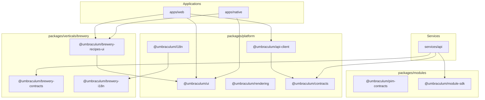

# Umbraculum repository structure — where things live, why there, how they fit

**Tier:** Public  
**Status:** v0.2 — updated 2026-06-07 (RFC-0011 Waves 3a–3f: package tiers, platform purity, web shell nomenclature)  
**Audience:** new contributors, evaluators preparing to adopt Umbraculum as an operational dependency, prospective module developers, future maintainers running an orientation pass.  
**Owners:** maintainers  
**Related:** [`GLOSSARY.md`](GLOSSARY.md), [`MODULES.md`](MODULES.md), [`PLATFORM-ARCHITECTURE.md`](PLATFORM-ARCHITECTURE.md), [`rfcs/0002-canonical-module-physical-layout.md`](rfcs/0002-canonical-module-physical-layout.md), [`rfcs/0011-application-surface-shell-layering.md`](rfcs/0011-application-surface-shell-layering.md), [`design/pre-flip-application-surface-backbone.md`](design/pre-flip-application-surface-backbone.md), [`packages/modules/module-sdk/README.md`](../packages/modules/module-sdk/README.md).

> [!NOTE]
> Part of [Umbraculum](../README.md) — an open-source toolset for building workspace-shaped operational applications. This doc is the **spatial map** of the monorepo: an inventory of every workspace + which layer it sits in + what depends on it.

---

## 1. Why this doc exists

The Umbraculum monorepo is structurally simple — three workspace trees (`apps/`, `services/`, `packages/`), one `docs/` tree, one `internal/` tree, plus **`packaging/`** and scripts/CI plumbing. This page is the single artifact that answers "where does X live?" directly.

It complements:

- [`MODULES.md`](MODULES.md) — vocabulary, governance, decision tree.
- [`PLATFORM-ARCHITECTURE.md`](PLATFORM-ARCHITECTURE.md) §3 + §4 — audit and target architecture.
- [`rfcs/0002-canonical-module-physical-layout.md`](rfcs/0002-canonical-module-physical-layout.md) — authoritative β-layout decision.
- [`design/pre-flip-application-surface-backbone.md`](design/pre-flip-application-surface-backbone.md) — RFC-0011 execution waves and terminology contract (§3.7).

---

## 2. The five-layer mental model

Every workspace belongs to exactly one layer. Modules consume lower layers, never peer verticals.

| # | Layer | On-disk pattern | Examples | Purpose |
|---|---|---|---|---|
| 1 | **Applications** | `apps/*` | `apps/web`, `apps/native`, `apps/web/e2e` | Deployable end-user surfaces. Apps consume layers 2–5, never each other. |
| 2 | **Services** | `services/*` | `services/api` | Long-running backends (Fastify + Prisma + Postgres + Redis). |
| 3 | **Horizontal infrastructure** | `packages/platform/*` | `@umbraculum/ui`, `@umbraculum/navigation`, `@umbraculum/i18n`, `@umbraculum/api-client`, `@umbraculum/media`, `@umbraculum/rendering` | Cross-cutting, **industry-agnostic** packages. No vertical-owned content (Wave 3c split brewery i18n/media to vertical packages). |
| 4 | **Contracts** | `packages/platform/contracts`, `packages/modules/*-contracts`, `packages/verticals/<code>/contracts` | `@umbraculum/contracts`, `@umbraculum/pim-contracts`, `@umbraculum/brewery-contracts` | Typed DTOs, Zod schemas, route IDs — the only piece third-party modules pin (MIT per [`LICENSING.md`](LICENSING.md) §6.2). |
| 5 | **Module SDK + vertical packages** | `packages/modules/*`, `packages/verticals/<code>/*` | `@umbraculum/module-sdk`, `@umbraculum/brewery-core`, `@umbraculum/brewery-recipes-ui` | Registration spine + vertical-flavored libraries (`@umbraculum/<vertical>-<name>` prefix). |

**Two rules:**

1. **No cross-app imports.** Apps share code through layers 3–5.
2. **No vertical → vertical imports.** Cross-vertical sharing belongs in layer 3 or platform contracts.

**On-disk package tiers (RFC-0011 Wave 3a):**

```text
packages/
  platform/           # layer 3 + platform contracts
  modules/            # canonical *-contracts, module-sdk, ai-tool-sdk, i18n-keys
  verticals/brewery/    # reference vertical (core, beerjson, recipes-ui, contracts, i18n, media-assets)
```

---

## 3. Workspace inventory

### 3.1 Applications (`apps/*`)

| Path | npm name | What it is | Notable consumes |
|---|---|---|---|
| `apps/web/` | `@umbraculum/web` | Next.js + React + Tamagui — the **member-facing web application** (workspace web UI). Platform shared layout: `app/_shared-layout/`. Route groups: `(auth)/`, `(platform-layout)/`, `(brewery)/`, canonical `(pim|mrp|crp|automation)/`, cross-workspace `platform/`. | `@umbraculum/{ui, brewery-recipes-ui, navigation, i18n-react, api-client, media, brewery-media-assets, contracts, …}` |
| `apps/native/brewery/` | `@umbraculum/native-brewery` | Expo + React Native + Tamagui — reference brewery brew-day app (RFC-0011 Wave 4). Umbrella: [`apps/native/README.md`](../apps/native/README.md). | Same horizontal + vertical packages as web where applicable |
| `apps/web/e2e/` | (sub-workspace) | Playwright E2E — folder taxonomy: `platform/`, `canonical/`, `verticals/brewery/` (RFC-0011 Wave 5). | Runs against live stack |

**Web app tree (spatial map):**

```text
apps/web/app/
  _shared-layout/          # platform UI frame (nav, footer, providers)
  [locale]/
    layout.tsx
    (auth)/                # login, signup, select-workspace
    (platform-layout)/     # platform horizontal pages (ai, accessibility, …)
    (brewery)/             # reference vertical
    (pim|mrp|crp|automation)/   # canonical modules
    platform/              # cross-workspace admin
```

See [`apps/web/README.md`](../apps/web/README.md) and [`BUILDING-YOUR-VERTICAL.md`](BUILDING-YOUR-VERTICAL.md) for placement decisions.

### 3.2 Services (`services/*`)

| Path | npm name | What it is | Notable consumes |
|---|---|---|---|
| `services/api/` | `@umbraculum/api` | Fastify + Prisma API — auth, workspace, billing, AI, brewery + canonical module slices. Brewery domain services colocated under `src/modules/brewery/services/` (Wave 3e). | `@umbraculum/{module-sdk, contracts, brewery-contracts, automation-contracts, pim-contracts, mrp-contracts, crp-contracts, brewery-core, brewery-beerjson}` |

### 3.2.1 Distribution adapters (`packaging/*`)

Not npm workspaces — Click / store packaging only.

| Path | Role |
|---|---|
| [`packaging/ubuntu-touch/`](../packaging/ubuntu-touch/README.md) | Ubuntu Touch Lomiri webapp Click packages |
| [`packaging/ubuntu-touch/umbraculum-reference/`](../packaging/ubuntu-touch/umbraculum-reference/README.md) | Reference operator webapp → `apps/web` over HTTPS |

### 3.3 Horizontal infrastructure packages (`packages/platform/*`)

Industry-agnostic. Brewery **content** lives in `@umbraculum/brewery-i18n` and `@umbraculum/brewery-media-assets` (Wave 3c); platform packages provide framework + merge/loader only.

| Path | npm name | Role |
|---|---|---|
| `packages/platform/ui/` | `@umbraculum/ui` | Cross-platform Tamagui primitives — design tokens, AI chat panel, industry-agnostic components. Brewery widgets (`BrewCheckbox`, `HydrometerChart`) moved to `@umbraculum/brewery-recipes-ui` (Wave 3c). |
| `packages/platform/navigation/` | `@umbraculum/navigation` | Cross-platform routing-policy framework. |
| `packages/platform/i18n/` | `@umbraculum/i18n` | Platform + canonical locale bundles; merges `@umbraculum/brewery-i18n` in `getSharedMessages()` for reference profile. |
| `packages/platform/i18n-react/` | `@umbraculum/i18n-react` | React + next-intl bindings (`useTranslator`). |
| `packages/platform/native-shell/` | `@umbraculum/native-shell` | Shared Expo bootstrap — auth, locale, theme tokens, platform RN/Tamagui primitives (RFC-0011 Wave 4B). |
| `packages/platform/api-client/` | `@umbraculum/api-client` | Typed fetch + auth (cookie web, bearer native). **Known gap:** vertical facade under `src/brewery/` — extraction deferred. |
| `packages/platform/media/` | `@umbraculum/media` | Media loader framework + empty platform manifest. |
| `packages/platform/rendering/` | `@umbraculum/rendering` | Document rendering pipeline (RFC-0007). |
| `packages/platform/test-mcp/` | `@umbraculum/test-mcp` | HTTP testing tools for Cursor MCP. |

### 3.4 Contracts packages (layer 4)

| Path | npm name | Module | Role |
|---|---|---|---|
| `packages/platform/contracts/` | `@umbraculum/contracts` | Platform-wide | Auth, workspaces, billing, ads, AI, rendering — **no brewery/water/gravity** (Wave 3b). |
| `packages/verticals/brewery/contracts/` | `@umbraculum/brewery-contracts` | `brewery` vertical | Recipe, brew-session, water, gravity wire types. |
| `packages/modules/automation-contracts/` | `@umbraculum/automation-contracts` | `automation` | Modbus mailbox, adapter SDK types. |
| `packages/modules/pim-contracts/` | `@umbraculum/pim-contracts` | `pim` | PIM DTOs and schemas. |
| `packages/modules/mrp-contracts/` | `@umbraculum/mrp-contracts` | `mrp` | MRP read-only alpha contracts. |
| `packages/modules/crp-contracts/` | `@umbraculum/crp-contracts` | `crp` | CRP read-only alpha contracts. |

### 3.5 Module SDK (layer 5)

| Path | npm name | Role |
|---|---|---|
| `packages/modules/module-sdk/` | `@umbraculum/module-sdk` | MIT registration contract — `registerModule`, `registerWebModule`, `ValidatedSchema<T>`. |
| `packages/modules/ai-tool-sdk/` | `@umbraculum/ai-tool-sdk` | MIT AI-tool interface types. |
| `packages/modules/i18n-keys/` | `@umbraculum/i18n-keys` | MIT nav/message key conventions — zero locale JSON. |

### 3.6 Vertical-flavored packages (`packages/verticals/brewery/*`)

| Path | npm name | Role |
|---|---|---|
| `packages/verticals/brewery/core/` | `@umbraculum/brewery-core` | Brewing math (gravity, water chemistry). |
| `packages/verticals/brewery/beerjson/` | `@umbraculum/brewery-beerjson` | BeerJSON adaptation layer. |
| `packages/verticals/brewery/recipes-ui/` | `@umbraculum/brewery-recipes-ui` | Brewery domain UI (editors, charts, `BrewCheckbox`). |
| `packages/verticals/brewery/i18n/` | `@umbraculum/brewery-i18n` | Brewery-only locale namespaces (`recipes`, `equipment`, …). |
| `packages/verticals/brewery/media-assets/` | `@umbraculum/brewery-media-assets` | Brewery PNG assets + manifest. |

---

## 4. How a single module materializes (the β layout)

Per [RFC-0002](rfcs/0002-canonical-module-physical-layout.md) §3, every module is **four coordinated slices**:

| Slice | Path | What it owns |
|---|---|---|
| **API** | `services/api/src/modules/<code>/` | Routes, services, AI tools, Prisma slice. |
| **Web** | `apps/web/app/[locale]/(<code>)/` | Next.js pages (route groups are URL-invisible). |
| **Native** | `apps/native/src/modules/<code>/` | RN screens (brewery reference today). |
| **Contracts** | `packages/modules/<code>-contracts/` or `packages/verticals/<code>/contracts/` | DTOs + Zod schemas. |

**Vertical contracts path:** tier-6 verticals use `packages/verticals/<code>/contracts/` → `@umbraculum/<code>-contracts` (brewery) or `@umbraculum/brewery-contracts` npm name.

### Finding vertical module code on web

| Need | Go to |
|------|-------|
| Brewery recipes | `apps/web/app/[locale]/(brewery)/recipes/` |
| PIM admin (β reference) | `apps/web/app/[locale]/(pim)/` |
| Platform horizontal AI | `apps/web/app/[locale]/(platform-layout)/ai/` |
| Platform admin recipes | `apps/web/app/[locale]/platform/recipes/` — **not** brewery |
| Recipe API | `services/api/src/modules/brewery/routes/` |

---

## 5. Dependency diagram



---

## 6. Trees that are not workspaces

| Path | Role |
|---|---|
| `docs/` | Public reference set — indexed by [`docs/README.md`](README.md). |
| `internal/` | Pre-flip internal scaffolding — excluded from public flip. |
| `scripts/` | Repo tooling including `scripts/docs/check-readmes.py`. |
| `.github/` | CI workflows. |

---

## 7. Where this doc fits + future docs publishing

Read this doc first for the spatial map, then [`MODULES.md`](MODULES.md) for catalog vocabulary, then [`PLATFORM-ARCHITECTURE.md`](PLATFORM-ARCHITECTURE.md) for architectural reasoning.

Docs site: [`docs-site/`](../docs-site/) → `docs.umbraculum.dev`.

---

## 8. Further reading

- [`MODULES.md`](MODULES.md) — module ecosystem vocabulary and decision tree.
- [`BUILDING-YOUR-VERTICAL.md`](BUILDING-YOUR-VERTICAL.md) — integrator onboarding + UI placement decision tree.
- [`PLATFORM-ARCHITECTURE.md`](PLATFORM-ARCHITECTURE.md) — platform vision and public-flip path.
- [`design/pre-flip-application-surface-backbone.md`](design/pre-flip-application-surface-backbone.md) — RFC-0011 wave plan and §12 success criteria.
- [`rfcs/0011-application-surface-shell-layering.md`](rfcs/0011-application-surface-shell-layering.md) — application surface shell layering RFC.
- [`rfcs/0002-canonical-module-physical-layout.md`](rfcs/0002-canonical-module-physical-layout.md) — β-layout decision.
- [`DOCS-README-STANDARDS.md`](DOCS-README-STANDARDS.md) — module README standard.
- [`LINTING.md`](LINTING.md) — WS5 app boundaries + package-layer fences (Wave 3d).
- [`../README.md`](../README.md) — repo entry point.
- [`../DEVELOPMENT.md`](../DEVELOPMENT.md) — day-to-day engineering conventions.
