# Umbraculum repository structure — where things live, why there, how they fit

**Tier:** Public
**Status:** v0.1 — first iteration 2026-05-20 (living document; updated as new workspaces, modules, or vertical configurations land)
**Audience:** new contributors, evaluators preparing to adopt Umbraculum as an operational dependency, prospective module developers, future maintainers running an orientation pass.
**Owners:** maintainers
**Related:** [`MODULES.md`](MODULES.md) (ecosystem vocabulary + catalog + decision tree), [`PLATFORM-ARCHITECTURE.md`](PLATFORM-ARCHITECTURE.md) §3 (current-state audit) + §4 (target architecture), [`rfcs/0002-canonical-module-physical-layout.md`](rfcs/0002-canonical-module-physical-layout.md) (the authoritative β-layout commitment), [`packages/module-sdk/README.md`](../packages/module-sdk/README.md) (what the SDK is *not* — where module code actually lives).

> [!NOTE]
> Part of [Umbraculum](../README.md) — an open-source toolset for building workspace-shaped operational applications. This doc is the **spatial map** of the monorepo: an inventory of every workspace + which layer it sits in + what depends on it. It complements [`MODULES.md`](MODULES.md) (which is the *ecosystem* view) and [`PLATFORM-ARCHITECTURE.md`](PLATFORM-ARCHITECTURE.md) (which is the *architectural* view).

---

## 1. Why this doc exists

The Umbraculum monorepo is structurally simple — three workspace trees (`apps/`, `services/`, `packages/`), one `docs/` tree, one `internal/` tree, plus scripts and CI plumbing. But the answer to "where does X live?" today requires reasoning across five other docs to reconstruct. This page is the single artifact that answers it directly.

It is intentionally a **complement**, not a duplicate, of three sibling docs:

- [`MODULES.md`](MODULES.md) — vocabulary, governance, decision tree (the "who is the module ecosystem" view).
- [`PLATFORM-ARCHITECTURE.md`](PLATFORM-ARCHITECTURE.md) §3 + §4 — the audit (what we are today) and target (what we are going) views.
- [`rfcs/0002-canonical-module-physical-layout.md`](rfcs/0002-canonical-module-physical-layout.md) — the authoritative β-layout decision for module physical placement.

This doc carries the **spatial** view: an inventory of every workspace, which layer it sits in, what consumes it, what it consumes, plus a dependency diagram. When a new contributor asks "where do I put this?" or "what does this consume?", they should land here.

---

## 2. The five-layer mental model

Umbraculum's monorepo is organized into five layers. Every workspace belongs to exactly one. The same five-layer shape is the structural answer to RFC-0001's "consumption contract" and RFC-0002's "β layout" — modules consume the lower layers, never reach across to peers.

| # | Layer | Examples | Purpose |
|---|---|---|---|
| 1 | **Applications** (`apps/*`) | `apps/web`, `apps/native`, `apps/web/e2e` | Deployable end-user surfaces. The web app is Next.js + React + Tamagui; the native app is Expo + React Native + Tamagui; the E2E suite is a sub-workspace. Apps consume layers 2–5, never each other. |
| 2 | **Services** (`services/*`) | `services/api` | Long-running backends. The API is Fastify + Prisma + Postgres + Redis. Consumes layers 3–5; serves layer 1 over HTTP. |
| 3 | **Horizontal infrastructure packages** (`packages/<name>/`) | `@umbraculum/ui`, `@umbraculum/navigation`, `@umbraculum/i18n`, `@umbraculum/i18n-react`, `@umbraculum/api-client`, `@umbraculum/media`, `@umbraculum/test-mcp` | Cross-cutting, cross-platform infrastructure. **Industry-agnostic by construction** — no module-specific or vertical-specific logic. Consumed by apps, services, and module slices. |
| 4 | **Contracts packages** (`packages/<code>-contracts/`) | `@umbraculum/contracts` (platform-wide), `@umbraculum/automation-contracts`, `@umbraculum/pim-contracts` | One per module — typed DTOs, Zod schemas, route ID constants, contract-version handshakes. **The only piece a third-party module pins.** MIT-licensable per [`LICENSING.md`](LICENSING.md) §6.2. |
| 5 | **Module SDK + vertical-flavored packages** | `@umbraculum/module-sdk` (registration contract — MIT); `@umbraculum/brewery-core`, `@umbraculum/brewery-beerjson`, `@umbraculum/brewery-recipes-ui` (brewery-vertical-prefixed per RFC-0002 §4) | The SDK is the registration spine that ties β-layout modules together. Vertical-flavored packages carry the `@umbraculum/<vertical>-<name>` prefix to mark vertical scope (the trap-avoidance discipline from sub-plan #9 §1.3). |

**Two rules the layering enforces** (and why):

1. **No cross-app imports.** `apps/web` does not import from `apps/native`, and neither imports from `apps/web/e2e`. Apps share code through layers 3–5, not through each other.
2. **No vertical → vertical imports.** `@umbraculum/brewery-*` packages never reach into a hypothetical future `@umbraculum/cosmetics-*` or `@umbraculum/distillery-*`. Cross-vertical sharing belongs in horizontal layer-3 packages or in promotion-RFC'd platform packages.

---

## 3. Workspace inventory

Every workspace in the monorepo, grouped by layer. The npm name and the on-disk path may differ — the on-disk path is what you `cd` into; the npm name is what you `import` from.

### 3.1 Applications (`apps/*`)

| Path | npm name | What it is | Notable consumes |
|---|---|---|---|
| `apps/web/` | `@umbraculum/web` | Next.js + React + Tamagui storefront — the desktop-first web surface. | `@umbraculum/{ui, brewery-recipes-ui, navigation, i18n-react, api-client, media, contracts, …}` |
| `apps/native/` | `@umbraculum/native` | Expo + React Native + Tamagui mobile app — the on-the-go brew-day surface. | `@umbraculum/{ui, brewery-recipes-ui, navigation, i18n-react, api-client, media, contracts, …}` |
| `apps/web/e2e/` | (sub-workspace) | Playwright E2E suite for the web app. | Runs against the live stack; no source-level package dependencies. |

### 3.2 Services (`services/*`)

| Path | npm name | What it is | Notable consumes |
|---|---|---|---|
| `services/api/` | `@umbraculum/api` | Fastify + Prisma API — auth, workspace, billing, AI consultant, brewery routes, canonical-module slices (`automation`, `pim`). | `@umbraculum/{module-sdk, contracts, automation-contracts, pim-contracts, brewery-core, brewery-beerjson}` |

### 3.3 Horizontal infrastructure packages (layer 3)

Industry-agnostic. No module knowledge. Consumed by every app and the API service.

| Path | npm name | Role |
|---|---|---|
| `packages/ui/` | `@umbraculum/ui` | Cross-platform UI primitive layer built on Tamagui — design tokens, platform-forking primitives (Button/Input/BrewCheckbox), AI chat panel, hydrometer chart. **The package that makes "native out of the box" work** — one component tree, real DOM on web, real React Native on device. |
| `packages/navigation/` | `@umbraculum/navigation` | Cross-platform routing-policy framework — route ID system, RouteRef type, web/native target mappers. Framework-agnostic (does not import React Navigation or Next.js types). |
| `packages/i18n/` | `@umbraculum/i18n` | Generic locale-bundle framework — JSON message catalogs + copy-json build step. Current content is brewery-flavored; content split deferred per sub-plan #9 §1.4. |
| `packages/i18n-react/` | `@umbraculum/i18n-react` | React + next-intl bindings — the universal `useTranslator` hook used by both web and native. Dual entry points (default + `./next-intl`). |
| `packages/api-client/` | `@umbraculum/api-client` | Typed fetch + auth boundary — cookie sessions on web, bearer tokens on native, runtime-validated payloads from `@umbraculum/contracts`. |
| `packages/media/` | `@umbraculum/media` | Shared media assets framework (manifest + asset loader). Asset content is currently brewery-flavored; content split deferred to second-vertical landing. |
| `packages/test-mcp/` | `@umbraculum/test-mcp` | Small HTTP server exposing testing tools (smoke / seed / vitest / Playwright / contracts) for Cursor MCP and shell consumers. Developer tooling, not runtime. |
| [`packages/rendering/`](../packages/rendering/README.md) | `@umbraculum/rendering` | Centralized document / file rendering pipeline: Gotenberg sidecar for HTML→PDF + DOCX/ODT→PDF; in-process exceljs / fast-csv / bwip-js / xmlbuilder2; eta + MJML template engines; async-via-BullMQ on existing Redis. Industry-agnostic. Allocated by [RFC-0007](rfcs/0007-canonical-document-rendering.md); RFC-0007 PR1-PR7 have landed the package scaffold, engine adapters, job-runner wiring, sync BeerJSON proof, platform `render_document` AI tool, and the first async PIM channel-feed consumer. |

### 3.4 Contracts packages (layer 4)

One per module. Typed DTOs, Zod schemas (per [RFC-0003](rfcs/0003-validation-library-adoption.md)), route IDs, the contract-version handshake. **The only piece a third-party module pins** — MIT-licensable per [`LICENSING.md`](LICENSING.md) §6.2.

| Path | npm name | Module | Role |
|---|---|---|---|
| `packages/contracts/` | `@umbraculum/contracts` | Platform-wide | Auth payloads, water-chemistry compute responses, gravity-analysis results, AI-tool I/O shapes, format hints. Predates the canonical-module scheme; not module-scoped. |
| `packages/automation-contracts/` | `@umbraculum/automation-contracts` | `automation` canonical | Modbus mailbox shape, adapter SDK types, contract-version handshake. Vessel-agnostic; sister-repo emits JSON-only mailbox artifacts that this package mirrors at build time. |
| `packages/pim-contracts/` | `@umbraculum/pim-contracts` | `pim` canonical | Products, variants, attribute sets, attributes, categories, media asset refs, contract-version handshake. RFC-0004. |

### 3.5 Module SDK (layer 5)

| Path | npm name | Role |
|---|---|---|
| `packages/module-sdk/` | `@umbraculum/module-sdk` | The MIT-licensed registration contract: `registerModule()`, `registerWebModule()`, `RESERVED_CANONICAL_MODULE_CODES`, the library-agnostic `ValidatedSchema<T>` interface. **Contract-only — no UI, no Prisma, no native code.** Per-module code lives in the β slices, not in this package — see [`packages/module-sdk/README.md`](../packages/module-sdk/README.md) §"What this SDK is *not*". |
| `packages/ai-tool-sdk/` | `@umbraculum/ai-tool-sdk` | The MIT-licensed AI-tool contract: `AiTool<I, O>`, `AiToolContext`, `AiToolScope`, `AiToolRegistry`, `AiToolDefinition`. **Type-only, zero runtime dependencies, library-agnostic** — third-party tool authors may use any validation library that produces a JSON Schema for `inputSchema`. Extracted from `@umbraculum/contracts` on 2026-05-21 to realize the [`PLATFORM-ARCHITECTURE.md`](PLATFORM-ARCHITECTURE.md) §4.4 published-SDK surface. |

### 3.6 Vertical-flavored packages (layer 5)

Brewery-vertical packages carry the `@umbraculum/brewery-` prefix per RFC-0002 §4. Future verticals (distillery, cosmetics, kombucha, …) carry their own vertical prefix.

| Path | npm name | Role |
|---|---|---|
| `packages/core/` | `@umbraculum/brewery-core` | Brewing-domain math — gravity (OG / FG / ABV / SG↔Plato), water chemistry, brewing-specific unit conversions. Not loaded by non-brewery verticals. The `@umbraculum/core` bare name is reserved for a future platform-core framework package — see sub-plan #9 §1.3 trap-avoidance. |
| `packages/beerjson/` | `@umbraculum/brewery-beerjson` | BeerJSON adaptation layer — typed BeerJSON wrappers, editor-row helpers, re-exports from `@umbraculum/brewery-core`. |
| `packages/recipes-ui/` | `@umbraculum/brewery-recipes-ui` | Brewery-vertical domain UI — recipe / mash / water / yeast editors. Cross-platform (web + native) via injected-adapter pattern. Sits one tier above `@umbraculum/ui` (platform-neutral primitives). |

---

## 4. How a single module materializes (the β layout)

Per [RFC-0002](rfcs/0002-canonical-module-physical-layout.md) §3, every canonical or tier-6 vertical module is materialized as **four coordinated slices** sharing the same `code`. The contracts package (layer 4) is one slice; the other three are spread across `apps/native`, `apps/web`, and `services/api`. The folders use the canonical code as the folder name — no `module-` or `umbraculum-` prefix in the path.

| Slice | Path | What it owns |
|---|---|---|
| **API** | `services/api/src/modules/<code>/` | Fastify route plugins, services, AI tool handlers, Prisma slice (when `multiSchema` is enabled), module-local tests. |
| **Web** | `apps/web/app/[locale]/(<code>)/` | Next.js App Router pages + layouts. Route group `(<code>)/` — no URL prefix change. |
| **Native** | `apps/native/src/modules/<code>/` | React Native screens, navigation entries, native-only components (required for native-mandatory modules per [`ROADMAP.md`](ROADMAP.md); pending for others). |
| **Contracts** | `packages/<code>-contracts/` → `@umbraculum/<code>-contracts` | DTOs, route IDs, Zod schemas, contract-version handshake. The only slice a third-party pins. |

**Brewery vertical now follows β.** Per [RFC-0006](rfcs/0006-amend-rfc-0002-brewery-file-move-acceleration.md) (the calendar amendment to RFC-0002 Decision D, Accepted 2026-05-21), brewery's API routes, web pages, and native screens moved into β slices in Week 1 of the late-H1-2026 tranche (2026-05-20 → 2026-05-26), bundled with the web-route-shape audit ([`design/web-route-group-audit.md`](design/web-route-group-audit.md)). URLs were preserved end-to-end (route groups don't affect URL paths per RFC-0002 Decision B). The brewery `multiSchema` migration from `public.*` to `brewery.*` remains deferred (RFC-0002 §11.4). All three canonical modules (`automation`, `pim`, `brewery` as tier-6 reference vertical) now share one uniform shape.

**Where the SDK fits.** `@umbraculum/module-sdk` is the registration spine — every β-layout module calls `registerModule()` from its API slice and `registerWebModule({ ownedUrlSegments, navEntry })` to declare the top-level URL segments its web slice owns. The web slice's segment claims feed the build-time CI collision check at `scripts/check-web-url-segments.ts`, which also enforces the two β disciplines (no `(<code>)/page.tsx`, no `(<code>)/[<dynamic>]/page.tsx` at the route-group root — see [`design/web-route-group-audit.md`](design/web-route-group-audit.md) §3). `registerNativeModule()` remains future per RFC-0002 §5. The SDK does not contain any module code itself; it defines the shape every module agrees to.

---

## 5. Dependency diagram

A high-level view of how the layers connect. The diagram only shows the legal "consumes" direction — peer-to-peer arrows within a layer and cross-vertical arrows are omitted because the layering forbids them.

```mermaid
graph TB
  subgraph apps_tier["Applications (layer 1)"]
    direction LR
    web["apps/web<br/>Next.js + Tamagui"]
    native["apps/native<br/>Expo + Tamagui"]
  end

  subgraph svc_tier["Services (layer 2)"]
    api["services/api<br/>Fastify + Prisma"]
  end

  subgraph cp_tier["Horizontal infrastructure packages (layer 3 — cross-platform, industry-agnostic)"]
    direction LR
    ui["@umbraculum/ui<br/>Tamagui primitives"]
    nav["@umbraculum/navigation"]
    i18nr["@umbraculum/i18n-react<br/>(useTranslator)"]
    i18n["@umbraculum/i18n"]
    apic["@umbraculum/api-client"]
    media["@umbraculum/media"]
  end

  subgraph cn_tier["Contracts packages (layer 4 — one per module)"]
    direction LR
    cont["@umbraculum/contracts<br/>(platform-wide)"]
    autoc["@umbraculum/automation-contracts"]
    pimc["@umbraculum/pim-contracts"]
  end

  subgraph mod_tier["Module SDK + vertical-flavored packages (layer 5)"]
    direction LR
    sdk["@umbraculum/module-sdk<br/>(MIT contract)"]
    atsdk["@umbraculum/ai-tool-sdk<br/>(MIT contract)"]
    bcore["@umbraculum/brewery-core"]
    bjson["@umbraculum/brewery-beerjson"]
    brui["@umbraculum/brewery-recipes-ui<br/>(domain UI)"]
  end

  web --> ui
  web --> nav
  web --> i18nr
  web --> apic
  web --> media
  web --> brui

  native --> ui
  native --> nav
  native --> i18nr
  native --> apic
  native --> media
  native --> brui

  brui --> ui
  brui --> bjson
  brui --> bcore

  i18nr --> i18n
  apic --> cont

  api --> cont
  api --> autoc
  api --> pimc
  api --> sdk
  api --> atsdk
  api --> bcore
  api --> bjson

  sdk --> atsdk
```

**What the diagram makes obvious** (and the prose above states but doesn't show):

- **Apps consume cross-platform packages, never each other.** Web and native share through layer 3, not through `apps/*` imports.
- **`@umbraculum/brewery-recipes-ui` is the cross-platform domain UI** — both apps consume it, and it in turn consumes `@umbraculum/ui` (primitives) plus `@umbraculum/brewery-beerjson` + `@umbraculum/brewery-core` (domain math). This is the layered shape that makes brewery features render on both surfaces without per-app forks.
- **`services/api` consumes contracts packages and the module SDK** — never the cross-platform packages (no `@umbraculum/ui` import from a Fastify handler, by design).
- **`@umbraculum/module-sdk` is consumed by `services/api` AND `apps/web`** in the diagram today. The API-side `registerModule()` records server-side metadata; the web-side `registerWebModule()` is called both from each module's API bootstrap (so registration happens at app boot) and from `apps/web/app/_lib/registerPlatformSegments.ts` (so the platform's residual segments are also declared). `registerNativeModule()` remains future per RFC-0002 §5.

---

## 6. Trees that are not workspaces

Two top-level trees are part of the repository but are **not npm workspaces** — they don't show up in any dependency graph.

| Path | Role |
|---|---|
| `docs/` | The canonical public reference set. This file lives here. Indexed by [`docs/README.md`](README.md). |
| `internal/` | Pre-flip internal scaffolding (sub-plan logs, working notes, design dumps). Intentionally **not** indexed in the public docs set and explicitly excluded from any public-mirror flip per [`PLATFORM-ARCHITECTURE.md`](PLATFORM-ARCHITECTURE.md) §10.1. |
| `scripts/` | Repo-wide tooling — including the documentation structural checker (`scripts/docs/check-readmes.py`) consumed by `.github/workflows/docs-readmes.yml`. |
| `.github/` | CI workflows + issue / PR templates. |
| `e2e/playwright/` | (Currently inside `apps/web/e2e/`; the root `e2e/` placeholder is reserved for future native E2E.) |

---

## 7. Where this doc fits + future docs publishing

**Where this doc fits in the docs set.** It sits next to [`MODULES.md`](MODULES.md) (vocabulary + ecosystem) and [`PLATFORM-ARCHITECTURE.md`](PLATFORM-ARCHITECTURE.md) (vision + audit + target). The three together form the "orient me to this codebase" reading bundle — read this one first for the spatial map, then `MODULES.md` for what the catalog allows, then `PLATFORM-ARCHITECTURE.md` for the architectural reasoning behind the shape.

**Future docs publishing — `docs.umbraculum.dev` (canonical-for-now).** The working assumption recorded here is that the docs site, when it lands, will live at `docs.umbraculum.dev` as the canonical URL, served from a generated static site (generator choice — Docusaurus, MkDocs Material, VitePress, Nextra — deliberately deferred to a separate decision). The subdomain shape is chosen for these reasons:

- The marketing site does not exist yet; the docs site does not need to be coupled to it.
- DNS + GitHub-Pages or Cloudflare-Pages setup is a one-afternoon job once the generator is chosen.
- When a marketing site eventually ships at `umbraculum.dev`, the canonical can flip to a subpath (`umbraculum.dev/docs`) without breaking links by keeping `docs.umbraculum.dev` as a permanent redirect.

This is a **canonical-for-now** decision — revisable when the marketing site lands or when versioning / i18n needs become concrete. It does not commit the project to a specific generator; that decision is separately tracked alongside the org-transfer / public-flip work in [`PLATFORM-ARCHITECTURE.md`](PLATFORM-ARCHITECTURE.md) §10.1.

---

## 8. Further reading

- [`MODULES.md`](MODULES.md) — module ecosystem vocabulary, catalog, decision tree, worked example.
- [`PLATFORM-ARCHITECTURE.md`](PLATFORM-ARCHITECTURE.md) — platform vision and audit; §1.1 for the native-out-of-the-box framing; §3 for the current-state audit; §4 for the target architecture; §10.1 for the public-flip path.
- [`rfcs/README.md`](rfcs/README.md) — RFC index.
- [`rfcs/0002-canonical-module-physical-layout.md`](rfcs/0002-canonical-module-physical-layout.md) — authoritative β-layout decision.
- [`DOCS-README-STANDARDS.md`](DOCS-README-STANDARDS.md) — the per-workspace module-README standard (Docs slice CI gate).
- [`TAMAGUI.md`](TAMAGUI.md) — Tamagui as the choice that makes "one tree → both surfaces" possible.
- [`NATIVE-STRATEGY-AND-CI.md`](NATIVE-STRATEGY-AND-CI.md) — native strategy + risk posture + CI.
- [`OPEN-SOURCE-STACK.md`](OPEN-SOURCE-STACK.md) — per-dependency rationale (what each load-bearing dep does + why this over the proprietary alternative).
- [`../README.md`](../README.md) — repo entry point with the high-level repository layout and the "Native out of the box (why Tamagui)" framing.
- [`../DEVELOPMENT.md`](../DEVELOPMENT.md) — day-to-day engineering conventions and the cross-platform reading list.
