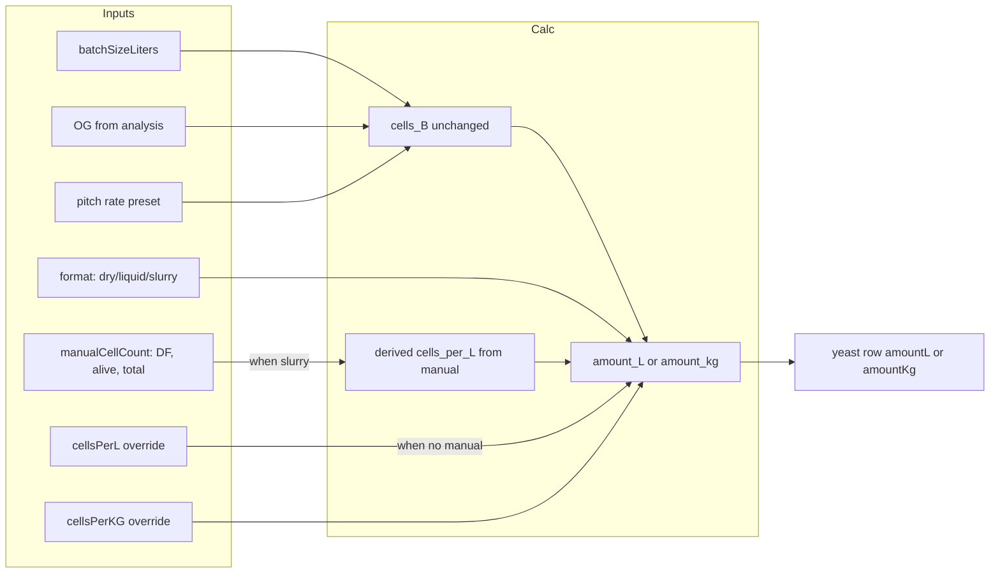

# Yeast Math Reference

Internal reference for all yeast-related formulas used in the recipe editor.

## Overview

This document describes the formulas and constants used to compute estimated yeast cells and amount (volume or mass) for pitching. The calculations support liquid, slurry, and dry yeast formats, with overridable cell density defaults.

## Estimated Cells Needed (B)

**Formula:**

```
cells_B = batchSize_L × OG_plato × pitch_rate
```

**Definitions:**

- `batchSize_L` – Kettle or batch volume in liters (from `recipeExtJson.batchSizeLiters` or analysis kettle volume)
- `OG_plato` – Original gravity converted from SG to °Plato (degrees Plato)
- `pitch_rate` – Million cells per mL per °Plato (from preset key)
- `cells_B` – Billions of cells needed

**Pitch rate presets (million cells per mL per °Plato):**

| Key               | Value |
|-------------------|-------|
| mfg_rec_0_35_ales | 0.35  |
| mfg_rec_0_5_ales  | 0.5   |
| pro_0_75_ales     | 0.75  |
| pro_1_0_ales      | 1.0   |
| pro_1_25_ales     | 1.25  |
| pro_1_5_lager     | 1.5   |
| pro_1_75_lager    | 1.75  |
| pro_2_0_lager     | 2.0   |

## Amount (L) for Liquid / Slurry

**Formula:**

```
amount_L = cells_B / cells_per_L
```

**Default cell densities (B/L):**

- Liquid: 2150 (White Labs PurePitch Next Gen)
- Slurry: 1200 (typical harvested slurry)

**Overridable:** The user can override `cells_per_L` per yeast row via "Cells per L (overridable)". Stored in `recipeExtJson.yeastCellsPerLOverrides`.

## Use Manual count for slurry density and viability

By choosing manual count to derive cells per L, the field **Estimated cells needed (B)** is unchanged; only the slurry density (and thus Amount (L)) comes from the manual count. This fully reuses existing formulas and logic.

**Formulas (from hemocytometer methodology Step 5):**

```
live cells/g = alive × 5 × DF × 10,000
cells_per_L (B/L) = live cells/g × 1000 / 1e9 = alive × DF × 0.05
```

**Inputs:** DF (dilution factor: 200× or 2000×), alive cells, total cells (raw counts from five hemocytometer squares).

**Storage:** `recipeExtJson.yeastManualCellCountOverrides` keyed by yeast row ID. When present for a slurry row, it **directly influences Amount (L)** via `amount_L = cells_B / cells_per_L`.

Viability (%) = (alive cells / total cells) × 100 (display only).

## Amount (kg) for Dry

**Formula:**

```
amount_kg = cells_B / cells_per_kg
```

**Default cell density (B/kg):** 1500 (yeastman-derived from ~1.5 B/g × 1000 g/kg; dry yeast typically ~1–2 billion cells per gram)

**Overridable:** The user can override `cells_per_kg` per yeast row via "Cells per KG (overridable)". Stored in `recipeExtJson.yeastCellsPerKGOverrides`.

## Constants

| Constant              | Value | Description                                  |
|-----------------------|-------|----------------------------------------------|
| CELLS_PER_L_LIQUID    | 2150  | Default cells per liter for liquid yeast     |
| CELLS_PER_L_SLURRY    | 1200  | Default cells per liter for slurry           |
| CELLS_PER_KG_DRY      | 1500  | Default cells per kg for dry yeast           |

## Data Flow



## Worked example (manual count)

**Inputs:**
- Batch: 20 L
- OG: 1.048 SG → 12°Plato
- Pitch rate: Pro Brewer 0.75 Ales → 0.75 million cells/mL/°P
- Manual count: alive=50, total=60, DF=200×

**Step 1 – cells_B:**
```
cells_B = 20 × 12 × 0.75 = 180 billion
```

**Step 2 – cells_per_L (from manual):**
```
live cells/g = 50 × 5 × 200 × 10,000 = 500,000,000
cells_per_L = 500,000,000 × 1000 / 1e9 = 500 B/L
```
Or directly: `cells_per_L = alive × DF × 0.05 = 50 × 200 × 0.05 = 500 B/L`

**Step 3 – amount_L:**
```
amount_L = 180 / 500 = 0.36 L
```

## Source of Defaults

Default cell density values are from yeastman. Overrides are allowed when the user has lab or manufacturer data for a specific product.
