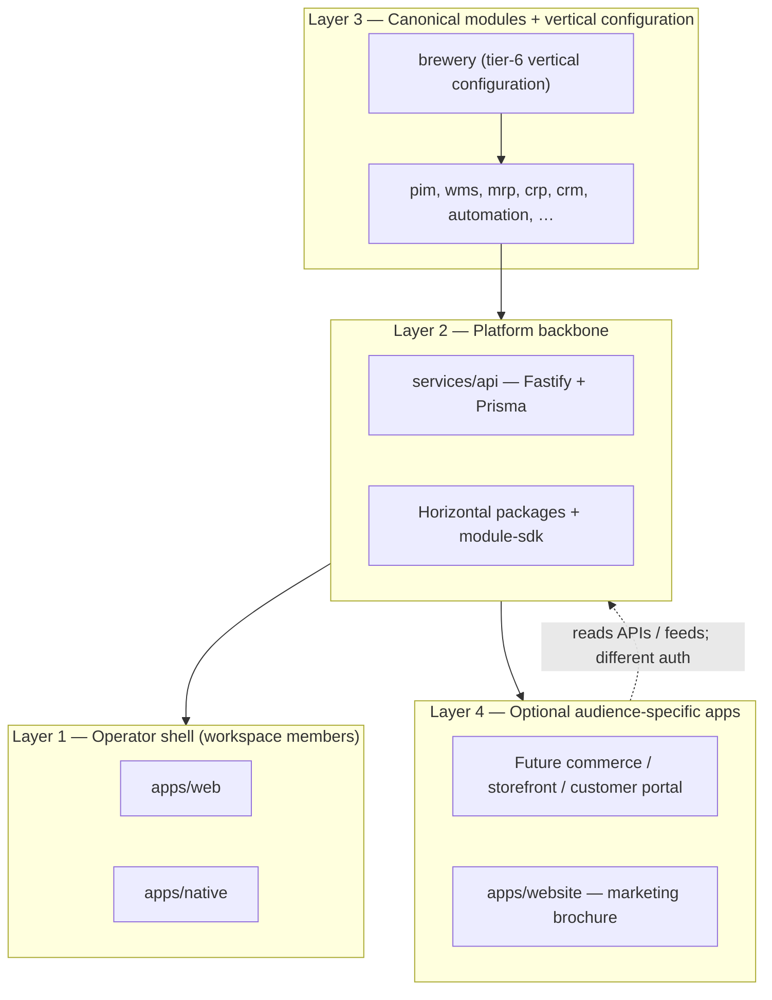

# Application surfaces vs platform backbone

**Tier:** Public  
**Status:** Decision-of-record 2026-05-28 (terminology + layering; no new RFC)  
**Audience:** core team, module authors, self-hosting operators, anyone asking "where does backend live?" or "do we need admin vs storefront?"  
**Builds on:** [PLATFORM-ARCHITECTURE.md](../PLATFORM-ARCHITECTURE.md) §1.1, §2, §4.0–§4.2; [REPOSITORY-STRUCTURE.md](../REPOSITORY-STRUCTURE.md) §2; [RFC-0001](../rfcs/0001-modules-tiers-governance-and-automation-placement.md) §8 (Decision F); [ROADMAP.md](../ROADMAP.md) standing principles

> **Disclaimer.** Clarifies vocabulary and audience boundaries already committed elsewhere. Does not allocate a new canonical module, does not introduce `@umbraculum/core` as a package, and does not change the one-shell / one-AI-context principle.

---

## 1. Summary

| Question | Short answer |
|---|---|
| What is the **platform backbone**? | Horizontal platform services (auth, workspace, billing, AI, rendering, i18n, navigation primitives) + `services/api` as the single API monolith + `@umbraculum/module-sdk` as the module registration contract. |
| What is a **backend** in this repo? | Usually **`services/api`** (layer 2). Sometimes the whole horizontal platform. Rarely "Drupal admin" — that phrase overloads operator UI with API service. |
| Drupal-style admin vs customer frontend? | **Not** the model for PIM / WMS / MRP / CRP / CRM or for brewery today. Operator modules share **one workspace-member shell**. Shopper-facing surfaces (if any) are **separate apps**. |
| How do you "configure" a public operational product? | Install canonical modules + vertical configuration + workspace entitlements — not by theming a second backend inside `apps/web`. |
| Is `@umbraculum/core` the backbone? | **No.** That npm name is reserved and unused. The backbone SDK is **`@umbraculum/module-sdk`** plus horizontal packages ([§5](#5-module-sdk-vs-umbraculumcore-vs-shell-composition)). |

---

## 2. Four layers (not "backend vs frontend")

| Layer | Role | Examples in tree |
|---|---|---|
| **Platform backbone** | Cross-cutting services every module consumes ([RFC-0001 §8.2](../rfcs/0001-modules-tiers-governance-and-automation-placement.md)); single source of truth for tenancy and AI context | `services/api`, `@umbraculum/contracts`, `@umbraculum/module-sdk`, `@umbraculum/ui`, `@umbraculum/navigation`, `@umbraculum/rendering`, … |
| **Canonical modules** | Peer operational domains (flat SAP-style decomposition, not nested under "manufacturing") | `automation`, `pim` (shipped); `mrp`, `crp` (alpha read-only shipped); `wms`, `crm` (open doors) |
| **Vertical configuration** | Seed data, prompts, vertical UI — consumes canonicals, does not replace them | `brewery` (reference tier-6 configuration) |
| **Application surfaces** | Deployable UIs or sites for a **specific audience** | `apps/web` + `apps/native` (operators); `apps/website` (public orientation); future storefront = separate `apps/*` |

**Repository layers vs product layers.** [REPOSITORY-STRUCTURE.md](../REPOSITORY-STRUCTURE.md) names layer 1 **Applications** (`apps/*`) and layer 2 **Services** (`services/*`). That is **spatial** (where code lives), not Drupal's merchant/customer split. Both web and native are operator applications talking to the same API.

---

## 3. Terminology glossary

Use these terms in reviews and plans to avoid talking past each other.

| Term | Meaning | Do not confuse with |
|---|---|---|
| **API service** | HTTP monolith: routes, Prisma, jobs | Operator UI, "admin theme" |
| **Horizontal platform** | Auth, workspace, billing, AI orchestrator, rendering, notifications boundary, … | A single package named `core` |
| **Operator shell** | Federated web + native app workspace members use daily | Storefront, brochure site |
| **Workspace-member app** | Same as operator shell — one audience, one AI context ([ROADMAP](../ROADMAP.md) standing principle) | B2C shopper app |
| **Module registration** | Boot-time declaration via `registerModule()` / `registerWebModule()` / `registerNativeModule()` | Runtime shell layout (partially deferred — see §5) |
| **Public surface (marketing)** | Static orientation HTML | Operational "public API" |
| **Storefront / commerce** (future) | Separate deployable; read-only consumer of PIM/CRM master data | PIM admin UI |

---

## 4. Drupal-style vs ERP-style

### 4.1 Drupal-style (usually **not** this project)

- Merchant configures catalog in **admin backend**
- Customer shops on **themed frontend**
- Two audiences, often two apps, shared CMS core

### 4.2 Umbraculum-style (committed)

- **Workspace members** (planners, brewers, warehouse staff, admins) use **one shell** with federated module routes
- Canonical modules are **operator systems** (Akeneo / SAP / Odoo class admin), not storefronts
- **AI consultant** requires workspace-scope context — splitting operator modules across disconnected apps breaks the cornerstone principle ([PLATFORM-ARCHITECTURE.md](../PLATFORM-ARCHITECTURE.md) §4.0)

Standing principle ([ROADMAP.md](../ROADMAP.md)):

> **One audience per app.** Workspace-member modules share one shell. Shopper-facing surfaces (if any) are separate apps.

### 4.3 Where Drupal *does* apply — the optional edge

| Surface | Audience | In repo today |
|---|---|---|
| PIM product admin | Workspace member | `(pim)/` routes in `apps/web` |
| Channel feed / CSV export | Downstream system | PIM + RFC-0007 rendering |
| Shopper storefront | Anonymous / customer | **Not in repo**; explicitly separate app if pursued |
| Marketing site | Evaluator / contributor | `apps/website` (static; not operational) |

PIM boundary ([canonical-pim-module-surface.md](canonical-pim-module-surface.md) §3.2): master product data is canonical; **storefront projections belong to a sibling commerce module**, not inside PIM.

---

## 5. Module SDK vs `@umbraculum/core` vs shell composition

### 5.1 Yes — the "core SDK" already exists

In governance and npm terms, the **module registration spine** is shipped:

| Package | Tier | Role |
|---|---|---|
| [`@umbraculum/module-sdk`](../../packages/module-sdk/README.md) | 2 (MIT) | `registerModule()`, `registerWebModule()`, `registerNativeModule()`, reserved codes, `ValidatedSchema<T>`, document-template types |
| [`@umbraculum/ai-tool-sdk`](../../packages/ai-tool-sdk/README.md) | 2 (MIT) | AI tool contract types |
| [`@umbraculum/i18n-keys`](../../packages/i18n-keys/README.md) | 2 (MIT) | Module nav / message-key conventions |

Third-party modules pin these — they **are** the public "how you plug into the platform" contract ([MODULES.md](../MODULES.md) §3.3, [RFC-0001](../rfcs/0001-modules-tiers-governance-and-automation-placement.md) tier 2).

The SDK is **contract + boot-time registry**, not the API implementation:

| Concern | Owner |
|---|---|
| Fastify routes, Prisma, orchestrator, billing webhooks | `services/api` |
| Registration shape, collision detection, nav metadata types | `@umbraculum/module-sdk` |
| Tamagui primitives, route IDs, `useT`, api-client | Other horizontal packages |

### 5.2 What `@umbraculum/core` is **not**

During the `@brewery/*` → `@umbraculum/*` scope migration, `@brewery/core` (brewing math) was renamed to **`@umbraculum/brewery-core`** — deliberately **not** `@umbraculum/core` — so "core" does not read as "everything shared" ([brewery-scope-migration-plan.md](brewery-scope-migration-plan.md) §1.3).

**There is no `@umbraculum/core` package today.** The name remains reserved; creating it as a grab-bag of shared code would recreate the trap the migration avoided.

### 5.3 Shell composition — related problem, different home

Some **runtime** shell concerns are partially extracted:

- **Registry-driven primary nav** — `composeWebShellNavItems()` in `@umbraculum/module-sdk` reads `registerWebModule({ navEntries })` metadata from [`BUILTIN_WEB_MODULE_REGISTRATIONS`](../../packages/module-sdk/src/builtinWebModules.ts); [`PrimaryNav.tsx`](../../apps/web/app/_components/PrimaryNav.tsx) receives composed items from the server layout.
- **Platform-owned URL segments** — [`registerPlatformSegments.ts`](../../apps/web/app/_lib/registerPlatformSegments.ts) lives in `apps/web` today.
- **Entitlement-gated nav / upgrade affordances** — tied to `WorkspaceBilling` and future `WorkspaceBillingAddon` ([PLATFORM-ARCHITECTURE.md](../PLATFORM-ARCHITECTURE.md) §3.6–§3.7).

These are **operator-shell composition** problems. Reasonable future homes (pick one when the debt hurts — **no commitment now**):

1. Stay in `apps/web` / `apps/native` until a second shell consumer exists
2. Extract shared shell helpers to a new horizontal package (e.g. `@umbraculum/shell` — name illustrative only)
3. Extend `@umbraculum/navigation` with registry-aware composition helpers

They should **not** become a second API, duplicate `module-sdk`, or hold domain logic. **`@umbraculum/module-sdk` remains the registration contract**; any future shell package would **consume** it, same as `apps/web` does.

---

## 6. Worked examples

### 6.1 Brewery workspace (today)

| Piece | Classification |
|---|---|
| Recipe editor, brew-day flows | Vertical configuration UI in operator shell |
| `/auth/*`, workspace switcher | Horizontal platform |
| `services/api` recipe routes | API service (brewery-vertical routes today; β-layout under `modules/brewery/`) |
| Brochure at umbraculum.dev | Layer 4 marketing — not operational backend |
| Hypothetical beer shop | Layer 4 separate app — would consume PIM/CRM APIs, not live inside `(brewery)/` |

Brewery operators **are** the users of `apps/web` / `apps/native`. There is no in-repo B2C storefront; native exists for **offline brew-day** (form factor), not for shoppers.

### 6.2 PIM-only workspace (future)

A cosmetics company using only `pim` + platform horizontal services:

- Operators use `(pim)/products`, `(pim)/categories`, … in the **same shell** as any other installed module
- No WMS/MRP required for a minimal deployment
- Shopify storefront (if built) = **separate app** reading channel feeds / APIs — not "PIM frontend theme"

### 6.3 Configuring a hosted product

To offer "Umbraculum hosted for breweries" or "hosted PIM":

1. Enable modules + vertical seed (brewery configuration or PIM-only)
2. Set workspace billing tier and (future) per-module add-ons
3. Assign workspace members and roles
4. Optionally operate a **separate** marketing or commerce app — not by forking the operator shell into "admin" vs "store"

---

## 7. Cross-references

- [PLATFORM-ARCHITECTURE.md](../PLATFORM-ARCHITECTURE.md) — vision, audit, target module model
- [REPOSITORY-STRUCTURE.md](../REPOSITORY-STRUCTURE.md) — five-layer monorepo map
- [MODULES.md](../MODULES.md) — ecosystem entry + horizontal package catalog
- [packages/module-sdk/README.md](../../packages/module-sdk/README.md) — registration contract (the backbone SDK)
- [design/web-route-group-audit.md](web-route-group-audit.md) — URL segment ownership + `registerWebModule`
- [design/canonical-native-platform-surface.md](canonical-native-platform-surface.md) — native shell obligations
- [RFC-0001 §8.2](../rfcs/0001-modules-tiers-governance-and-automation-placement.md) — consumption contract (what modules must not reimplement)
