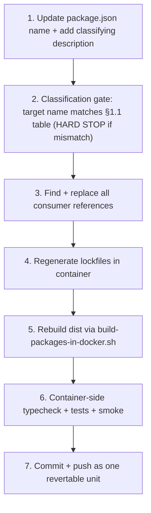

# `@brewery/*` → `@umbraculum/*` package-scope migration plan

**Tier:** Public
**Status:** Active 2026-05-19 — scoping pass + slots 1–5 landed (slot 1: `test-mcp` worked example, §6; slot 2: `media`, §6.1; slot 3: `navigation`, §6.2; slot 4: `automation-contracts`, §6.3; slot 5: `ui` — heavy 69-file slot held cleanly on first attempt under the slot-4-corrected recipe, §6.4; each slot surfaced lessons folded back into §4/§5 before commit). Remaining 9 slots (8 packages + 1 application-workspace bundle) tracked in [`brewery-scope-migration-per-package-handoff.md`](./brewery-scope-migration-per-package-handoff.md).
**Audience:** core team executing the rename; future contributors picking up un-checked items from the handoff checklist; anyone evaluating the migration shape before the public flip.
**Resolves:** umbrella plan sub-plan #9 (post-RFC-001 follow-on); the `@brewery/*` actual-scope migration referenced from [`docs/RENAME-DILIGENCE.md`](../RENAME-DILIGENCE.md) §10.
**Builds on:** [`docs/PLATFORM-ARCHITECTURE.md`](../PLATFORM-ARCHITECTURE.md) §5.2 (rename commitment), [`docs/rfcs/0001-modules-tiers-governance-and-automation-placement.md`](../rfcs/0001-modules-tiers-governance-and-automation-placement.md) §§4–5 (brewery is tier-6 vertical, NOT canonical), [`docs/rfcs/0002-canonical-module-physical-layout.md`](../rfcs/0002-canonical-module-physical-layout.md) §11.2 (H1 2027 restructure row that defers to this plan).

> **Disclaimer.** This is a migration-shape pre-flight, not an architectural audit. The decision to migrate to `@umbraculum/*` is settled by the source documents above; the project of this plan is operational — how to land 13 package renames + 4 application-workspace renames safely across ~5–8 sessions without ever leaving the repo in a half-migrated state. No new architectural decisions land in this doc. If an execution session discovers a need for one, it stops and escalates rather than improvising.

---

## 0. Status banner

| Field | Value |
|---|---|
| Scoping pass | **Done 2026-05-19** (this doc + handoff doc + worked-example rename) |
| Worked example landed | `@brewery/test-mcp` → `@umbraculum/test-mcp` (commit hash recorded in §6) |
| Slots landed | 5 of 14 — slots 1–5 (`test-mcp`, `media`, `navigation`, `automation-contracts`, `ui`) |
| Remaining slots to migrate | 9 (8 packages + 1 application-workspace bundle); see [handoff doc](./brewery-scope-migration-per-package-handoff.md) |
| Estimated remaining sessions | 3–6 (1–3 slots per session; slot 9 `contracts` likely its own session; slot 6 `core` is a ⚠ TRAP slot per §1.3 needing the classification gate but is otherwise small) |
| Skill capture in plugin pack | Deferred to second-package execution per "codify on second use" cadence |
| Blocking dependencies | None — both gates closed (rename primary substitution + RFC-0001 acceptance) |

---

## 1. Mis-classification audit (§1 because every other section depends on it)

The migration converts thirteen `@brewery/*` workspace packages into the `@umbraculum/*` namespace per [`docs/PLATFORM-ARCHITECTURE.md`](../PLATFORM-ARCHITECTURE.md) §5.2:

> Horizontal packages move to the neutral platform scope `@umbraculum/*`; brewery-vertical packages stay branded as the brewery module package set (or re-scope under `@umbraculum/brewery-*`).

The substitution is **not mechanical** because mechanical substitution silently promotes brewery-vertical code into the platform-core namespace — exactly the failure mode the rename is meant to fix.

### 1.1 Classification table (authoritative for the rename)

| Source name | Classification | Target name | Rationale |
|---|---|---|---|
| `@brewery/api-client` | **Platform** | `@umbraculum/api-client` | Generic fetch + auth boundary (cookie web, bearer native); no brewery-domain logic. |
| `@brewery/automation-contracts` | **Platform** (canonical-module contracts) | `@umbraculum/automation-contracts` | Vessel-agnostic mailbox + adapter contracts; `automation` is canonical tier-1 ([RFC-0001](../rfcs/0001-modules-tiers-governance-and-automation-placement.md) §4 Decision B). Already self-declares end-state name in its `package.json` description. |
| `@brewery/beerjson` | **Brewery-vertical** | `@umbraculum/brewery-beerjson` | BeerJSON is a brewing-specific interchange schema (style guidelines, fermentables, hops, yeast). Will never be loaded by a cosmetics or distillery vertical. |
| `@brewery/contracts` | **Platform** | `@umbraculum/contracts` | Generic auth/me DTO + AI-tool contract types; no brewery-domain types. |
| `@brewery/core` | **Brewery-vertical** ⚠ TRAP | `@umbraculum/brewery-core` ⚠ **NOT** `@umbraculum/core` | Contents are brewing math (`gravity.js`, `water.js`, brewing-specific unit conversions). The word "core" mis-suggests platform-core; the rename is the opportunity to make the vertical-ness explicit in the name. See §1.3. |
| `@brewery/i18n` | **Platform** (framework; brewery-flavored content for now) | `@umbraculum/i18n` | Generic locale bundle framework. Current bundle contents are brewery-flavored, but that is a separate content-split job tracked for when the second vertical lands. See §1.4. |
| `@brewery/i18n-react` | **Platform** | `@umbraculum/i18n-react` | Generic universal `useT` hook (web + native); no brewery-domain logic. |
| `@brewery/media` | **Platform** (framework; brewery-flavored content for now) | `@umbraculum/media` | Generic shared-assets framework. Current assets are brewery imagery; same content-split as `i18n` when second vertical lands. |
| `@brewery/module-sdk` | **Platform** | `@umbraculum/module-sdk` | `registerModule()` contract + `ValidatedSchema<T>` interface; module-developer surface. Already self-declares end-state name in its `package.json` description. |
| `@brewery/navigation` | **Platform** (framework; brewery-flavored route IDs for now) | `@umbraculum/navigation` | Route IDs + cross-platform routing policy framework. Current route IDs include brewery routes; same content-split as `i18n` later. |
| `@brewery/recipes-ui` | **Brewery-vertical** | `@umbraculum/brewery-recipes-ui` | Recipes, mash, water, yeast UIs — brewing-domain primitives. |
| `@brewery/test-mcp` | **Platform** | `@umbraculum/test-mcp` | HTTP server exposing testing tools (smoke, seed, vitest, Playwright, contracts); no brewery-domain logic. |
| `@brewery/ui` | **Platform** | `@umbraculum/ui` | Tamagui primitives, design-system components; no brewery-domain logic. |

**Tally:** 10 platform packages (→ `@umbraculum/<name>`), 3 brewery-vertical packages (→ `@umbraculum/brewery-<name>`).

### 1.1.1 Application workspace names (4 additional renames)

The four application workspaces ([`services/api/package.json`](../../services/api/package.json), [`apps/web/package.json`](../../apps/web/package.json), [`apps/native/package.json`](../../apps/native/package.json), [`apps/web/e2e/package.json`](../../apps/web/e2e/package.json)) also declare `@brewery/*` `name` fields. They are not consumed by any other workspace (nobody imports `@brewery/web` or `@brewery/api`), but the `name` field is still visible in `package-lock.json`, npm output, and any inter-workspace tooling that lists workspaces. Leaving them as `@brewery/*` after the package migration completes would re-introduce the cognitive-drift problem (mixed `@brewery/*` and `@umbraculum/*` namespaces in the same repo) that sub-plan #9 exists to fix.

| Source workspace name | Target name | Notes |
|---|---|---|
| `@brewery/api` ([`services/api/`](../../services/api/)) | `@umbraculum/api` | API service. Platform-classified. |
| `@brewery/web` ([`apps/web/`](../../apps/web/)) | `@umbraculum/web` | Next.js web app. Platform-classified (carries brewery-vertical UI today; same content-split logic as `i18n`/`media`/`navigation` — framework is platform, content is vertical, content split deferred). |
| `@brewery/native` ([`apps/native/`](../../apps/native/)) | `@umbraculum/native` | Expo native app. Same logic as `web`. |
| `@brewery/web-e2e` ([`apps/web/e2e/`](../../apps/web/e2e/)) | `@umbraculum/web-e2e` | Playwright suite for the web app. |

These four renames are bundled as a single PR in slot 14 (§3) — they have zero workspace consumers (the only references are in the workspace's own `package.json` and in inherited lockfile entries) so the blast radius is minimal and they don't justify separate PRs.

### 1.2 Dep-graph proof: zero platform → vertical edges today

Cross-package workspace `dependencies` declared in `packages/*/package.json`:

```text
api-client            → contracts                  [platform → platform]   OK
automation-contracts  → (no internal deps)         OK
beerjson              → core                       [vertical → vertical]   OK
contracts             → (no internal deps)         OK
core                  → (no internal deps)         OK
i18n                  → (no internal deps)         OK
i18n-react            → i18n                       [platform → platform]   OK
media                 → (no internal deps)         OK
module-sdk            → contracts                  [platform → platform]   OK
navigation            → (no internal deps)         OK
recipes-ui            → beerjson, i18n-react, ui   [vertical → vertical + platform]  OK
test-mcp              → (no internal deps)         OK
ui                    → (no internal deps)         OK
```

**Zero platform → vertical edges.** The classification is consistent with the existing dep-graph: brewery-vertical packages depend on platform packages (allowed), platform packages never depend on brewery-vertical packages (forbidden). The rename must preserve this invariant. Per-package verification step 2 in §4 enforces it explicitly.

### 1.3 The one trap: `@brewery/core`

Of the thirteen packages, **`@brewery/core` is the only target-name decision that defaults to wrong** under mechanical substitution:

- Naive substitution → `@umbraculum/core` (sounds like platform-core)
- Correct target → `@umbraculum/brewery-core` (brewing math, vertical-classified)

Contents to verify: [`packages/core/src/gravity.js`](../../packages/core/src/gravity.js), [`packages/core/src/water.js`](../../packages/core/src/water.js), and the `units/` subdirectory — all brewing-domain. The package's `package.json` does not currently declare a description; the rename PR will add one ("Brewery-vertical brewing calculations and unit conversions. End-state npm scope: `@umbraculum/brewery-core`.") so the next reader is not at risk of the same confusion.

The handoff doc's `core` section repeats this trap warning verbatim; it is also encoded as a hard-stop in §4 verification step 2 below.

### 1.4 Soft note: three platform packages carry brewery-flavored content today

| Package | Framework classification | Content today | Resolution |
|---|---|---|---|
| `@brewery/i18n` | Platform | Locale bundles include brewery strings (`recipes.*`, `equipment.*`, `automation.*`, `nav.recipes`, etc.) | Rename safely as platform; content-split deferred to when second vertical lands (then: `@umbraculum/i18n` keeps shell + `@umbraculum/brewery-i18n` ships brewery bundle). |
| `@brewery/media` | Platform | `assets/` are brewery imagery (recipe images, brand assets) | Same as `i18n` — rename framework, defer content split. |
| `@brewery/navigation` | Platform | Route IDs include brewery routes (`recipes`, `equipment`, `inventory`, `water-profiles`, …) | Same as `i18n` — rename framework, defer content split. |

**This is NOT a rename problem.** The frameworks are platform-correct; the content split is a separate, much later concern tied to the second vertical landing. The rename PRs for these three packages MUST NOT attempt the content split — that is out of scope for sub-plan #9 entirely.

---

## 2. Concrete inventory

### 2.1 Occurrence + file counts per package (excl. `dist/` and `package-lock.json`)

| Package | Occurrences | Files | Notes |
|---|---:|---:|---|
| `@brewery/contracts` | 122 | 75 | Heaviest — consumed by api, web, native, every contract test |
| `@brewery/ui` | 104 | 67 | Tamagui primitives; touches every web and native screen |
| `@brewery/recipes-ui` | 61 | 33 | Brewery-vertical; mainly web + native + own README |
| `@brewery/i18n-react` | 58 | 42 | Universal `useT` consumers across web + native |
| `@brewery/i18n` | 48 | 27 | Locale bundles + i18n config |
| `@brewery/api-client` | 43 | 31 | Mostly native screens + AuthProvider |
| `@brewery/navigation` | 28 | 16 | Route ID consumers across web + native |
| `@brewery/beerjson` | 28 | 20 | Brewery-vertical; recipes + waterCalc + tests |
| `@brewery/core` | 26 | 18 | Brewery-vertical brewing math; ⚠ trap (see §1.3) |
| `@brewery/media` | 25 | 18 | Web + native asset consumers |
| `@brewery/automation-contracts` | 23 | 18 | New (B-1 onward); api + web automation pages |
| `@brewery/module-sdk` | 19 | 12 | api + tests + design docs |
| `@brewery/test-mcp` | 11 | 6 | **Lowest blast radius — worked example (§6)** |

### 2.2 Reference categories

For each package, occurrences fall into five surface categories:

1. **Workspace deps** — every `packages/*/package.json`, `apps/*/package.json`, `services/*/package.json` that lists the package under `dependencies` or `devDependencies`.
2. **Source imports** — `import … from "@brewery/<name>"` in `*.ts`, `*.tsx`, `*.js`, `*.jsx`, `*.mjs` files.
3. **Build/runtime configs** — `apps/web/next.config.js` `transpilePackages` list, `apps/native/metro.config.js` `extraNodeModules` map, `apps/native/tamagui.config.ts`, `apps/web/tamagui.config.ts`, `apps/web/app/variables.css` (one CSS path reference).
4. **Lockfiles** — root [`package-lock.json`](../../package-lock.json) + per-workspace `package-lock.json` files. Regenerated by `npm install --no-audit --no-fund` in container; never edited by hand.
5. **Doc + readme references** — ~30 doc files in `docs/` and `*/README.md` mention `@brewery/*` by name. Updated as part of the rename PR for each package.

### 2.3 Sister-repo coordination is doc-only

The openplc sister repo (frozen alarm layer `2.0.1-dev`, [`docs/design/openplc-mailbox-emitter-pr-shape.md`](./openplc-mailbox-emitter-pr-shape.md)) does **not** import `@brewery/automation-contracts`. It emits a JSON artifact that the platform mirrors. Sub-plan #9 therefore needs only doc-link updates in the sister-repo handoff doc when `automation-contracts` is renamed — no code coordination, no PR-pairing, no synchronized release.

This significantly lowers the coordination burden compared to what a cross-repo TypeScript dependency would have implied.

### 2.4 What the rename does NOT touch

Pinned out-of-scope items, to prevent scope creep during execution sessions:

- npm registry name reservation under `@umbraculum/*` — deferred to pre-public-flip (H1 2027) per [`docs/PLATFORM-ARCHITECTURE.md`](../PLATFORM-ARCHITECTURE.md) §10.1.1. The packages are `"private": true` workspace-only today; npm publishing is a separate post-flip concern.
- Content split for `i18n`, `media`, `navigation` (see §1.4).
- Module SDK API changes (interface shape stays identical; only the npm scope of the SDK package changes).
- Prisma schema names, route paths, or AI tool names — none of these encode `@brewery` in their identifiers.
- The brewery-vertical's user-visible product name — Umbraculum's brewery configuration is still branded "Umbraculum (brewery)" per [`docs/RENAME-DILIGENCE.md`](../RENAME-DILIGENCE.md); the package scope is an internal-developer-facing surface.

---

## 3. Per-package migration order

Staged by the dep-graph from §1.2: leaves first, mid-graph next, top-graph last. One package per PR; consumers updated in the same PR. **No bridge layer** (no `@umbraculum/<name>` package that re-exports from `@brewery/<name>` or vice versa) — the rename is point-in-time, atomic per package, and the verification step is the proof.

| Order | Package | Target name | Why this slot | Rough size (files) |
|---|---|---|---|---:|
| 1 | `@brewery/test-mcp` ✅ | `@umbraculum/test-mcp` | **Worked example (this session)** — zero workspace consumers, lowest blast radius, proves the recipe end-to-end | 6 |
| 2 | `@brewery/media` | `@umbraculum/media` | Leaf; consumed only by `apps/web` + `apps/native` (no other workspace packages); `next.config.js transpilePackages` touch | 18 |
| 3 | `@brewery/navigation` | `@umbraculum/navigation` | Leaf; route IDs; consumed by web + native; no internal package consumers | 16 |
| 4 | `@brewery/automation-contracts` | `@umbraculum/automation-contracts` | Leaf; new (no historical dep churn); only consumed by api + web automation pages | 18 |
| 5 | `@brewery/ui` | `@umbraculum/ui` | Leaf in dep-graph but heavy (67 files); `next.config.js transpilePackages` + `tamagui.config.ts` touch; landing here uncorks the top-graph `recipes-ui` rename later | 67 |
| 6 | `@brewery/core` | `@umbraculum/brewery-core` | Leaf; trap (§1.3) — pin classification verbatim from §1 in the PR description | 18 |
| 7 | `@brewery/i18n` | `@umbraculum/i18n` | Mid-graph; consumed by `i18n-react`; lockfile churn worth doing before its consumer | 27 |
| 8 | `@brewery/i18n-react` | `@umbraculum/i18n-react` | Depends on `i18n` (must come after slot 7) | 42 |
| 9 | `@brewery/contracts` | `@umbraculum/contracts` | Heaviest (122 occurrences, 75 files); consumed by `api-client`, `module-sdk`, and ~every contract test | 75 |
| 10 | `@brewery/api-client` | `@umbraculum/api-client` | Depends on `contracts` (must come after slot 9); mainly native screens + AuthProvider | 31 |
| 11 | `@brewery/module-sdk` | `@umbraculum/module-sdk` | Depends on `contracts` (must come after slot 9); api + automation module + tests | 12 |
| 12 | `@brewery/beerjson` | `@umbraculum/brewery-beerjson` | Depends on `@brewery/core` (must come after slot 6); brewery-vertical | 20 |
| 13 | `@brewery/recipes-ui` | `@umbraculum/brewery-recipes-ui` | Depends on `beerjson`, `i18n-react`, `ui` (must come after slots 5, 8, 12); brewery-vertical; closes the package migration | 33 |
| 14 | Application workspace names (×4) | `@umbraculum/{api,web,native,web-e2e}` | Single PR; bundles the four `name`-field renames from §1.1.1 — no consumer churn beyond own `package.json` + lockfile + `package-lock.json` workspace `name` fields. Lands after slot 13 to ensure no in-flight package PR collides with workspace-dep paths. | 4 |

**Slot 1 is executed in this session.** Slots 2–14 execute serially across subsequent sessions per the [handoff doc](./brewery-scope-migration-per-package-handoff.md). The ordering above is a recommendation, not a hard contract — execution sessions MAY reorder within constraints if a slot is blocked, provided the per-package dep predecessors have shipped.

---

## 4. Verification recipe per package

Every package migration follows the same seven steps. **No step may be skipped.** The recipe is the contract.



### Step 1 — Update the package itself

- Edit [`packages/<name>/package.json`](../../packages/) `name` field.
- **Also check the `bin:` field**, if present. If the bin name encodes the old scope (e.g. `"brewery-<name>": "..."`), rename it to match the new scope (`"umbraculum-<name>": "..."`). Surfaced during slot 1 worked example: [`packages/test-mcp/package.json`](../../packages/test-mcp/package.json) had `"brewery-test-mcp"` as bin name; not renaming it would have left the CLI command inconsistent with the package name.
- If `description` is empty or missing, add a classifying description: for platform, `"… End-state npm scope: @umbraculum/<name> per sub-plan #9."`; for brewery-vertical, `"… Brewery-vertical … End-state npm scope: @umbraculum/brewery-<name> per sub-plan #9."`
- Update the package's own `README.md` heading and any in-text references to the old name.
- **Also check the README for user-facing config samples** (MCP server entries, CLI command examples, copy-paste-able JSON snippets that reference the package by name or bin name). These are surface a user pastes into their own config; renaming them in the README is the only way the next reader of the README gets the right command. Surfaced during slot 1: the test-mcp README's Cursor MCP wiring example had `"brewery-test-mcp"` as the server key.

### Step 2 — Classification gate (HARD STOP)

Before touching any consumer file, confirm:

- The target name in step 1 exactly matches the §1.1 table.
- If the target is `@umbraculum/brewery-<name>`, an explicit `Brewery-vertical` keyword appears in the package's `description` field.
- If the target name is `@umbraculum/core` and the source was `@brewery/core` — **STOP**. This is the §1.3 trap; the correct target is `@umbraculum/brewery-core`. Revert step 1 and re-do with the correct name.

This step is enforced by reviewer attention, not automation, until the plugin-pack skill lands at second-package execution.

### Step 3 — Find + replace all consumer references

Run the canonical grep from §2.1's methodology against the entire repo:

```bash
grep -rlE "@brewery/<name>([^a-zA-Z0-9_-]|$)" \
  --include='*.ts' --include='*.tsx' --include='*.js' --include='*.jsx' --include='*.mjs' \
  --include='*.json' --include='*.md' --include='*.py' --include='*.yml' --include='*.yaml' \
  --include='*.css' --include='*.prisma' \
  --exclude-dir=node_modules --exclude-dir=dist --exclude='package-lock.json' \
  /home/rf/dkprojects/rfapps/umbraculum-dev
```

For every file in the result list, replace `@brewery/<name>` with the target name from §1.1. Particular attention to:

- **Root `package.json` `build:packages` script** — references every workspace by full name (`npm run build -w @brewery/<name>`); if not updated, step 5 (`scripts/build-packages-in-docker.sh`) will fail with `npm error No workspaces found: --workspace=@brewery/<name>` for the renamed package. **Surfaced during slot 2 worked example** (was NOT in the original slot 1 inventory; missed because slot 1's `test-mcp` doesn't appear in this script).
- **`apps/web/next.config.js`** `transpilePackages: [...]` array — Next.js will silently fail to transpile if the package is renamed without updating this list.
- **`apps/native/metro.config.js`** `resolver.extraNodeModules` map — currently pins `@brewery/recipes-ui`; needs updating when that package migrates.
- **`docker-compose.yml`** bind-mount comments + any volume names — references are comment-only but worth keeping accurate for grep-ability.
- **Doc files in `docs/`** — `PLATFORM-ARCHITECTURE.md`, `RENAME-DILIGENCE.md`, RFC-0002 §11.2 table, `CODING-STANDARDS.md`, `LINTING.md`, `TESTING.md`, `TYPING.md`, `DEVELOPMENT-NATIVE-LOCAL.md`, `REACT-NATIVE-KICKOFF-READINESS.md`, `architecture-Rev02.md`, `DOCS-README-STANDARDS.md`, `NATIVE-STRATEGY-AND-CI.md`, `ROLLOUT.md`.
- **README files in `packages/*/README.md`, `apps/*/README.md`, `services/api/README.md`** — most carry an inventory section listing workspace packages.

### Step 4 — Regenerate lockfiles in container

> **Cross-reference:** This step embodies the lesson from Phase B-3 ("vitest hoisted to root" gotcha). Read [`pr1-contracts-migration-handoff.md`](./pr1-contracts-migration-handoff.md) §"Mandatory prep before any consumer-side verification" if unfamiliar.
>
> **Hard-won during slot 1 worked example:** even when the renamed package has *zero* runtime consumers (e.g. `test-mcp`, no `apps/*` or `services/*` lists it as a dep), the root `npm install` still destructively prunes the bind-mounted `services/api/node_modules` and `apps/web/node_modules` directories. The api container then boots into `MODULE_NOT_FOUND` (`tsc: not found`, missing preload modules) and surfaces as a 502 through Nginx. The per-container reinstall + api restart below is therefore **unconditional**, not conditional on dep-graph membership.

```bash
# (a) Refresh root lockfile via one-shot node:20-slim container (DO NOT use `docker compose exec`
#     against api/web here — those containers' /app mount is services/api/ or apps/web/,
#     not the workspace root, so `npm install` there refreshes the wrong lockfile).
docker run --rm \
  -v "$PWD:/repo" \
  -v brewery_app_root_node_modules:/repo/node_modules \
  -w /repo \
  -e HOST_UID="$(id -u)" -e HOST_GID="$(id -g)" \
  node:20-slim \
  bash -lc 'npm install --no-audit --no-fund; rc=$?; chown -R "$HOST_UID:$HOST_GID" /repo/packages /repo/apps /repo/services /repo/package.json /repo/package-lock.json; exit $rc'

# (b) web side: in-place install is safe (web container does not run a tsx-style
#     hot-reload preload; the build script does not unlink-watch web's dist).
#     --include=dev is REQUIRED for the in-place install (surfaced during slot 2):
#     when run against a workspace-flavored package.json whose `file:../../packages/...`
#     deps can't resolve from /app's perspective, npm 10's degraded resolution
#     mode treats this as a production install and silently omits devDependencies.
docker compose exec web sh -c 'cd /app && npm install --include=dev --no-audit --no-fund'

# (c) api side: DELAYED to AFTER step 5 (build) — see "api recovery is bundled
#     with step 5" below. Do NOT install devDeps into services/api/node_modules
#     here, because the build script's `npm ci` (step 5) will wipe them anyway.
```

**Why not `docker compose restart api` (and why is api recovery delayed to step 5)?** Surfaced in stages across slots 1, 3, and 4 — the cleanest mental model is the slot-4 root cause:

The real devDep pruner is **`scripts/build-packages-in-docker.sh`'s `npm ci`** (step 5), not any restart per se. That script mounts `${REPO_ROOT}:/repo` (the whole repo, including `services/api/`) and runs `npm ci` to populate the build's workspace tree. In npm 10's degraded-resolution mode against this workspace shape, `npm ci` silently omits devDependencies for `services/api/` — leaving its bind-mounted `node_modules` at ~42 packages instead of ~140 (no `tsc`, no `vitest`, no `tsx`).

If the api container is RUNNING during this build, two failure modes chain:
1. The `npm ci` wipes `/app/node_modules/tsx/dist/preflight.cjs`.
2. `npm run build:packages` then unlinks `dist/` files for every package one-by-one.
3. The running `tsx watch` (PID 1's child) detects each `unlink` event and tries to hot-reload, but tsx itself is missing → `Cannot find module .../tsx/dist/preflight.cjs` → tsx exits → container crash-loops → `/api/health` returns 502 through Nginx for the rest of the slot.

`docker compose restart api` is also dangerous on its own — every restart re-runs the container's `sh -c "npm install && npm run dev"` startup command, and that `npm install` can re-prune devDeps the same way. But `docker compose restart api` only hurts if step 5 hasn't already run; once step 5 runs against a live api, the build's `npm ci` is sufficient to kill tsx watch regardless of any restarts.

**The cleanest sequence** (post-slot-4, validated on slot 4 second attempt): take api OUT of the picture during the build, then re-install its devDeps after the build, then start it. See step 5 for the exact commands.

After step 4 (a) + (b):

- `git diff --stat package-lock.json` — should show a small number of insertions/deletions (~6+6 for a single-package rename with no dep change; more if the package has cross-package consumers). Inspect the line-level diff to confirm changes are limited to the renamed package's entries (plus the workspace-deps reverse-pointers under each consumer's `node_modules` map). If *unrelated* packages appear in the diff, **STOP and investigate** before proceeding.
- The api container is **still running with stale node_modules** at this point — that is intentional and OK; we will rebuild + reinstall + restart it in step 5. The web container has been reinstalled in-place and is in its target state.

### Step 5 — Rebuild `dist/` via the canonical script (api STOP-build-install-START sequence)

The build script `scripts/build-packages-in-docker.sh` runs `npm ci && npm run build:packages` against a mount of the whole repo. The `npm ci` will wipe `services/api/node_modules` devDeps as a side-effect (see step 4's "Why not docker compose restart api?" for the root cause). To prevent tsx watch from crash-looping, the api container is stopped BEFORE the build, recovered AFTER the build, and started LAST:

```bash
# (a) Stop api so tsx watch is not running while the build's npm ci wipes its devDeps
docker compose stop api

# (b) Run the canonical build (no live tsx watching anything → safe)
bash scripts/build-packages-in-docker.sh

# (c) Restore api's devDeps into the (now-pruned) bind-mount via host one-shot
docker run --rm -v "$PWD/services/api:/app" -w /app node:20-slim \
  bash -lc 'npm install --include=dev --no-audit --no-fund'

# (d) Start api — its startup `npm install` sees deps satisfied, runs as a no-op,
#     tsx watch comes up clean, all package dist/ files are already on disk
docker compose start api

# (e) Verify
curl -sS http://localhost:18080/api/health   # expect {"ok":true}
```

This rebuilds `dist/` for every package that publishes one (most platform packages do). Skipping the build produces the same failure mode that derailed B-3:

```
SyntaxError: The requested module '@umbraculum/<name>' does not provide an export named 'X'
```

…because the running container is still resolving the stale pre-rename `dist/index.js`. Always rebuild even when "just renaming a package" — the dist artifacts pin the old name in their own `import` statements.

### Step 6 — Container-side typecheck + tests + smoke

```bash
docker compose exec api  sh -c 'cd /app && npm run typecheck && npm run test'
docker compose exec web  sh -c 'cd /app && npm run typecheck'
# Smoke: hit real pages through Nginx (NOT localhost:3000 — that bypasses the gateway).
# Include UI-heavy pages if the slot touches @umbraculum/ui or @brewery/recipes-ui.
curl -sS http://localhost:18080/api/health
curl -sS -o /dev/null -w 'HTTP %{http_code}\n' http://localhost:18080/en/dashboard
curl -sS -o /dev/null -w 'HTTP %{http_code}\n' http://localhost:18080/en/recipes
```

> **`apps/web` typecheck is EXCLUDED from CI gating by explicit decision** (see [`.github/workflows/typecheck.yml`](../../.github/workflows/typecheck.yml) header comment + [`docs/TYPING.md`](../TYPING.md) Phase 4 + [`docs/TAMAGUI.md`](../TAMAGUI.md)). Running `npm run typecheck` against `apps/web` locally currently produces ~1000–1100 `TS2322` errors, all in the accepted-cost Tamagui shorthand-prop / theme-token class (e.g. `Property 'mt' does not exist`, `Property 'minW' does not exist`, `Property 'bg' does not exist`). **Surfaced during slot 5 verification (2026-05-19) — 1063 of 1073 errors were TS2322 in the documented class.** Do NOT treat these as a slot regression. The proper web verification is the Nginx smoke through the gateway (above). If you want to confirm none of the errors are new, sort the error codes (`npm run typecheck 2>&1 | grep -oE "error TS[0-9]+" | sort | uniq -c | sort -rn`) — the TS2322 count should dominate by ≥98%.

If the renamed package is consumed by `apps/native`, also run `npm run typecheck` from `apps/native/` (typecheck-only; native runtime smoke is out of scope for this migration).

> **Slot-5 GOTCHA — native typecheck via host one-shot container prunes api devDeps.** Running native typecheck commonly takes the form:
>
> ```bash
> docker run --rm -v "$PWD:/repo" -w /repo/apps/native node:20-slim \
>   bash -lc 'cd /repo && npm install --no-audit --no-fund && cd apps/native && npm run typecheck'
> ```
>
> The `npm install` step against the repo root inside that one-shot container hits the SAME root-cause failure mode as the step-5 build script: against the workspace shape with bind-mounted `services/api/node_modules`, npm 10's degraded resolution mode silently prunes api's devDeps. The api container appears healthy (`/api/health` returns `{"ok":true}`) because tsx is already loaded into the running process's memory, but `/app/node_modules/.bin/` is left with ~8 binaries instead of ~140 (no `tsc`, `tsx`, `vitest`). Any subsequent `docker compose exec api npm run typecheck` or `npm run test` will fail with `tsc: not found`.
>
> **Recovery is the same as step 5's STOP-install-START sequence** (without the build, since dist/ is already current):
>
> ```bash
> docker compose stop api
> docker run --rm -v "$PWD/services/api:/app" -w /app node:20-slim \
>   bash -lc 'npm install --include=dev --no-audit --no-fund'
> docker compose start api
> curl -sS http://localhost:18080/api/health  # expect {"ok":true}
> ```
>
> **Mitigation:** run native typecheck BEFORE step 5 (when api is already stopped from step 5a) if possible; or accept that the native typecheck triggers a recovery cycle and budget for it. **Surfaced during slot 5 verification (2026-05-19).**

### Step 7 — Commit + push as one revertable unit

One commit per package. Commit message format (mirrors recent sub-plan commit-naming convention):

```
sub-plan #9 — rename @brewery/<name> → @umbraculum/<target> (slot N of 13)

- Classification: platform | brewery-vertical (with one-line rationale)
- Surfaces touched: package.json + README + N source imports + M doc references
- Verification: typecheck green, tests green (count), smoke OK
- Per-package handoff item ticked: docs/design/brewery-scope-migration-per-package-handoff.md
```

If the verification surfaces any gotcha not yet documented in §4 or §5, **update this plan doc BEFORE the commit lands**. The recipe must always reflect what actually happened, not the version that was easier to write.

---

## 5. Risk register

| Risk | Likelihood | Severity | Mitigation |
|---|---|---|---|
| `@brewery/core` mechanically migrates to `@umbraculum/core`, promoting brewery math to platform-core in the public surface | Medium (most likely mistake) | High (the exact failure the rename is meant to fix) | Step 2 (Classification gate) + §1.3 trap pinned + handoff doc `core` section repeats target verbatim |
| Lockfile churn drags unrelated packages into the diff | Medium | Medium | `--no-audit --no-fund` flags + post-regen diff review (step 4) + abort-if-unrelated-changed rule |
| Root `npm install` destructively prunes bind-mounted `services/api/node_modules` + `apps/web/node_modules` → api container crashes with `MODULE_NOT_FOUND` → 502 through Nginx | High (happens EVERY rename, not just dep-graph-consuming ones) | Medium (recoverable in <30s but easy to misdiagnose as "rename broke something") | Per-container reinstall + api restart is unconditional in step 4; smoke check `curl http://localhost:18080/api/health` proves recovery before moving to step 5 |
| `apps/web/next.config.js` `transpilePackages` not updated → web build silently misses the renamed package | Medium | Medium | Step 3 explicitly enumerates `next.config.js`; smoke step (step 6) catches if missed |
| `apps/native/metro.config.js extraNodeModules` not updated → native build "Invalid hook call" or module-not-found | Low (only one pin today: `recipes-ui`) | Medium | Step 3 explicitly enumerates `metro.config.js`; flagged in the `recipes-ui` handoff section |
| In-flight feature branches reference old `@brewery/<name>` → merge conflicts | Medium | Low | Single-package PRs are small and fast-conflict-resolvable; no long-lived feature branch should outrun the migration |
| Doc drift — README or design doc references the old name post-rename | High (~30 doc files) | Low | Step 3 enumerates the doc file list; reviewer scans `git grep '@brewery/<name>'` before pushing each PR |
| Root `package.json` `build:packages` script not updated → `scripts/build-packages-in-docker.sh` (step 5) fails with `No workspaces found: --workspace=@brewery/<name>` | High (every rename touches this script unless the package is omitted from it, like test-mcp was) | Low (loud failure; easy to diagnose and recover) | Step 3 explicitly lists this script as a HARD STOP file; preflight skill `package-scope-migration-preflight` checks it as Command 5. **Surfaced during slot 2 worked example.** |
| In-place `npm install` in api container omits devDependencies (tsc, vitest, tsx missing → typecheck/test fail) | High (every in-place reinstall against a running container with workspace deps) | Medium (recoverable, easy to misdiagnose as "lockfile corrupted") | Step 4b uses `--include=dev` flag; container startup `npm install` (via `docker compose up`) is unaffected. **Surfaced during slot 2 worked example.** |
| `scripts/build-packages-in-docker.sh`'s `npm ci` (against `${REPO_ROOT}:/repo` mount) silently prunes `services/api/node_modules` devDeps (no `tsc`, `vitest`, `tsx`) → then `npm run build:packages` unlinks dist files → if api container is running, tsx watch tries to hot-reload → tsx itself missing → api crash-loops → 502 through Nginx for the rest of the slot | High (every slot that runs step 5 with api live; surfaced piecemeal across slots 1, 3, and 4) | High (silent until smoke check; misdiagnosed across three slots as "restart broke things" or "host-install fixed it" before slot 4 isolated the real culprit) | **Slot 4 fix:** step 5 is now a STOP-build-install-START sequence: `docker compose stop api` → `bash scripts/build-packages-in-docker.sh` → host one-shot `npm install --include=dev` into the api bind-mount → `docker compose start api`. With api stopped during the build, tsx watch cannot crash on the build's unlink events; after the build, the host one-shot restores devDeps; on start, the container's startup `npm install` sees deps satisfied and is a no-op. Step 4b's per-container install for api is REMOVED (it would be wiped by step 5 anyway); web's in-place install is retained because the build's `npm ci` does not prune web's bind-mount the same way (and web has no tsx-watch failure mode). |
| `docker compose restart api` on its own (without a subsequent build) is also unsafe: re-runs the container's startup `sh -c "npm install && npm run dev"`; the startup `npm install` can re-prune devDeps depending on workspace-resolution state. | Medium (surfaces only if used as a "fix" between step 4 and step 5; the new step 5 recipe doesn't issue any restart) | Medium (caught by smoke if tested after) | **Plan-doc directive:** never use `docker compose restart api` during a slot's execution; the start/stop sequencing of step 5 (and only step 5) is the canonical state-mutation path for the api container. |
| Native typecheck via host one-shot container (`docker run -v $PWD:/repo ... npm install ... npm run typecheck`) silently prunes the api bind-mount the same way step 5's build script does — but post-step-5, when api is running again. API appears healthy (`/api/health` returns `{"ok":true}`) because tsx is already loaded into memory; `/app/node_modules/.bin/` is left with ~8 entries instead of ~140 (no `tsc`, `tsx`, `vitest`). Any subsequent `docker compose exec api npm run typecheck` or `npm run test` fails with `tsc: not found`. | High (every slot that touches a native-consumed package and runs native typecheck after step 5; surfaced during slot 5 — apps/native has 24 files updated) | Medium (silent, then misdiagnosed as "the rename broke api"; recovery is a 30s STOP-install-START with no rebuild) | **Slot-5 fix:** any out-of-band `npm install` against the workspace root with the api bind-mount intact requires a STOP-install-START recovery: `docker compose stop api && docker run --rm -v "$PWD/services/api:/app" -w /app node:20-slim bash -lc 'npm install --include=dev ...' && docker compose start api`. Step 6 native typecheck block in §4 documents the full sequence + a sniff check (`ls /app/node_modules/.bin/ \| grep -E "^(tsc\|tsx\|vitest)$"`) to confirm devDeps survived. Preferred ordering: run native typecheck BEFORE step 5 (api already stopped from step 5a), eliminating the recovery cycle. |
| `apps/web` typecheck appears to "regress" with ~1000–1100 `TS2322` errors after a slot lands. | High (every slot — `apps/web` is excluded from CI gating and accumulates Tamagui shorthand-prop / theme-token errors as the codebase grows; the count was ~585 at HIGH-full Phase 4 measurement and is ~1073 as of slot 5) | Low (accepted-cost per [`docs/TYPING.md`](../TYPING.md) Phase 4 + [`docs/TAMAGUI.md`](../TAMAGUI.md); reflected in the `.github/workflows/typecheck.yml` header which explicitly excludes `apps/web` from the gated set) | **Slot-5 fix:** §4 step 6 now warns explicitly that `apps/web` typecheck is excluded from CI; the proper web verification for a slot is the Nginx smoke through the gateway (not local typecheck). Error-class fingerprint (`grep -oE "error TS[0-9]+" \| sort \| uniq -c \| sort -rn`) should be ≥98% TS2322; if a different code dominates, escalate. **Surfaced during slot 5 verification (2026-05-19).** |
| `dist/` not rebuilt → `SyntaxError: does not provide an export named` at api boot | Medium (easy to forget) | Medium | Step 5 + cross-reference to the canonical recovery in [`pr1-contracts-migration-handoff.md`](./pr1-contracts-migration-handoff.md) |
| Sister-repo coordination overlooked when migrating `automation-contracts` | Low | Low | §2.3 confirms sister repo emits JSON only; one-line doc-link update in [`openplc-mailbox-emitter-pr-shape.md`](./openplc-mailbox-emitter-pr-shape.md) is the only sister-side change |
| Scoping pass under-estimates effort and execution sessions balloon | Medium | Low | Per-package handoff doc tracks actual size per slot; if early slots overrun estimated effort, reschedule remaining slots accordingly — no sunk-cost pressure to keep the same cadence |
| Plugin-pack skill not yet present → reviewer skips Step 2 classification gate | Resolved as of slot 2 — `package-scope-migration-preflight` skill landed under `umbraculum-platform-tsjs-cursor-assistant/skills/`; formalizes inventory + classification gate + the slot-2 gotchas as bounded commands. | — | — |

---

## 6. Worked example (slot 1)

`@brewery/test-mcp` → `@umbraculum/test-mcp`. Executed in this session as the canonical proof that the recipe in §4 works end-to-end.

**Why this package:**

- Zero workspace consumers (no other `package.json` lists it as a dependency).
- 11 occurrences in 6 files: 3 in the package itself (`package.json`, `README.md`, `src/server.ts`), 3 in docs (`PLATFORM-ARCHITECTURE.md`, `ROLLOUT.md`, `TESTING.md`).
- No `next.config.js`, `metro.config.js`, or `tamagui.config.ts` touch.
- Platform-classified — no §1.3 trap risk.
- Smallest possible "prove the lockfile + dist + container loop works" footprint.

**Commit hash:** *(populated post-commit — recorded in the worked-example commit message)*

**Lessons recorded back into §4 / §5 during the worked example (2026-05-19):**

1. **Bin field rename surfaced** — `packages/test-mcp/package.json` had a `bin: { "brewery-test-mcp": "..." }` entry. Naive `name`-only rename would have left the CLI command name inconsistent with the package name. **§4 step 1 updated** to explicitly enumerate the `bin:` field check.
2. **User-facing config samples in READMEs surfaced** — `packages/test-mcp/README.md` had a `~/.cursor/mcp.json` example with `"brewery-test-mcp"` as the server key. Users who copy-paste from the README post-rename would have stale config. **§4 step 1 updated** to explicitly enumerate user-facing config samples (MCP server entries, CLI command examples, JSON snippets).
3. **Bind-mounted `node_modules` pruning bites every rename, not just dep-graph consumers** — even though test-mcp is consumed by zero `apps/*` or `services/*` packages, the root `npm install` (step 4a) still destructively pruned `services/api/node_modules` (host bind-mount). The api container immediately crashed with `MODULE_NOT_FOUND` (`tsc: not found`, preload modules missing) and surfaced as a 502 through Nginx. **§4 step 4 updated** to make the per-container reinstall + api restart UNCONDITIONAL; **§5 risk register row added** elevating this to High likelihood.

All three lessons landed in the plan doc BEFORE the worked-example commit, so the recipe future sessions will follow already reflects the actual experience.

**Status as recorded in handoff doc:** Slot 1 ticked complete with commit hash; slot 1's file inventory pre-updated to include the bin + MCP-config-sample items so the historical record is accurate.

### 6.1. Slot 2 — `@brewery/media` → `@umbraculum/media`

Executed in the next session as the first non-worked-example slot — i.e. the first slot driven by §4 of this doc rather than discovering the recipe. Platform-classified (media framework; brewery-flavored asset content split deferred per §1.4).

**Footprint:** 20 files / 25 occurrences. Two real consumers (`apps/web`, `apps/native`) → exercises `transpilePackages` (web) for the first time. Publishes `dist/` (manifest + index) → exercises `scripts/build-packages-in-docker.sh` for the first time on a real consumer-bearing rename.

**Lessons recorded back into §4 / §5 during slot 2 (2026-05-19):**

1. **Root `package.json` `build:packages` script** — references every workspace by its full name (`npm run build -w @brewery/<name>`). Renaming the workspace without updating this script causes step 5 (`scripts/build-packages-in-docker.sh`) to fail with `npm error No workspaces found: --workspace=@brewery/<name>`. **§4 step 3 updated** to enumerate this script as a HARD STOP file; **§5 risk register row added** (High likelihood). Missed in slot 1 because `test-mcp` doesn't appear in `build:packages`.
2. **In-place api-container `npm install` omits devDependencies** — when `npm install` runs in `/app` against a running container with workspace deps that can't resolve from /app's perspective (`file:../../packages/...` paths don't exist in the api's bind-mount view), npm 10 silently switches to a degraded resolution mode that omits devDependencies. Result: `tsc`, `vitest`, `tsx` disappear from `/app/node_modules/.bin/`, breaking step 6 typecheck + tests. The container's *startup* `npm install` (via `docker compose up`) is unaffected because npm runs that one with a fresh cache and no in-place pruning. **§4 step 4b updated** to use `--include=dev`; **§5 risk register row added** (High likelihood, Medium severity).
3. **Plugin-pack skill `package-scope-migration-preflight` authored** per the "codify on second use" cadence (§5 last row, originally pending). Lives in `umbraculum-platform-tsjs-cursor-assistant/skills/package-scope-migration-preflight/`. Encodes the §4 step 3 file inventory check + the §1.3 core-trap gate + the two new gotchas as Command 5 + an "Operator follow-up" footer. Bounded (max 5 commands, no loops, inventory cap at 50).

All three lessons landed in the plan doc BEFORE the slot-2 commit, mirroring the slot-1 discipline. The recipe is now slot-2-tested in addition to slot-1-tested.

**Commit hash:** `ded49ea` (umbraculum-dev) + `6e65348` (umbraculum-toolset plugin skill).

### 6.2. Slot 3 — `@brewery/navigation` → `@umbraculum/navigation`

Platform-classified (cross-platform routing-policy framework with dual entry points `.` + `./native`; brewery-flavored route IDs split deferred per §1.4). First slot where the upgraded post-slot-2 recipe was run end-to-end, including the preflight skill in advance.

**Footprint:** 18 files / 24 occurrences. Five real consumers (4 native source files + 1 web `appRouter.ts`). Publishes dual-entrypoint `dist/` (index + native, both in ESM/CJS/d.ts) → first slot exercising tsup with multiple entry points.

**Lessons recorded back into §4 / §5 during slot 3 (2026-05-19):**

1. **`docker compose restart api` re-prunes devDeps and kills tsx watch via the subsequent build's unlink events.** Surfaced on the first slot-3 execution: the `--include=dev` install + restart sequence worked through health-check, but then `bash scripts/build-packages-in-docker.sh` unlinked `dist/` files for every package, tsx watch tried to hot-reload, and tsx itself was missing from `/app/node_modules/tsx/dist/` because the restart's startup `npm install` had silently pruned it. The api crash-looped and returned 502 through Nginx for the rest of the smoke step. **§4 step 4b updated** to replace `docker compose restart api` with the safer `docker compose stop api` → host-side one-shot `npm install --include=dev` → `docker compose start api` sequence. **§5 risk register row added** (High likelihood, High severity).
2. **Recovery procedure documented:** `docker compose stop api && docker run --rm -v "$PWD/services/api:/app" -w /app node:20-slim bash -lc 'npm install --include=dev --no-audit --no-fund' && docker compose start api`. The host one-shot lands devDeps against an idle bind-mount with no concurrent tsx watching; container startup install is then a no-op; tsx watch comes up clean.
3. **Preflight skill confirmed correct on first real use.** The `package-scope-migration-preflight` skill authored at slot 2 was applied at slot 3's start: canonical grep returned 18 hits, classification was platform (target `@umbraculum/navigation`), the root `build:packages` HARD STOP was flagged, no §1.3 trap, no `bin:` field, no `next.config.js`/`metro.config.js` touch. The skill's inventory matched the handoff doc's pre-scoped slot-3 inventory exactly — confirms the skill's bounded methodology is sufficient for sole inventory authority on remaining slots.

All three lessons landed in the plan doc BEFORE the slot-3 commit, mirroring slots 1–2 discipline. The recipe is now slot-3-tested as well.

**Commit hash:** `4daad7a` (umbraculum-dev) + `41743e0` (umbraculum-toolset preflight skill update).

### 6.3. Slot 4 — `@brewery/automation-contracts` → `@umbraculum/automation-contracts`

Platform-classified (canonical-module contracts, NOT brewery-vertical; vessel-agnostic Modbus mailbox + adapter SDK types). First slot whose package already self-declared its end-state name in `package.json.description` (carryover from when it was authored alongside Phase B-1); description was cleaned up to current-state during the rename.

**Footprint:** 18 files / 23 occurrences across 4 surface types — own package files (3), root build:packages, 2 consumer `package.json` deps (web + api), 7 source imports (2 web pages + 5 api: 3 module/services + 2 ai tools), docker-compose comment, prisma schema comment, 2 design docs (canonical-automation-module-surface, openplc-mailbox-emitter-pr-shape). Slot-4-specific HARD STOP: `CONTRACT_VERSION` constant in `src/version.ts` (`"2.0.1-dev"`) verified NOT bumped — only its JSDoc reference was retitled.

**Sister-repo side:** doc-only update to `openplc-mailbox-emitter-pr-shape.md` §1 + §7 (the "Pairs with @umbraculum/automation-contracts" mention). Sister repo emits JSON-only mailbox artifacts and does not `import` this package; no code-side coordination required.

**Lessons recorded back into §4 / §5 during slot 4 (2026-05-19) — biggest recipe correction yet:**

1. **The build script's `npm ci` is the real devDep pruner, not any restart.** Surfaced when slot 4 ran the post-slot-3 STOP → host-install → START sequence BEFORE the build (treating it as preventive) and then watched the build wipe devDeps anyway and crash tsx. Root cause: `scripts/build-packages-in-docker.sh` mounts `${REPO_ROOT}:/repo` (the whole repo including `services/api/`) and runs `npm ci` — in npm 10's degraded workspace-resolution mode against this shape, `npm ci` silently omits api workspace devDependencies, leaving `services/api/node_modules` at ~42 packages instead of ~140 (no `tsc`/`vitest`/`tsx`).
2. **The cleanest sequence is STOP api BEFORE build, install devDeps AFTER build, then START.** Step 5 was restructured into a 5-step STOP-build-install-START block that takes the api container out of the picture during the build (so tsx watch is not running while the build's `npm ci` wipes its devDeps, and the build's subsequent `unlink` events cannot trigger a doomed tsx hot-reload). Step 4b's per-container api install was REMOVED (it would be wiped by step 5 anyway); web's in-place install is retained because web has no tsx-watch failure mode.
3. **The slot-3 stop-install-start "fix" was actually a recovery, not a preventive.** It worked there because it was applied AFTER an already-completed build — by the time stop-install-start ran in slot 3, the build had finished and there was no more `npm ci` to wipe the freshly-installed devDeps. Slot 4 applying it BEFORE the build (per the doc) hit the failure mode and isolated the real culprit. §5 risk register row was reworded to attribute the failure to the build's `npm ci` rather than the restart, and a separate Medium row was added for the restart's standalone risk.

Three lessons landed in the plan doc BEFORE the slot-4 commit, mirroring slots 1–3 discipline. The recipe is now slot-4-tested as well — and is **substantially shorter and more robust** than the post-slot-3 version (api state-mutation is now confined to step 5, not split across steps 4b and 5).

**Commit hash:** `bd7d147` (umbraculum-dev) + `467b4ba` (umbraculum-toolset preflight skill update).

### 6.4. Slot 5 — `@brewery/ui` → `@umbraculum/ui`

Platform-classified (Tamagui primitives + design-system components; industry-agnostic by construction — no brewery-domain knowledge lives here). The first **heavy** slot: 69 files / ~100 occurrences, the largest by ~2× of any prior slot. First slot to exercise a **quadruple-entrypoint** tsup build (`.`, `./tamagui-config-web`, `./tamagui-config-native`, `./charts/HydrometerChart` with web/native platform-fork via `react-native` export condition). First slot to touch all 5 slot-5-specific HARD STOPS in one go: `apps/web/next.config.js` `transpilePackages`, both `apps/{web,native}/tamagui.config.ts`, `apps/web/app/variables.css`, and the root `build:packages`.

**Footprint:** 69 files. Distribution: 1 own package (`packages/ui/package.json`), 3 consumer `package.json` deps (`apps/{web,native}`, `packages/recipes-ui`), root `package.json` `build:packages`, 4 hard-stop build configs (`next.config.js` + 2 `tamagui.config.ts` + `variables.css`), ~50 source imports (~10 web, ~25 native, ~5 packages/recipes-ui, 1 services/api test, 1 packages/ui itself), 7 cross-package READMEs, ~10 doc references. Sweep regex `@brewery/ui([^a-zA-Z0-9_-]|$)` — anchored to avoid `@brewery/ui-anything-else` matches; only 3 sub-paths exist (`/tamagui-config-web`, `/tamagui-config-native`, `/charts/HydrometerChart`) so the regex is unambiguous. **Initial sed had a bug — `/` was overzealously added to the exclusion class, so subpath imports were missed; fixed by removing `/` (the safety regex never had it) on the second pass.** First slot to exercise a controlled bulk sed across this many files; previous slots used StrReplace for every file individually.

**The recipe (now slot-4-corrected) held cleanly on first attempt** for the per-package handoff steps 1–5. No api crash-loop, no missing-export errors, no lockfile churn beyond the rename itself (root: 8/8, web: 7/7). Step 5's STOP-build-install-START sequence took ~110s total (5b build = 96s, 5c host install = 5s, 5d start + warm = 8s). All 4 dist entrypoints rebuilt with both `.cjs`/`.js`/`.d.ts`/`.d.cts` artifacts. Vitest baseline preserved (413/413). Nginx smoke 6/6 HTTP 200 across the UI-heavy pages (`/en/dashboard`, `/en/recipes`, `/en/automation`, `/en/yeast-bank`, plus `/en/login` and `/api/health`).

**Lessons recorded back into §4 / §5 during slot 5 (2026-05-19):**

1. **`apps/web` typecheck is excluded from CI by explicit decision** ([`.github/workflows/typecheck.yml`](../../.github/workflows/typecheck.yml) header + [`docs/TYPING.md`](../TYPING.md) Phase 4 + [`docs/TAMAGUI.md`](../TAMAGUI.md)). Local `apps/web` typecheck currently produces ~1000–1100 errors, all in the accepted-cost Tamagui shorthand-prop / theme-token class (`mt`, `mb`, `bg`, `minW`, `items`, etc.). Slot 5 verification measured 1073 errors of which 1063 (~99%) were `TS2322` in that class. **Without this context, a future slot's verifier would treat the "regression" as a slot-introduced bug and rabbit-hole into Tamagui type debugging.** §4 step 6 was updated with an inline note and an error-class fingerprint check (`grep -oE "error TS[0-9]+" | sort | uniq -c | sort -rn` → TS2322 should be ≥98%). §5 risk register row added (High likelihood, Low severity because it's accepted-cost, not a real regression).
2. **Native typecheck via host one-shot container prunes the api bind-mount.** The standard invocation `docker run -v "$PWD:/repo" -w /repo/apps/native node:20-slim bash -lc 'cd /repo && npm install && cd apps/native && npm run typecheck'` runs `npm install` against the workspace root inside the one-shot container, which hits the SAME root cause as the build script's `npm ci`: against the workspace shape with bind-mounted `services/api/node_modules`, npm 10 silently prunes api devDeps. The api appears healthy (`/api/health` returns `{"ok":true}` because tsx is loaded into the running process's memory), but `/app/node_modules/.bin/` is left with ~8 entries (no `tsc`/`tsx`/`vitest`). Any subsequent `docker compose exec api npm run typecheck` or `npm run test` fails with `tsc: not found`. **Slot 5 hit this gap, recovered with a STOP-install-START sequence (no rebuild — dist/ was already current).** §4 step 6 was updated with the explicit gotcha block + recovery commands + a preferred ordering note (run native typecheck BEFORE step 5, when api is already stopped from step 5a, to eliminate the recovery cycle). §5 risk register row added (High likelihood for slots touching native-consumed packages, Medium severity for misdiagnosis risk).
3. **Bulk sed for slots with 50+ source-import files is justified and SAFE provided the post-character class is correct.** Slot 5 was the first to use a single `xargs ... sed -i` pass instead of per-file StrReplace. The regex must use the same boundary class as the inventory grep (`[^a-zA-Z0-9_-]` — explicitly excluding `/` is wrong because subpaths legitimately follow with `/`). First-attempt regex `[^a-zA-Z0-9_/-]` was overcautious and missed subpath imports (caught by post-sweep `grep -rl` showing 12 remaining hits, all in files with subpath imports). Plan-doc note: future heavy slots should mirror the safety regex from §4 step 3 verbatim — do NOT add characters to the exclusion class. (This is recipe execution discipline, not a §5 risk row.)

Three lessons landed in the plan doc BEFORE the slot-5 commit, mirroring slots 1–4 discipline. The recipe is now slot-5-tested as well — and is **proven robust under the heavy slot load** (largest by 2× and multi-entrypoint).

**Commit hash:** *(populated post-commit — recorded in the slot-5 commit message)*

---

## 7. Per-package handoff link

The serial-execution checklist lives in [`brewery-scope-migration-per-package-handoff.md`](./brewery-scope-migration-per-package-handoff.md). Open that doc, pick the next un-checked slot (next-after-`ui` is `core`, slot 6 — ⚠ TRAP: §1.3 classification gate is non-skippable; target is `@umbraculum/brewery-core`, NOT `@umbraculum/core`), follow §4 of this doc (now using the STOP-build-install-START sequence in step 5 + the slot-5-discovered native-typecheck-prunes-api gotcha awareness in step 6), then tick the slot in the handoff doc and commit.

---

## 8. Sequencing note

- **One package = one PR = one commit.** Bundling renames batches risk into a single hard-to-revert change and erases the per-slot evidence trail. The handoff doc is structured around this commit shape.
- **No bridge packages.** The temptation to create a `@umbraculum/<name>` shim that re-exports from `@brewery/<name>` (or vice versa) should be rejected — the migration is mechanical, and a bridge only delays the verification work it is supposed to replace.
- **Estimated cadence:** 1–3 packages per session, depending on package size and consumer count. Slots 9 (`contracts`, 75 files) and 5 (`ui`, 67 files) are likely their own session each. Slots 1–4 and 6 are probably batchable. Total: 5–8 sessions to complete slots 2–13.
- **Stopping rule:** if any execution session surfaces a gotcha that the recipe (§4) cannot accommodate, the session stops, the gotcha is added to §4 or §5, and the next session resumes from the updated recipe. No improvisation past the recipe.
- **Closing condition:** sub-plan #9 closes when (a) all 13 packages + 4 application workspaces are renamed (slots 1–14), (b) `grep -rE "@brewery/[a-z]" --exclude-dir=node_modules --exclude-dir=dist --exclude='package-lock.json'` returns nothing, and (c) the umbrella plan sub-plan #9 row is updated to "Done".

---

*This plan is part of the Umbraculum sub-plan #9 deliverable set. See [`docs/PLATFORM-ARCHITECTURE.md`](../PLATFORM-ARCHITECTURE.md) §5.2 for the rename commitment, [RFC-0001](../rfcs/0001-modules-tiers-governance-and-automation-placement.md) §§4–5 for the tier-6-vertical framing that informs §1.1's classification, and [`brewery-scope-migration-per-package-handoff.md`](./brewery-scope-migration-per-package-handoff.md) for the serial-execution checklist.*
