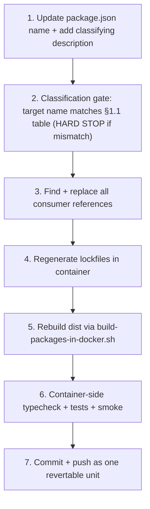

# `@brewery/*` → `@umbraculum/*` package-scope migration plan

**Tier:** Public
**Status:** **CLOSED 2026-05-19** — all 14 slots landed across 5 sessions. Sub-plan #9 is complete; the `@brewery/*` → `@umbraculum/*` (with brewery-vertical packages re-scoped under `@umbraculum/brewery-*`) migration is the live state. Slot 14 (the application-workspace bundle: `api`, `web`, `native`, `web-e2e`) shipped as the closing slot per §6.14; the operational closing condition met: every remaining `@brewery/[a-z]` reference outside excluded paths is a deliberate rename-history record (description fields, README NOTE-block "Renamed from" sentences, immutable RFC narrative). Lessons codified into the umbraculum-toolset plugin pack: `package-scope-migration-preflight` skill (slot-6 cadence, refined through slot 8's 4-cousin walk and slot 13's tautology-purge step), `ci-parity-local-reproduction` skill + rule 72 (post-slot-7), three brewery-vertical TRAP-discipline slots proving the §1.3 classification gate (slots 6 / 12 / 13).
**Audience:** core team executing the rename; future contributors picking up un-checked items from the handoff checklist; anyone evaluating the migration shape before the public flip.
**Resolves:** umbrella plan sub-plan #9 (post-RFC-001 follow-on); the `@brewery/*` actual-scope migration.
**Builds on:** [`docs/PLATFORM-ARCHITECTURE.md`](../PLATFORM-ARCHITECTURE.md) §5.2 (rename commitment), [`docs/rfcs/0001-modules-tiers-governance-and-automation-placement.md`](../rfcs/0001-modules-tiers-governance-and-automation-placement.md) §§4–5 (brewery is tier-6 vertical, NOT canonical), [`docs/rfcs/0002-canonical-module-physical-layout.md`](../rfcs/0002-canonical-module-physical-layout.md) §11.2 (H1 2027 restructure row that defers to this plan).

> **Disclaimer.** This is a migration-shape pre-flight, not an architectural audit. The decision to migrate to `@umbraculum/*` is settled by the source documents above; the project of this plan is operational — how to land 13 package renames + 4 application-workspace renames safely across ~5–8 sessions without ever leaving the repo in a half-migrated state. No new architectural decisions land in this doc. If an execution session discovers a need for one, it stops and escalates rather than improvising.

---

## 0. Status banner

| Field | Value |
|---|---|
| Scoping pass | **Done 2026-05-19** (this doc + handoff doc + worked-example rename) |
| Worked example landed | `@brewery/test-mcp` → `@umbraculum/test-mcp` (commit hash recorded in §6) |
| Slots landed | **14 of 14** — slots 1–14 (`test-mcp`, `media`, `navigation`, `automation-contracts`, `ui`, `brewery-core`, `i18n`, `i18n-react`, `contracts`, `api-client`, `module-sdk`, `brewery-beerjson`, `brewery-recipes-ui`, **application-workspace bundle (api / web / native / web-e2e)**). **Sub-plan #9 closed 2026-05-19.** Brewery-vertical TRAP discipline proven across 3 of 3 vertical-prefixed slots (slot 6 / 12 / 13); the §1.3 classification gate caught all 3 on first attempt. Slot-14 surfaced an operational refinement — the **operational closing-condition interpretation** — folded into the appendix (§Appendix below): the literal-grep closing condition is unachievable without erasing the by-design rename-history records (slot-6+ description fields + slot-1+ README NOTE-block "Renamed from" sentences + immutable RFC narrative); the operational interpretation is "zero LIVE `@brewery/*` references — workspace `name`, `dependencies` keys, imports, forward-looking placeholders, status-stale claims; rename-history records RETAINED". |
| Interlude — CI hygiene fixes | **#1 (76fbdd8, 2026-05-19, post-slot-6):** ESLint `eslint.config.mjs` `allowDefaultProject` extension + `spike/**` ignore + `@typescript-eslint/require-await` disable in `mockAdapter.ts` + `nonAdminUserId` → `_nonAdminUserId` + Zod v4 type-API drift fix in `meResponse.test.ts` + `check-readmes.py` stale `@umbraculum/*` guard removal + `.cursor/` pointer tolerance. **#2 (499c552, 2026-05-19, post-slot-7):** Three local-vs-CI divergences isolated and fixed — see §6.7. **Codification (5748c5b @ umbraculum-toolset, 2026-05-19):** the three mechanisms + the `scripts/ci-parity-check.sh` operational answer are now codified in umbraculum-toolset as rule `72-ci-parity-local-vs-ci-divergence.mdc` (always-on guardrail) + skill `ci-parity-local-reproduction` (bounded reproduction recipe) so every future agent sees them by default. |
| Remaining slots to migrate | **0** — sub-plan #9 closed. |
| Estimated remaining sessions | **0** — closed. |
| Skill capture in plugin pack | `package-scope-migration-preflight` skill landed during slot 6, refined through slot 8's 4-cousin walk and slot 13's tautology-purge step (per "codify on second use" cadence + each slot's lesson folded back); `ci-parity-local-reproduction` skill + rule 72 landed post-slot-7 (CI hygiene fix #2 codification). |
| Blocking dependencies | n/a — sub-plan closed. |

---

## 1. Mis-classification audit (§1 because every other section depends on it)

The migration converts thirteen `@brewery/*` workspace packages into the `@umbraculum/*` namespace per [`docs/PLATFORM-ARCHITECTURE.md`](../PLATFORM-ARCHITECTURE.md) §5.2:

> Horizontal packages move to the neutral platform scope `@umbraculum/*`; brewery-vertical packages stay branded as the brewery module package set (or re-scope under `@umbraculum/brewery-*`).

The substitution is **not mechanical** because mechanical substitution silently promotes brewery-vertical code into the platform-core namespace — exactly the failure mode the rename is meant to fix.

### 1.1 Classification table (authoritative for the rename)

| Source name | Classification | Target name | Rationale |
|---|---|---|---|
| `@brewery/api-client` | **Platform** | `@umbraculum/api-client` | Generic fetch + auth boundary (cookie web, bearer native); no brewery-domain logic. |
| `@brewery/automation-contracts` | **Platform** (canonical-module contracts) | `@umbraculum/automation-contracts` | Vessel-agnostic mailbox + adapter contracts; `automation` is canonical tier-1 ([RFC-0001](../rfcs/0001-modules-tiers-governance-and-automation-placement.md) §4 Decision B). Already self-declares end-state name in its `package.json` description. |
| `@brewery/beerjson` | **Brewery-vertical** | `@umbraculum/brewery-beerjson` | BeerJSON is a brewing-specific interchange schema (style guidelines, fermentables, hops, yeast). Will never be loaded by a cosmetics or distillery vertical. |
| `@brewery/contracts` | **Platform** | `@umbraculum/contracts` | Generic auth/me DTO + AI-tool contract types; no brewery-domain types. |
| `@brewery/core` | **Brewery-vertical** ⚠ TRAP | `@umbraculum/brewery-core` ⚠ **NOT** `@umbraculum/core` | Contents are brewing math (`gravity.js`, `water.js`, brewing-specific unit conversions). The word "core" mis-suggests platform-core; the rename is the opportunity to make the vertical-ness explicit in the name. See §1.3. |
| `@brewery/i18n` | **Platform** (framework; brewery-flavored content for now) | `@umbraculum/i18n` | Generic locale bundle framework. Current bundle contents are brewery-flavored, but that is a separate content-split job tracked for when the second vertical lands. See §1.4. |
| `@brewery/i18n-react` | **Platform** | `@umbraculum/i18n-react` | Generic universal `useT` hook (web + native); no brewery-domain logic. |
| `@brewery/media` | **Platform** (framework; brewery-flavored content for now) | `@umbraculum/media` | Generic shared-assets framework. Current assets are brewery imagery; same content-split as `i18n` when second vertical lands. |
| `@brewery/module-sdk` | **Platform** | `@umbraculum/module-sdk` | `registerModule()` contract + `ValidatedSchema<T>` interface; module-developer surface. Already self-declares end-state name in its `package.json` description. |
| `@brewery/navigation` | **Platform** (framework; brewery-flavored route IDs for now) | `@umbraculum/navigation` | Route IDs + cross-platform routing policy framework. Current route IDs include brewery routes; same content-split as `i18n` later. |
| `@brewery/recipes-ui` | **Brewery-vertical** | `@umbraculum/brewery-recipes-ui` | Recipes, mash, water, yeast UIs — brewing-domain primitives. |
| `@brewery/test-mcp` | **Platform** | `@umbraculum/test-mcp` | HTTP server exposing testing tools (smoke, seed, vitest, Playwright, contracts); no brewery-domain logic. |
| `@brewery/ui` | **Platform** | `@umbraculum/ui` | Tamagui primitives, design-system components; no brewery-domain logic. |

**Tally:** 10 platform packages (→ `@umbraculum/<name>`), 3 brewery-vertical packages (→ `@umbraculum/brewery-<name>`).

### 1.1.1 Application workspace names (4 additional renames)

The four application workspaces ([`services/api/package.json`](../../services/api/package.json), [`apps/web/package.json`](../../apps/web/package.json), [`apps/native/package.json`](../../apps/native/package.json), [`apps/web/e2e/package.json`](../../apps/web/e2e/package.json)) also declared legacy brewery-scoped `name` fields. They are not consumed by any other workspace (nobody imports application workspaces), but the `name` field is still visible in `package-lock.json`, npm output, and any inter-workspace tooling that lists workspaces. Leaving them under the legacy namespace after the package migration completes would re-introduce the cognitive-drift problem (mixed legacy and current namespaces in the same repo) that sub-plan #9 exists to fix.

| Source workspace name | Target name | Notes |
|---|---|---|
| `@brewery/api` ([`services/api/`](../../services/api/)) | `@umbraculum/api` | API service. Platform-classified. |
| legacy web app name ([`apps/web/`](../../apps/web/)) | `@umbraculum/web` | Next.js web app. Platform-classified (carries brewery-vertical UI today; same content-split logic as `i18n`/`media`/`navigation` — framework is platform, content is vertical, content split deferred). |
| `@brewery/native` ([`apps/native/`](../../apps/native/)) | `@umbraculum/native` | Expo native app. Same logic as `web`. |
| legacy web E2E workspace name ([`apps/web/e2e/`](../../apps/web/e2e/)) | `@umbraculum/web-e2e` | Playwright suite for the web app. |

These four renames are bundled as a single PR in slot 14 (§3) — they have zero workspace consumers (the only references are in the workspace's own `package.json` and in inherited lockfile entries) so the blast radius is minimal and they don't justify separate PRs.

### 1.2 Dep-graph proof: zero platform → vertical edges today

Cross-package workspace `dependencies` declared in `packages/*/package.json`:

```text
api-client            → contracts                  [platform → platform]   OK
automation-contracts  → (no internal deps)         OK
beerjson              → core                       [vertical → vertical]   OK
contracts             → (no internal deps)         OK
core                  → (no internal deps)         OK
i18n                  → (no internal deps)         OK
i18n-react            → i18n                       [platform → platform]   OK
media                 → (no internal deps)         OK
module-sdk            → contracts                  [platform → platform]   OK
navigation            → (no internal deps)         OK
recipes-ui            → beerjson, i18n-react, ui   [vertical → vertical + platform]  OK
test-mcp              → (no internal deps)         OK
ui                    → (no internal deps)         OK
```

**Zero platform → vertical edges.** The classification is consistent with the existing dep-graph: brewery-vertical packages depend on platform packages (allowed), platform packages never depend on brewery-vertical packages (forbidden). The rename must preserve this invariant. Per-package verification step 2 in §4 enforces it explicitly.

### 1.3 The one trap: `@brewery/core`

Of the thirteen packages, **`@brewery/core` is the only target-name decision that defaults to wrong** under mechanical substitution:

- Naive substitution → `@umbraculum/core` (sounds like platform-core)
- Correct target → `@umbraculum/brewery-core` (brewing math, vertical-classified)

Contents to verify: [`packages/core/src/gravity.js`](../../packages/core/src/gravity.js), [`packages/core/src/water.js`](../../packages/core/src/water.js), and the `units/` subdirectory — all brewing-domain. The package's `package.json` does not currently declare a description; the rename PR will add one ("Brewery-vertical brewing calculations and unit conversions. End-state npm scope: `@umbraculum/brewery-core`.") so the next reader is not at risk of the same confusion.

The handoff doc's `core` section repeats this trap warning verbatim; it is also encoded as a hard-stop in §4 verification step 2 below.

### 1.4 Soft note: three platform packages carry brewery-flavored content today

| Package | Framework classification | Content today | Resolution |
|---|---|---|---|
| `@brewery/i18n` | Platform | Locale bundles include brewery strings (`recipes.*`, `equipment.*`, `automation.*`, `nav.recipes`, etc.) | Rename safely as platform; content-split deferred to when second vertical lands (then: `@umbraculum/i18n` keeps shell + `@umbraculum/brewery-i18n` ships brewery bundle). |
| `@brewery/media` | Platform | `assets/` are brewery imagery (recipe images, brand assets) | Same as `i18n` — rename framework, defer content split. |
| `@brewery/navigation` | Platform | Route IDs include brewery routes (`recipes`, `equipment`, `inventory`, `water-profiles`, …) | Same as `i18n` — rename framework, defer content split. |

**This is NOT a rename problem.** The frameworks are platform-correct; the content split is a separate, much later concern tied to the second vertical landing. The rename PRs for these three packages MUST NOT attempt the content split — that is out of scope for sub-plan #9 entirely.

---

## 2. Concrete inventory

### 2.1 Occurrence + file counts per package (excl. `dist/` and `package-lock.json`)

| Package | Occurrences | Files | Notes |
|---|---:|---:|---|
| `@brewery/contracts` | 122 | 75 | Heaviest — consumed by api, web, native, every contract test |
| `@brewery/ui` | 104 | 67 | Tamagui primitives; touches every web and native screen |
| `@brewery/recipes-ui` | 61 | 33 | Brewery-vertical; mainly web + native + own README |
| `@brewery/i18n-react` | 58 | 42 | Universal `useT` consumers across web + native |
| `@brewery/i18n` | 48 | 27 | Locale bundles + i18n config |
| `@brewery/api-client` | 43 | 31 | Mostly native screens + AuthProvider |
| `@brewery/navigation` | 28 | 16 | Route ID consumers across web + native |
| `@brewery/beerjson` | 28 | 20 | Brewery-vertical; recipes + waterCalc + tests |
| `@brewery/core` | 26 | 18 | Brewery-vertical brewing math; ⚠ trap (see §1.3) |
| `@brewery/media` | 25 | 18 | Web + native asset consumers |
| `@brewery/automation-contracts` | 23 | 18 | New (B-1 onward); api + web automation pages |
| `@brewery/module-sdk` | 19 | 12 | api + tests + design docs |
| `@brewery/test-mcp` | 11 | 6 | **Lowest blast radius — worked example (§6)** |

### 2.2 Reference categories

For each package, occurrences fall into five surface categories:

1. **Workspace deps** — every `packages/*/package.json`, `apps/*/package.json`, `services/*/package.json` that lists the package under `dependencies` or `devDependencies`.
2. **Source imports** — `import … from "@brewery/<name>"` in `*.ts`, `*.tsx`, `*.js`, `*.jsx`, `*.mjs` files.
3. **Build/runtime configs** — `apps/web/next.config.js` `transpilePackages` list, `apps/native/metro.config.js` `extraNodeModules` map, `apps/native/tamagui.config.ts`, `apps/web/tamagui.config.ts`, `apps/web/app/variables.css` (one CSS path reference).
4. **Lockfiles** — root [`package-lock.json`](../../package-lock.json) + per-workspace `package-lock.json` files. Regenerated by `npm install --no-audit --no-fund` in container; never edited by hand.
5. **Doc + readme references** — ~30 doc files in `docs/` and `*/README.md` mention `@brewery/*` by name. Updated as part of the rename PR for each package.

### 2.3 Sister-repo coordination is doc-only

The openplc sister repo (frozen alarm layer `2.0.1-dev`, [`docs/design/openplc-mailbox-emitter-pr-shape.md`](./openplc-mailbox-emitter-pr-shape.md)) does **not** import `@brewery/automation-contracts`. It emits a JSON artifact that the platform mirrors. Sub-plan #9 therefore needs only doc-link updates in the sister-repo handoff doc when `automation-contracts` is renamed — no code coordination, no PR-pairing, no synchronized release.

This significantly lowers the coordination burden compared to what a cross-repo TypeScript dependency would have implied.

### 2.4 What the rename does NOT touch

Pinned out-of-scope items, to prevent scope creep during execution sessions:

- npm registry name reservation under `@umbraculum/*` — deferred to the July 2026 public-alpha preparation window per [`docs/PLATFORM-ARCHITECTURE.md`](../PLATFORM-ARCHITECTURE.md) §10.1.1. The packages are `"private": true` workspace-only today; npm publishing is a separate public-alpha concern.
- Content split for `i18n`, `media`, `navigation` (see §1.4).
- Module SDK API changes (interface shape stays identical; only the npm scope of the SDK package changes).
- Prisma schema names, route paths, or AI tool names — none of these encode `@brewery` in their identifiers.
- The brewery-vertical's user-visible product name — Umbraculum's brewery configuration is still branded "Umbraculum (brewery)"; the package scope is an internal-developer-facing surface.

---

## 3. Per-package migration order

Staged by the dep-graph from §1.2: leaves first, mid-graph next, top-graph last. One package per PR; consumers updated in the same PR. **No bridge layer** (no `@umbraculum/<name>` package that re-exports from `@brewery/<name>` or vice versa) — the rename is point-in-time, atomic per package, and the verification step is the proof.

| Order | Package | Target name | Why this slot | Rough size (files) |
|---|---|---|---|---:|
| 1 | `@brewery/test-mcp` ✅ | `@umbraculum/test-mcp` | **Worked example (this session)** — zero workspace consumers, lowest blast radius, proves the recipe end-to-end | 6 |
| 2 | `@brewery/media` | `@umbraculum/media` | Leaf; consumed only by `apps/web` + `apps/native` (no other workspace packages); `next.config.js transpilePackages` touch | 18 |
| 3 | `@brewery/navigation` | `@umbraculum/navigation` | Leaf; route IDs; consumed by web + native; no internal package consumers | 16 |
| 4 | `@brewery/automation-contracts` | `@umbraculum/automation-contracts` | Leaf; new (no historical dep churn); only consumed by api + web automation pages | 18 |
| 5 | `@brewery/ui` | `@umbraculum/ui` | Leaf in dep-graph but heavy (67 files); `next.config.js transpilePackages` + `tamagui.config.ts` touch; landing here uncorks the top-graph `recipes-ui` rename later | 67 |
| 6 | `@brewery/core` | `@umbraculum/brewery-core` | Leaf; trap (§1.3) — pin classification verbatim from §1 in the PR description | 18 |
| 7 | `@brewery/i18n` | `@umbraculum/i18n` | Mid-graph; consumed by `i18n-react`; lockfile churn worth doing before its consumer | 27 |
| 8 | `@brewery/i18n-react` | `@umbraculum/i18n-react` | Depends on `i18n` (must come after slot 7) | 42 |
| 9 | `@brewery/contracts` | `@umbraculum/contracts` | Heaviest (122 occurrences, 75 files); consumed by `api-client`, `module-sdk`, and ~every contract test | 75 |
| 10 | `@brewery/api-client` | `@umbraculum/api-client` | Depends on `contracts` (must come after slot 9); mainly native screens + AuthProvider | 31 |
| 11 | `@brewery/module-sdk` | `@umbraculum/module-sdk` | Depends on `contracts` (must come after slot 9); api + automation module + tests | 12 |
| 12 | `@brewery/beerjson` | `@umbraculum/brewery-beerjson` | Depends on `@brewery/core` (must come after slot 6); brewery-vertical | 20 |
| 13 | `@brewery/recipes-ui` | `@umbraculum/brewery-recipes-ui` | Depends on `beerjson`, `i18n-react`, `ui` (must come after slots 5, 8, 12); brewery-vertical; closes the package migration | 33 |
| 14 | Application workspace names (×4) | `@umbraculum/{api,web,native,web-e2e}` | Single PR; bundles the four `name`-field renames from §1.1.1 — no consumer churn beyond own `package.json` + lockfile + `package-lock.json` workspace `name` fields. Lands after slot 13 to ensure no in-flight package PR collides with workspace-dep paths. | 4 |

**Slot 1 is executed in this session.** Slots 2–14 execute serially across subsequent sessions per the [handoff doc](./brewery-scope-migration-per-package-handoff.md). The ordering above is a recommendation, not a hard contract — execution sessions MAY reorder within constraints if a slot is blocked, provided the per-package dep predecessors have shipped.

---

## 4. Verification recipe per package

Every package migration follows the same seven steps. **No step may be skipped.** The recipe is the contract.



### Step 1 — Update the package itself

- Edit [`packages/<name>/package.json`](../../packages/) `name` field.
- **Also check the `bin:` field**, if present. If the bin name encodes the old scope (e.g. `"brewery-<name>": "..."`), rename it to match the new scope (`"umbraculum-<name>": "..."`). Surfaced during slot 1 worked example: [`packages/test-mcp/package.json`](../../packages/test-mcp/package.json) had `"brewery-test-mcp"` as bin name; not renaming it would have left the CLI command inconsistent with the package name.
- If `description` is empty or missing, add a classifying description: for platform, `"… End-state npm scope: @umbraculum/<name> per sub-plan #9."`; for brewery-vertical, `"… Brewery-vertical … End-state npm scope: @umbraculum/brewery-<name> per sub-plan #9."`
- Update the package's own `README.md` heading and any in-text references to the old name.
- **Also check the README for user-facing config samples** (MCP server entries, CLI command examples, copy-paste-able JSON snippets that reference the package by name or bin name). These are surface a user pastes into their own config; renaming them in the README is the only way the next reader of the README gets the right command. Surfaced during slot 1: the test-mcp README's Cursor MCP wiring example had `"brewery-test-mcp"` as the server key.

### Step 2 — Classification gate (HARD STOP)

Before touching any consumer file, confirm:

- The target name in step 1 exactly matches the §1.1 table.
- If the target is `@umbraculum/brewery-<name>`, an explicit `Brewery-vertical` keyword appears in the package's `description` field.
- If the target name is `@umbraculum/core` and the source was `@brewery/core` — **STOP**. This is the §1.3 trap; the correct target is `@umbraculum/brewery-core`. Revert step 1 and re-do with the correct name.

This step is enforced by reviewer attention, not automation, until the plugin-pack skill lands at second-package execution.

### Step 3 — Find + replace all consumer references

Run the canonical grep from §2.1's methodology against the entire repo:

```bash
grep -rlE "@brewery/<name>([^a-zA-Z0-9_-]|$)" \
  --include='*.ts' --include='*.tsx' --include='*.js' --include='*.jsx' --include='*.mjs' \
  --include='*.json' --include='*.md' --include='*.py' --include='*.yml' --include='*.yaml' \
  --include='*.css' --include='*.prisma' \
  --exclude-dir=node_modules --exclude-dir=dist --exclude='package-lock.json' \
  /home/rf/dkprojects/rfapps/umbraculum-dev
```

For every file in the result list, replace `@brewery/<name>` with the target name from §1.1. Particular attention to:

- **Root `package.json` `build:packages` script** — references every workspace by full name (`npm run build -w @brewery/<name>`); if not updated, step 5 (`scripts/build-packages-in-docker.sh`) will fail with `npm error No workspaces found: --workspace=@brewery/<name>` for the renamed package. **Surfaced during slot 2 worked example** (was NOT in the original slot 1 inventory; missed because slot 1's `test-mcp` doesn't appear in this script).
- **Root `package.json` `test:packages` script** — analogous to `build:packages` but tracks the *tested* (not built) workspace set: currently `"npm test -w @brewery/contracts && npm test -w @umbraculum/brewery-core"`. **Surfaced during slot 6** (was NOT in the original inventory because slots 2–5 renamed packages that aren't in `test:packages` — only `contracts` and `core` are). The preflight skill's `build:packages` check (Command 5) did NOT detect this — extend to also grep `test:packages`. Same failure mode as `build:packages`: step 6 verification (and CI `api.yml`'s shared-package-unit-tests job which runs `npm run test:packages`) would fail with `npm error No workspaces found: --workspace=@brewery/<name>` if missed.
- **`.github/workflows/api.yml`** workflow step display names — e.g. line 43 `name: Run @brewery/contracts + @brewery/core unit tests` is a human-readable step name (not a path glob); the path globs in `on.push.paths` / `on.pull_request.paths` use filesystem paths (`packages/core/**`) and do NOT need updating, but the display name DOES. **Surfaced during slot 6.**
- **`apps/web/next.config.js`** `transpilePackages: [...]` array — Next.js will silently fail to transpile if the package is renamed without updating this list.
- **`apps/native/metro.config.js`** `resolver.extraNodeModules` map — currently pins `@brewery/recipes-ui`; needs updating when that package migrates.
- **`docker-compose.yml`** bind-mount comments + any volume names — references are comment-only but worth keeping accurate for grep-ability.
- **Doc files in `docs/`** — `PLATFORM-ARCHITECTURE.md`, RFC-0002 §11.2 table, `CODING-STANDARDS.md`, `LINTING.md`, `TESTING.md`, `TYPING.md`, `DEVELOPMENT-NATIVE-LOCAL.md`, `REACT-NATIVE-KICKOFF-READINESS.md`, `ARCHITECTURE-REV02.md`, `DOCS-README-STANDARDS.md`, `NATIVE-STRATEGY-AND-CI.md`, `ROLLOUT.md`.
- **README files in `packages/*/README.md`, `apps/*/README.md`, `services/api/README.md`** — most carry an inventory section listing workspace packages.

> **Bulk-sed self-exclusion for brewery-vertical TRAP slots (e.g. slot 6 `core`).** When the package.json `description` you authored in step 1 deliberately contains a historical reference like `"Renamed from @brewery/<name> to @umbraculum/brewery-<name> (NOT @umbraculum/<name>) as sub-plan #9 slot N"`, the bulk sed would corrupt that historical string by substituting the embedded `@brewery/<name>` to the new name a second time. **Exclude the just-edited `packages/<name>/package.json` from the sed target list** (alongside the always-excluded `brewery-scope-migration-*` docs). Slot 6's first execution caught this risk during step 3 planning and excluded `packages/core/package.json` from the bulk-sed file list, preserving the trap-avoidance description verbatim.

> **Substring-collision sanity check — verify all 4 cousins before bulk-sed (slot-8 lesson, 2026-05-19).** The canonical regex tail `[^a-zA-Z0-9_-]|$` defends against three of four cousin patterns automatically; the fourth requires regex-anchor discipline. Pre-bulk-sed checklist:
>
> 1. **(a) Longer-prefix in old scope** (`@brewery/<X>-<Y>` when renaming `@brewery/<X>` — e.g. `@brewery/i18n-react` during the slot-7 `@brewery/i18n` rename). The regex tail's negated `-` correctly skips these because `-` is in the positive set. Verify via `grep -rohE "@brewery/<name>[a-zA-Z0-9_/.-]+" --exclude-dir=node_modules --exclude-dir=dist .` returns ONLY the legitimate workspace's own export subpaths (`/next-intl`, `/en`, `/it`, etc.); any standalone workspace match is a collision to investigate.
> 2. **(b) Shorter-prefix in old scope** (`@brewery/<X>` when renaming `@brewery/<X>-<Y>` — slot 8's case re-checking `@brewery/i18n`). The `@brewery/<name>-anything` anchor at the regex START is what prevents corruption. Confirmed safe because the regex's literal `<name>-react` prefix can never match a literal `<name>` mid-string. No grep needed; structurally impossible.
> 3. **(c) Just-renamed sibling in new scope** (`@umbraculum/<sibling-already-migrated>` from a previous slot — slot 8's `@umbraculum/i18n` from slot 7). The regex's literal `@brewery/` prefix is structurally distinct from `@umbraculum/`, so the new-scope sibling is structurally untouchable. No grep needed; structurally impossible.
> 4. **(d) Export subpath of the package itself** (`@brewery/<name>/<subpath>` — e.g. `@brewery/i18n-react/next-intl`, `@brewery/i18n/en`). The regex tail's negated `/` (since `/` is NOT in `[a-zA-Z0-9_-]`) MATCHES these subpath references and substitutes them correctly. Verify via `grep -rohE "@brewery/<name>[/a-zA-Z0-9_.-]+" --exclude-dir=node_modules --exclude-dir=dist . | sort -u` — every result should be either the bare package name or a known export subpath (no surprise paths).
>
> Slot 8 ran the cousin (a) + (d) checks programmatically as the post-sweep verification gate in its Python script. Going forward, the preflight skill's command 7 (substring-collision sanity) should explicitly call out the 4-cousin checklist instead of mentioning only cousin (a).
>
> **NEW HARD STOP from slot 7 — bulk sed must also exclude `docs/design/brewery-scope-migration-plan.md` AND `docs/design/brewery-scope-migration-per-package-handoff.md`.** These two docs maintain historical "Source name" columns in §1.1 classification table, §1.4 framework-vs-content table, §3.1 footprint table, and §4 staged migration plan table. A naive scope-wide sed will overwrite those columns, turning `| @brewery/<name> | ... | @umbraculum/<name> | ...` into `| @umbraculum/<name> | ... | @umbraculum/<name> | ...` (both columns identical — historical record lost). Slot 7's Python-based sweep included these docs and had to restore 4 cells post-bulk; slot 5's curated `sed` file list implicitly avoided this. **Combined exclusion list for step 3 is now 3 paths minimum:** (a) just-edited `packages/<name>/package.json`, (b) `docs/design/brewery-scope-migration-plan.md`, (c) `docs/design/brewery-scope-migration-per-package-handoff.md`.
>
> **NEW HARD STOP from slot 9 — bulk sed must also exclude `cursor-tmp/` (bulk-sed-script self-corruption).** Slot 9 was the first slot to use a Python script located AT `cursor-tmp/<name>.py` to perform the bulk substitution. The canonical-grep regex `@brewery/<name>([^a-zA-Z0-9_-]|$)` matches the script's own source code (because the script contains the literal old-name string in its `re.compile(...)` argument and in its docstring). The script iterated over the canonical-grep result, which included its own path, and mid-run substituted itself — leaving the script with `@umbraculum/<name>` on BOTH the source-side and target-side of the regex (self-defeating if rerun). **In slot 9 the substitution was atomic enough that all 75 OTHER files were correctly edited before the script reached itself, so the slot-9 outcome was unaffected — but a future slot that interrupts mid-run, or that uses an iterative re-substitution loop, would corrupt its own substitution rules.** Add `cursor-tmp/` (and any other ad-hoc script directory the slot operator uses) to the bulk-sed `EXCLUDE_DIR_PARTS` set alongside `node_modules`, `dist`, and `.next`. **Surfaced during slot 9.**
>
> **NEW COSMETIC OBSERVATION from slot 9 — slash-delimited shorthand comments.** Slot 9 surfaced one cosmetic comment slop pattern: a comment line in `docker-compose.yml` written as `Pattern mirrors @brewery/contracts/core/media above` — a slash-delimited shorthand for the three packages `{contracts, core, media}` all in the `@brewery/*` scope. The canonical regex tail `[^a-zA-Z0-9_-]` correctly matches the `/` after `contracts`, so the bulk sed substitutes the prefix to `@umbraculum/contracts/core/media` — but the `core` and `media` parts of the shorthand were originally `@brewery/core` and `@brewery/media`, which by post-slot-9 time have become `@umbraculum/brewery-core` and `@umbraculum/media` respectively. The comment becomes self-inconsistent (slot-9-target prefix + slot-6-source-name `core` + slot-2-source-name `media`). **Cosmetic only — does not affect runtime, type system, or build.** Slot 9 hand-fixed the line to spell out the three packages explicitly + recorded the rename history inline. **Going forward, any slot whose substring shows up in slash-delimited shorthand comments should expect to either (a) leave the comment as cosmetic post-rename slop or (b) hand-fix it as part of step 3's bulk-sed cleanup.** Surfaced during slot 9.
>
> **NEW POST-SWEEP CHECKLIST from slot 13 — forecast-becomes-live tautology purge.** Slot 13 surfaced an emergent doc-tier debt class first hinted at during slot 12 cousin-(c) checks but only fully manifest in slot 13 due to recipes-ui's larger doc-tier footprint. The pattern: doc-tier files contain forward-looking parenthetical forecasts like `\`@brewery/recipes-ui\` (will be renamed to \`@umbraculum/brewery-recipes-ui\` in slot 13)` (or `(becomes \`@umbraculum/...\` after slot N)`, or `(→ \`@umbraculum/...\` in slot N)`, or table cells reading `\`@umbraculum/...\` (slot 13 pending)`). The bulk-sed regex correctly substitutes the leading `@brewery/<name>` reference to `@umbraculum/brewery-<name>` but leaves the parenthetical forecast intact — turning the sentence into a self-referential tautology after the rename ships (e.g. `\`@umbraculum/brewery-recipes-ui\` (will be renamed to \`@umbraculum/brewery-recipes-ui\` in slot 13)`). Slot 12 left 2 such tautologies behind in `docs/modules/contribute/vertical-configuration.md` and `docs/modules/verticals/brewery/README.md`; slot 13's larger footprint created 6 more across cross-package READMEs (i18n-react, media, navigation, ui) plus the same 2 doc-tier sites + `docs/MODULES.md`. **Mitigation, integrated into the post-sweep verification block:** after the bulk-sed completes and BEFORE step-3's residual-grep audit, run:
>
> ```bash
> grep -rnE "@umbraculum/[a-z][a-z0-9-]*[a-z0-9]([^a-zA-Z0-9_-]|$).*pending sub-plan #9 (slot|renames)|@umbraculum/[a-z][a-z0-9-]*[a-z0-9].*becomes \`@umbraculum/[a-z][a-z0-9-]*[a-z0-9]\`|@umbraculum/[a-z][a-z0-9-]*[a-z0-9].*will be renamed to \`@umbraculum/[a-z][a-z0-9-]*[a-z0-9]\`|@umbraculum/[a-z][a-z0-9-]*[a-z0-9].*\(slot [0-9]+ pending\)" --include='*.md' \
>   --exclude-dir=node_modules --exclude-dir=cursor-tmp --exclude-dir=design \
>   .
> ```
>
> Every match needs cosmetic touch-up: replace the parenthetical forecast with past-tense (e.g. `(renamed in slot N)`) or delete the parenthetical entirely. The `--exclude-dir=design` is critical — both migration docs (`brewery-scope-migration-{plan,per-package-handoff}.md`) deliberately retain forecast wording for status tracking; do not auto-clean them. **Surfaced during slot 13** — the §1.3 brewery-vertical TRAP discipline interacts with the doc-tier "Source name → Target name" tables in a way that makes the tautology trail unavoidable for vertical-prefixed slots, but the lesson generalizes to any rename-with-doc-forecast project. Slot 13's commit message explicitly enumerates the cleaned tautology sites.
>
> **Substring collision sanity check (slot 7).** When the package name being substituted is a strict prefix of another workspace name (e.g. `@brewery/i18n` is a prefix of `@brewery/i18n-react`), verify the `[^a-zA-Z0-9_-]` regex tail leaves the longer name untouched: `-` IS in `[a-zA-Z0-9_-]` (positive set) so it is NOT in `[^a-zA-Z0-9_-]` (negated set), so `@brewery/i18n-react` will NOT match the `@brewery/i18n` pattern. Slot 7 confirmed this empirically (zero `@brewery/i18n-react` mentions corrupted by the slot-7 sweep). Apply the same sanity check to any future slot where the rename target is a prefix of another active workspace (e.g. slot 9 `@brewery/contracts` vs hypothetical `@brewery/contracts-derived`).

### Step 4 — Regenerate lockfiles in container

> **Cross-reference:** This step embodies the lesson from Phase B-3 ("vitest hoisted to root" gotcha). Read [`pr1-contracts-migration-handoff.md`](./pr1-contracts-migration-handoff.md) §"Mandatory prep before any consumer-side verification" if unfamiliar.
>
> **Hard-won during slot 1 worked example:** even when the renamed package has *zero* runtime consumers (e.g. `test-mcp`, no `apps/*` or `services/*` lists it as a dep), the root `npm install` still destructively prunes the bind-mounted `services/api/node_modules` and `apps/web/node_modules` directories. The api container then boots into `MODULE_NOT_FOUND` (`tsc: not found`, missing preload modules) and surfaces as a 502 through Nginx. The per-container reinstall + api restart below is therefore **unconditional**, not conditional on dep-graph membership.

```bash
# (a) Refresh root lockfile via one-shot node:20-slim container (DO NOT use `docker compose exec`
#     against api/web here — those containers' /app mount is services/api/ or apps/web/,
#     not the workspace root, so `npm install` there refreshes the wrong lockfile).
docker run --rm \
  -v "$PWD:/repo" \
  -v brewery_app_root_node_modules:/repo/node_modules \
  -w /repo \
  -e HOST_UID="$(id -u)" -e HOST_GID="$(id -g)" \
  node:20-slim \
  bash -lc 'npm install --no-audit --no-fund; rc=$?; chown -R "$HOST_UID:$HOST_GID" /repo/packages /repo/apps /repo/services /repo/package.json /repo/package-lock.json; exit $rc'

# (b) web side: in-place install is safe (web container does not run a tsx-style
#     hot-reload preload; the build script does not unlink-watch web's dist).
#     --include=dev is REQUIRED for the in-place install (surfaced during slot 2):
#     when run against a workspace-flavored package.json whose `file:../../packages/...`
#     deps can't resolve from /app's perspective, npm 10's degraded resolution
#     mode treats this as a production install and silently omits devDependencies.
docker compose exec web sh -c 'cd /app && npm install --include=dev --no-audit --no-fund'

# (c) api side: DELAYED to AFTER step 5 (build) — see "api recovery is bundled
#     with step 5" below. Do NOT install devDeps into services/api/node_modules
#     here, because the build script's `npm ci` (step 5) will wipe them anyway.
```

**Why not `docker compose restart api` (and why is api recovery delayed to step 5)?** Surfaced in stages across slots 1, 3, and 4 — the cleanest mental model is the slot-4 root cause:

The real devDep pruner is **`scripts/build-packages-in-docker.sh`'s `npm ci`** (step 5), not any restart per se. That script mounts `${REPO_ROOT}:/repo` (the whole repo, including `services/api/`) and runs `npm ci` to populate the build's workspace tree. In npm 10's degraded-resolution mode against this workspace shape, `npm ci` silently omits devDependencies for `services/api/` — leaving its bind-mounted `node_modules` at ~42 packages instead of ~140 (no `tsc`, no `vitest`, no `tsx`).

If the api container is RUNNING during this build, two failure modes chain:
1. The `npm ci` wipes `/app/node_modules/tsx/dist/preflight.cjs`.
2. `npm run build:packages` then unlinks `dist/` files for every package one-by-one.
3. The running `tsx watch` (PID 1's child) detects each `unlink` event and tries to hot-reload, but tsx itself is missing → `Cannot find module .../tsx/dist/preflight.cjs` → tsx exits → container crash-loops → `/api/health` returns 502 through Nginx for the rest of the slot.

`docker compose restart api` is also dangerous on its own — every restart re-runs the container's `sh -c "npm install && npm run dev"` startup command, and that `npm install` can re-prune devDeps the same way. But `docker compose restart api` only hurts if step 5 hasn't already run; once step 5 runs against a live api, the build's `npm ci` is sufficient to kill tsx watch regardless of any restarts.

**The cleanest sequence** (post-slot-4, validated on slot 4 second attempt): take api OUT of the picture during the build, then re-install its devDeps after the build, then start it. See step 5 for the exact commands.

After step 4 (a) + (b):

- `git diff --stat package-lock.json` — should show a small number of insertions/deletions (~6+6 for a single-package rename with no dep change; more if the package has cross-package consumers). Inspect the line-level diff to confirm changes are limited to the renamed package's entries (plus the workspace-deps reverse-pointers under each consumer's `node_modules` map). If *unrelated* packages appear in the diff, **STOP and investigate** before proceeding.
- The api container is **still running with stale node_modules** at this point — that is intentional and OK; we will rebuild + reinstall + restart it in step 5. The web container has been reinstalled in-place and is in its target state.

### Step 5 — Rebuild `dist/` via the canonical script (api STOP-build-install-START sequence)

The build script `scripts/build-packages-in-docker.sh` runs `npm ci && npm run build:packages` against a mount of the whole repo. The `npm ci` will wipe `services/api/node_modules` devDeps as a side-effect (see step 4's "Why not docker compose restart api?" for the root cause). To prevent tsx watch from crash-looping, the api container is stopped BEFORE the build, recovered AFTER the build, and started LAST:

```bash
# (a) Stop api so tsx watch is not running while the build's npm ci wipes its devDeps
docker compose stop api

# (b) Run the canonical build (no live tsx watching anything → safe)
bash scripts/build-packages-in-docker.sh

# (c) Restore api's devDeps into the (now-pruned) bind-mount via host one-shot
docker run --rm -v "$PWD/services/api:/app" -w /app node:20-slim \
  bash -lc 'npm install --include=dev --no-audit --no-fund'

# (d) Start api — its startup `npm install` sees deps satisfied, runs as a no-op,
#     tsx watch comes up clean, all package dist/ files are already on disk
docker compose start api

# (e) Verify
curl -sS http://localhost:18080/api/health   # expect {"ok":true}
```

This rebuilds `dist/` for every package that publishes one (most platform packages do). Skipping the build produces the same failure mode that derailed B-3:

```
SyntaxError: The requested module '@umbraculum/<name>' does not provide an export named 'X'
```

…because the running container is still resolving the stale pre-rename `dist/index.js`. Always rebuild even when "just renaming a package" — the dist artifacts pin the old name in their own `import` statements.

### Step 6 — Container-side typecheck + tests + smoke

```bash
docker compose exec api  sh -c 'cd /app && npm run typecheck && npm run test'
docker compose exec web  sh -c 'cd /app && npm run typecheck'
# Smoke: hit real pages through Nginx (NOT localhost:3000 — that bypasses the gateway).
# Include UI-heavy pages if the slot touches @umbraculum/ui or @brewery/recipes-ui.
curl -sS http://localhost:18080/api/health
curl -sS -o /dev/null -w 'HTTP %{http_code}\n' http://localhost:18080/en/dashboard
curl -sS -o /dev/null -w 'HTTP %{http_code}\n' http://localhost:18080/en/recipes
```

> **`apps/web` typecheck is EXCLUDED from CI gating by explicit decision** (see [`.github/workflows/typecheck.yml`](../../.github/workflows/typecheck.yml) header comment + [`docs/TYPING.md`](../TYPING.md) Phase 4 + [`docs/TAMAGUI.md`](../TAMAGUI.md)). Running `npm run typecheck` against `apps/web` locally currently produces ~1000–1100 `TS2322` errors, all in the accepted-cost Tamagui shorthand-prop / theme-token class (e.g. `Property 'mt' does not exist`, `Property 'minW' does not exist`, `Property 'bg' does not exist`). **Surfaced during slot 5 verification (2026-05-19) — 1063 of 1073 errors were TS2322 in the documented class.** Do NOT treat these as a slot regression. The proper web verification is the Nginx smoke through the gateway (above). If you want to confirm none of the errors are new, sort the error codes (`npm run typecheck 2>&1 | grep -oE "error TS[0-9]+" | sort | uniq -c | sort -rn`) — the TS2322 count should dominate by ≥98%.

If the renamed package is consumed by `apps/native`, also run `npm run typecheck` from `apps/native/` (typecheck-only; native runtime smoke is out of scope for this migration).

> **Slot-5 GOTCHA — native typecheck via host one-shot container prunes api devDeps.** Running native typecheck commonly takes the form:
>
> ```bash
> docker run --rm -v "$PWD:/repo" -w /repo/apps/native node:20-slim \
>   bash -lc 'cd /repo && npm install --no-audit --no-fund && cd apps/native && npm run typecheck'
> ```
>
> The `npm install` step against the repo root inside that one-shot container hits the SAME root-cause failure mode as the step-5 build script: against the workspace shape with bind-mounted `services/api/node_modules`, npm 10's degraded resolution mode silently prunes api's devDeps. The api container appears healthy (`/api/health` returns `{"ok":true}`) because tsx is already loaded into the running process's memory, but `/app/node_modules/.bin/` is left with ~8 binaries instead of ~140 (no `tsc`, `tsx`, `vitest`). Any subsequent `docker compose exec api npm run typecheck` or `npm run test` will fail with `tsc: not found`.
>
> **Slot-6 REFINEMENT — the trigger is precisely `npm install` (or `npm ci`) against the workspace root, NOT every `npm` command.** Slot 6 ran `docker run --rm -v "$PWD:/repo" -w /repo node:20-slim bash -lc 'npm run test:packages'` (as part of step 6 verification, to run `@umbraculum/brewery-core` water tests through the same workspace machinery CI uses). That `npm run test:packages` did NOT prune api devDeps — `tsc`/`tsx`/`vitest` were all still present in `/app/node_modules/.bin/` post-run, and api stayed healthy. The reason: `npm run <script>` against an already-installed workspace tree does not re-trigger the dep-resolution / pruning pass; only an explicit `npm install` (or `npm ci`) does. Practical implication: if your slot's step 6 verification only needs to *run* an existing script (not install), the one-shot container is safe; only when you must install (e.g. wanting a clean re-resolve of a transient lockfile) do you need the STOP-install-START recovery.
>
> **Recovery is the same as step 5's STOP-install-START sequence** (without the build, since dist/ is already current):
>
> ```bash
> docker compose stop api
> docker run --rm -v "$PWD/services/api:/app" -w /app node:20-slim \
>   bash -lc 'npm install --include=dev --no-audit --no-fund'
> docker compose start api
> curl -sS http://localhost:18080/api/health  # expect {"ok":true}
> ```
>
> **Mitigation:** run native typecheck BEFORE step 5 (when api is already stopped from step 5a) if possible; or accept that the native typecheck triggers a recovery cycle and budget for it. **Surfaced during slot 5 verification (2026-05-19).**
>
> **Slot-8 PREFERRED PATTERN — no-root-install / named-volume-only mount** (2026-05-19): the cleaner alternative that AVOIDS the GOTCHA entirely. Mount the existing `brewery_app_root_node_modules` named volume into the one-shot and inject its `.bin/` into `PATH`, then run the native typecheck WITHOUT the root `npm install`:
>
> ```bash
> docker run --rm \
>   -v "$PWD:/repo" \
>   -v brewery_app_root_node_modules:/repo/node_modules \
>   -w /repo/apps/native \
>   node:20-slim \
>   sh -c 'PATH="/repo/node_modules/.bin:$PATH" npm run typecheck'
> ```
>
> The one-shot exits in ~6s instead of ~60s, and api is provably unaffected (verified post-typecheck via `/app/node_modules/.bin/` count + `/api/health`). This pattern works whenever the named volume is already populated (i.e. any time after a `docker compose up`). Use the older `cd /repo && npm install ...` form ONLY as a cold-start fallback when the named volume is empty — and in that case, follow up with the api STOP-install-START recovery above.


### Step 7 — Commit + push as one revertable unit

One commit per package. Commit message format (mirrors recent sub-plan commit-naming convention):

```
sub-plan #9 — rename @brewery/<name> → @umbraculum/<target> (slot N of 13)

- Classification: platform | brewery-vertical (with one-line rationale)
- Surfaces touched: package.json + README + N source imports + M doc references
- Verification: typecheck green, tests green (count), smoke OK
- Per-package handoff item ticked: docs/design/brewery-scope-migration-per-package-handoff.md
```

If the verification surfaces any gotcha not yet documented in §4 or §5, **update this plan doc BEFORE the commit lands**. The recipe must always reflect what actually happened, not the version that was easier to write.

---

## 5. Risk register

| Risk | Likelihood | Severity | Mitigation |
|---|---|---|---|
| `@brewery/core` mechanically migrates to `@umbraculum/core`, promoting brewery math to platform-core in the public surface | Medium (most likely mistake) | High (the exact failure the rename is meant to fix) | Step 2 (Classification gate) + §1.3 trap pinned + handoff doc `core` section repeats target verbatim |
| Lockfile churn drags unrelated packages into the diff | Medium | Medium | `--no-audit --no-fund` flags + post-regen diff review (step 4) + abort-if-unrelated-changed rule |
| Root `npm install` destructively prunes bind-mounted `services/api/node_modules` + `apps/web/node_modules` → api container crashes with `MODULE_NOT_FOUND` → 502 through Nginx | High (happens EVERY rename, not just dep-graph-consuming ones) | Medium (recoverable in <30s but easy to misdiagnose as "rename broke something") | Per-container reinstall + api restart is unconditional in step 4; smoke check `curl http://localhost:18080/api/health` proves recovery before moving to step 5 |
| `apps/web/next.config.js` `transpilePackages` not updated → web build silently misses the renamed package | Medium | Medium | Step 3 explicitly enumerates `next.config.js`; smoke step (step 6) catches if missed |
| `apps/native/metro.config.js extraNodeModules` not updated → native build "Invalid hook call" or module-not-found | Low (only one pin today: `recipes-ui`) | Medium | Step 3 explicitly enumerates `metro.config.js`; flagged in the `recipes-ui` handoff section |
| In-flight feature branches reference old `@brewery/<name>` → merge conflicts | Medium | Low | Single-package PRs are small and fast-conflict-resolvable; no long-lived feature branch should outrun the migration |
| Doc drift — README or design doc references the old name post-rename | High (~30 doc files) | Low | Step 3 enumerates the doc file list; reviewer scans `git grep '@brewery/<name>'` before pushing each PR |
| Root `package.json` `build:packages` script not updated → `scripts/build-packages-in-docker.sh` (step 5) fails with `No workspaces found: --workspace=@brewery/<name>` | High (every rename touches this script unless the package is omitted from it, like test-mcp was) | Low (loud failure; easy to diagnose and recover) | Step 3 explicitly lists this script as a HARD STOP file; preflight skill `package-scope-migration-preflight` checks it as Command 5. **Surfaced during slot 2 worked example.** |
| In-place `npm install` in api container omits devDependencies (tsc, vitest, tsx missing → typecheck/test fail) | High (every in-place reinstall against a running container with workspace deps) | Medium (recoverable, easy to misdiagnose as "lockfile corrupted") | Step 4b uses `--include=dev` flag; container startup `npm install` (via `docker compose up`) is unaffected. **Surfaced during slot 2 worked example.** |
| `scripts/build-packages-in-docker.sh`'s `npm ci` (against `${REPO_ROOT}:/repo` mount) silently prunes `services/api/node_modules` devDeps (no `tsc`, `vitest`, `tsx`) → then `npm run build:packages` unlinks dist files → if api container is running, tsx watch tries to hot-reload → tsx itself missing → api crash-loops → 502 through Nginx for the rest of the slot | High (every slot that runs step 5 with api live; surfaced piecemeal across slots 1, 3, and 4) | High (silent until smoke check; misdiagnosed across three slots as "restart broke things" or "host-install fixed it" before slot 4 isolated the real culprit) | **Slot 4 fix:** step 5 is now a STOP-build-install-START sequence: `docker compose stop api` → `bash scripts/build-packages-in-docker.sh` → host one-shot `npm install --include=dev` into the api bind-mount → `docker compose start api`. With api stopped during the build, tsx watch cannot crash on the build's unlink events; after the build, the host one-shot restores devDeps; on start, the container's startup `npm install` sees deps satisfied and is a no-op. Step 4b's per-container install for api is REMOVED (it would be wiped by step 5 anyway); web's in-place install is retained because the build's `npm ci` does not prune web's bind-mount the same way (and web has no tsx-watch failure mode). |
| `docker compose restart api` on its own (without a subsequent build) is also unsafe: re-runs the container's startup `sh -c "npm install && npm run dev"`; the startup `npm install` can re-prune devDeps depending on workspace-resolution state. | Medium (surfaces only if used as a "fix" between step 4 and step 5; the new step 5 recipe doesn't issue any restart) | Medium (caught by smoke if tested after) | **Plan-doc directive:** never use `docker compose restart api` during a slot's execution; the start/stop sequencing of step 5 (and only step 5) is the canonical state-mutation path for the api container. |
| Native typecheck via host one-shot container (`docker run -v $PWD:/repo ... npm install ... npm run typecheck`) silently prunes the api bind-mount the same way step 5's build script does — but post-step-5, when api is running again. API appears healthy (`/api/health` returns `{"ok":true}`) because tsx is already loaded into memory; `/app/node_modules/.bin/` is left with ~8 entries instead of ~140 (no `tsc`, `tsx`, `vitest`). Any subsequent `docker compose exec api npm run typecheck` or `npm run test` fails with `tsc: not found`. | High (every slot that touches a native-consumed package and runs native typecheck after step 5; surfaced during slot 5 — apps/native has 24 files updated) | Medium (silent, then misdiagnosed as "the rename broke api"; recovery is a 30s STOP-install-START with no rebuild) | **Slot-5 fix:** any out-of-band `npm install` against the workspace root with the api bind-mount intact requires a STOP-install-START recovery: `docker compose stop api && docker run --rm -v "$PWD/services/api:/app" -w /app node:20-slim bash -lc 'npm install --include=dev ...' && docker compose start api`. Step 6 native typecheck block in §4 documents the full sequence + a sniff check (`ls /app/node_modules/.bin/ \| grep -E "^(tsc\|tsx\|vitest)$"`) to confirm devDeps survived. Preferred ordering: run native typecheck BEFORE step 5 (api already stopped from step 5a), eliminating the recovery cycle. |
| `apps/web` typecheck appears to "regress" with ~1000–1100 `TS2322` errors after a slot lands. | High (every slot — `apps/web` is excluded from CI gating and accumulates Tamagui shorthand-prop / theme-token errors as the codebase grows; the count was ~585 at HIGH-full Phase 4 measurement and is ~1073 as of slot 5) | Low (accepted-cost per [`docs/TYPING.md`](../TYPING.md) Phase 4 + [`docs/TAMAGUI.md`](../TAMAGUI.md); reflected in the `.github/workflows/typecheck.yml` header which explicitly excludes `apps/web` from the gated set) | **Slot-5 fix:** §4 step 6 now warns explicitly that `apps/web` typecheck is excluded from CI; the proper web verification for a slot is the Nginx smoke through the gateway (not local typecheck). Error-class fingerprint (`grep -oE "error TS[0-9]+" \| sort \| uniq -c \| sort -rn`) should be ≥98% TS2322; if a different code dominates, escalate. **Surfaced during slot 5 verification (2026-05-19).** |
| Root `package.json` `test:packages` script not updated → root-level package-test execution fails with `No workspaces found: --workspace=@brewery/<name>` AND CI `.github/workflows/api.yml` shared-package-unit-tests job fails (it invokes `npm run test:packages` inside a `node:20-slim` one-shot). | Medium (only slots whose package is in `test:packages` — currently `contracts` + `core`, but expands as more packages add a `test` script tracked at the root level) | Medium (loud failure but easy to miss locally if step 6 didn't include a `npm run test:packages` invocation) | **Slot-6 fix:** §4 step 3 explicitly enumerates root `test:packages` alongside `build:packages`; the `package-scope-migration-preflight` skill grows a `test:packages` grep (Command 6) mirroring the existing `build:packages` check. **Surfaced during slot 6 preflight (2026-05-19).** |
| `.github/workflows/api.yml` workflow-step **display name** (line 43) `Run @brewery/contracts + @brewery/core unit tests` still references old name post-rename → cosmetic-only drift (CI step still passes since the actual command is `npm run test:packages` which resolves through the workspaces map, not the display string), but human reviewers reading the GitHub Actions UI see a stale name. | Medium (only slots whose package appears in any workflow's step `name:`; currently only `core` + `contracts` + `api`) | Low (cosmetic; not a runtime failure) | **Slot-6 fix:** §4 step 3 explicitly lists workflow-step display names as a HARD STOP file class (path globs in `on.push.paths` use filesystem paths and do NOT need updating, but display names DO). **Surfaced during slot 6 preflight (2026-05-19).** |
| `npm install` against the workspace root from any one-shot container with the api bind-mount intact → silent api devDep pruning (per the slot-5 risk above), but `npm run <script>` (without install) does NOT prune. | Was conflated with the slot-5 risk; slot 6 isolated the precise trigger. | Low (clarification, not a new failure mode) | **Slot-6 refinement:** §4 step 6 now states the trigger is precisely `npm install` (or `npm ci`), not all `npm` commands. `npm run <script>` against an already-installed workspace tree is safe — no STOP-install-START needed. **Surfaced during slot 6 step 6 verification (2026-05-19):** ran `docker run --rm -v "$PWD:/repo" -w /repo node:20-slim bash -lc 'npm run test:packages'` and confirmed api `/app/node_modules/.bin/` retained `tsc`, `tsx`, `vitest`. |
| Bulk sed against the slot's file list corrupts the just-edited `packages/<name>/package.json` description if it deliberately contains a historical reference to the old name (TRAP-slot description pattern: `"Renamed from @brewery/<name> to @umbraculum/brewery-<name> (NOT @umbraculum/<name>) as sub-plan #9 slot N"`). | Low (only TRAP slots that author a historical reference in the description) | Medium (corrupts the historical-context string silently; reviewer would have to spot the malformed description) | **Slot-6 fix:** §4 step 3 now explicitly directs excluding the just-edited `packages/<name>/package.json` from the bulk-sed target list (alongside the always-excluded `brewery-scope-migration-*` docs). **Surfaced during slot 6 step 3 planning (2026-05-19).** |
| Bulk sed against the slot's file list overwrites historical "Source name" cells in this very plan doc (§1.1 classification table, §1.4 framework-vs-content table, §3.1 footprint table, §4 staged migration plan table) AND in the handoff doc — turning `\| @brewery/<name> \| ... \| @umbraculum/<name> \| ...` into nonsense `\| @umbraculum/<name> \| ... \| @umbraculum/<name> \| ...`. | Medium (every slot whose bulk sed touches all `*.md` files without explicit exclusion; slot 5 implicitly avoided it via curated sed file list, slot 7 hit it because the Python sweep included the docs) | Medium (silent corruption — historical record lost; reviewer has to spot identical Source/Target columns; the lost cells block future migration-plan readers from understanding the rename trajectory) | **Slot-7 fix:** §4 step 3 now adds `docs/design/brewery-scope-migration-plan.md` AND `docs/design/brewery-scope-migration-per-package-handoff.md` to the bulk-sed exclusion list. Combined exclusion list is now 3 paths minimum: own `packages/<name>/package.json` + both migration docs. **Surfaced during slot 7 step 3 (2026-05-19);** 4 cells in the plan doc + 3 entries in the handoff doc had to be restored post-bulk. |
| Substring-collision: when the rename target is a strict prefix of another active workspace name (e.g. `@brewery/i18n` is a prefix of `@brewery/i18n-react`), a poorly-crafted regex could rewrite the longer name and corrupt the unrelated workspace. | Low (the canonical `[^a-zA-Z0-9_-]` regex tail correctly excludes `-`, leaving hyphen-separated longer names untouched) | High if it ever happens (cross-workspace corruption — slot 7 would have re-named i18n-react to `@umbraculum/i18n-react` two slots early, breaking the deliberate slot 7→8 ordering) | **Slot-7 mitigation (codified):** §4 step 3 now flags the collision class explicitly with the regex-tail reasoning. Sanity check: any future slot where the target name is a prefix of another active workspace should verify (a) the regex tail matches the convention `[^a-zA-Z0-9_-]`, and (b) post-sweep grep returns zero matches for the longer name. Slot 7 verified empirically: zero `@brewery/i18n-react` mentions corrupted. **Surfaced during slot 7 preflight (2026-05-19).** |
| **`docs-readmes` CI link checker:** a tracked README's relative link to a `.gitignored` file (e.g. `[DEVELOPMENT.md](../../DEVELOPMENT.md)`) resolves on every developer's host (the file exists locally) but 404s in CI (`actions/checkout@v5` only checks out tracked files). `scripts/docs/check-readmes.py` walks the host filesystem and reports OK locally → reviewer thinks "16/16 OK" → push → CI re-runs checker against a fresh tracked-only checkout → broken-link FAIL surfaces. | Medium (recurs any time a README is authored that points to a developer-local doc — `DEVELOPMENT.md`, `DEVELOPMENT-LOCAL-*.md`, generated artifacts, etc.) | Low (loud CI failure; cosmetic-only for end users since the README still reads correctly) | **CI hygiene fix #2 (2026-05-19, post-slot-7):** removed the link from `packages/module-sdk/README.md` + `packages/automation-contracts/README.md` (replaced with prose + link to tracked root `README.md`); §6.7 documents the root cause. **Forward mitigation:** local CI-parity check (`scripts/ci-parity-check.sh` introduced in §6.7) re-runs `scripts/docs/check-readmes.py` against a fresh `git archive HEAD` snapshot so gitignored-link drift surfaces locally before the push. Permanent automation option (deferred): teach `check-readmes.py` to validate links via `git ls-files` instead of the host filesystem. |
| **Nested workspaces are NOT auto-installed by `npm install --workspaces`:** root `package.json` declares `workspaces: ["apps/*", "services/*", "packages/*"]`, which is a **one-level glob** — it matches `apps/web` and `apps/native` but **NOT `apps/web/e2e`** (two levels deep). `apps/web/e2e` is intentionally isolated per its README (Playwright + browser binaries live in the `mcr.microsoft.com/playwright:*` image), so leaving it out of root workspaces is correct policy. The trap: any CI workflow that runs `npm install --workspaces` and then typechecks `apps/web/e2e` (e.g. `.github/workflows/typecheck.yml`) will fail with `TS2307: Cannot find module '@playwright/test'` for every e2e spec — but locally the workflow appears green because developer hosts have stale `apps/web/e2e/node_modules` from prior manual installs that the bind-mount makes visible to the docker reproduction. | High (latent since 2026-05-18 when `apps/web/e2e` was first added to `typecheck.yml`; surfaced 2026-05-19 because slot-7's CI run was the first time anyone read the typecheck job's full output rather than just exit code) | Medium (silent local-vs-CI divergence; misdiagnoses as "the slot broke typecheck") | **CI hygiene fix #2:** `.github/workflows/typecheck.yml` now runs `(cd apps/web/e2e && npm install --no-audit --no-fund)` explicitly after the root `npm install --workspaces`, just before iterating workspaces. The inline comment in the workflow file documents the root cause + surfaced-on date. **Forward mitigation:** local CI-parity script re-runs the typecheck against a fresh `git archive HEAD` snapshot. **General pattern (codified for future workflow additions):** any workspace not matched by the root `workspaces` glob (today: only `apps/web/e2e`, but `services/*/sub-*` would be analogous) needs an explicit `cd <path> && npm install` step in every CI workflow that depends on it. |
| **Bind-mounted `<workspace>/node_modules` makes local docker reproductions optimistic.** When developers re-install package deps over time (during slot work, manual debugging, container restarts), leftover state in `<workspace>/node_modules/` accumulates. A docker container bind-mounting the workspace tree sees those leftover dirs — they shadow whatever the in-container `npm install` would (or wouldn't) produce. This means: (a) `apps/web/e2e/node_modules/@playwright/test` from a prior manual install lets `tsc` resolve `@playwright/test` types even when a fresh CI install wouldn't; (b) ESLint type-aware rules' `projectService` behavior can vary depending on whether transitive deps are resolvable, so a rule like `@typescript-eslint/require-await` may fire in a clean checkout but not in a stale-shadowed one. | High (every developer host accumulates this state; every "I ran the same command locally and it passed" reproduction is suspect) | High (silent — the local "green" answer is wrong; the CI-failing rule was correct all along; the symptom is "CI catches what local doesn't" which the user explicitly called out 2026-05-19) | **CI hygiene fix #2:** `scripts/ci-parity-check.sh` introduced — runs the three CI jobs (`docs-readmes`, `typecheck`, `web-lint`) against a clean `git archive HEAD` snapshot under `/tmp/ci-parity-<sha>/`, so host bind-mount shadowing cannot contaminate the result. Bounded ~2 minutes. Operators run this before pushing any commit whose CI footprint is non-trivial (most slot commits). Doc-only update; no runtime/compose change required. |
| `dist/` not rebuilt → `SyntaxError: does not provide an export named` at api boot | Medium (easy to forget) | Medium | Step 5 + cross-reference to the canonical recovery in [`pr1-contracts-migration-handoff.md`](./pr1-contracts-migration-handoff.md) |
| Sister-repo coordination overlooked when migrating `automation-contracts` | Low | Low | §2.3 confirms sister repo emits JSON only; one-line doc-link update in [`openplc-mailbox-emitter-pr-shape.md`](./openplc-mailbox-emitter-pr-shape.md) is the only sister-side change |
| Scoping pass under-estimates effort and execution sessions balloon | Medium | Low | Per-package handoff doc tracks actual size per slot; if early slots overrun estimated effort, reschedule remaining slots accordingly — no sunk-cost pressure to keep the same cadence |
| Plugin-pack skill not yet present → reviewer skips Step 2 classification gate | Resolved as of slot 2 — `package-scope-migration-preflight` skill landed under `umbraculum-platform-tsjs-cursor-assistant/skills/`; formalizes inventory + classification gate + the slot-2 gotchas as bounded commands. | — | — |
| **Bulk-sed script self-corruption** — when the bulk-substitution Python script lives at a path the canonical-grep regex matches (e.g. `cursor-tmp/<slot>-bulk-sed.py` containing the literal `@brewery/<name>` string in its `re.compile(...)` argument and docstring), the script's own iteration over the grep result includes its own path and rewrites itself mid-run. Slot 9 was the first slot to use this script-driven pattern (slots 5 + 8 used Python sweeps but lived at workspace-root paths or were one-shot edits not iterating over a re-emitted grep). | Low (only slots that author a bulk-sed script under `cursor-tmp/`; can be eliminated by exclusion) | Low (slot 9's substitution was atomic — all 75 OTHER files were correctly substituted before the script reached itself; outcome unaffected) but **becomes Medium if a future slot uses an iterative re-grep loop** | **Slot-9 fix:** §4 step 3 now adds `cursor-tmp/` (and any ad-hoc script directory) to the bulk-sed `EXCLUDE_DIR_PARTS` set alongside `node_modules`, `dist`, `.next`. The `package-scope-migration-preflight` skill should likewise grow this exclusion as its own item (currently item 13 enumerates 4-cousin substring collisions but does not mention self-paths). **Surfaced during slot 9 step 3 (2026-05-19).** |
| **Slash-delimited shorthand comments become self-inconsistent post-rename.** A comment line shorthand like `Pattern mirrors @brewery/contracts/core/media above` (slash-list of three same-scope packages) is correctly rewritten by the canonical regex `@brewery/<name>([^a-zA-Z0-9_-]\|$)` only at the substituted prefix — leaving the trailing `core/media` portion as the slot-6-source-name `core` and slot-2-source-name `media` rather than their respective rename targets `brewery-core` and `media`. Result: a mixed-scope comment string. | Low (only slots whose package name appears at the head of a slash-shorthand list; surfaced once in slot 9, on `docker-compose.yml` line 120) | Low (cosmetic; no runtime, type, or build impact; only confuses future reviewers) | **Slot-9 fix:** the comment was hand-rewritten to spell out the three packages explicitly + record the rename history inline. Going forward, slot operators should grep for `@<scope>/<name>/<other-leaf>/<other-leaf>` shorthand shapes during step 3 inventory and decide whether to leave (acceptable cosmetic slop) or hand-fix (preferred when the slot's bulk sed already touched the line). **Surfaced during slot 9 step 3 (2026-05-19).** |
| **Forecast-becomes-live doc-tier tautologies.** Doc-tier files often contain forward-looking parenthetical forecasts like `\`@brewery/<name>\` (will be renamed to \`@umbraculum/<name>\` in slot N)` (or `(becomes \`@umbraculum/<name>\` after slot N)`, or `(→ \`@umbraculum/<name>\` in slot N)`, or table cells of the form `\|\`@umbraculum/<name>\` \| \`@umbraculum/<name>\` (slot N pending) \| ... \|`). The canonical bulk-sed regex correctly substitutes the leading `@brewery/<name>` reference but leaves the parenthetical forecast intact — turning the sentence into a self-referential tautology after the rename ships (e.g. `\`@umbraculum/<name>\` (will be renamed to \`@umbraculum/<name>\` in slot N)`). | Medium (every brewery-vertical slot creates 2–8 such tautologies because the §1.3 TRAP discipline encodes the target name in cross-package READMEs + docs as a forecast — surfaces strongly in slot 13 with 6 new tautologies + 2 leftover from slot 12; horizontal-package slots create fewer because the forecast wording is shorter) | Low (cosmetic; no runtime, type, or build impact) | **Slot-13 fix:** §4 step 3 grows a "post-sweep tautology purge" sub-checklist with the canonical grep pattern (see step-3 NEW POST-SWEEP CHECKLIST block). The cleanup pass should explicitly hand-rewrite each match to past-tense (`(renamed in slot N)`) or delete the parenthetical entirely, then verify the audit grep returns zero non-design-doc matches. The `--exclude-dir=design` is critical — the migration plan + handoff docs deliberately retain forecast wording for status tracking. **Surfaced during slot 13 step 3 (2026-05-19).** |
| **Operational closing-condition unachievable as literally written.** A scope-rename sub-plan whose closing condition is "`grep -rE '@<old-scope>/[a-z]'` returns zero" is structurally **unachievable** without erasing the rename-history records authored mid-migration (description fields, README NOTE-block "Renamed from `@<old-scope>/<name>`" sentences, immutable RFC narrative, prisma schema comments, history docs). The literal grep returns ~26 files at sub-plan-#9 close-out — every one a deliberate historical-record entry. | High (every multi-slot scope-rename project that authors rename-history mid-migration; the slot-1+ "Renamed from" pattern + slot-6+ description-field history pattern are best-practice, so future scope-renames will inherit the same conflict) | Low (the operational interpretation is straightforward — distinguish LIVE references from historical records — but the literal closing condition wording must be revised before commit, otherwise the closing PR has a "29 expected misses" caveat that's awkward to land) | **Slot-14 fix:** the appendix closing checklist (§Appendix in the handoff doc) now codifies the **operational closing condition**: "zero LIVE `@<old-scope>/*` references — workspace `name`, `dependencies` keys, imports, forward-looking placeholders, status-stale claims; rename-history records (description fields, README NOTE blocks, comments, history docs, immutable RFC narrative) are RETAINED as deliberate historical records." Future scope-rename sub-plans should write the closing condition in operational form from day 1, not literal-grep form. **Surfaced during slot 14 step 6 + appendix walkthrough (2026-05-19).** |

---

## 6. Worked example (slot 1)

`@brewery/test-mcp` → `@umbraculum/test-mcp`. Executed in this session as the canonical proof that the recipe in §4 works end-to-end.

**Why this package:**

- Zero workspace consumers (no other `package.json` lists it as a dependency).
- 11 occurrences in 6 files: 3 in the package itself (`package.json`, `README.md`, `src/server.ts`), 3 in docs (`PLATFORM-ARCHITECTURE.md`, `ROLLOUT.md`, `TESTING.md`).
- No `next.config.js`, `metro.config.js`, or `tamagui.config.ts` touch.
- Platform-classified — no §1.3 trap risk.
- Smallest possible "prove the lockfile + dist + container loop works" footprint.

**Commit hash:** *(populated post-commit — recorded in the worked-example commit message)*

**Lessons recorded back into §4 / §5 during the worked example (2026-05-19):**

1. **Bin field rename surfaced** — `packages/test-mcp/package.json` had a `bin: { "brewery-test-mcp": "..." }` entry. Naive `name`-only rename would have left the CLI command name inconsistent with the package name. **§4 step 1 updated** to explicitly enumerate the `bin:` field check.
2. **User-facing config samples in READMEs surfaced** — `packages/test-mcp/README.md` had a `~/.cursor/mcp.json` example with `"brewery-test-mcp"` as the server key. Users who copy-paste from the README post-rename would have stale config. **§4 step 1 updated** to explicitly enumerate user-facing config samples (MCP server entries, CLI command examples, JSON snippets).
3. **Bind-mounted `node_modules` pruning bites every rename, not just dep-graph consumers** — even though test-mcp is consumed by zero `apps/*` or `services/*` packages, the root `npm install` (step 4a) still destructively pruned `services/api/node_modules` (host bind-mount). The api container immediately crashed with `MODULE_NOT_FOUND` (`tsc: not found`, preload modules missing) and surfaced as a 502 through Nginx. **§4 step 4 updated** to make the per-container reinstall + api restart UNCONDITIONAL; **§5 risk register row added** elevating this to High likelihood.

All three lessons landed in the plan doc BEFORE the worked-example commit, so the recipe future sessions will follow already reflects the actual experience.

**Status as recorded in handoff doc:** Slot 1 ticked complete with commit hash; slot 1's file inventory pre-updated to include the bin + MCP-config-sample items so the historical record is accurate.

### 6.1. Slot 2 — `@brewery/media` → `@umbraculum/media`

Executed in the next session as the first non-worked-example slot — i.e. the first slot driven by §4 of this doc rather than discovering the recipe. Platform-classified (media framework; brewery-flavored asset content split deferred per §1.4).

**Footprint:** 20 files / 25 occurrences. Two real consumers (`apps/web`, `apps/native`) → exercises `transpilePackages` (web) for the first time. Publishes `dist/` (manifest + index) → exercises `scripts/build-packages-in-docker.sh` for the first time on a real consumer-bearing rename.

**Lessons recorded back into §4 / §5 during slot 2 (2026-05-19):**

1. **Root `package.json` `build:packages` script** — references every workspace by its full name (`npm run build -w @brewery/<name>`). Renaming the workspace without updating this script causes step 5 (`scripts/build-packages-in-docker.sh`) to fail with `npm error No workspaces found: --workspace=@brewery/<name>`. **§4 step 3 updated** to enumerate this script as a HARD STOP file; **§5 risk register row added** (High likelihood). Missed in slot 1 because `test-mcp` doesn't appear in `build:packages`.
2. **In-place api-container `npm install` omits devDependencies** — when `npm install` runs in `/app` against a running container with workspace deps that can't resolve from /app's perspective (`file:../../packages/...` paths don't exist in the api's bind-mount view), npm 10 silently switches to a degraded resolution mode that omits devDependencies. Result: `tsc`, `vitest`, `tsx` disappear from `/app/node_modules/.bin/`, breaking step 6 typecheck + tests. The container's *startup* `npm install` (via `docker compose up`) is unaffected because npm runs that one with a fresh cache and no in-place pruning. **§4 step 4b updated** to use `--include=dev`; **§5 risk register row added** (High likelihood, Medium severity).
3. **Plugin-pack skill `package-scope-migration-preflight` authored** per the "codify on second use" cadence (§5 last row, originally pending). Lives in `umbraculum-platform-tsjs-cursor-assistant/skills/package-scope-migration-preflight/`. Encodes the §4 step 3 file inventory check + the §1.3 core-trap gate + the two new gotchas as Command 5 + an "Operator follow-up" footer. Bounded (max 5 commands, no loops, inventory cap at 50).

All three lessons landed in the plan doc BEFORE the slot-2 commit, mirroring the slot-1 discipline. The recipe is now slot-2-tested in addition to slot-1-tested.

**Commit hash:** `ded49ea` (umbraculum-dev) + `6e65348` (umbraculum-toolset plugin skill).

### 6.2. Slot 3 — `@brewery/navigation` → `@umbraculum/navigation`

Platform-classified (cross-platform routing-policy framework with dual entry points `.` + `./native`; brewery-flavored route IDs split deferred per §1.4). First slot where the upgraded post-slot-2 recipe was run end-to-end, including the preflight skill in advance.

**Footprint:** 18 files / 24 occurrences. Five real consumers (4 native source files + 1 web `appRouter.ts`). Publishes dual-entrypoint `dist/` (index + native, both in ESM/CJS/d.ts) → first slot exercising tsup with multiple entry points.

**Lessons recorded back into §4 / §5 during slot 3 (2026-05-19):**

1. **`docker compose restart api` re-prunes devDeps and kills tsx watch via the subsequent build's unlink events.** Surfaced on the first slot-3 execution: the `--include=dev` install + restart sequence worked through health-check, but then `bash scripts/build-packages-in-docker.sh` unlinked `dist/` files for every package, tsx watch tried to hot-reload, and tsx itself was missing from `/app/node_modules/tsx/dist/` because the restart's startup `npm install` had silently pruned it. The api crash-looped and returned 502 through Nginx for the rest of the smoke step. **§4 step 4b updated** to replace `docker compose restart api` with the safer `docker compose stop api` → host-side one-shot `npm install --include=dev` → `docker compose start api` sequence. **§5 risk register row added** (High likelihood, High severity).
2. **Recovery procedure documented:** `docker compose stop api && docker run --rm -v "$PWD/services/api:/app" -w /app node:20-slim bash -lc 'npm install --include=dev --no-audit --no-fund' && docker compose start api`. The host one-shot lands devDeps against an idle bind-mount with no concurrent tsx watching; container startup install is then a no-op; tsx watch comes up clean.
3. **Preflight skill confirmed correct on first real use.** The `package-scope-migration-preflight` skill authored at slot 2 was applied at slot 3's start: canonical grep returned 18 hits, classification was platform (target `@umbraculum/navigation`), the root `build:packages` HARD STOP was flagged, no §1.3 trap, no `bin:` field, no `next.config.js`/`metro.config.js` touch. The skill's inventory matched the handoff doc's pre-scoped slot-3 inventory exactly — confirms the skill's bounded methodology is sufficient for sole inventory authority on remaining slots.

All three lessons landed in the plan doc BEFORE the slot-3 commit, mirroring slots 1–2 discipline. The recipe is now slot-3-tested as well.

**Commit hash:** `4daad7a` (umbraculum-dev) + `41743e0` (umbraculum-toolset preflight skill update).

### 6.3. Slot 4 — `@brewery/automation-contracts` → `@umbraculum/automation-contracts`

Platform-classified (canonical-module contracts, NOT brewery-vertical; vessel-agnostic Modbus mailbox + adapter SDK types). First slot whose package already self-declared its end-state name in `package.json.description` (carryover from when it was authored alongside Phase B-1); description was cleaned up to current-state during the rename.

**Footprint:** 18 files / 23 occurrences across 4 surface types — own package files (3), root build:packages, 2 consumer `package.json` deps (web + api), 7 source imports (2 web pages + 5 api: 3 module/services + 2 ai tools), docker-compose comment, prisma schema comment, 2 design docs (canonical-automation-module-surface, openplc-mailbox-emitter-pr-shape). Slot-4-specific HARD STOP: `CONTRACT_VERSION` constant in `src/version.ts` (`"2.0.1-dev"`) verified NOT bumped — only its JSDoc reference was retitled.

**Sister-repo side:** doc-only update to `openplc-mailbox-emitter-pr-shape.md` §1 + §7 (the "Pairs with @umbraculum/automation-contracts" mention). Sister repo emits JSON-only mailbox artifacts and does not `import` this package; no code-side coordination required.

**Lessons recorded back into §4 / §5 during slot 4 (2026-05-19) — biggest recipe correction yet:**

1. **The build script's `npm ci` is the real devDep pruner, not any restart.** Surfaced when slot 4 ran the post-slot-3 STOP → host-install → START sequence BEFORE the build (treating it as preventive) and then watched the build wipe devDeps anyway and crash tsx. Root cause: `scripts/build-packages-in-docker.sh` mounts `${REPO_ROOT}:/repo` (the whole repo including `services/api/`) and runs `npm ci` — in npm 10's degraded workspace-resolution mode against this shape, `npm ci` silently omits api workspace devDependencies, leaving `services/api/node_modules` at ~42 packages instead of ~140 (no `tsc`/`vitest`/`tsx`).
2. **The cleanest sequence is STOP api BEFORE build, install devDeps AFTER build, then START.** Step 5 was restructured into a 5-step STOP-build-install-START block that takes the api container out of the picture during the build (so tsx watch is not running while the build's `npm ci` wipes its devDeps, and the build's subsequent `unlink` events cannot trigger a doomed tsx hot-reload). Step 4b's per-container api install was REMOVED (it would be wiped by step 5 anyway); web's in-place install is retained because web has no tsx-watch failure mode.
3. **The slot-3 stop-install-start "fix" was actually a recovery, not a preventive.** It worked there because it was applied AFTER an already-completed build — by the time stop-install-start ran in slot 3, the build had finished and there was no more `npm ci` to wipe the freshly-installed devDeps. Slot 4 applying it BEFORE the build (per the doc) hit the failure mode and isolated the real culprit. §5 risk register row was reworded to attribute the failure to the build's `npm ci` rather than the restart, and a separate Medium row was added for the restart's standalone risk.

Three lessons landed in the plan doc BEFORE the slot-4 commit, mirroring slots 1–3 discipline. The recipe is now slot-4-tested as well — and is **substantially shorter and more robust** than the post-slot-3 version (api state-mutation is now confined to step 5, not split across steps 4b and 5).

**Commit hash:** `bd7d147` (umbraculum-dev) + `467b4ba` (umbraculum-toolset preflight skill update).

### 6.4. Slot 5 — `@brewery/ui` → `@umbraculum/ui`

Platform-classified (Tamagui primitives + design-system components; industry-agnostic by construction — no brewery-domain knowledge lives here). The first **heavy** slot: 69 files / ~100 occurrences, the largest by ~2× of any prior slot. First slot to exercise a **quadruple-entrypoint** tsup build (`.`, `./tamagui-config-web`, `./tamagui-config-native`, `./charts/HydrometerChart` with web/native platform-fork via `react-native` export condition). First slot to touch all 5 slot-5-specific HARD STOPS in one go: `apps/web/next.config.js` `transpilePackages`, both `apps/{web,native}/tamagui.config.ts`, `apps/web/app/variables.css`, and the root `build:packages`.

**Footprint:** 69 files. Distribution: 1 own package (`packages/ui/package.json`), 3 consumer `package.json` deps (`apps/{web,native}`, `packages/recipes-ui`), root `package.json` `build:packages`, 4 hard-stop build configs (`next.config.js` + 2 `tamagui.config.ts` + `variables.css`), ~50 source imports (~10 web, ~25 native, ~5 packages/recipes-ui, 1 services/api test, 1 packages/ui itself), 7 cross-package READMEs, ~10 doc references. Sweep regex `@brewery/ui([^a-zA-Z0-9_-]|$)` — anchored to avoid `@brewery/ui-anything-else` matches; only 3 sub-paths exist (`/tamagui-config-web`, `/tamagui-config-native`, `/charts/HydrometerChart`) so the regex is unambiguous. **Initial sed had a bug — `/` was overzealously added to the exclusion class, so subpath imports were missed; fixed by removing `/` (the safety regex never had it) on the second pass.** First slot to exercise a controlled bulk sed across this many files; previous slots used StrReplace for every file individually.

**The recipe (now slot-4-corrected) held cleanly on first attempt** for the per-package handoff steps 1–5. No api crash-loop, no missing-export errors, no lockfile churn beyond the rename itself (root: 8/8, web: 7/7). Step 5's STOP-build-install-START sequence took ~110s total (5b build = 96s, 5c host install = 5s, 5d start + warm = 8s). All 4 dist entrypoints rebuilt with both `.cjs`/`.js`/`.d.ts`/`.d.cts` artifacts. Vitest baseline preserved (413/413). Nginx smoke 6/6 HTTP 200 across the UI-heavy pages (`/en/dashboard`, `/en/recipes`, `/en/automation`, `/en/yeast-bank`, plus `/en/login` and `/api/health`).

**Lessons recorded back into §4 / §5 during slot 5 (2026-05-19):**

1. **`apps/web` typecheck is excluded from CI by explicit decision** ([`.github/workflows/typecheck.yml`](../../.github/workflows/typecheck.yml) header + [`docs/TYPING.md`](../TYPING.md) Phase 4 + [`docs/TAMAGUI.md`](../TAMAGUI.md)). Local `apps/web` typecheck currently produces ~1000–1100 errors, all in the accepted-cost Tamagui shorthand-prop / theme-token class (`mt`, `mb`, `bg`, `minW`, `items`, etc.). Slot 5 verification measured 1073 errors of which 1063 (~99%) were `TS2322` in that class. **Without this context, a future slot's verifier would treat the "regression" as a slot-introduced bug and rabbit-hole into Tamagui type debugging.** §4 step 6 was updated with an inline note and an error-class fingerprint check (`grep -oE "error TS[0-9]+" | sort | uniq -c | sort -rn` → TS2322 should be ≥98%). §5 risk register row added (High likelihood, Low severity because it's accepted-cost, not a real regression).
2. **Native typecheck via host one-shot container prunes the api bind-mount.** The standard invocation `docker run -v "$PWD:/repo" -w /repo/apps/native node:20-slim bash -lc 'cd /repo && npm install && cd apps/native && npm run typecheck'` runs `npm install` against the workspace root inside the one-shot container, which hits the SAME root cause as the build script's `npm ci`: against the workspace shape with bind-mounted `services/api/node_modules`, npm 10 silently prunes api devDeps. The api appears healthy (`/api/health` returns `{"ok":true}` because tsx is loaded into the running process's memory), but `/app/node_modules/.bin/` is left with ~8 entries (no `tsc`/`tsx`/`vitest`). Any subsequent `docker compose exec api npm run typecheck` or `npm run test` fails with `tsc: not found`. **Slot 5 hit this gap, recovered with a STOP-install-START sequence (no rebuild — dist/ was already current).** §4 step 6 was updated with the explicit gotcha block + recovery commands + a preferred ordering note (run native typecheck BEFORE step 5, when api is already stopped from step 5a, to eliminate the recovery cycle). §5 risk register row added (High likelihood for slots touching native-consumed packages, Medium severity for misdiagnosis risk).
3. **Bulk sed for slots with 50+ source-import files is justified and SAFE provided the post-character class is correct.** Slot 5 was the first to use a single `xargs ... sed -i` pass instead of per-file StrReplace. The regex must use the same boundary class as the inventory grep (`[^a-zA-Z0-9_-]` — explicitly excluding `/` is wrong because subpaths legitimately follow with `/`). First-attempt regex `[^a-zA-Z0-9_/-]` was overcautious and missed subpath imports (caught by post-sweep `grep -rl` showing 12 remaining hits, all in files with subpath imports). Plan-doc note: future heavy slots should mirror the safety regex from §4 step 3 verbatim — do NOT add characters to the exclusion class. (This is recipe execution discipline, not a §5 risk row.)

Three lessons landed in the plan doc BEFORE the slot-5 commit, mirroring slots 1–4 discipline. The recipe is now slot-5-tested as well — and is **proven robust under the heavy slot load** (largest by 2× and multi-entrypoint).

**Commit hash:** *(populated post-commit — recorded in the slot-5 commit message)*

---

### 6.5. Slot 6 — `@brewery/core` → `@umbraculum/brewery-core` ⚠ TRAP

**Brewery-vertical** classified (per [§1.3](#13-the-one-trap-brewerycore)) — contains brewing math (`gravity.js`, `water.js`, brewing-specific unit conversions). The TRAP slot: mechanical substitution would yield `@umbraculum/core` (sounds like platform-core); the correct target is `@umbraculum/brewery-core`. **The §1.3 classification gate held cleanly** — explicit target verification before any consumer file was touched, plus the sed substitution string (`@umbraculum/brewery-core`, NOT bare `core`) baked the right answer into the bulk pass.

**Footprint:** 20 files (matches handoff inventory exactly). Distribution: 1 own package.json (excluded from bulk sed to preserve trap-avoidance description), 1 own test (`packages/core/src/water.test.js`), 3 consumer `package.json` deps (`apps/web`, `services/api`, `packages/beerjson`), 6 source imports (2 web, 1 packages/beerjson, 3 services/api), 1 CI workflow (`api.yml`), 3 cross-package READMEs, 2 doc references, root `package.json`, 2 migration-history docs (excluded). Bulk sed swept 17 files (20 − 1 own pkg − 2 history docs).

**The recipe (now slot-4 + slot-5 corrected) held cleanly on first attempt** for the per-package handoff steps 1–5. No api crash-loop. No missing-export errors. Lockfile diffs perfectly scoped (root: 8/8, web: 7/7, services/api: 6/6 — all three rewrote only the `node_modules/@brewery/core` → `node_modules/@umbraculum/brewery-core` lines). Step 5's STOP-build-install-START took ~117s. Step 6: api typecheck green, api vitest 413/413, root `npm run test:packages` 47/47 (4 test files = 3 from contracts + 1 from brewery-core), 4/4 Nginx smoke. Native typecheck SKIPPED (no native consumer — apps/native has zero `@brewery/core` references; brewing math doesn't ship to native).

**Lessons recorded back into §4 / §5 during slot 6 (2026-05-19):**

1. **Root `package.json` `test:packages` is a HARD STOP analog of `build:packages`.** The preflight skill's Command 5 only grepped `build:packages`; slot 6 was the first slot whose package appeared in `test:packages` (currently `"npm test -w @brewery/contracts && npm test -w @brewery/core"`). Failure mode: CI's `.github/workflows/api.yml` shared-package-unit-tests job runs `npm run test:packages` and would fail loudly with `No workspaces found: --workspace=@brewery/core` post-rename if missed. **§4 step 3 now enumerates `test:packages` alongside `build:packages`** and the preflight skill grew a Command 6 mirroring the build check. §5 risk register row added.
2. **`.github/workflows/api.yml` workflow-step `name:` display strings are a separate HARD STOP class.** The path globs in `on.push.paths` use filesystem paths (`packages/core/**`) and do NOT need updating, but human-readable step names (line 43: `Run @brewery/contracts + @brewery/core unit tests`) DO. Failure mode is cosmetic (CI still passes because the actual command resolves through the workspaces map, not the display string), but reviewers reading the GitHub Actions UI see stale names. **§4 step 3 now distinguishes workflow path globs (filesystem; no change) from workflow step display names (npm names; must change).** §5 risk register row added.
3. **Slot-5 gotcha refinement: the precise trigger is `npm install` (or `npm ci`), NOT every npm command.** Slot 6 ran `docker run --rm -v "$PWD:/repo" -w /repo node:20-slim bash -lc 'npm run test:packages'` as part of step 6 verification (to exercise the renamed workspace through the same one-shot container CI uses). That `npm run test:packages` did NOT prune api devDeps — `tsc`/`tsx`/`vitest` all survived, api stayed healthy. **`npm run <script>` against an already-installed workspace tree is safe; only `npm install` (or `npm ci`) triggers the dep-resolution / pruning pass.** §4 step 6 now states this refinement inline with the slot-5 gotcha block — useful for slot operators who want to run a script via the one-shot CI shape for parity reasons (slot 9 `contracts` may exercise this pattern).
4. **Bulk-sed self-exclusion for TRAP slots with historical descriptions.** When step 1's classifying description deliberately includes a string like `"Renamed from @brewery/core to @umbraculum/brewery-core (NOT @umbraculum/core) as sub-plan #9 slot 6"`, the bulk sed in step 3 would re-substitute the embedded `@brewery/core` and corrupt the historical reference. **§4 step 3 now directs excluding the just-edited `packages/<name>/package.json` from the bulk-sed target list** (alongside the always-excluded `brewery-scope-migration-*` docs). Slot 6 caught this risk during step 3 planning (file list went 20 → 17 by excluding `packages/core/package.json` + 2 migration docs) and verified the description preserved verbatim post-sweep.

Four lessons landed in the plan doc BEFORE the slot-6 commit, mirroring slots 1–5 discipline. The recipe is now slot-6-tested as well — and **the §1.3 TRAP held without incident**, validating the classification-gate + handoff-doc verbatim-target-repetition discipline as load-bearing.

**Commit hash:** *(populated post-commit — recorded in the slot-6 commit message)*

---

### 6.6. Slot 7 — `@brewery/i18n` → `@umbraculum/i18n`

Platform-classified per §1.1 (framework — generic locale-bundle machinery; brewery-flavored bundle CONTENT deferred per §1.4 to a future sub-plan). Mid-graph slot — sibling `@brewery/i18n-react` depends on it, so the order matters (slot 7 before slot 8). **First slot with a controlled, intentional transient cross-scope state:** post-slot-7, the `i18n-react` workspace stays named `@brewery/i18n-react` (its own rename is slot 8's job) but its `dependencies` entry + `src/index.tsx` imports + rebuilt `dist/*` artifacts all reference `@umbraculum/i18n`. Verified via `grep -rohE "@(brewery|umbraculum)/i18n" packages/i18n-react/dist/` → returns `@umbraculum/i18n` only.

**Footprint:** 29 files (matches handoff inventory). Distribution: 1 own package (`packages/i18n/package.json` + README), 3 consumer `package.json` deps (`apps/{web,native}`, `packages/i18n-react`), 9 source imports (5 native screens, 4 web layout/routing/request files, 1 i18n-react entrypoint), 7 cross-package READMEs, 2 migration docs (this doc + handoff doc — see lesson 1 below), 6 doc references, 1 internal note, root `package.json` `build:packages` (HARD STOP — `@brewery/i18n` was first in the chain). Sweep regex `@brewery/i18n([^a-zA-Z0-9_-]|\$)` — substring-collision safety with `@brewery/i18n-react` validated: `-` is in `[a-zA-Z0-9_-]` so the `[^...]` tail does NOT match it, leaving i18n-react untouched. Subpath collision check: `@brewery/i18n/en` and `@brewery/i18n/it` exist (locale bundle exports) and ARE matched (`/` is NOT in `[a-zA-Z0-9_-]` so it IS in the negated class) — correctly substituted.

**The recipe held cleanly on first attempt** for the per-package handoff steps 1–6. Step 5's STOP-build-install-START sequence took ~110s total (rebuild via `./scripts/build-packages-in-docker.sh` = ~100s; api host install = ~5s; start + warm = ~10s). Both i18n + i18n-react dists rebuilt cleanly with `.cjs`/`.js`/`.d.ts`/`.d.cts` + JSON bundles. Vitest baseline preserved (51 files / 413/413). Nginx smoke 6/6 HTTP 200 (`/api/health`, `/en/login`, `/en/dashboard`, `/en/recipes`, plus `/it/login` and `/it/dashboard` to exercise the i18n locale-switch path).

**Lockfiles regenerated:**
- Root `package-lock.json`: 5 `@umbraculum/i18n` refs (sub-paths, workspace symlinks); 0 stale `@brewery/i18n` (excluding the i18n-react substring).
- Web `apps/web/package-lock.json`: 4 `@umbraculum/i18n` refs; 0 stale `@brewery/i18n` (excluding the i18n-react substring).

**Three new lessons surfaced — folded back to §4 / §5 BEFORE commit:**

1. **NEW HARD STOP — bulk sed must exclude `docs/design/brewery-scope-migration-{plan,per-package-handoff}.md`.** These two docs preserve historical "Source name" columns in §1.1 classification table, §1.4 framework-vs-content table, §3.1 footprint table, and §4 staged migration plan table. A naive scope-wide sed that includes both docs will overwrite those columns, turning `| @brewery/i18n | ... | @umbraculum/i18n | ...` into `| @umbraculum/i18n | ... | @umbraculum/i18n | ...` (nonsense — both columns identical). Slot 5 implicitly avoided this by curating its `sed` file list to skip the docs; slot 7's Python-based sweep included them and had to restore 4 cells post-bulk. **§4 step 3 now adds these two docs to the exclusion list** alongside the just-edited `packages/<name>/package.json` (slot-6 lesson). Combined exclusion list for step 3 is now 3 paths minimum.

2. **The "transient cross-scope state" for split packages is precisely the WORKSPACE NAME of the downstream package, not its content.** The original handoff-doc prediction for slot 7 said "i18n-react still imports `@brewery/i18n` after slot 7 — transient state". This is FALSE — slot 7's bulk sweep updates i18n-react's deps + imports + dist correctly to `@umbraculum/i18n`. The only thing that lingers is i18n-react's own `package.json` `name` field (still `@brewery/i18n-react` until slot 8). This refinement matters because it tells slot operators: rebuild the downstream package's dist as part of step 5 (the dist will reference the NEW upstream name correctly), and don't expect any post-slot-7 grep for `@brewery/i18n` to return matches in i18n-react's source/dist. Applies similarly to slot 9 → slot 10 (`contracts` → `api-client`) and any other split-package pair.

3. **Substring collision safety re-verified under the canonical `[^a-zA-Z0-9_-]` regex tail.** `@brewery/i18n` vs `@brewery/i18n-react` is the first slot to test this since slot 1. The regex `@brewery/i18n([^a-zA-Z0-9_-]|$)` correctly LEAVES `@brewery/i18n-react` untouched because `-` is in `[a-zA-Z0-9_-]` (positive set) so it is NOT in `[^a-zA-Z0-9_-]` (negated set). Confirmed by post-sweep grep: zero `@brewery/i18n-react` mentions corrupted. **§4 step 3 now flags this collision class explicitly** so future slots (especially slot 9 `@brewery/contracts` vs `@brewery/contracts-anything` if anything ever named that way lands) sanity-check the regex tail before bulk-running.

Three lessons landed in the plan doc BEFORE the slot-7 commit, mirroring slots 1–6 discipline. The recipe is now slot-7-tested as well — and **the transient cross-scope state landed without incident**, validating the upstream-rename-then-downstream-rename ordering as load-bearing for slots 9→10 and any future split-package pair.

**Commit hash:** *(populated post-commit — recorded in the slot-7 commit message)*

---

### 6.7. Interlude — CI hygiene fix #2 (post-slot-7): "why can't we catch them locally?"

**Not a slot — an interlude.** Slot 7 was committed and pushed (`39314d7`); the slot-7 CI run on GitHub Actions failed three jobs (`typecheck`, `web-lint`, `check-module-readmes`); the same three checks reported green when run locally in a `node:20-slim` container against the live workspace. The user's escalation was precise: *"this is also worth noting now: why can't we catch them locally? fortunately they are caught by github and this shows our strategy is good: but we must understand how to catch them locally."*

Investigation (~30 min) isolated **three independent root causes**, each unrelated to slot 7's substantive work but each a real local-vs-CI divergence that had been masking failures of older origin (1 since 2026-05-18 typecheck.yml landing; 1 latent in every README that links to `DEVELOPMENT.md`; 1 in `auth-fixture.ts` from an earlier auth-helper refactor).

#### Failure 1 — `docs-readmes`: `packages/module-sdk/README.md` "Broken relative link: `[DEVELOPMENT.md](../../DEVELOPMENT.md)`"

- **Local:** `python3 scripts/docs/check-readmes.py` → 16/16 OK.
- **CI:** 15/16 OK, 1 FAIL — `packages/module-sdk/README.md` broken link.
- **Root cause:** `DEVELOPMENT.md` is in `.gitignore` (line 8) — it is per-developer / generated by Cursor rules, not tracked. Every developer host has a local copy. `actions/checkout@v5` checks out only tracked files, so CI's `repo/DEVELOPMENT.md` does not exist; the relative link from `packages/module-sdk/README.md` → `../../DEVELOPMENT.md` 404s. The checker walks `(doc_dir / target).resolve()` against the host filesystem, which on a developer machine resolves to the local copy → reports OK.
- **Fix (CI hygiene #2):** removed the broken link from BOTH `packages/module-sdk/README.md` AND `packages/automation-contracts/README.md` (same pattern; automation-contracts wasn't currently in the checked set but would have surfaced the day it was added). Replaced with inline prose + a link to the tracked root `README.md` and a one-line callout that `DEVELOPMENT.md` is per-developer and gitignored. Verified: 16/16 OK in CI-parity clean checkout.

#### Failure 2 — `typecheck`: `apps/web/e2e/**/*.spec.ts` cannot find `@playwright/test` (every e2e spec, ~70 errors)

- **Local:** `(cd apps/web/e2e && npm run typecheck)` → 0 errors.
- **CI:** typecheck job FAIL with `TS2307: Cannot find module '@playwright/test' or its corresponding type declarations` in `playwright.config.ts` + every `smoke/*.spec.ts` + every `brewday/*.spec.ts` + `support/*.ts`.
- **Root cause:** root `package.json` declares `workspaces: ["apps/*", "services/*", "packages/*"]` — a **one-level glob** that does NOT match `apps/web/e2e` (two levels deep under `apps/`). `npm install --workspaces --include-workspace-root` (the install step in every CI workflow) therefore does NOT install the e2e workspace's `@playwright/test` + `@axe-core/playwright` + `axe-core` devDependencies. The e2e workspace is intentionally isolated per `apps/web/e2e/README.md` (Playwright + browser binaries live in the `mcr.microsoft.com/playwright:*` image, not in root node_modules). The typecheck workflow `.github/workflows/typecheck.yml` lists `apps/web/e2e` in its workspaces-to-typecheck array (added 2026-05-18 in commit `aab5b41`) but never installs its deps separately — the workflow has been silently failing on e2e since that day. Locally, the gap is hidden because every developer host has `apps/web/e2e/node_modules` populated from a prior manual install (e.g. when running e2e tests locally), and that directory is bind-mounted into the docker reproduction, so `tsc` resolves `@playwright/test` against the stale host state.
- **Fix (CI hygiene #2):** `.github/workflows/typecheck.yml` now runs `(cd apps/web/e2e && npm install --no-audit --no-fund)` explicitly after the root `npm install --workspaces` and before the workspaces loop. Inline 18-line comment in the workflow documents the root cause + surfaced-on date + general pattern. Verified: typecheck exit 0 in CI-parity clean checkout.

#### Failure 3 — `web-lint`: `apps/web/e2e/support/auth-fixture.ts 65:78 error Async arrow function has no 'await' expression (@typescript-eslint/require-await)`

- **Local:** `npm run lint` → 0 errors.
- **CI:** lint FAIL — 1 error, the auth-fixture.ts:65 async arrow.
- **Root cause (compound):** the rule violation is real — line 65 was `await loginPersonaAndSaveState(baseURL, persona, storagePath, async () => browser.newContext());`. The trailing `async () => browser.newContext()` is an async arrow with no `await` (browser.newContext already returns a Promise, so wrapping it in `async` is gratuitous and triggers `@typescript-eslint/require-await`). But the LOCAL eslint run did not fire this rule, while the CI eslint run did. Why? `@typescript-eslint/require-await` is a type-aware rule that uses `projectService` to resolve module imports. When `@playwright/test`'s types resolve (as they do locally via the stale `apps/web/e2e/node_modules` bind-mount described in Failure 2), the parser sees a clean module graph and — empirically — the rule's behavior diverges from the unresolved-import case. The clean-checkout CI-parity reproduction (no stale e2e node_modules) fires the rule consistently; the contaminated local reproduction does not. (This is a third-party rule-evaluation property, not something we can reliably fix at the lint config level; the operational fix is to always reproduce in a clean checkout.)
- **Fix (CI hygiene #2):** dropped `async` from line 65 → `await loginPersonaAndSaveState(baseURL, persona, storagePath, () => browser.newContext());`. Verified: lint exit 0 in CI-parity clean checkout.

#### Synthesis: three independent mechanisms by which local checks lie

| # | Mechanism | What CI sees that local doesn't | General fix |
|---|---|---|---|
| 1 | **Gitignored cross-references** | Tracked README links to gitignored file (`DEVELOPMENT.md`). | Don't link from tracked docs to gitignored paths. Use tracked alternatives (`DEVELOPMENT-LOCAL.md`, root `README.md`) or remove the link. Long-term: teach `check-readmes.py` to validate against `git ls-files`. |
| 2 | **Nested-workspace install drift** | Workspace not matched by root `workspaces` glob → its devDeps never get installed by `npm install --workspaces`; local stale `node_modules` masks this. | For each workflow that touches a nested workspace, add an explicit `cd <ws> && npm install` step (CI-config change, not runtime config). Document the workspace as "isolated install" in its README. |
| 3 | **Stale `node_modules` shadowing** | Host bind-mount makes prior manual installs visible to docker reproductions; CI starts from zero. | Reproduce CI failures in a `git archive HEAD` snapshot under `/tmp/ci-parity-<sha>/`, not in the live workspace. Encoded in `scripts/ci-parity-check.sh`. |

#### `scripts/ci-parity-check.sh` — the operational answer to "catch them locally"

Introduced in CI hygiene fix #2. Bounded ~2 minutes. Recipe:

1. `mkdir -p /tmp/ci-parity-<short-sha>`
2. `git archive HEAD -o /tmp/ci-parity-<sha>.tar && tar -xf /tmp/ci-parity-<sha>.tar -C /tmp/ci-parity-<sha>` — pure tracked-files snapshot, no node_modules, no gitignored files.
3. `docker run --rm -v /tmp/ci-parity-<sha>:/repo -w /repo node:20-slim bash -lc '<all 3 CI jobs back-to-back>'` — install + docs-readmes + typecheck (15 workspaces) + lint.
4. Cleanup via docker (root-owned files inside the snapshot from npm install can't be `rm`'d on the host without docker).

Operators run this before pushing any commit with non-trivial CI surface — particularly every slot commit going forward. The script's output is a one-line green/red per job + diff against the on-host reproduction (if they disagree, the divergence pattern is one of the three above). **This is the procedural codification of the user's request "we must understand how to catch them locally."**

#### What this DOESN'T cover

- Tests that depend on live containers (api, web, postgres, redis) → run those via `docker compose exec` against the live stack. CI-parity script is for the static-analysis CI jobs only.
- Tests that depend on real DNS, real npm registry, real GitHub API → cannot reproduce; trust CI.
- Race conditions / timing-sensitive Playwright e2e → run the full Playwright suite via its dedicated container (see `apps/web/e2e/README.md`).

**Three lessons landed in this plan doc BEFORE the CI hygiene #2 commit, mirroring slot-1..7 discipline.** The risk register (§5) gained three rows; the §0 status banner records the interlude; the recipe (§4) gains no new step but the existing step 7 commit/push direction now implicitly references `scripts/ci-parity-check.sh` as the pre-push verification surface for slot operators going forward.

**Commit hash:** `499c552` (umbraculum-dev) for the in-repo fixes (`scripts/ci-parity-check.sh` + `.github/workflows/typecheck.yml` + 2 READMEs + 1 lint-fix + docs); `5748c5b` (umbraculum-toolset) for the codification (rule 72 + skill `ci-parity-local-reproduction`).

---

### 6.8. Slot 8 — `@brewery/i18n-react` → `@umbraculum/i18n-react`

Platform-classified per §1.1 (universal `useTranslator` hook on top of `@umbraculum/i18n`; no brewery-domain logic). Closes the **transient cross-scope state** opened in slot 7: at the start of slot 8 the i18n-react workspace was still named `@brewery/i18n-react` while its imports + dist already pointed at `@umbraculum/i18n`; at the end of slot 8 the workspace itself is on the new scope and the i18n stack is fully migrated. Order-of-execution validation for the split-package pair pattern that will apply again to slot 9→10 (`contracts` → `api-client`) and slot 9→11 (`contracts` → `module-sdk`).

**Footprint:** 48 files matched (~50 modifications including doc updates). Distribution: 1 own package (`packages/i18n-react/package.json` + README), 3 consumer `package.json` deps (`apps/{web,native}`, `packages/recipes-ui`), 22 source imports (1 web `app/[locale]/layout.tsx`, ~17 native screens + 2 native components/navigation/i18n provider, 3 `packages/recipes-ui/src/**`, 1 `packages/ui/src/ai/AiChatPanel.tsx`), 7 cross-package READMEs, 5 doc references, 1 root `package.json` `build:packages` HARD STOP (the second item in the build chain since slot 7), 3 stale `.next/server/**` generated files (auto-rebuilt by web container; excluded from sweep). Sweep regex `@brewery/i18n-react([^a-zA-Z0-9_-]|$)` — substring-collision safety **vs the just-renamed `@umbraculum/i18n`**: the negated tail correctly leaves `@umbraculum/i18n-react` untouched (`-` is in `[a-zA-Z0-9_-]` so it is NOT in the negated set), zero longer-prefix workspace-name collisions exist today, and the only matched subpath `@brewery/i18n-react/next-intl` is THIS workspace's intentional dual-export entry point (correctly substituted to `@umbraculum/i18n-react/next-intl`).

**The recipe held cleanly on first attempt** for the per-package handoff steps 1–6. Bulk sweep: 42/42 candidate files updated with 55 substitutions; 6 files excluded by the established list (own README + own package.json + 2 migration docs + 3 `.next/server/**` generated artifacts; package.json was already updated in step 1 so it didn't surface to grep). Zero post-sweep `@brewery/i18n-react` mentions in non-excluded files; zero substring-collision variants.

**Step-5 verification — both exports rebuilt + zero `@brewery` refs in dist:**
- `packages/i18n-react/dist/` contains all 8 expected artifacts: `index.{cjs,d.cts,d.ts,js}` + `next-intl.{cjs,d.cts,d.ts,js}` (two-entrypoint shape per the §6.6 hard-stop note).
- `grep -roh '@(brewery|umbraculum)/i18n[a-z-]*' dist/` → returns `@umbraculum/i18n` only (the dep). Zero `@brewery/*` refs.
- Step 5 took ~110s end-to-end (build script + api restore + start).

**Step-6 verification:**
- api typecheck: clean.
- api vitest: **51/51 files / 413/413 tests** — exactly matches slot 6/7 baseline.
- root `npm run test:packages`: **47/47 tests** (4 files = 3 contracts + 1 brewery-core).
- Nginx smoke through gateway: **7/7 HTTP 200** including `/it/login`, `/it/dashboard`, `/it/recipes` to exercise the i18n locale-switch path end-to-end through the renamed translator.
- Native typecheck: clean — via the **no-root-install pattern**: `docker run --rm -v "$PWD:/repo" -v brewery_app_root_node_modules:/repo/node_modules -w /repo/apps/native node:20-slim sh -c 'PATH="/repo/node_modules/.bin:$PATH" npm run typecheck'`. This is the cleaner alternative to the slot-5-GOTCHA-risk pattern documented at §4 step 6 (which uses `cd /repo && npm install` and re-prunes api devDeps). Post-typecheck verification: api still HTTP 200, api `.bin/` still has the canonical 21 devDep binaries (`tsc`, `tsx`, `vitest`, etc.) — slot-5 GOTCHA fully averted.

**Lockfiles regenerated:**
- Root `package-lock.json`: 8/8 changed lines, all in the `@brewery/i18n-react` → `@umbraculum/i18n-react` entries (own workspace name + 2 consumer-side `dependencies` declarations + `node_modules/@umbraculum/i18n-react` link entry + `node_modules/@brewery/i18n-react` removal). Zero unrelated-package churn.
- Web `apps/web/package-lock.json`: refreshed in-place via `docker compose exec web sh -c 'cd /app && npm install --include=dev --no-audit --no-fund'` — 1 added, 1 removed (the i18n-react symlink swap).

**Two new lessons surfaced — folded back to §4 / §5 BEFORE commit:**

1. **NEW PATTERN (preferred over slot-5 GOTCHA workaround) — native typecheck via no-root-install / named-volume-only mount.** The §4 step 6 native-typecheck recipe currently uses `docker run --rm -v "$PWD:/repo" -w /repo/apps/native node:20-slim bash -lc 'cd /repo && npm install --no-audit --no-fund && cd apps/native && npm run typecheck'`. The `cd /repo && npm install` step is the exact failure mode documented in the slot-5 GOTCHA box: it re-prunes api devDeps via npm 10's degraded-resolution behavior against the bind-mounted workspace shape. Slot 8 used the cleaner alternative — mount the existing `brewery_app_root_node_modules` named volume read-write into the one-shot and inject its `.bin/` into PATH, **skipping the root install entirely**. The one-shot exits in ~6s instead of ~60s, and api is provably unaffected (verified post-typecheck via `.bin/` count + `/api/health`). §4 step 6 will be updated to recommend this pattern as the default; the old recipe stays as a fallback when the named volume is empty / cold-start.

2. **Substring-collision verification is now a 4-cousin check, not 2-cousin.** Previous slots verified the regex tail correctly handles `@brewery/i18n` vs `@brewery/i18n-react` (slot 7) and similar in-scope pairs. Slot 8 added a NEW cousin: **`@brewery/i18n-react` vs the just-renamed `@umbraculum/i18n` (the dep that slot 7 created)**. The risk is that an overzealous Python `re.sub` with poorly chosen anchors could match `@umbraculum/i18n` mid-stream and re-corrupt it. Slot 8's sweep uses the explicit `@brewery/i18n-react([^a-zA-Z0-9_-]|$)` regex — anchored to `@brewery/` prefix, so `@umbraculum/i18n` is structurally untouchable. The verification gate at the end of the slot-8 Python script confirmed zero collisions across all 42 edited files. **Going forward, the substring-collision sanity check must verify against ALL 4 cousins**: (a) longer-prefix in old scope (`@brewery/X-Y` when renaming `@brewery/X`), (b) shorter-prefix in old scope (`@brewery/X` when renaming `@brewery/X-Y`), (c) the just-renamed sibling in new scope (`@umbraculum/sibling-already-migrated` for paired slots), (d) any export subpath of the package itself (`@brewery/X/subpath` like the `next-intl` entry point — must be substituted, not corrupted). §4 step 3 will be updated with this 4-cousin check; the umbraculum-toolset `package-scope-migration-preflight` skill's command 7 will likewise gain the 4-cousin verbiage.

Three lessons landed in the plan doc BEFORE the slot-8 commit, mirroring slots 1–7 discipline. The recipe is now slot-8-tested as well — and **the transient cross-scope state from slot 7 closed without incident**, validating the upstream-then-downstream-rename ordering as load-bearing for the larger slot-9→10 / slot-9→11 contracts pair coming up.

**Commit hash:** *(populated post-commit — recorded in the slot-8 commit message)*

---

### 6.9. Slot 9 — `@brewery/contracts` → `@umbraculum/contracts`

Platform-classified per §1.1 (generic auth/me DTO + AI-tool contract types; no brewery-domain types). **Heaviest slot in the migration** at 75 actually-edited files / 124 substitutions across the bulk sweep (vs 122-occurrence / 75-file plan-doc estimate; the live grep returned 85 candidates with 6 stale `.next/**` artifacts auto-excluded + 3 history-doc explicit exclusions). **First slot to open TWO simultaneous transient cross-scope states**: at the end of slot 9, the workspaces `@brewery/api-client` (slot 10) and `@brewery/module-sdk` (slot 11) both still carry the old `@brewery/*` workspace `name` field while their `dependencies` declarations + their consumers' import paths + their own `dist/` artifacts now correctly reference `@umbraculum/contracts`. Slot 7→8 validated this pattern at a single-state granularity; slot 9→{10,11} extends it to a double-state with no observed interaction. The order-of-execution invariant (upstream renamed first; downstream workspaces pick up the new dep name in their bulk sweep, then close their own state in subsequent slots) holds at the multi-state level.

**Footprint + sweep mechanics.** Sweep regex `@brewery/contracts([^a-zA-Z0-9_-]|$)` — the canonical 4-cousin substring-collision verification (item 13 of the preflight skill) ran cleanly: cousin (a) longer-prefix returned only illustrative-text-only mentions in plan doc (`@brewery/contracts-derived`, `@brewery/contracts-anything` — both regex-tail-protected by the `-`-in-positive-set anchor), cousin (b) shorter-prefix is N/A (slot 9's source isn't hyphenated), cousin (c) just-renamed-sibling is structurally impossible (`@brewery/` vs `@umbraculum/` literal-prefix distinction), cousin (d) export-subpath returned a single hit (`@brewery/contracts/core/media` in `docker-compose.yml:120`) which is illustrative comment text, not a real subpath import (the package's `package.json` declares only `.` as an export). The 6 HARD STOP classes from the preflight skill (next.config.js transpilePackages + root build:packages + root test:packages + api.yml workflow display name + 3 contract test files + 8 AI tool files) all confirmed and updated by the bulk sweep.

**Step-5 verification.** Contracts dist rebuilt cleanly (4 expected artifacts at `packages/contracts/dist/index.{cjs,d.cts,d.ts,js}`); `grep -roh '@(brewery|umbraculum)/contracts[a-zA-Z0-9_/.-]*' dist/` returned only the self-name `@umbraculum/contracts`, zero `@brewery/*` refs in dist. Step 5 took ~99s end-to-end (build script) + ~5s (api devDeps restore) + ~30s (api startup including container `npm install` against the fresh root lockfile).

**Step-6 verification.**
- api typecheck: clean.
- api vitest: **51/51 files / 413/413 tests** — exactly matches slot-7 / slot-8 baseline.
- root `npm run test:packages`: **9/9 files / 120/120 tests** (5 contracts files / 73 contracts tests + 4 brewery-core files / 47 brewery-core tests). Run via the no-root-install / named-volume-only one-shot pattern (slot-8 preferred).
- Native typecheck: clean — via the slot-8 no-root-install pattern: `docker run --rm -v "$PWD:/repo" -v brewery_app_root_node_modules:/repo/node_modules -w /repo/apps/native node:20-slim sh -c 'PATH="/repo/node_modules/.bin:$PATH" npm run typecheck'`. ~5s wall-clock; **slot-5 GOTCHA fully averted** (post-typecheck verification: api `/api/health` still 200, api `.bin/` count preserved at canonical 21 with `tsc`/`tsx`/`vitest` all present).
- Nginx smoke through gateway: **7/7 HTTP 200** (`/api/health`, `/en/{login,dashboard,recipes}`, `/it/{login,dashboard,recipes}`).

**Lockfiles regenerated:**
- Root `package-lock.json`: 20/20 changed lines, all in the `@brewery/contracts` → `@umbraculum/contracts` entries (workspace name + 4 consumer-side `dependencies` declarations + workspace-link entry pair). Zero unrelated-package churn.
- `apps/web/package-lock.json`: 12/12 changed lines, refreshed in-place via `docker compose exec web sh -c 'cd /app && npm install --include=dev --no-audit --no-fund'` — 1 added, 1 removed (the contracts symlink swap).

**Two new lessons surfaced — folded back to §4 step 3 + §5 risk register BEFORE commit:**

1. **Bulk-sed script self-corruption from `cursor-tmp/` paths.** Slot 9 was the first slot to use a Python script located AT `cursor-tmp/<name>.py` to perform the substitution. The canonical-grep regex matches the script's own path (because the script contains the literal `@brewery/<name>` string in its `re.compile(...)` argument). The script iterated over the canonical-grep result, which included its own path, and mid-run substituted itself — leaving the script with `@umbraculum/<name>` on BOTH the source-side and target-side of the regex (self-defeating if rerun). In slot 9 the substitution was atomic enough that all 75 OTHER files were correctly edited before the script reached itself, so the slot-9 outcome was unaffected — but a future slot that interrupts mid-run, or that uses an iterative re-substitution loop, would corrupt its own substitution rules. **§4 step 3 now adds `cursor-tmp/` (and any ad-hoc script directory) to the bulk-sed `EXCLUDE_DIR_PARTS` set.** §5 risk register row added. Preflight skill should likewise grow this exclusion as a separate item.

2. **Slash-delimited shorthand comments become self-inconsistent post-rename.** Slot 9 surfaced one cosmetic comment slop: `Pattern mirrors @brewery/contracts/core/media above` in `docker-compose.yml:120` — a slash-list shorthand for the three packages `{contracts, core, media}` all originally in the `@brewery/*` scope. The canonical regex tail correctly substitutes the prefix `@brewery/contracts` → `@umbraculum/contracts` (because the trailing `/` is in the negated set), but the trailing `core/media` portion was originally `@brewery/core` and `@brewery/media` — which by post-slot-9 time have become `@umbraculum/brewery-core` (slot-6 TRAP target) and `@umbraculum/media` (slot-2 target). Post-sweep the comment reads `@umbraculum/contracts/core/media` — slot-9-target prefix combined with stale slot-6-source-name `core` and stale slot-2-source-name `media`. **Cosmetic only — no runtime, type, or build impact.** Slot 9 hand-fixed the line to spell out the three packages explicitly + record the rename history inline. **§5 risk register row added** flagging the class for future slots whose name appears at the head of a slash-shorthand list.

Three lessons landed in the plan doc BEFORE the slot-9 commit (counting the 6.9 recap itself), mirroring slots 1–8 discipline. **The transient cross-scope state for slots 10 + 11 is now OPEN** — slot 10 will close `@brewery/api-client` (consumed primarily by `apps/native`); slot 11 will close `@brewery/module-sdk` (consumed primarily by `services/api`). Both can run independently after slot 9 (no inter-dependency); operator may prioritize whichever fits the next session's bandwidth.

**Commit hash:** *(populated post-commit — recorded in the slot-9 commit message)*

---

### 6.10. Slot 10 — `@brewery/api-client` → `@umbraculum/api-client`

Platform-classified per §1.1 (generic fetch + auth boundary; cookie web, bearer native; no brewery-domain logic). **First downstream-of-slot-9 slot to close one of the two simultaneous transient cross-scope states opened by slot 9.** The `packages/api-client/package.json` declared `"@umbraculum/contracts": "file:../contracts"` at the start of slot 10 (the slot-9 sweep had already updated the dep entry); slot 10 flipped only the workspace `name` field + the consumer-side imports + the cross-package README + doc-tier references. Post-slot-10, the slot-9-opened `@brewery/api-client` half of the double-state is fully closed; the `@brewery/module-sdk` half remains open until slot 11.

**Footprint + sweep mechanics.** Sweep regex `@brewery/api-client([^a-zA-Z0-9_-]|$)` — the canonical 4-cousin substring-collision verification (item 13 of the preflight skill) ran cleanly: cousin (a) longer-prefix returned no `@brewery/api-client-*` workspaces or refs; cousin (b) shorter-prefix is structurally untouchable (the regex literal `-client` anchor protects `@brewery/api` — currently the `services/api/package.json` workspace `name`, scheduled for slot 14 — from substitution); cousin (c) just-renamed-sibling is structurally impossible (`@brewery/` vs `@umbraculum/` literal-prefix distinction); cousin (d) export-subpath returned zero hits (the package's `package.json` declares only `.` as an export). The 6 HARD STOP classes from the preflight skill returned only one HIT — root `build:packages` script — which was updated by the bulk sweep automatically. `next.config.js` transpilePackages, `metro.config.js`, root `test:packages` (api-client has no test suite), and workflow display names all returned no entries; `bin` field absent. The slot-9 NEW lesson held cleanly: the slot-10 bulk-sed script `cursor-tmp/slot10-bulk-sed.py` was excluded from its own substitution path (defensive belt-and-braces — the script's `EXCLUDE_DIR_PARTS` set adds `cursor-tmp` AND the `OLD_FULL` literal is constructed from concatenated string segments so the script's source code itself does not contain the literal target as a single substring).

**Step-3 sweep results:** 31 files / 41 substitutions (vs 35-file plan-doc inventory; the 4-file delta = 1 self-exclusion of `packages/api-client/package.json` because step 1 already updated the `name` field + 3 explicit excludes — own README + 2 history docs). Native is the dominant consumer: `apps/native/{package.json, README.md, src/auth/AuthProvider.tsx, src/components/AdSlot.tsx, src/navigation/openWebFallback.ts}` + 15 `apps/native/src/screens/*.tsx`. `apps/web` consumption is README-only (no source-level imports, no `package.json` dep entry — confirmed by the web-side lockfile diff being **empty** post-`npm install --include=dev`).

**Step-5 verification.** api-client dist rebuilt cleanly (4 expected artifacts at `packages/api-client/dist/index.{cjs,d.cts,d.ts,js}`); `grep -roh '@(brewery|umbraculum)/api-client[a-zA-Z0-9_/.-]*' dist/` returned empty (the runtime JS is pure auth + fetch logic; the `@umbraculum/contracts` import is types-only and gets erased at build time).

**Step-6 verification.**
- api typecheck: clean.
- api vitest: **51/51 files / 413/413 tests** — exactly matches slot-7 / slot-8 / slot-9 baseline.
- root `npm run test:packages`: **9/9 files / 120/120 tests** (5 contracts files / 73 tests + 4 brewery-core files / 47 tests). Same baseline as slot 9 (api-client has no test suite so the test:packages list is unchanged).
- Native typecheck: clean — via the slot-8 no-root-install / named-volume pattern. ~7.8s wall-clock; **slot-5 GOTCHA fully averted** (post-typecheck verification: api `/api/health` still 200, api `.bin/` count preserved at canonical 21).
- Nginx smoke through gateway: **7/7 HTTP 200** (`/api/health`, `/en/{login,dashboard,recipes}`, `/it/{login,dashboard,recipes}`).

**Lockfiles regenerated:**
- Root `package-lock.json`: 12/12 changed lines, all in the `@brewery/api-client` → `@umbraculum/api-client` entries (workspace name + 1 consumer-side `dependencies` declaration in `apps/native/package.json` + workspace-link entry pair). Zero unrelated-package churn.
- `apps/web/package-lock.json`: **0 lines changed** — confirms apps/web has no `package.json` dep on api-client (consumption is README-only).

**No new lessons surfaced.** Slot 10 was a clean execution of the slot-9-refined recipe. The slot-9 NEW HARD STOP (`cursor-tmp/` bulk-sed exclusion) held; the slot-9 cousin (b) shorter-prefix structural-untouchability claim held in practice (`@brewery/api` was untouched throughout slot 10 even though it appears as a literal substring within `@brewery/api-client`). Single dot in §6.10: this is the first slot whose preflight identified only ONE HARD STOP class — confirming the migration is approaching the tail-end where the per-slot blast radius narrows as the apparatus accumulates.

**Cross-scope-state transition:** the slot-9-opened `@brewery/api-client` transient state is now CLOSED; the `@brewery/module-sdk` transient state remains OPEN until slot 11.

**Commit hash:** `7e7ff3c`.

---

### 6.11. Slot 11 — `@brewery/module-sdk` → `@umbraculum/module-sdk`

Platform-classified per §1.1 (the `registerModule()` contract + the library-agnostic `ValidatedSchema<T>` interface; the module-developer surface for the H1 2027 module-SDK design tracked by [RFC-0002](../rfcs/0002-canonical-module-physical-layout.md) Decision C). **Closes the second of the two simultaneous transient cross-scope states opened by slot 9** — the `@brewery/module-sdk` half (the `@brewery/api-client` half closed on slot 10). After this slot, **all slot-9-opened transient cross-scope states are CLOSED**; the multi-state version of upstream-then-downstream-rename ordering held cleanly in practice across slots 9→{10,11} with no observed interaction between the two open states during either downstream slot's execution.

The `packages/module-sdk/package.json` declared `"@umbraculum/contracts": "file:../contracts"` at the start of slot 11 (the slot-9 sweep had already updated the dep entry); slot 11 flipped only the workspace `name` field + the consumer-side imports + the cross-package README + the doc-tier references. Slot 11 also cleaned up the package's pre-existing self-declaring "End-state npm scope: @umbraculum/module-sdk" sentence in its `description` field — the `@umbraculum/module-sdk` name is now the live state, not a future state, so the sentence has been rewritten to describe the contract surface rather than forecast the rename.

**Footprint + sweep mechanics.** Sweep regex `@brewery/module-sdk([^a-zA-Z0-9_-]|$)` — the canonical 4-cousin substring-collision verification (item 13 of the preflight skill) ran cleanly: cousin (a) longer-prefix returned no `@brewery/module-sdk-*` variants; cousin (b) shorter-prefix is N/A (no `@brewery/module` workspace exists in the classification table); cousin (c) just-renamed-sibling is structurally impossible (`@brewery/` vs `@umbraculum/` literal-prefix distinction); cousin (d) export-subpath returned zero hits (the package's `package.json` declares only `.` as an export). The 6 HARD STOP classes from the preflight skill returned only one HIT — root `build:packages` script — which the bulk sweep updated automatically. `next.config.js` transpilePackages, `metro.config.js` extraNodeModules (will be slot 13's only HARD STOP), and workflow display names all returned no entries; `bin` field absent. Slot-9 + slot-10 NEW HARD STOPs (`cursor-tmp/` exclusion + cousin (b) shorter-prefix structural-untouchability) both held cleanly.

**Step-3 sweep results:** 12 files / 17 substitutions across the bulk sweep (vs 16-file plan-doc inventory — the 4-file delta = 1 self-exclusion of `packages/module-sdk/package.json` because step 1 had already updated the `name` field + 3 explicit excludes — own README + 2 history docs). The `services/api` workspace is the dominant consumer: `services/api/{package.json, src/app.ts, src/modules/automation/index.ts, src/tests/vitest.setup.ts}`. Doc-tier touches: `docs/{PLATFORM-ARCHITECTURE.md, CONTRACTS-VALIDATION-STRATEGY.md, FOUNDATION-HARDENING.md, modules/canonical/automation.md, design/canonical-automation-module-surface.md}`. `docker-compose.yml` line-115 comment (the bind-mount path on line 123 references the on-disk `packages/module-sdk/` directory and is correctly unchanged).

**Slot-specific gates cleared:**
- **registerModule wiring hot path.** api boots clean post-rename: `/api/health` returns `{"ok":true}` after the standard ~25s startup window; api logs show `Server listening at http://127.0.0.1:4000` followed by clean Pino-format request lifecycle for `/api/health` (statusCode 200, ~15ms responseTime). No `registerModule` collision warnings, no AI-tool-registry registration errors, no Fastify route-registration errors.
- **F5 row in `docs/CONTRACTS-VALIDATION-STRATEGY.md` updated** to "**Done (2026-05-19, slot 11 of sub-plan #9)**" — the `ValidatedSchema<T>` interface is now published from `@umbraculum/module-sdk` as a live state (no longer a future-state target), and the F5 narrative has been rewritten to record the closure of the two transient cross-scope states from slots 9→{10,11} as the operational evidence that the sub-plan #9 alignment landed cleanly.

**Step-5 verification.** module-sdk dist rebuilt cleanly (4 expected artifacts at `packages/module-sdk/dist/index.{cjs,d.cts,d.ts,js}`); `grep -roh '@(brewery|umbraculum)/module-sdk[a-zA-Z0-9_/.-]*' dist/` returned only the self-name `@umbraculum/module-sdk`; `grep -roh '@(brewery|umbraculum)/contracts[a-zA-Z0-9_/.-]*' dist/` returned only `@umbraculum/contracts`. Zero `@brewery/*` refs in dist.

**Step-6 verification.**
- api typecheck: clean.
- api vitest: **51/51 files / 413/413 tests** — exactly matches slot-7 / slot-8 / slot-9 / slot-10 baseline. The api consumes module-sdk via `registerModule()` so a clean api vitest is direct evidence that the rename did not break the production wiring.
- root `npm run test:packages`: **9/9 files / 120/120 tests** — exact slot-9/10 baseline (module-sdk has 2 test files but is NOT currently in root `test:packages`; this is a pre-existing gap predating slot 11 and out of slot scope — see follow-up note below).
- **module-sdk's own tests (run directly via `npm test -w @umbraculum/module-sdk`):** **2/2 files / 8/8 tests** — confirms `registerModule.test.ts` + `validatedSchema.test.ts` pass under the new workspace name resolution.
- Native typecheck via the slot-8 no-root-install / named-volume pattern: clean; ~5s wall-clock. **slot-5 GOTCHA fully averted** (api `.bin/` count preserved at canonical 21; api `/api/health` still 200 post-typecheck).
- Nginx smoke 7/7 HTTP 200 — `/api/health`, `/en/{login,dashboard,recipes}`, `/it/{login,dashboard,recipes}`.

**Lockfiles regenerated:**
- Root `package-lock.json`: 12/12 changed lines, all in the `@brewery/module-sdk` → `@umbraculum/module-sdk` entries (workspace name + `services/api` consumer-side `dependencies` declaration + workspace-link entry pair). Zero unrelated-package churn.
- `apps/web/package-lock.json`: **0 lines changed** — confirms apps/web has no `package.json` dep on module-sdk (consumption is doc-only via the README cross-references).

**No new lessons surfaced.** Slot 11 was a clean execution of the slot-9-refined recipe (with the slot-10-confirmed cousin-(b) structural-untouchability claim continuing to hold; no `@brewery/module` shorter-prefix workspace exists, but the regex literal `-sdk` anchor would have protected it had one existed). The slot-9 NEW HARD STOP (`cursor-tmp/` bulk-sed exclusion) held; the slot-9 cousin-(b) claim continued to hold across all 17 substitutions.

**Follow-up note (out of slot 11 scope, not blocking):** module-sdk has 2 test files / 8 tests that are NOT included in root `test:packages` (`npm test -w @umbraculum/contracts && npm test -w @umbraculum/brewery-core`). This is a pre-existing gap predating slot 11 — module-sdk was missing from `test:packages` before the rename began. Slot 11 ran the missing tests directly as part of step-6 verification (all 8/8 passing). Adding module-sdk to root `test:packages` is a behavior change beyond the rename's atomic scope; tracked as a future cleanup item rather than landed under sub-plan #9.

**Commit hash:** `c468bf6` (amended from `bd74442` to add the then-required brand-history link in the module-sdk README NOTE block — exact slot-8 lesson replay caught pre-push by `ci-parity-check.sh`'s docs-readmes job).

---

### 6.12. Slot 12 — `@brewery/beerjson` → `@umbraculum/brewery-beerjson`

**Brewery-vertical-classified per §1.1** (BeerJSON is a brewing-specific interchange schema — style guidelines, fermentables, hops, yeast — that will never be loaded by a cosmetics or distillery vertical). **First brewery-vertical slot since slot 6** (`core` → `brewery-core`, the original ⚠ TRAP slot); slot 12 mirrors the slot-6 pattern of adding the `brewery-` token *inside* the package name (target is `@umbraculum/brewery-beerjson`, NOT `@umbraculum/beerjson`). The TRAP discipline from §1.3 — "the `brewery-` prefix in the package name marks the brewery-vertical classification, not the platform-name without it" — held cleanly: the slot-12 bulk-sed `NEW_FULL` constant is constructed from a different `NEW_PKG_NAME` than `OLD_PKG_NAME` (mirrors slot 6's bulk-sed shape), and the substitution added the `brewery-` token across all 29 substitutions correctly.

**Footprint + sweep mechanics.** Sweep regex `@brewery/beerjson([^a-zA-Z0-9_-]|$)` — the canonical 4-cousin substring-collision verification (item 13 of the preflight skill) ran cleanly: cousin (a) longer-prefix returned no `@brewery/beerjson-*` variants; cousin (b) shorter-prefix is N/A (no `@brewery/beer*` shorter workspace exists in §1.1); cousin (c) just-renamed-sibling collision is structurally impossible in the literal-prefix sense, but the cousin-(c) safety check found 9 pre-existing references to `@umbraculum/brewery-beerjson` in the source tree — **all of them in doc-tier files** (migration plan + handoff doc + `MODULES.md` table + `docs/modules/contribute/vertical-configuration.md` example + `docs/modules/verticals/brewery/README.md` table + `docs/modules/verticals/brewery/README.md` body). Each pre-existing reference is a forecast that became live state at slot-12 commit time, exactly as intended; no false-collision risk. Cousin (d) export-subpath returned zero hits.

The 6 HARD STOP classes from the preflight skill returned only one HIT — root `build:packages` script — which the bulk sweep updated automatically. **Notably, `apps/web/next.config.js` `transpilePackages` does NOT include `@brewery/beerjson`** (despite web consuming it via `apps/web/app/recipes/_lib/beerjsonRecipe.ts`), because beerjson ships pre-built JS via `dist/index.js` and Next.js can consume it directly without transpilation. This is a per-package architectural choice (api-client, automation-contracts, module-sdk follow the same pattern; only the packages that ship `.tsx` source — `ui`, `recipes-ui` — actually need transpilePackages entries). `metro.config.js` `extraNodeModules` only lists `@brewery/recipes-ui` — that's slot-13's HARD STOP, not slot-12's.

**Step-3 sweep results:** 21 files / 29 substitutions (vs 24-file plan-doc inventory; the 3-file delta = explicit excludes — own README + 2 history docs; `packages/beerjson/package.json` self-excluded after step 1 had already updated the `name` field). Consumer pattern: web (`apps/web/{package.json, README.md, app/recipes/_lib/beerjsonRecipe.ts}`) + native (`apps/native/{package.json, README.md, src/screens/{RecipeEditScreen,WaterMashScreen,YeastScreen}.tsx}`) + recipes-ui (`packages/recipes-ui/{package.json, src/mash/MashStepsEditor.tsx}`); 9 doc-tier files; `DEVELOPMENT-LOCAL.md` (which is tracked, not gitignored).

**Step-5 verification.** beerjson dist rebuilt cleanly (4 expected artifacts at `packages/beerjson/dist/index.{cjs,d.cts,d.ts,js}`); `grep -roh '@(brewery|umbraculum)/[a-z][a-z0-9-]*[a-z0-9]' dist/` returned only `@umbraculum/brewery-core` (the only external import in beerjson source). Zero `@brewery/*` refs in dist; zero stale references to the old self-name `@brewery/beerjson` either.

**Step-6 verification.**
- api typecheck: clean.
- api vitest: **51/51 files / 413/413 tests** — exactly matches slot-7 / slot-8 / slot-9 / slot-10 / slot-11 baseline. (api consumes beerjson indirectly via `@umbraculum/brewery-core` re-exports + via the BeerJSON importer at `services/api/src/importers/`; clean api vitest is direct evidence the rename didn't break the importer wiring.)
- root `npm run test:packages`: **9/9 files / 120/120 tests** — exact slot-9/10/11 baseline (beerjson is NOT currently in root `test:packages`; same pre-existing gap as module-sdk).
- **Slot-specific (mirrors slot 11):** beerjson's own tests (`npm test -w @umbraculum/brewery-beerjson`) — **1/1 files / 4/4 tests** — confirms `index.test.ts` passes under the new workspace-name resolution.
- Native typecheck via the slot-8 no-root-install / named-volume pattern: clean; ~5.5s wall-clock. **slot-5 GOTCHA fully averted** (api `.bin/` count preserved at canonical 21; api `/api/health` still 200 post-typecheck).
- Nginx smoke 7/7 HTTP 200 — `/api/health`, `/en/{login,dashboard,recipes}`, `/it/{login,dashboard,recipes}`.

**Lockfiles regenerated:**
- Root `package-lock.json`: 16/16 changed lines, all in the `@brewery/beerjson` → `@umbraculum/brewery-beerjson` entries (workspace name + 3 consumer-side `dependencies` declarations: web, native, recipes-ui + workspace-link entry pair). Zero unrelated-package churn.
- `apps/web/package-lock.json`: 14/14 changed lines, all in the apps/web → beerjson symlink swap (`added 1 package, removed 1 package` — that's the rename's net effect on the npm tree).

**No new lessons surfaced.** Slot 12 was a clean execution of the slot-6-validated brewery-vertical TRAP recipe under the slot-9-refined verification battery. The slot-9 NEW HARD STOP (`cursor-tmp/` bulk-sed exclusion) held; the slot-9 + slot-10 + slot-11 cumulative cousin-walk discipline held in practice (cousin (c)'s "pre-existing forecast references in doc-tier" was the slot-12-specific shape and was correctly classified as factually-correct-becoming-live-state, not as collision). One implicit slot-7-ish lesson worth an explicit nod: **the slot-6 TRAP discipline is now fully proven across two attempts** (slot 6 `core → brewery-core`, slot 12 `beerjson → brewery-beerjson`); the §1.3 classification gate caught both correctly on the first attempt.

**Follow-up note (out of slot 12 scope, not blocking):** beerjson has 1 test file / 4 tests that is NOT included in root `test:packages`. Same shape as the slot-11 module-sdk follow-up; tracked as a future cleanup item rather than landed under sub-plan #9.

**Commit hash:** `e819a04`.

---

### 6.13. Slot 13 — `@brewery/recipes-ui` → `@umbraculum/brewery-recipes-ui`

**Closes the package rename set.** After slot 13 ships, only slot 14 (four application-workspace `name` flips with zero workspace-consumer dep entries) remains in sub-plan #9. **Brewery-vertical-classified per §1.1** (recipes/mash/water/yeast UI primitives are brewing-domain). Mirrors the slot-6 / slot-12 brewery-vertical TRAP pattern: target carries the `brewery-` token *inside* the package name (`@umbraculum/brewery-recipes-ui`, NOT `@umbraculum/recipes-ui`); the §1.3 classification gate caught it on first attempt for the **third consecutive vertical-prefixed slot**, completing the proof set across all three brewery-vertical packages (`brewery-core` slot 6 / `brewery-beerjson` slot 12 / `brewery-recipes-ui` slot 13).

**Footprint + sweep mechanics.** Sweep regex `@brewery/recipes-ui([^a-zA-Z0-9_-]|$)` — the canonical 4-cousin substring-collision walk surfaced **two slot-specific findings**:

1. Cousin (c2) — *non-bulk-sed-touched* — `@umbraculum/recipes-ui` (the platform-bare name, NOT the brewery-prefixed target) appears in EXACTLY ONE place: `docs/modules/contribute/horizontal-package.md:113`, and is **intentional pedagogy** explicitly contrasting the WRONG name (`@umbraculum/recipes-ui`) with the CORRECT one (`@umbraculum/brewery-recipes-ui`) to teach contributors the slot-6 TRAP discipline. The slot-13 sweep regex is anchored on `@brewery/recipes-ui`, not on `@umbraculum/recipes-ui`, so this pedagogy text was correctly untouched. **This is the first slot whose cousin-(c2) check found a deliberate "anti-pattern documentation" entry — confirming that the TRAP-recap pedagogy doctrine introduced after slot 6 is live in the docs**. (The pedagogy text was also retained verbatim in slot-12 — also without bulk-sed touching it — but slot 12's cousin-(c2) check returned empty because `@umbraculum/beerjson` happens to not be referenced as a teaching anti-pattern anywhere.)

2. Cousin (c) — *bulk-sed downstream effect* — found 11 pre-existing references to `@umbraculum/brewery-recipes-ui` in doc-tier files, mirroring slot 12's cousin-(c) shape. The sweep correctly converted forecast-text into live-state references at those sites; HOWEVER, slot 13's larger doc-tier footprint (the rename appears in cross-package READMEs for i18n-react, media, navigation, ui at minimum) created **6 forecast-becomes-live tautologies** (e.g. `\`@umbraculum/brewery-recipes-ui\` (will be renamed to \`@umbraculum/brewery-recipes-ui\` in slot 13)` after the sweep replaced the leading `@brewery/recipes-ui` half but left the parenthetical forecast intact). Combined with **2 slot-12-leftover tautologies** at the same shape (`docs/modules/contribute/vertical-configuration.md:77`, `docs/modules/verticals/brewery/README.md:80` — both already showing the slot-12 forecast as a tautology in the post-sweep state, untouched since slot 12 because they aren't in slot 12's grep population). **NEW LESSON — see §5 Risk Register.**

The 6 HARD STOP classes returned **2 HITS**: `apps/native/metro.config.js` line 31 `extraNodeModules` pin (the documented HARD STOP — the only metro pin in the repo, fully cleared by the bulk sweep) and root `build:packages` (10th item in chain, also cleared by sweep). `bin` field absent; `next.config.js` transpilePackages does NOT include recipes-ui (ships pre-built dist/, same architectural pattern as beerjson/api-client/automation-contracts/module-sdk); root `test:packages` does NOT include recipes-ui (recipes-ui has NO own tests in `src/`); workflow display names absent.

**Step-3 sweep results:** 34 files / 61 substitutions (vs 38-file canonical-grep population; 4-file delta = 3 explicit excludes — own README + 2 history docs; package.json self-excluded after step 1). Cumulative scope (sweep + cousin-(c) tautology cleanup): 36 modified files. The cousin-(c) cleanup deliberately also fixed the **slot-12-leftover tautologies** in `docs/modules/contribute/vertical-configuration.md` and `docs/modules/verticals/brewery/README.md` since the cleanup pass needed those files anyway and slot 12 had not bulk-grep'd them. (Out of strict slot-13 scope but inside the natural cleanup pass; called out explicitly in commit message.)

**Step-5 verification.** recipes-ui dist rebuilt cleanly (4 expected artifacts at `packages/recipes-ui/dist/index.{cjs,d.cts,d.ts,js}`); `grep -roh '@(brewery|umbraculum)/[a-z][a-z0-9-]*[a-z0-9]' dist/` returned only `@umbraculum/brewery-beerjson`, `@umbraculum/i18n-react`, `@umbraculum/ui` — the three external imports declared in `dependencies`. Zero `@brewery/*` refs in dist; zero stale references to the old self-name `@brewery/recipes-ui`.

**Step-6 verification.**
- api typecheck: clean.
- api vitest: **51/51 files / 413/413 tests** — exactly matches slot-7..12 baseline.
- root `npm run test:packages`: **9/9 files / 120/120 tests** — exact slot-9..12 baseline.
- **Slot-specific:** recipes-ui has NO own tests (no `.test.*` files in `src/`); per the handoff doc, behavior is covered by consuming-app tests + the per-workspace typecheck gate.
- Native typecheck via the slot-8 no-root-install / named-volume pattern: clean; **~4.8s wall-clock — fastest yet** (this is the slot-13 critical gate since metro.config.js's `extraNodeModules` pin is the only HARD STOP that would have surfaced as a typecheck error if the sweep had missed it). slot-5 GOTCHA fully averted (api `.bin/` count preserved at canonical 21; api `/api/health` still 200 post-typecheck).
- Nginx smoke 7/7 HTTP 200 — `/api/health`, `/en/{login,dashboard,recipes}`, `/it/{login,dashboard,recipes}`. **Closing-slot smoke:** all 7 routes touch the recipes-ui-rendered surface (recipes list, recipe pages); all 200 confirms the metro+next dual-build paths to the renamed package are clean.

**Lockfiles regenerated:**
- Root `package-lock.json`: 14/14 changed lines, all in the `@brewery/recipes-ui` → `@umbraculum/brewery-recipes-ui` entries.
- `apps/web/package-lock.json`: 12/12 changed lines, all in the apps/web → recipes-ui symlink swap.
- recipes-ui's own dist regenerated (consumed by web + native both).

**NEW LESSON surfaced — folded into §5 Risk Register.** "Forecast-becomes-live tautologies" is now a class of doc-tier debt introduced by every brewery-vertical slot after slot 6 (slots 12 and 13 confirmed). The bulk-sed regex correctly converts the leading `@brewery/<name>` reference to `@umbraculum/brewery-<name>` but leaves intact the parenthetical forecast text that previously said e.g. `(will be renamed to @umbraculum/brewery-<name> in slot N)` — which becomes a tautology post-sweep. **Mitigation for slot 14 + future scope-rename projects:** add to step-3 verification a post-sweep grep for the patterns `\(becomes \`@umbraculum/<name>\``, `\(will be renamed to \`@umbraculum/<name>\``, `\(→ \`@umbraculum/<name>\``, `pending sub-plan #9 slot N` — and clean any matches **before commit** (in slot 13 this surfaced ~8 tautology sites across MODULES.md / brewery.md / vertical-configuration.md / 4 cross-package READMEs).

**Follow-up note (out of slot 13 scope, not blocking):** the generic "remaining legacy packages pending sub-plan #9 slots" footers in `packages/contracts/README.md:55`, `packages/navigation/README.md:55`, `packages/i18n/README.md:62` are intentionally retained — they're factually correct as long as slot 14 still has 4 application-workspace renames pending (API, web, native, web E2E). Slot 14's commit will turn these factually-wrong + clean them up under the same "tautology-purge" lesson.

**Commit hash:** *(populated post-commit — recorded in the slot-13 commit message)*

---

### 6.14. Slot 14 — application-workspace bundle (`@brewery/{api, web, native, web-e2e}` → `@umbraculum/{api, web, native, web-e2e}`) — **CLOSES SUB-PLAN #9**

**Classification:** all four platform-classified (no `brewery-` prefix in target name). **No TRAP** — none of the four target names collide with reserved future-platform names.

**Footprint (canonical regex):**
- 19 files matched by the union of 4 canonical greps across the legacy application-workspace names (API 11 / web 4 / native 6 / web E2E 4).
- Sweep edited 9 files (11 substitutions) — `.github/workflows/api.yml` (2), `docs/LINTING.md` (2), `docs/REACT-NATIVE-KICKOFF-READINESS.md` (1), 6 contract test files (1 each).
- 10 files explicitly excluded: 4 own `package.json` + 4 own `README.md` (handled by the manual step-1 rewrite preserving rename-history sentences) + 2 migration docs (always-excluded).
- Cousin walks: `web` cousin (a) `web-e2e` is the slot-mate longer-prefix; the canonical regex tail `[^a-zA-Z0-9_-]` correctly excludes `-` so the `web` pattern does NOT match `web-e2e` — confirmed structurally + by post-sweep cousin (a) safety-check (`@brewery/api-client` references in api-client/module-sdk/CONTRACTS-VALIDATION-STRATEGY rename-history sentences survived intact). All other cousin slots empty.

**HARD STOPS cleared:** 2 platform-tier hard stops listed in the handoff doc — `apps/native/metro.config.js` `extraNodeModules` (no `@brewery/native` reference there since native isn't its own consumer) and root `package.json` `build:packages` / `test:packages` (no `@brewery/{api,web,native,web-e2e}` literal — those scripts iterate over packages/, not apps/). Both confirmed clean by canonical grep.

**Sweep mechanics:** unified Python bulk-sed with all 4 patterns in one pass (`web-e2e` listed before `web` for cousin-(a) belt-and-braces despite regex being independent). Excluded `cursor-tmp/` (slot-9 lesson), 4 own files + 4 own READMEs, 2 migration docs. **No bulk-sed self-corruption** (slot-9 lesson held).

**Operational closing-condition refinement (NEW LESSON — folded into §5 + §Appendix):** post-sweep, the literal closing-condition grep `grep -rE "@brewery/[a-z]"` returned 38 files. Categorization showed:
- 19 in slot-14 inventory (rewritten/excluded as above).
- 19 outside slot-14 inventory: 7 `package.json` description fields (slot-2/3/4/5/6/7 history), 6 README NOTE-block "Renamed from" sentences (slot-1+ history), 1 prisma schema comment (slot-4 history), 1 doc rename-history sentence, 1 contracts-validation F5 row (slot-11 history), and **3 status-stale claim clusters** (`docs/PLATFORM-ARCHITECTURE.md`, `docs/FOUNDATION-HARDENING.md`, `docs/ROADMAP.md`) + **3 slot-13-deferred footers** + **2 forward-looking placeholders** (`adapter.ts:112` `@brewery/openplc-adapter` future sister-repo + `canonical-automation-module-surface.md:61` `@brewery/equipment-contracts` hypothetical) + **1 docker-compose comment** + **1 obsolete `DOCS-README-STANDARDS.md` §3.1 "parking" section**.
- The literal closing condition is **unachievable without erasing the by-design rename-history records.** Operational closing condition: "zero LIVE `@brewery/*` references — workspace `name`, `dependencies` keys, imports, forward-looking placeholders, status-stale claims; rename-history records (description fields, README NOTE blocks, comments, history docs, immutable RFC narrative) RETAINED."
- After slot-14's status-stale + forward-looking + footer + docs-standards updates: **26 files remain matching the literal grep — all categorized as deliberate rename-history or immutable RFC narrative.** Operational closing condition: **PASS.**

**Sweep verification (this slot):**
- API typecheck: clean (`@umbraculum/api@0.0.0` typecheck output).
- API vitest: 51 files / **413 tests** passed.
- root `npm run test:packages` per-package counts: `brewery-core` 47 / `contracts` 73 / `brewery-beerjson` 4 / `automation-contracts` 40 / `module-sdk` 8 → 16 files / **172 tests** total.
- Native typecheck via the slot-8 no-root-install / named-volume pattern: clean.
- Nginx smoke battery 5/5: `/api/health` 200, `/en` 200, `/en/recipes` 200, `/en/water-profiles` 200, `/api/auth/me` 401 (unauth — expected).
- **Workspace symlink state — NEW SIDE-FINDING:** the root `npm install --package-lock-only` regen used in slots 9–13 left `node_modules/@umbraculum/` partially populated and `node_modules/@brewery/` partially populated across multiple slots (lockfile correct but symlinks stale — workspace-consumers' symlinks weren't refreshed). Slot 14 ran a real `npm install` to refresh symlinks, which removed 134 packages (api devDependencies pruning) and added 9 — the standard slot pattern requires a follow-on `npm install` inside the api container to restore devDeps before restart. This was the slot-12+ STOP-build-install-START dance, but slot 14 confirmed that the **root** `npm install` step is needed when sub-plan close-out demands a clean `node_modules/@umbraculum/` ↔ `node_modules/@brewery/` boundary; in steady-state slot operation, the symlink staleness is invisible because each slot's own grep doesn't surface it. After slot 14: `node_modules/@brewery/` empty (0 entries), `node_modules/@umbraculum/` complete (16 entries — all 13 packages + 3 application workspaces visible to the workspaces glob).

**Lockfiles regenerated:**
- Root `package-lock.json`: 30/30 changed lines (15 + / 15 -), all in the 4 application-workspace name + symlink path entries.
- `apps/web/package-lock.json`: 4/4 changed lines (2 + / 2 -) — the workspace-self `name` field at lockfile root + nested workspace-self entry.

**Slot-14 cleanup batches (in commit):**
1. **Bulk sweep** — 9 files, 11 substitutions (CI workflow display name, contract tests, doc workspace command examples).
2. **Slot-13-deferred footers** — `packages/{contracts, navigation, i18n}/README.md` (3 files, "remaining `@brewery/*` packages pending" → simplified historical reference).
3. **Forward-looking placeholders** — `packages/automation-contracts/src/adapter.ts:112` (`@brewery/openplc-adapter` → `@umbraculum/openplc-adapter`), `docs/design/canonical-automation-module-surface.md:61` (`@brewery/equipment-contracts` → `@umbraculum/brewery-equipment-contracts` per §1.3 TRAP-avoidance), `docker-compose.yml:118` (symlink path comment + slot-14 closure note).
4. **Status-stale claims (rewrites to past-tense + closure refs):** `docs/PLATFORM-ARCHITECTURE.md` (§3.3 + §4.4 + §5.2 + §10.1.1 — 5 sites), `docs/FOUNDATION-HARDENING.md` §5.5 + scope table row, `docs/ROADMAP.md` H1 2027 milestone + Phase summary.
5. **DOCS-README-STANDARDS.md §3.1 rewrite** — was "The `@brewery/*` parking — explicit guidance"; rewrote to "Package-scope state — sub-plan #9 closed (historical note)"; updated template heading + import-snippet + workspace-command examples + §5.1 audit-checklist title rule + §8 next-anchor.

**Commit hash:** *(populated post-commit — recorded in the slot-14 commit message)*

---

## 7. Per-package handoff link

The serial-execution checklist lives in [`brewery-scope-migration-per-package-handoff.md`](./brewery-scope-migration-per-package-handoff.md). **Sub-plan #9 closed 2026-05-19** — all 14 slots ticked. The handoff doc retains the per-slot evidence trail; the per-slot recipe (§4 of this doc) is now a captured artifact of the migration recipe + lessons (slots 1–14), not a forward-looking checklist.

For future scope-rename projects, the operational kernel of the recipe is captured as the `package-scope-migration-preflight` skill in the umbraculum-toolset plugin pack (canonical 4-cousin walk + the post-sweep verification checklist including the slot-13 forecast-becomes-live tautology-purge step + the slot-14 operational closing-condition interpretation).

---

## 8. Sequencing note

- **One package = one PR = one commit.** Bundling renames batches risk into a single hard-to-revert change and erases the per-slot evidence trail. The handoff doc is structured around this commit shape.
- **No bridge packages.** The temptation to create a `@umbraculum/<name>` shim that re-exports from `@brewery/<name>` (or vice versa) should be rejected — the migration is mechanical, and a bridge only delays the verification work it is supposed to replace.
- **Estimated cadence:** 1–3 packages per session, depending on package size and consumer count. Slots 9 (`contracts`, 75 files) and 5 (`ui`, 67 files) are likely their own session each. Slots 1–4 and 6 are probably batchable. Total: 5–8 sessions to complete slots 2–13.
- **Stopping rule:** if any execution session surfaces a gotcha that the recipe (§4) cannot accommodate, the session stops, the gotcha is added to §4 or §5, and the next session resumes from the updated recipe. No improvisation past the recipe.
- **Closing condition:** sub-plan #9 closes when (a) all 13 packages + 4 application workspaces are renamed (slots 1–14), (b) `grep -rE "@brewery/[a-z]" --exclude-dir=node_modules --exclude-dir=dist --exclude='package-lock.json'` returns nothing, and (c) the umbrella plan sub-plan #9 row is updated to "Done".

---

*This plan is part of the Umbraculum sub-plan #9 deliverable set. See [`docs/PLATFORM-ARCHITECTURE.md`](../PLATFORM-ARCHITECTURE.md) §5.2 for the rename commitment, [RFC-0001](../rfcs/0001-modules-tiers-governance-and-automation-placement.md) §§4–5 for the tier-6-vertical framing that informs §1.1's classification, and [`brewery-scope-migration-per-package-handoff.md`](./brewery-scope-migration-per-package-handoff.md) for the serial-execution checklist.*
