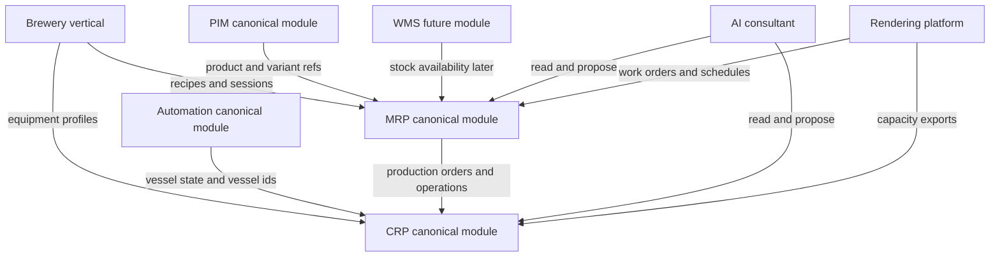

# MRP/CRP August 2026 co-design plan

**Tier:** Public  
**Status:** Draft planning artifact 2026-05-26; documentation-only acceleration plan, not an implementation record  
**Audience:** core team, brewery-vertical maintainers, future MRP/CRP implementers, module SDK authors, AI-consultant maintainers  
**Document role:** joint co-design plan that precedes the per-module `mrp` and `crp` surface docs

> [!NOTE]
> This document expresses the project's willingness to bring a bounded MRP/CRP proof into the public alpha as early as August 2026. It is not a hard delivery promise, not a claim that MRP/CRP are implemented, and not a replacement for the mature H1 2027 roadmap target.

---

## 1. Summary

The H1 2027 roadmap item says brewery production planning should be promoted into first-class `mrp` and `crp` canonical modules. The acceleration target is to pull the design and a bounded alpha proof forward to August 2026, because public alpha benefits from showing how the brewery reference vertical generalizes into the platform's canonical operational modules.

The first move is **joint co-design**, not code. `mrp` and `crp` are strongly coupled at their boundary: MRP produces production orders and operations; CRP allocates those operations onto constrained resources. Designing one without the other would create either an MRP module that ignores capacity or a CRP module with no canonical production input.

The target shape is:

- `mrp` owns production orders, work orders, BOM/material-requirement expansion, and production-planning lifecycle.
- `crp` owns resource calendars, capacity load, schedule proposals, and conflict detection.
- `brewery` remains a tier-6 vertical configuration consuming those canonical primitives.
- `automation` owns live vessel/controller state; CRP consumes vessel/resource references without deep-importing automation internals.
- `pim` owns product and variant identity; MRP references PIM IDs where finished-good or sellable-unit identity is needed.
- `wms` remains future work; alpha MRP may model material availability assumptions, but it does not implement warehouse stock movement.
- The AI consultant reads and proposes across the surfaces; humans approve mutable scheduling/work-order actions.
- Document/file output uses the canonical rendering pipeline, not module-private PDF/XLSX/CSV libraries.

---

## 2. Canonical-kernel guardrail

`mrp` and `crp` are **canonical modules**, not finished vertical SaaS products. August 2026 should produce extensible canonical kernels: stable primitives, contracts, module registration, extension points, brewery proof, AI-tool hooks, rendering-template hooks, and clear ownership boundaries.

It must not try to ship a complete ready-to-sell MRP/CRP suite with every commercial feature built in. The following are explicitly out of alpha scope unless a tiny placeholder is required to keep a contract coherent:

- finite-capacity optimization engines,
- procurement workflows and supplier RFQs,
- accounting/ERP postings,
- MES dispatch and shop-floor execution beyond work-order visibility,
- multi-plant or multi-site planning,
- advanced costing,
- demand forecasting and S&OP,
- full WMS replacement,
- autonomous AI writes to production or capacity state.

Brewery is the proof vehicle, not the module boundary. Brewery concepts may validate the abstractions, but brewery assumptions must not become canonical invariants unless they generalize cleanly to other process-manufacturing verticals such as distillery, kombucha, cosmetics, food-batch, fragrance, or fine-chemical production.

---

## 3. Source-of-truth constraints

This plan builds on already-accepted project decisions:

| Source | Planning implication |
|---|---|
| [`ROADMAP.md`](../ROADMAP.md) | H1 2027 remains the mature MRP/CRP target; August 2026 is an alpha acceleration ambition. |
| [`PLATFORM-ARCHITECTURE.md`](../PLATFORM-ARCHITECTURE.md) | Brewery is a showcase vertical; the durable product is the platform/toolset and canonical-module surface. |
| [`RFC-0001`](../rfcs/0001-modules-tiers-governance-and-automation-placement.md) | `mrp` and `crp` are already reserved canonical codes; no allocation RFC is needed. |
| [`RFC-0002`](../rfcs/0002-canonical-module-physical-layout.md) | Both modules use the beta layout: API, web, native, and contracts slices. |
| [`RFC-0007`](../rfcs/0007-canonical-document-rendering.md) | Work orders, route cards, schedules, and exports must use the platform rendering pipeline. |
| [`canonical-automation-module-surface.md`](canonical-automation-module-surface.md) | Automation owns live controller state; CRP owns planning-resource state. |
| [`canonical-pim-module-surface.md`](canonical-pim-module-surface.md) | PIM owns product/variant identity; MRP references it rather than duplicating master data. |
| [`modules/verticals/brewery/README.md`](../modules/verticals/brewery/README.md) | Brewery is a tier-6 vertical configuration that consumes canonical modules. |

---

## 4. Why joint design comes first

MRP and CRP share a planning loop:

1. A demand signal or brewery recipe/session becomes a proposed production order.
2. MRP expands the order into material requirements and operations.
3. CRP evaluates whether the operations fit available resources and calendars.
4. The operator adjusts timing, resource assignment, batch size, or priority.
5. MRP emits work-order artifacts; CRP emits schedule/load artifacts.
6. The AI consultant explains constraints and proposes human-approved adjustments.

If MRP is designed alone, it risks producing orders that cannot be scheduled. If CRP is designed alone, it risks inventing a private order model. The joint plan therefore resolves shared vocabulary, ownership boundaries, and alpha proof shape before the module-specific surface docs split.

---

## 5. Current brewery surfaces to promote

| Current surface | Current owner | Canonical promotion | Alpha stance |
|---|---|---|---|
| BeerJSON recipe | `brewery` | MRP BOM/process-template input | Reference by projection/adaptor first; do not migrate recipe storage during alpha. |
| Brew session | `brewery` | MRP production order / work order source | Use as the main proof path. Keep existing brewery routes stable initially. |
| Brewday settings / steps | `brewery` | MRP operation template and CRP duration input | Treat as vertical route/operation defaults. |
| Equipment profile | `brewery` | CRP resource/capacity input; possible shared equipment contract | Evaluate `@umbraculum/equipment-contracts` in CRP surface doc. |
| Automation vessel | `automation` | CRP resource state/reference | Consume via contracts/services, not deep imports. |
| Inventory item | `brewery` today; WMS later | MRP material-availability assumption | No WMS implementation in alpha. |
| PIM product / variant | `pim` | MRP finished-good / sellable-unit reference | Reuse PIM references where identity matters. |

---

## 6. Alpha proof

The August 2026 alpha proof should be intentionally small and demonstrable:

1. Start from one brewery recipe/session.
2. Show a planned production order in MRP language.
3. Expand the order into material requirements and route/operation steps.
4. Allocate operations onto one or more capacity resources in CRP language.
5. Detect at least one capacity conflict or at-capacity condition.
6. Generate at least one work-order or route-card artifact through rendering.
7. Let the AI consultant explain the material and capacity picture using module-owned tools.
8. Keep all mutable decisions human-approved.

This proof demonstrates the platform claim without pretending the system is a complete commercial MRP/CRP suite.

---

## 7. Boundary decisions

### 7.1 MRP owns

- Production-order lifecycle.
- Work-order identity and status.
- BOM/material-requirement expansion.
- Operation/route templates as production-planning inputs.
- Planned material availability assumptions until WMS exists.
- Work-order and material-requirement document templates.
- MRP AI tools.

### 7.2 CRP owns

- Resource and work-center planning primitives.
- Resource calendars and capacity windows.
- Scheduled-operation placement.
- Capacity-load views.
- Conflict detection and scheduling proposals.
- Capacity/schedule document templates.
- CRP AI tools.

### 7.3 Brewery owns

- Brewery-specific recipe authoring, BeerJSON, water chemistry, yeast math, BJCP styles, and vertical prompts.
- Brewery-specific UI flows and seed data.
- Brewery adapter/projection logic that maps recipes and brew sessions into canonical MRP/CRP primitives.
- PLC-side assets in the sister repo, joined through the already-documented automation contract discipline.

### 7.4 Automation owns

- Live vessel/controller state.
- Adapter connections, runtime status, alarm state, and mailbox/version contracts.
- Supervisory-control boundaries.

Automation does not own vessel booking, utilization, capacity remaining, or scheduling. Those are CRP concerns.

### 7.5 PIM and WMS boundaries

PIM owns master product and variant identity. MRP references PIM where finished-good or sellable-unit identity matters.

WMS owns stock movements, locations, lots/serials, receipts, issues, and stock-on-hand. Alpha MRP may consume a narrow material-availability assumption, but it must not implement warehouse management.

---

## 8. Per-module design split

After this joint artifact is accepted:

1. `canonical-mrp-module-surface.md` defines the production-planning module.
2. `canonical-crp-module-surface.md` defines the capacity-planning module.
3. Public navigation docs link to both docs and keep implementation status honest.

The split is a documentation boundary, not a permission to diverge. Each surface doc must keep a section explaining how it consumes the other module.

---

## 9. Implementation waves for a later plan

This document is not the implementation plan, but it sets the execution order:

| Wave | Shape | Output |
|---|---|---|
| 0 | Documentation and design | Joint plan + MRP/CRP surface docs + navigation updates. |
| 1 | Contracts | `@umbraculum/mrp-contracts`, `@umbraculum/crp-contracts`, possible shared equipment contract decision. |
| 2 | Read-only API skeletons | `services/api/src/modules/mrp/` and `services/api/src/modules/crp/` registered via `registerModule()`. |
| 3 | Brewery projection | Adapter/projection from recipes, brew sessions, brewday settings, equipment profiles. |
| 4 | Web/read surfaces | Static route-group subsegments registered with `registerWebModule({ ownedUrlSegments })`. |
| 5 | Rendering + AI | Planned templates and read/propose AI tools. |
| 6 | Public-alpha demo | One coherent brewery production-order + capacity-load walkthrough. |

Mature scope remains H1 2027: write workflows, WMS integration, richer scheduling, entitlement billing, native-first operator flows, and irreversible brewery schema migration.

---

## 10. Acceptance criteria for this design package

The documentation package is complete when:

- This joint plan exists and distinguishes August 2026 alpha ambition from H1 2027 mature scope.
- The `mrp` surface doc exists and can be handed to an implementer without a new allocation RFC.
- The `crp` surface doc exists and preserves the automation-vs-CRP boundary.
- Public navigation docs link to the new docs without claiming MRP/CRP are implemented.
- The docs identify future slices and packages but do not create them.
- The docs name AI tools and rendering templates as planned surfaces, not shipped surfaces.
- The docs preserve workspace-scoped, module-pluggable, platform-service-consuming discipline.

---

## 11. Cross-references

- [`ROADMAP.md`](../ROADMAP.md) - public roadmap.
- [`PLATFORM-ARCHITECTURE.md`](../PLATFORM-ARCHITECTURE.md) - platform positioning and module model.
- [`MODULES.md`](../MODULES.md) - ecosystem catalog.
- [`modules/canonical/mrp.md`](../modules/canonical/mrp.md) - MRP open-door page.
- [`modules/canonical/crp.md`](../modules/canonical/crp.md) - CRP open-door page.
- [`modules/verticals/brewery/README.md`](../modules/verticals/brewery/README.md) - reference vertical.
- [`canonical-automation-module-surface.md`](canonical-automation-module-surface.md) - automation boundary.
- [`canonical-pim-module-surface.md`](canonical-pim-module-surface.md) - PIM boundary.
- [`RFC-0001`](../rfcs/0001-modules-tiers-governance-and-automation-placement.md) - module governance.
- [`RFC-0002`](../rfcs/0002-canonical-module-physical-layout.md) - physical layout.
- [`RFC-0007`](../rfcs/0007-canonical-document-rendering.md) - rendering pipeline.
