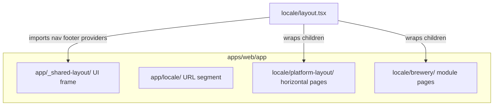
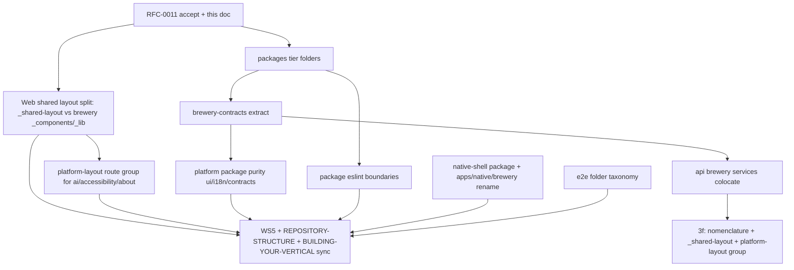

# Pre-flip application-surface backbone — structural audit and target shape

**Tier:** Public  
**Status:** v0.1 — pre-flip planning (2026-06-06); companion to [RFC-0011](../rfcs/0011-application-surface-shell-layering.md)  
**Audience:** maintainers, integrators forking umbraculum-dev, agent executors, module authors  
**Related:** [RFC-0002](../rfcs/0002-canonical-module-physical-layout.md) (β module slices), [REPOSITORY-STRUCTURE.md](../REPOSITORY-STRUCTURE.md), [BUILDING-YOUR-VERTICAL.md](../BUILDING-YOUR-VERTICAL.md), [application-surfaces-vs-platform-backbone.md](application-surfaces-vs-platform-backbone.md), [forkable-repo-cleanliness-audit.md](forkable-repo-cleanliness-audit.md)

> **Disclaimer.** This document diagnoses gaps between today's tree and the Magento-class separation integrators expect. It does not supersede RFC-0002's β module layout; it extends β to **shared layout layers** (shared UI/helpers, E2E, native app workspaces, package on-disk grouping) that RFC-0002 deliberately left unspecified.

---

## 1. Executive summary

| Area | Today | Problem | Target (backbone) |
|------|-------|---------|-------------------|
| **Module routes (web)** | `(brewery)/`, `(pim)/`, … under `[locale]/` | **Mostly fixed** after fork-cleanliness Part B (recipes consolidation) | Keep β; enforce module-local `_components` / `_lib` per route group |
| **Shared layout helpers (web)** | **`app/_shared-layout/`** (platform) + `(brewery)/{_components,_lib}/` | **Done (Wave 1 + 3f, 2026-06-07)** | Keep; WS5 `web-platform-shared-layout` |
| **Platform pages (web)** | `(platform-layout)/{ai,accessibility,about,…}` | **Done (Wave 3f, 2026-06-07)** | Keep grouping; `platform/` admin unchanged |
| **Native apps** | `apps/native/brewery/` + `@umbraculum/native-shell` | **Done (Wave 4, 2026-06-07)** | Multi-app under `apps/native/<app-code>/`; shared shell package; navigation stays per-app |
| **E2E** | `platform/`, `canonical/`, `verticals/brewery/` | **Done (Wave 5, 2026-06-07)** | Mirror module taxonomy under `e2e/{platform,canonical,verticals}/` |
| **Packages (on disk)** | Flat `packages/*` (19 siblings) | Horizontal, SDK, canonical contracts, and brewery vertical at same level; folder names disagree with npm names | On-disk tiers + align paths with npm + split brewery out of platform packages |
| **Packages (content)** | Brewery DTOs in `@umbraculum/contracts`; `BrewCheckbox` in `@umbraculum/ui` | Platform packages contain vertical logic/content — same class of bug as `app/_components` | `@umbraculum/brewery-contracts`; purge vertical leakage from platform packages |
| **Website** | `apps/website/` in monorepo | Wrong audience for forkable product repo | Sister repo **`umbraculum-website`** (private OK pre-flip) — see website extraction plan |
| **`apps/web` without verticals** | Present with platform profile | **Yes — stays.** Shared layout, auth, canonical modules, AI, accessibility remain | Document as the **member-facing web application**, not “brewery app” |

**Bottom line:** RFC-0002 solved **where module pages live**. This epic solves **where everything else lives** so a forked tree reads like Magento's `vendor/` + `app/code/` + `app/design/` mental model without splitting the member-facing web app into two deployables.

---

## 2. Magento mapping (pedagogical — not identity)

Integrators already have this table in [BUILDING-YOUR-VERTICAL.md](../BUILDING-YOUR-VERTICAL.md). Extend it to **filesystem** layers:

| Magento 2 | Umbraculum layer | Target path (post-backbone) |
|-----------|------------------|----------------------------|
| `vendor/magento/*` (framework, module-* ) | Horizontal platform + SDK | `packages/platform/*`, `services/api/src/platform/`, `services/api/src/routes/{auth,workspaces,…}` |
| `vendor/magento/module-catalog` (domain module) | Canonical module | β slices: `services/api/src/modules/<code>/`, `(code)/`, `packages/<code>-contracts/` |
| `Magento_SampleData*` | Reference vertical | `brewery` β slices + `@umbraculum/brewery-*` + `packages/verticals/brewery/` |
| `app/code/Vendor/Module` | Integrator vertical (Tier 6) | **Your repo** — same β shape |
| `app/design/frontend/` | Shared layout theming / overrides | `apps/web/app/_shared-layout/` (platform) + future theme package |
| `app/etc/config.php` module enable | Boot registration | `registerModule()` / `UMBRACULUM_MODULE_PROFILE` |

**What Magento has that we lack today:** platform vs brewery shared-layout ownership is clear via `app/_shared-layout/` vs `(brewery)/_components|_lib` (Wave 1). Platform horizontal pages are grouped under `(platform-layout)/` (Wave 3f).

---

## 3. `apps/web` — shared layout layering (primary gap)

### 3.1 What is already correct

- **Module pages** live under `[locale]/(<code>)/<segment>/` per RFC-0002.
- **Brewery recipe implementation** consolidated to `(brewery)/recipes/**` (fork-cleanliness Part B, 2026-06).
- **WS5 eslint** fences `(pim|mrp|crp|brewery|automation)` from cross-importing sibling verticals.
- **`(auth)/`** is the canonical example of a platform route group with sub-segments only.
- **Platform horizontal pages** grouped under `(platform-layout)/` (Wave 3f, 2026-06-07).

### 3.2 What is still mixed

| Path | Examples | Should be |
|------|----------|-----------|
| ~~`app/_components/` / `app/_lib/`~~ | ~~Mixed platform + brewery~~ | **Done (Wave 1)** — `app/_shared-layout/` + `(brewery)/{_components,_lib}/` |
| ~~Flat `[locale]/ai`, …~~ | ~~Platform horizontal features at flat `[locale]/<segment>/`~~ | **Done (Wave 3f)** — `(platform-layout)/<segment>/` (URLs unchanged) |
| `[locale]/platform/` | Cross-workspace admin (ads, platform recipes) | **Keep** — distinct from shared layout / module routes; docs call this **platform admin** |

### 3.3 Target web tree (member-facing web application)

```text
apps/web/app/
  _shared-layout/                              # Platform shared layout — path name; see §3.5–§3.6
    _components/                       # Nav, footer, auth status, …
    _lib/                              # webApiClient, sessionAuthUx, registerPlatformSegments, …
  [locale]/
    (platform-layout)/                  # Route group — no URL prefix
      ai/
      accessibility/
      about/
      contact/
      contributing/
      i18n-contributing/
    (auth)/                            # unchanged
    (automation)/                      # canonical modules — unchanged
    (brewery)/
      _components/                     # Brewery-only shared route components (moved from app/_components)
      _lib/                            # breweryWaterClient, grist, … (moved from app/_lib)
      recipes/ …
    (pim)/ …
    (mrp)/ …
    (crp)/ …
    platform/                          # Admin cross-workspace — unchanged URL /platform/*
  layout.tsx, globals.css, …           # App root — unchanged
```

**Rules (enforceable):**

1. **`_shared-layout/` may not import from `(brewery)/`, `(pim)/`, …** — WS5 extension.
2. **Module route groups own `_components/` and `_lib/` at group root** when shared across segments within that module (PIM already has local `_components` under some segments; standardize on group root).
3. **Vertical-specific UI belongs in `@umbraculum/brewery-recipes-ui`** when shared across web **and** native — app tree holds adapters/pages only.
4. **URLs unchanged** — same discipline as RFC-0006 (route groups are structural).

### 3.4 Will `apps/web` exist without verticals?

**Yes.** With `UMBRACULUM_MODULE_PROFILE=platform`:

- Shared layout folder (`_shared-layout/`), `(auth)/`, `(platform-layout)/`, canonical modules, and `platform/` admin remain.
- `(brewery)/` routes and brewery nav entries are not registered ([platform-module-profile.md](platform-module-profile.md)).
- Integrators still need `apps/web` as the **member-facing web application** (workspace members' daily UI) — comparable to Magento admin, not the reference vertical.

### 3.5 Terminology policy — conventional vocabulary only

Wave **3f (2026-06-07)** removed internal product slang from integrator-facing docs and code identifiers. Use **standard software-engineering and Next.js terms** only.

| Topic | Write this | Not this |
|-------|------------|----------|
| Daily member UI | **Member-facing web application** (`apps/web`), **workspace web UI** | Invented "operator" compounds |
| Nav / footer / auth frame | **Platform shared layout**, **shared layout components** | "Chrome", unqualified "shell" |
| `app/_shared-layout/` on disk | **Platform shared layout folder** (Next.js private folder) | Bare "layout" without "shared" or "page" qualifier |
| `(platform-layout)/` route group | **Platform horizontal pages** (filesystem grouping; URLs unchanged) | Prose-only invented route-group names |
| Bash / CI | **Command-line shell** | — |

**Allowed path/package identifiers (explain once using terms above):** `@umbraculum/native-shell` (Expo bootstrap package — not the web UI frame). RFC-0011 **filename/title** is historical only.

See [`GLOSSARY.md`](../GLOSSARY.md) for **Platform shared layout**, **Command-line shell**, and **UT Morph webapp wrapper**.

### 3.6 What `app/_shared-layout/` is — placement and why it is not in `node_modules`

**Short definition:** `apps/web/app/_shared-layout/` holds **platform-owned shared layout code** — the persistent **UI frame** (navigation, footer, authentication UI, global ad slots, i18n/Tamagui providers, optional build-time banner) wrapping every locale route. It is **not** a page's internal column layout, **not** a command-line shell, **not** part of any module route group.

| Layer | Path | Role | Under `[locale]/`? |
|-------|------|------|-------------------|
| **Platform shared layout** | `app/_shared-layout/{_components,_lib}/` | `PrimaryNav`, `Footer`, `webApiClient`, auth UX, segment registration — horizontal, profile-agnostic | **No** |
| **Platform horizontal pages** | `app/[locale]/(platform-layout)/<segment>/` | AI, accessibility, about, contact, … — platform-owned routes | **Yes** (route group; no URL prefix) |
| **Module shared UI** | `app/[locale]/(<code>)/{_components,_lib}/` | Module-only shared components (e.g. `(brewery)/_components/recipe-edit/`) | **Yes** |
| **Module pages** | `app/[locale]/(<code>)/<segment>/` | Routable pages (`/en/recipes`, …) | **Yes** |
| **Cross-surface vertical UI** | `@umbraculum/<vertical>-*` packages | Shared when web **and** native need the same widget | npm package |

**Why `_shared-layout/` sits beside `[locale]/`, not inside it**

1. **Next.js App Router:** `[locale]/` is a URL segment. `_shared-layout/` is a **private folder** (leading `_`; omitted from URLs). `[locale]/layout.tsx` imports shared layout components once for all locales.
2. **Ownership:** `(brewery)/` is a module route group. `_shared-layout/` is **platform-owned** and remains when `UMBRACULUM_MODULE_PROFILE=platform` disables brewery routes.
3. **Dependency direction (WS5):** Module code may import `_shared-layout/`. `_shared-layout/` must **not** import module route groups — enforced by eslint element `web-platform-shared-layout`.

**Why shared layout code lives in `apps/web/app/`, not `node_modules/`**

Application composition, not a publishable library: wires this Next.js app's layouts to `@umbraculum/*` packages; keeps forkability without npm release coupling. Promote to `@umbraculum/*` only when reusable across repos with no Next.js layout coupling.

### 3.7 Canonical web app layout diagram



Integrator decision tree: [`BUILDING-YOUR-VERTICAL.md`](../BUILDING-YOUR-VERTICAL.md) § "Where does my UI code go?".

---

## 4. `apps/native` — multi-app workspace model

### 4.1 Problem

`apps/native/` is one Expo app (`@umbraculum/native`) whose README describes “the native application.” In manufacturing/ERP you routinely ship **multiple mobile apps** against one backend: brew-day, warehouse scanner, PIM floor app, maintenance handheld.

### 4.2 Target shape

```text
apps/native/
  brewery/                    # @umbraculum/native-brewery — brew-day (current app)
    App.tsx, app.json, …
    src/modules/brewery/ …
  # future examples (scaffold only pre-flip):
  # pim-floor/                # @umbraculum/native-pim-floor
  # wms-scanner/                # @umbraculum/native-wms-scanner

packages/native-shell/        # @umbraculum/native-shell (NEW)
  auth/, navigation/, i18n/, theme/, bootstrap
```

**Shared extraction:** Move today's `apps/native/src/{auth,navigation,i18n,theme,bootstrap,components}` into `@umbraculum/native-shell`. Each app workspace depends on shell + selected module native slices.

**Registration:** Each app calls `registerPlatformNativeModules({ modules: ['brewery'] })` (or subset) — already partially profile-driven.

**Flip posture:** Pre-flip can land **folder rename + shell package extraction** with one shipping app (`brewery/`). Additional app workspaces are **scaffold + README** only — proves extensibility without EAS multiplication on day one.

### 4.3 Relationship to RFC-0002 native slice

RFC-0002 native slice path **`apps/native/src/modules/<code>/`** becomes **`apps/native/<primary-app>/src/modules/<code>/`** OR module code moves to **`packages/<code>-native/`** when shared across multiple native apps. Decision in RFC-0011: prefer **per-app `src/modules/<code>/`** for app-specific navigation; promote to package when second app reuses screens.

---

## 5. `apps/web/e2e` — test ownership mirrors product layers

### 5.1 Today (Wave 5 complete, 2026-06-07)

```text
apps/web/e2e/
  platform/       # auth, select-workspace, dashboard, ai-pages
  canonical/      # mrp-crp-read-only, mrp-crp-export
  verticals/
    brewery/      # recipe-list, water-*, recipe-create, brew-session
  support/        # unchanged fixtures
```

Playwright projects: `platform`, `canonical`, `verticals-brewery`.

### 5.2 Target

Same as §5.1 — **landed Wave 5 (2026-06-07)**.

---

## 6. `packages/` — the same mixing problem as `apps/web`

The flat `packages/` tree repeats the shell-layer confusion at the **npm workspace** layer. [REPOSITORY-STRUCTURE.md](../REPOSITORY-STRUCTURE.md) §2 defines five logical layers, but on disk all 19 workspaces sit as siblings — and several **platform-classified** packages still contain brewery-vertical code.

### 6.1 Inventory — what lives where today

| On-disk path | npm name | Declared layer | Actual ownership signal |
|--------------|----------|----------------|-------------------------|
| `packages/platform/ui/` | `@umbraculum/ui` | Horizontal (L3) | **Clean (Wave 3c, 2026-06-07)** — brewery widgets moved to `@umbraculum/brewery-recipes-ui` |
| `packages/platform/navigation/` | `@umbraculum/navigation` | Horizontal (L3) | Clean |
| `packages/platform/i18n/` | `@umbraculum/i18n` | Horizontal (L3) | **Clean (Wave 3c)** — brewery copy in `@umbraculum/brewery-i18n`; platform merges at runtime |
| `packages/platform/i18n-react/` | `@umbraculum/i18n-react` | Horizontal (L3) | Clean (bindings only) |
| `packages/modules/i18n-keys/` | `@umbraculum/i18n-keys` | SDK (L5) | Clean |
| `packages/platform/api-client/` | `@umbraculum/api-client` | Horizontal (L3) | Clean |
| `packages/platform/media/` | `@umbraculum/media` | Horizontal (L3) | **Clean (Wave 3c)** — brewery assets in `@umbraculum/brewery-media-assets`; platform manifest empty |
| `packages/platform/rendering/` | `@umbraculum/rendering` | Horizontal (L3) | Clean (BeerJSON proof is consumer, not owner) |
| `packages/platform/test-mcp/` | `@umbraculum/test-mcp` | Dev tooling | Clean |
| `packages/platform/contracts/` | `@umbraculum/contracts` | Platform contracts (L4) | **Was leaked** — `src/brewery/`, `src/water/`, `src/analysis/` moved to `@umbraculum/brewery-contracts` (Wave 3b, 2026-06-06) |
| `packages/verticals/brewery/contracts/` | `@umbraculum/brewery-contracts` | Vertical contracts (L4) | **Clean** — RFC-0002 β fourth slice for `brewery` |
| `packages/modules/module-sdk/` | `@umbraculum/module-sdk` | SDK (L5) | Clean |
| `packages/modules/ai-tool-sdk/` | `@umbraculum/ai-tool-sdk` | SDK (L5) | Clean |
| `packages/modules/automation-contracts/` | `@umbraculum/automation-contracts` | Canonical (L4) | Clean — **good pattern** |
| `packages/modules/pim-contracts/` | `@umbraculum/pim-contracts` | Canonical (L4) | Clean |
| `packages/modules/mrp-contracts/` | `@umbraculum/mrp-contracts` | Canonical (L4) | Clean |
| `packages/modules/crp-contracts/` | `@umbraculum/crp-contracts` | Canonical (L4) | Clean |
| `packages/verticals/brewery/core/` | `@umbraculum/brewery-core` | Vertical (L5) | **Trap:** folder says `core`, npm says `brewery-core` |
| `packages/verticals/brewery/beerjson/` | `@umbraculum/brewery-beerjson` | Vertical (L5) | **Trap:** folder omits `brewery-` prefix |
| `packages/verticals/brewery/recipes-ui/` | `@umbraculum/brewery-recipes-ui` | Vertical (L5) | **Trap:** folder omits `brewery-` prefix |

**Magento parallel:** this is like finding `Magento\Catalog` classes under `vendor/magento/framework/` because “we haven't split the package yet.” Canonical modules already follow the right pattern (`pim-contracts/` → `@umbraculum/pim-contracts`). Brewery and platform do not.

### 6.2 Failure modes (why this blocks integrators)

1. **Path vs npm cognitive load.** `cd packages/verticals/brewery/core` installs `@umbraculum/brewery-core` — the bare `@umbraculum/core` name is *reserved* for future platform-core ([trap-avoidance](../REPOSITORY-STRUCTURE.md) §3.6). New contributors grep `packages/verticals/brewery/core` expecting platform backbone.

2. **Platform contracts absorb vertical DTOs.** ~~`@umbraculum/contracts` exports brewery route schemas…~~ **Resolved Wave 3b** — brewery wire types now live in `@umbraculum/brewery-contracts`; platform `@umbraculum/contracts` is cross-cutting only (no re-export shims). Remaining symmetry gap: **`services/api/src/services/` and `domain/`** still host brewery logic outside `modules/brewery/` (§6.8).

3. **Horizontal UI carries vertical nouns.** `@umbraculum/ui` exports `BrewCheckbox` and hydrometer charts. A distillery integrator importing `@umbraculum/ui` for primitives inherits brewing-named components — the opposite of “industry-agnostic by construction.”

4. **Flat listing hides opt-out.** F-mod `UMBRACULUM_MODULE_PROFILE=platform` can skip brewery at **runtime registration**, but `npm ls` and `packages/` still show brewery workspaces peered with `navigation` — no filesystem story for “sample data module.”

5. **eslint / boundaries gap.** WS5 covers `apps/web` and `apps/native`; there is no equivalent **`eslint-plugin-boundaries` tier fence on `packages/**`** preventing `@umbraculum/ui` from importing `@umbraculum/brewery-recipes-ui` or `@umbraculum/contracts` from growing new vertical subtrees without review.

### 6.3 Target on-disk shape

```text
packages/
  platform/                         # Layer 3 — industry-agnostic ONLY
    ui/
    navigation/
    i18n/                           # platform message roots only (after content split)
    i18n-react/
    api-client/
    contracts/                      # platform wire types ONLY (auth, workspaces, billing, ai, rendering, …)
    rendering/
    media/                          # loader framework; vertical assets under verticals/
    native-shell/                   # NEW — extracted from apps/native
    test-mcp/
  modules/                          # Layer 4–5 — SDK + canonical *-contracts
    module-sdk/
    ai-tool-sdk/
    i18n-keys/
    automation-contracts/
    pim-contracts/
    mrp-contracts/
    crp-contracts/
  verticals/
    brewery/                        # Tier-6 reference vertical — ALL brewery npm packages here
      core/                         # @umbraculum/brewery-core  (rename from packages/verticals/brewery/core)
      beerjson/                     # @umbraculum/brewery-beerjson
      recipes-ui/                   # @umbraculum/brewery-recipes-ui
      contracts/                    # @umbraculum/brewery-contracts  (NEW — see §6.4)
      i18n/                         # optional: brewery locale bundles split from platform i18n
      media-assets/                 # optional: brewery-only manifest assets
```

Root workspaces:

```json
"packages/platform/*",
"packages/modules/*",
"packages/verticals/*/*"
```

**npm names:** stable through Wave 3a (physical tier move only). Wave 3b+ aligns folder names under `verticals/brewery/` with npm without changing published names.

### 6.4 Target content split — `@umbraculum/brewery-contracts`

Align brewery with canonical modules (RFC-0002 contracts slice):

| Move from `@umbraculum/contracts` | Destination |
|-----------------------------------|-------------|
| `src/brewery/**` | `@umbraculum/brewery-contracts` |
| `src/water/**` | `@umbraculum/brewery-contracts` (brewery water chemistry — not horizontal) |
| `src/analysis/**` | `@umbraculum/brewery-contracts` (gravity analysis — brewery domain) |

**Keep in `@umbraculum/contracts` (platform):** `auth/`, `workspaces/`, `billing/`, `ads/`, `ai/`, `integrations/`, `platformAdmin/`, `webhooks/`, `health/`, `rendering/`, cross-cutting `format/`.

**Pre-flip posture:** pre-release — **no re-export shims**. Update `@umbraculum/api-client` and apps to import brewery wire types from `@umbraculum/brewery-contracts` directly. Same discipline as deleting legacy `apps/web/app/recipes/` re-exports.

### 6.5 Target content split — horizontal package purity

| Package | Action |
|---------|--------|
| `@umbraculum/ui` | Move `BrewCheckbox` → `@umbraculum/brewery-recipes-ui` or rename to neutral primitive if truly horizontal; move `HydrometerChart` → brewery package |
| `@umbraculum/i18n` | Split locale JSON: platform + canonical keys stay; brewery keys → `verticals/brewery/i18n/` (or `@umbraculum/brewery-i18n` bundle) |
| `@umbraculum/media` | Split manifest: framework loader stays; brewery images → vertical assets package |
| `@umbraculum/api-client` | Optional subpath exports: `./platform`, `./brewery`, `./pim` |

### 6.6 npm scope questions (recap)

**Should vertical packages leave `@umbraculum/`?** Keep `@umbraculum/brewery-*` for the **reference vertical** in this monorepo. Integrator verticals publish under **their org scope** (`@acme/distillery-*`). On-disk `verticals/brewery/` makes reference vertical visually optional; npm scope alone does not.

**Should `@umbraculum/api` + `@umbraculum/api-client` merge?** **No** — service workspace vs client SDK; WS6 client-safe story requires the split.

### 6.7 Package-layer eslint (new — mirrors WS5)

Add `eslint-plugin-boundaries` elements on `packages/**`:

| Element | Pattern | Rule |
|---------|---------|------|
| `pkg-platform` | `packages/platform/**` | Must not import `pkg-vertical` or `pkg-module-contracts` except via explicit allowlist for boot glue |
| `pkg-module-contracts` | `packages/modules/*-contracts/**` | Must not import `pkg-vertical` |
| `pkg-vertical` | `packages/verticals/**` | May import `pkg-platform` + relevant `pkg-module-contracts`; never sibling vertical |

Spike doc: [`docs/design/solid-boundaries-eslint-packages-spike.md`](./solid-boundaries-eslint-packages-spike.md) (Wave 3d, 2026-06-07).

### 6.8 `services/api` — brewery service colocation (Wave 3e — complete)

RFC-0002 β layout landed **module routes** under `services/api/src/modules/<code>/`. Wave **3e** (2026-06-06) colocated **all brewery domain math and orchestrators** under `modules/brewery/services/` — the same category fix as Wave **3b** (`@umbraculum/brewery-contracts`).

#### 6.8.1 Inventory (resolved)

| On-disk path | Status |
|--------------|--------|
| `modules/brewery/routes/` | **Correct** — Fastify route registration |
| `modules/brewery/services/waterCalc/` | **Done** — merged pure math (former `domain/waterCalc/`) + route ops |
| `modules/brewery/services/recipeWaterHub/` | **Done** — former `services/recipeWaterHub/` |
| `modules/brewery/services/recipeWaterCompute/` | **Done** — former `services/recipeWaterCompute/` |
| `modules/brewery/services/recipeAnalysis/` | **Done** — former `domain/recipeAnalysis/` |
| `modules/brewery/services/recipeWaterHubSummaryService.ts` | **Done** |
| `modules/brewery/services/recipeWaterComputeAndSaveService.ts` | **Done** |
| `modules/brewery/services/recipeWaterSettings/` + barrel | **Done** — former `services/recipeWaterSettings/` |
| `modules/brewery/services/recipes/` + barrels | **Done** — former `services/recipes/`, `recipesService.ts`, `recipesImportService.ts` |
| `modules/brewery/services/brewSessions/` + barrels | **Done** — former `services/brewSessions/` and top-level `brewSessions*.ts` |
| `modules/brewery/services/waterProfiles/` + barrel | **Done** |
| `modules/brewery/services/brewdaySettings/` + barrel | **Done** |
| `modules/brewery/services/inventoryService.ts` | **Done** |
| `modules/brewery/services/equipmentProfilesService.ts` | **Done** — Wave 3e Phase 2 (2026-06-07) |
| `modules/brewery/services/ai/tools/` + `ai/prompts/brewery.ts` | **Done** — Wave 3e Phase 2 (2026-06-07) |

**Stays flat (horizontal platform admin):** `services/platformRecipesService.ts` — imports brewery `RecipesService` / `RecipesImportService` from the module tree. Platform `services/ai/tools/automation/` remains horizontal.

#### 6.8.2 Failure modes (remaining)

1. **Dual homes for water calc — resolved.** Single folder: `modules/brewery/services/waterCalc/`.
2. **F-mod opt-out filesystem leak — resolved for brewery.** Brewery subtrees no longer under flat `domain/` or `services/{recipes,brewSessions,…}`.
3. **Boundary enforcement gap.** WS5 covers `apps/**`; there is no **`services/api/src/modules/**` vs `services/api/src/{services,domain}/**` eslint fence** preventing new brewery helpers from landing in flat trees “because it's closer to the route.”

#### 6.8.3 Target shape (filesystem clarity — HTTP paths unchanged)

```text
services/api/src/
  platform/              # horizontal services (auth, billing, rendering queue, …)
  modules/
    brewery/
      routes/            # exists today
      services/          # ALL brewery service + domain logic
        waterCalc/
        recipeWaterHub/
        recipeWaterCompute/
        recipeAnalysis/
        recipes/
        brewSessions/
        recipeWaterSettings/
        waterProfiles/
        brewdaySettings/
        …
    pim/
    …
  routes/                # legacy platform route entry files — migrate toward platform/ over time
  services/              # horizontal platform services only (e.g. platformRecipesService)
```

**Wave 3e complete (2026-06-06).** **Wave 3f complete (2026-06-07)** — shared layout nomenclature, `_shared-layout/` path, `(platform-layout)/` route group.

No change to HTTP paths — filesystem clarity only.

---

## 7. Sister repos and out-of-monorepo surfaces

| Item | Action | Plan reference |
|------|--------|----------------|
| `apps/website/` | Extract to **`umbraculum-website`** (private repo OK) | Cursor plan *Extract `apps/website` → `umbraculum-website`* (`website_sister_repo_08f8173a.plan.md` under operator `.cursor/plans/`) |
| `docs-site/` | **Keep** in monorepo through flip | deferral register R-POLICY |
| Forum/demo VPS | Already in hosting repos | production-hosts.md |

---

## 8. Relationship to completed / in-flight work

| Work | Status | Backbone relationship |
|------|--------|----------------------|
| Fork-cleanliness Part B (brewery recipes tree) | **Done** | Prerequisite — module routes correct |
| SOLID WS5/WS6 | **Closed** | **`web-platform-shared-layout` + `web-brewery-shared` WS5 elements landed (Wave 1)** |
| F-mod brewery optional profile | **Phase 1 shipped** | Backbone makes opt-out visually obvious |
| Website sister repo | **Ready to implement** | Independent track; rename to `umbraculum-website` |
| RFC-0002 β layout | **Accepted** | Unchanged — this doc extends, not replaces |

---

## 9. Proposed execution waves (no deadline pressure)



| Wave | Deliverable | Est. | Flip blocker? |
|------|-------------|------|---------------|
| **0** | RFC-0011 + this doc reviewed | 1–2d | No — but sets backbone |
| **1** | Move brewery files out of `app/_components`, `app/_lib`; introduce `app/_shared-layout/` | 2–4d | **Done (2026-06-06)** — child plan `rfc-0011_wave_1_web_shell_3435eb19.plan.md` |
| **2** | `(platform-layout)/` route group; move ai/accessibility/about/contact | 1–2d | **Done (2026-06-07)** — absorbed into Wave 3f |
| **3a** | Physical move to `packages/{platform,modules,verticals}/`; workspace globs | 2–3d | **Done (2026-06-07)** |
| **3b** | Create `@umbraculum/brewery-contracts`; migrate `contracts/src/{brewery,water,analysis}` | 3–5d | **Done (2026-06-06)** — closes RFC-0002 gap |
| **3c** | Purge vertical leakage from `@umbraculum/ui`, split `@umbraculum/i18n` content | 2–4d | **Done (2026-06-07)** |
| **3d** | Package-layer eslint boundaries + spike doc | 1–2d | **Done (2026-06-07)** |
| **3e** | Colocate brewery API services under `modules/brewery/services/` (§6.8) | 2–3d | **Done (2026-06-07)** — Phase 1 + Phase 2 flat orchestrators |
| **3f** | **Shared layout nomenclature + path rename:** `_shared-layout/`, `(platform-layout)/`, `web-platform-shared-layout`; glossary + BUILDING-YOUR-VERTICAL decision tree | 1–2d | **Done (2026-06-07)** |
| **4** | `@umbraculum/native-shell` + `apps/native/brewery/` | 3–5d | **Done (2026-06-07)** — 4A multi-app re-home + 4B shell extraction |
| **5** | E2E folder taxonomy | 1d | No — **Done (2026-06-07)** |
| **6** | Docs + eslint + module READMEs | 1d | Yes for changed waves — **Done (2026-06-07)** |

**Parallel track:** website → `umbraculum-website` extraction (existing plan).

---

## 10. Verification gates (per wave)

- `./scripts/ci-parity-check.sh --archive run` (lint + typecheck when TS paths change)
- `npm run check-web-url-segments` after any `[locale]/` moves
- WS5: zero `boundaries/element-types` violations after `_shared-layout/` element added
- Playwright smoke on touched segments
- `python3 scripts/docs/check-readmes.py` when module READMEs change

---

## 11. Open questions for maintainer decision

1. **Route group name:** `(platform-layout)/` vs `(platform)/` — latter collides mentally with `[locale]/platform/` admin. Prefer **`(platform-layout)/`** or **`(platform-layout)/`**.
2. **Native multi-app CI:** one EAS project per app vs monorepo matrix — defer to [NATIVE-STRATEGY-AND-CI.md](../NATIVE-STRATEGY-AND-CI.md) amendment.
3. **On-disk package move (Wave 3a):** before flip (cleaner first fork) vs after (less churn now).
4. **`brewery-contracts` extraction (Wave 3b):** pre-flip vs post-flip — pre-flip aligns public seed with RFC-0002 text.
5. **Integrator doc:** update BUILDING-YOUR-VERTICAL with “shared layout vs module vs vertical” filesystem diagram after Wave 1. — **Closed (Wave 6, 2026-06-07)**
6. **`app/_shared-layout/` path and doc vocabulary (Wave 3f):** **Closed (2026-06-07)** — **workspace web UI** retained as integrator term per RFC-0011 §3.1; deprecated slang (`operator shell`, `/_shell/`, `WebShellNotice`) removed from integrator prose.

---

## 12. Success criteria (epic complete)

Audit (2026-06-07, Wave 6): full table in [`rfc-0011-wave-6-doc-capstone-build-log.md`](./rfc-0011-wave-6-doc-capstone-build-log.md).

| # | Criterion | Status |
|---|-----------|--------|
| 1 | Contributor can identify layout / module / vertical folders | **Met** — generic UI hoisted to `_shared-layout/_components/`; one `@arch-boundary` bridge at `platform/recipes/_components/RecipeImportForm.tsx` |
| 2 | Zero deprecated slang | **Met** |
| 3 | Brewery naming only under `(brewery)/` or `@umbraculum/brewery-*` | **Met** — cross-module `(brewery)/_components` imports cleared (2026-06-07 backlog) |
| 4 | No brewery under `packages/platform/` | **Met** — `@umbraculum/brewery-api-client` extracted; platform keeps deprecated `./brewery` re-export shim only |
| 5 | `@umbraculum/brewery-contracts`; platform contracts clean | **Met** |
| 6 | Native README multi-app pattern | **Met** — Wave 4A umbrella + Wave 4B `@umbraculum/native-shell` |
| 7 | REPOSITORY-STRUCTURE ↔ RFC-0011 ↔ backbone linked | **Met** |

1. A new contributor can open `apps/web/app/` and identify **platform shared layout**, **platform horizontal pages**, **canonical module**, and **vertical** folders without reading chat history.
2. Deprecated internal slang (`operator shell`, `/_shell/`, `WebShellNotice`, …) returns zero hits in `docs/` and `apps/web/` except RFC-0011 historical title and `@umbraculum/native-shell` package name.
3. `grep brewery-only paths outside `(brewery)/`` returns zero — brewery naming only under `(brewery)/` or `@umbraculum/brewery-*`.
4. `grep brewery packages/platform` returns zero — no vertical subtrees under platform packages.
5. `@umbraculum/brewery-contracts` exists; `@umbraculum/contracts` root export has no brewery/water/analysis paths.
6. Native README describes **multi-app workspace** pattern with one reference app shipped.
7. [REPOSITORY-STRUCTURE.md](../REPOSITORY-STRUCTURE.md) and RFC-0011 cross-link this doc; deferral register lists anything intentionally post-flip.
