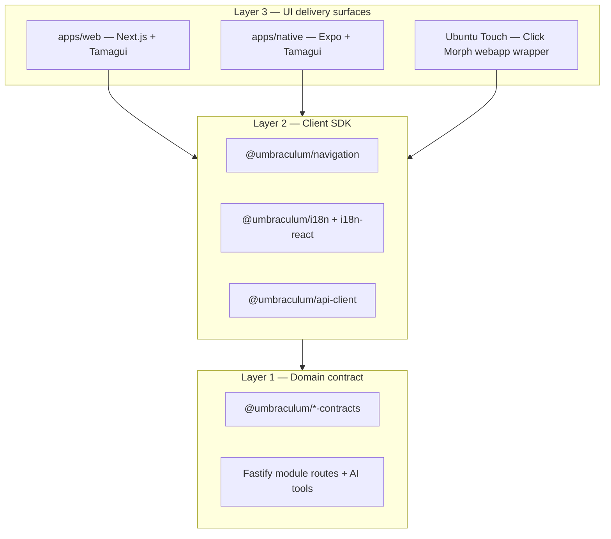
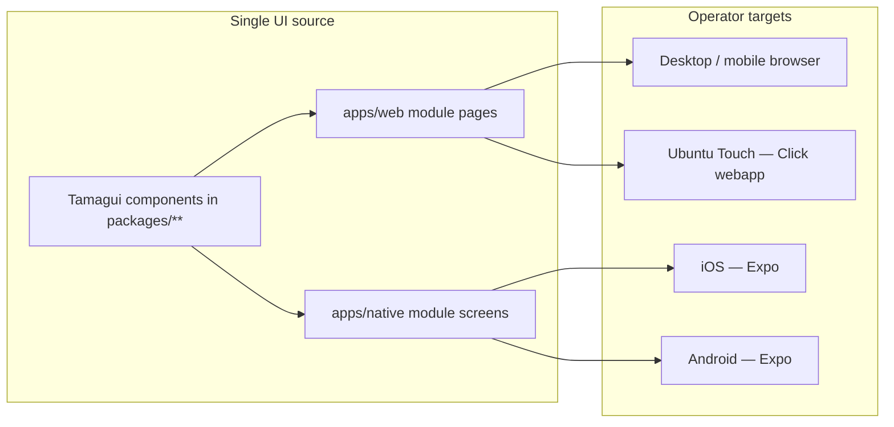

# Ubuntu Touch shell strategy — webapp delivery without UI rewrite

**Tier:** Public  
**Status:** Decision-of-record 2026-05-31  
**Audience:** core team, module authors, self-hosting operators, Ubuntu Touch integrators, plan executors  
**Builds on:** [PLATFORM-ARCHITECTURE.md](../PLATFORM-ARCHITECTURE.md) §1.1, [CROSS-PLATFORM-BOUNDARIES.md](../CROSS-PLATFORM-BOUNDARIES.md), [AUTH-STRATEGY.md](../AUTH-STRATEGY.md), [canonical-native-platform-surface.md](canonical-native-platform-surface.md), [application-surfaces-vs-platform-backbone.md](application-surfaces-vs-platform-backbone.md), [ROADMAP.md](../ROADMAP.md) standing principles  
**Resolves:** whether Umbraculum modules can reach Ubuntu Touch without a Qt/QML rewrite; what portability means for canonical and vertical modules on Lomiri  
**Referenced by:** [CROSS-PLATFORM-BOUNDARIES.md](../CROSS-PLATFORM-BOUNDARIES.md) §9, [PLATFORM-ARCHITECTURE.md](../PLATFORM-ARCHITECTURE.md) §1.1 / §3.5, [ROADMAP.md](../ROADMAP.md) standing principles, [MODULES.md](../MODULES.md) §5.1, [canonical-native-platform-surface.md](canonical-native-platform-surface.md) §3.4

> **Disclaimer.** This document records a **delivery strategy**, not an implementation commitment with dates. It does not allocate a new canonical module, does not change licenses, and does not weaken the native-slice offline guarantees on iOS/Android. It explicitly accepts **online-first** behavior on Ubuntu Touch in exchange for **fast store presence** and **zero Tamagui duplication**.

> **Terminology.** *Vertical* and *brewery* follow [`GLOSSARY.md`](../GLOSSARY.md): a **vertical configuration** is a specific product built on Umbraculum; **`brewery`** is the **reference vertical** shipped in this monorepo (Tier 6), not the platform's identity. Where this doc says *brewery vertical*, read *brewery (reference vertical)* unless a narrower brewery-domain rule is meant.

---

## 1. Summary — the decision

| Question | Decision |
|---|---|
| Can React Native run natively on Ubuntu Touch? | **No** — no maintained RN target for Linux mobile; not planned by Meta or Microsoft. |
| Can we ship Umbraculum on Ubuntu Touch without rewriting UI in Qt/QML? | **Yes** — via the **UT Morph webapp wrapper**: a Lomiri **Click package** that wraps `apps/web` in Morph's Qt WebEngine webview (`webapp-container`). |
| Do we maintain Tamagui as the single UI primitive layer? | **Yes — non-negotiable.** Ubuntu Touch consumes the **web slice**, not a parallel QML tree. |
| Do we require OpenStore / Click store presence? | **Yes — non-negotiable.** Packaging is a first-class deliverable, not "open in Morph manually." |
| Do we require offline on Ubuntu Touch? | **No — explicitly sacrificed for now.** Online-first is an accepted trade-off on this delivery path. |
| What is the strategic payoff? | **Faster React-app delivery** across **web + iOS/Android native + macOS (via web or future RN macOS) + Ubuntu Touch** from one Tamagui/Next source tree — without forking the module model. |

**Way forward (precise):** treat Ubuntu Touch as a **fourth workspace web UI** that reuses **`apps/web`** unchanged, distributed as a **UBports webapp Click package** per deployment (self-hosted URL or hosted product URL). Domain logic stays in API + contracts; UI stays in Tamagui web pages.

---

## 2. Discourse record — how we got here

This section names the full reasoning chain so future readers do not re-litigate rejected paths.

### 2.1 Starting question

> *Is there a way to make React Native work on Linux phones, or will it be possible in the future?*

**Finding:** Official React Native targets iOS and Android. Out-of-tree platforms include Windows, macOS, tvOS, visionOS, and Web — not Linux mobile. Canonical's 2016–2017 Ubuntu Touch RN fork is archived. Microsoft has stated no plans for Linux in `react-native-windows`. Community RN-on-Linux-desktop experiments (Skia renderer, Qt desktop port) do not constitute a phone platform.

**Implication for Umbraculum:** "RN on Ubuntu Touch" is not a credible product path.

### 2.2 Umbraculum-specific reframing

> *Can a canonical or vertical Umbraculum module appear on Ubuntu Touch without rewriting everything in Qt?*

Umbraculum modules ([RFC-0002](../rfcs/0002-canonical-module-physical-layout.md)) are four coordinated slices:

| Slice | Portable to UT without rewrite? |
|---|---|
| **Contracts** (`@umbraculum/<code>-contracts`) | Yes — MIT npm, Zod, route IDs |
| **API** (`services/api/src/modules/<code>/`) | Yes — HTTP |
| **Web** (`apps/web/app/[locale]/(<code>)/`) | Yes — runs inside Morph webview |
| **Native** (`apps/native/src/modules/<code>/`) | No — Expo targets iOS/Android only |

The toolset commitment ([PLATFORM-ARCHITECTURE.md](../PLATFORM-ARCHITECTURE.md) §1.1) is **one source of truth → web + native (RN/Expo)**, with Tamagui bridging DOM and RN. A Qt/QML port would fork the UI slice and violate [CROSS-PLATFORM-BOUNDARIES.md](../CROSS-PLATFORM-BOUNDARIES.md) §3 ("shared screens must not import platform frameworks") and [OPEN-SOURCE-STACK.md](../OPEN-SOURCE-STACK.md) rationale (Flutter = rewrite; separate native stacks = double maintenance).

**Implication:** Full Qt rewrite is **infeasible by design** and **not aligned** with the module model.

### 2.3 Three portability layers (mental model)

- **Layer 1** (API + contracts): fully portable; any client can integrate.
- **Layer 2** (navigation, i18n, api-client): portable to JS/TS clients; UT webapp inherits these via the web bundle.
- **Layer 3** (Tamagui screens): portable between **web and RN** today; UT joins via **web**, not a third widget toolkit.

### 2.4 Options considered

| Option | Rewrite? | Store presence? | Offline? | Verdict |
|---|---|---|---|---|
| **A — UT webapp → `apps/web`** | No | Yes (Click) | No | **Selected** |
| B — UT webapp + auth bridge extensions | No (small API glue) | Yes | No | Follow-on enhancement |
| C — Contracts + bounded QML client | Partial UI rewrite | Yes | Possible | Rejected as platform strategy; tier-3 integrator path only |
| D — Waydroid / Android layer | No | Awkward | Yes (RN slice) | Personal hack; not product distribution |
| E — React Native on UT natively | N/A | N/A | N/A | No maintained path |
| F — Full Qt/QML module UI | Yes — all screens | Yes | Possible | **Rejected** — forks module model |

### 2.5 Non-negotiables (confirmed feasible)

The selected path satisfies both constraints from product direction:

1. **No rewrite / maintain Tamagui** — UT shell loads existing Next.js + Tamagui pages; no QML screen tree, no second component library.
2. **Store presence** — UBports documents first-class [**webapp Click packages**](https://docs.ubports.com/en/latest/appdev/webapp/guide.html): Lomiri icon, AppArmor confinement, OpenStore distribution via `webapp-container` + Morph (Qt WebEngine).

Sacrificing **offline on Ubuntu Touch** is **explicitly accepted** to unlock **quick delivery** and an overall boost in React-app reach (web, iOS, Android, macOS-class browsers, UT) from one UI investment.

---

## 3. Why this choice — rationale

### 3.1 Aligns with existing architecture

- **Application surfaces** ([application-surfaces-vs-platform-backbone.md](application-surfaces-vs-platform-backbone.md)): workspace web UI = `apps/web` + `apps/native`. UT webapp is **`apps/web` + a packaging adapter**, not a new backbone layer.
- **Route policy** ([CROSS-PLATFORM-BOUNDARIES.md](../CROSS-PLATFORM-BOUNDARIES.md) §2): routes already have stable `RouteId`s and web paths via `@umbraculum/navigation`. UT navigates locale-prefixed URLs (`/en/products`, `/en/vessels`, …) — no new route semantics required.
- **Auth** ([AUTH-STRATEGY.md](../AUTH-STRATEGY.md)): web uses cookie sessions (`sid`). UT webapp is a web client; standard login flows apply. Optional follow-on: extend the existing webview-exchange bridge for smoother handoff from a future UT-specific entrypoint.
- **Native slice unchanged** ([canonical-native-platform-surface.md](canonical-native-platform-surface.md)): iOS/Android keep bearer auth, offline roadmap (SQLite), and brew-day guarantees. UT does not dilute those commitments.

### 3.2 Aligns with ROADMAP posture

[ROADMAP.md](../ROADMAP.md) already states **web-first for heavy desktop workflows** and contemplates **web + PWA** fallbacks where native is not justified (e.g. WMS). UT webapp delivery is consistent with that pattern — another **online-first web delivery** for operator workflows that do not require device-local persistence.

### 3.3 Rejects fragmentation

[RFC-0001](../rfcs/0001-modules-tiers-governance-and-automation-placement.md) §2 names domain duplication and cross-cutting fragmentation as core failure modes. A Qt UI fork would recreate Magento-style parallel implementations per platform. The Morph webapp wrapper keeps **one UI slice per module**.

### 3.4 Strategic velocity

Product view: **optimize for time-to-Ubuntu-Touch**, not parity with native offline. Each module that ships Tamagui web pages is **UT-ready** once packaged — no per-module Lomiri engineering. That accelerates the same React investment across:

- **Web** (all browsers)
- **iOS / Android** (Expo native slice where warranted)
- **macOS** (Safari / future RN macOS / web)
- **Ubuntu Touch** (Morph webapp)

---

## 4. What Ubuntu Touch delivery is (precise definition)

### 4.1 UT Morph webapp wrapper

A **Click package** containing:

- `manifest.json` — app name, version, framework target
- `.desktop` launcher — `Exec=webapp-container ...` with start URL and URL patterns
- AppArmor policy — typically `networking`, `webview`, and related groups per [UBports Click docs](https://docs.ubports.com/en/latest/appdev/platform/click.html)
- Icon assets for Lomiri dash / OpenStore

At runtime:

1. Operator taps the app icon on Lomiri.
2. `webapp-container` opens the configured **`apps/web` base URL** (e.g. `https://ops.example.com/en/dashboard`) in Morph's Qt WebEngine webview.
3. Tamagui pages, module routes, cookie auth, and AI consultant UI behave as on desktop web (within webview capabilities).

**No Umbraculum TypeScript runs on the device** except what the web bundle delivers over HTTPS.

### 4.2 Relationship to the four β slices

| Slice | UT webapp role |
|---|---|
| Contracts | Unchanged — still the third-party pin surface |
| API | Unchanged — webview calls same Fastify routes |
| Web | **Primary UT UI** — zero fork |
| Native | **Not used on UT** — offline/sync guarantees do not apply to this delivery path |

### 4.3 Reference Click package (packaging artifact)

RFC-0002 defines four runtime slices per module. For UT distribution the repo ships an optional **packaging artifact** (not a fifth runtime slice):

| Path | Role |
|---|---|
| [`packaging/ubuntu-touch/umbraculum-reference/`](../../packaging/ubuntu-touch/umbraculum-reference/README.md) | Reference Click webapp — manifest, AppArmor, `webapp-container` launcher, icon |
| [`scripts/ubuntu-touch/render-click-desktop.sh`](../../scripts/ubuntu-touch/render-click-desktop.sh) | Repo-root wrapper; sets `UMBRACULUM_WEB_ORIGIN` then renders `umbraculum.desktop` |

Tier-3/self-host authors copy that folder, change origin env vars, `click build`. No `@umbraculum/*-contracts` or module-sdk changes.

See also [`packaging/ubuntu-touch/README.md`](../../packaging/ubuntu-touch/README.md).

---

## 5. Accepted trade-offs

### 5.1 Sacrificed on Ubuntu Touch (explicit)

**Column key:** **UT webapp (v1)** is the Lomiri Click + Morph shell over `apps/web` only. **Why not in UT v1 webapp** states the feasibility/cost reason — not a moral judgment, but what we deliberately did *not* pay for in the first UT delivery tranche.

| Capability | iOS/Android native | UT webapp (v1) | Why not in UT v1 webapp |
|---|---|---|---|
| Offline SQLite / brew-day logging | Planned / product guarantee for the **brewery reference vertical** on iOS/Android ([brewery IMPLEMENTATION-LOG](../modules/verticals/brewery/IMPLEMENTATION-LOG.md)) | **Not supported** | Offline is owned by the **native slice** (device SQLite + sync queue — [`DATA-ACCESS-BOUNDARIES.md`](../DATA-ACCESS-BOUNDARIES.md) §5). v1 UT has **no native slice** and no second on-device store. Shipping offline in Morph would mean **new client persistence + conflict rules** beside the existing native plan — high cost, two offline stories, slow vs “wrap `apps/web` now.” **Accepted trade:** online-first on UT. |
| Bearer-only native auth transport | Yes (`POST /auth/login/native`, Secure Store) | Cookie web session (`sid` in Morph) | `apps/web` is already **cookie-session** ([`AUTH-STRATEGY.md`](../AUTH-STRATEGY.md)). Bearer-in-webview would need custom token injection + refresh handling in the Click shell with **no product win** over standard web login for v1. **Accepted trade:** UT behaves like web auth, not Expo auth. |
| Push notifications (Expo) | Future native path (FCM / APNs via Expo) | **Not in v1 webapp wrapper** | Push requires **native registration** (device token, OS notification channel). A Morph webapp is not an Expo app; Lomiri-visible push would need **UBports-specific glue** (Click lifecycle, system notifier, optional small Qt helper) — separate from Tamagui/web work. **Deferred:** possible v2+; **not** free with webapp packaging. |
| BLE / device sensors via native modules | Native-only (`apps/native` + RN plugins) | **Not in v1 webapp wrapper** | Sensor/BLE code lives in the **RN native slice**, not in Tamagui web. Web Bluetooth inside Morph is **unreliable or absent** for industrial use; a Lomiri-native BLE bridge would be a **new bounded client** (Option C in §2.4), not “no rewrite.” **Deferred:** integrator or v2; out of quick-delivery scope. |
| Background sync queue | Native roadmap (pairs with offline SQLite) | **Online only** — no background drain queue | A sync **queue** exists to flush **local writes** when connectivity returns. Without UT offline storage, there is no queued work to replay in background — only live HTTP while the webview is open. **Accepted trade:** same as browser tab; no native WorkManager-style pipeline in v1. |

#### Feasibility framing (outside the table)

The v1 UT path optimizes for **one cost profile**:

| If we paid for… | Rough cost | What we would give up |
|---|---|---|
| UT offline parity with iOS/Android | Second client persistence layer + sync semantics + tests; likely touches API conflict rules | “Quick delivery” and single offline owner (native slice) |
| UT push / BLE in v1 | Lomiri-native or Qt bridge work **per capability**, ongoing UBports QA | Tamagui-only, no-rewrite constraint |
| Qt/QML module UI instead of webapp | Full UI rewrite per module | Entire cross-platform toolset story |

**Feasibility verdict:** v1 UT is **feasible and cheap** precisely because it **reuses the web slice** and accepts the rows above. Each “not in v1” row is **technically possible later** only if we accept **new cost** (native glue, new slice, or abandoning online-first). None of them are blockers to shipping operator UI on OpenStore **today**; they are **scope boundaries**, not unknown engineering.

**Brewery on UT:** operators get **web workflows** (recipes, water, inventory read-only where web ships, automation dashboards, PIM admin, MRP/CRP read views). They do **not** get the **native brew-day offline guarantee** on Lomiri. That is an intentional product boundary, not a gap to paper over.

### 5.2 Retained on Ubuntu Touch

- Full **Tamagui** operator UI for every web-shipped module route
- **OpenStore / Click** installability
- **Workspace auth**, billing, AI consultant (online)
- **Canonical module semantics** via same API + contracts
- **Single codebase** for web + UT UI

### 5.3 Known webview limits

Morph uses Qt WebEngine (Chromium-derived, lagging desktop Chrome). Expect:

- Responsive layout reliance (Tamagui already targets multiple widths)
- Possible gaps vs latest PWA APIs (service worker depth varies)
- File upload/download via ContentHub (UBports handles many cases — verify per workflow)

These are **UX polish** issues, not blockers to the strategy.

---

## 6. Module and vertical eligibility

Default rule: **if the route is available on web, it is UT-webapp-eligible when online.**

| Surface | UT webapp fit | Notes |
|---|---|---|
| Platform (login, workspace select, dashboard) | Strong | Entry URLs for Click package |
| `automation` | Strong | Vessels, telemetry — web-only on native today anyway |
| `pim` | Strong | Admin catalog — web-only on native today |
| `mrp` / `crp` | Strong | Read-only alpha — web is primary |
| `wms` / `crm` (future) | Strong | ROADMAP web-first bias |
| `brewery` reference vertical | **Partial** | Web routes yes; **native-only brew-day offline flows no** (reference vertical product rules — not a platform-wide UT limitation) |
| Document rendering (RFC-0007 jobs) | Strong | Async jobs + download — same as web |
| Native-only screens (`getRouteAvailability(_, "native") === "available"`) | **Not in UT shell** | Use iOS/Android for those flows |

Source for native vs web route matrix: [canonical-native-platform-surface.md](canonical-native-platform-surface.md) §3.

---

## 7. Multi-platform delivery map (operator surfaces)

**Velocity claim (precise):** adding or updating a **web module page** advances **browser + UT** simultaneously. Native screens remain a **separate, justified investment** for offline/mobile-only workflows — not a prerequisite for UT presence.

---

## 8. Explicit non-goals

- **No Qt/QML Umbraculum UI** in core or canonical modules.
- **No React Native port to Lomiri** — not maintained; out of scope.
- **No requirement** that UT match iOS/Android offline semantics.
- **No parallel session model** — UT uses web cookie auth; does not invent a third auth transport in v1.
- **No `@umbraculum/navigation` platform fork** required for v1 — UT consumes web URLs; optional future `AppPlatform` extension is not blocking.
- **No core-team obligation** to ship Click packages for every self-hoster — document the pattern; **reference template** at [`packaging/ubuntu-touch/umbraculum-reference/`](../../packaging/ubuntu-touch/umbraculum-reference/README.md) for demo/self-host forks.

---

## 9. Implementation follow-ons (ordered, not scheduled)

These are **enhancements** to the decided strategy — not alternatives to it.

| # | Follow-on | Purpose | Status |
|---|---|---|---|
| 1 | Reference Click package for demo/hosted URL | Prove OpenStore path; template for tier-3 authors | **Shipped:** [`packaging/ubuntu-touch/umbraculum-reference/`](../../packaging/ubuntu-touch/umbraculum-reference/README.md) |
| 2 | Responsive / touch UX pass on high-traffic web routes | Thumb reach, Lomiri safe areas — still Tamagui, not QML | Open |
| 3 | Auth polish — webview-exchange entry URL | Optional deep-link login without retyping credentials | Open |
| 4 | `@umbraculum/navigation` — optional `touch_web` platform tag | Document route policy per shell; no UI fork | Open |
| 5 | Self-host runbook section | URL configuration, TLS, Click rebuild on URL change | Partial — see reference package README |
| 6 | CI smoke — Morph/QtWebEngine not in CI | Manual device checklist only (documented) | Open |

---

## 10. Verification checklist (strategy acceptance)

Before declaring a UT deployment "aligned with this doc":

- [ ] UI served from **`apps/web`** — no QML duplicate of module screens
- [ ] Click package installs from OpenStore or `click install` (build from [`packaging/ubuntu-touch/umbraculum-reference/`](../../packaging/ubuntu-touch/umbraculum-reference/README.md))
- [ ] AppArmor allows HTTPS to the configured API/web host
- [ ] Cookie login completes inside webview
- [ ] At least one canonical module route and one vertical route verified online on device
- [ ] Documentation states **online-only** for UT; offline messaging not shown misleadingly

---

## 11. Related docs

| Doc | Relevance |
|---|---|
| [README.md](../README.md) | Docs index — Design + Architecture entries |
| [PLATFORM-ARCHITECTURE.md](../PLATFORM-ARCHITECTURE.md) §1.1, §3.5 | Cross-platform toolset commitment |
| [MODULES.md](../MODULES.md) §5.1 | Four β slices; UT uses web slice only |
| [CROSS-PLATFORM-BOUNDARIES.md](../CROSS-PLATFORM-BOUNDARIES.md) §9 | UT workspace web UI summary |
| [application-surfaces-vs-platform-backbone.md](application-surfaces-vs-platform-backbone.md) | Workspace web UI layering |
| [AUTH-STRATEGY.md](../AUTH-STRATEGY.md) | Cookie vs bearer split |
| [DATA-ACCESS-BOUNDARIES.md](../DATA-ACCESS-BOUNDARIES.md) §5 | Native offline vs UT (no SQLite on UT) |
| [ROADMAP.md](../ROADMAP.md) | Standing principle — UT Morph webapp wrapper |
| [canonical-native-platform-surface.md](canonical-native-platform-surface.md) §3.4 | What stays iOS/Android-only |
| [modules/verticals/brewery/IMPLEMENTATION-LOG.md](../modules/verticals/brewery/IMPLEMENTATION-LOG.md) | Brew-day offline — native only (brewery reference vertical) |
| [GLOSSARY.md](../GLOSSARY.md) | *Vertical*, *canonical*, brewery-as-example convention |
| [TAMAGUI.md](../TAMAGUI.md) | UI primitive layer preserved on UT via web |
| [NATIVE-STRATEGY-AND-CI.md](../NATIVE-STRATEGY-AND-CI.md) | Expo native — orthogonal to UT shell |
| [OPEN-SOURCE-STACK.md](../OPEN-SOURCE-STACK.md) | RN vs Flutter rationale + UT note |
| [rfc-companion-documentation-audit.md](rfc-companion-documentation-audit.md) | Companion doc maintenance row |
| [packaging/ubuntu-touch/umbraculum-reference/README.md](../../packaging/ubuntu-touch/umbraculum-reference/README.md) | Reference Click webapp — build / install / fork |
| [scripts/ubuntu-touch/render-click-desktop.sh](../../scripts/ubuntu-touch/render-click-desktop.sh) | Render `.desktop` from origin env vars |
| [UBports webapp guide](https://docs.ubports.com/en/latest/appdev/webapp/guide.html) | Upstream `webapp-container` reference |
| [UBports Click package](https://docs.ubports.com/en/latest/appdev/platform/click.html) | AppArmor, manifest, `.desktop` |

---

## 12. Resolution

**Decision:** Ubuntu Touch is a **Morph webapp wrapper target** reusing **`apps/web` + Tamagui**, distributed as **Click/OpenStore packages**, **online-first**, **no Qt rewrite**.

**Rejected:** full QML UI port, RN-on-LUT, Waydroid-as-product-strategy, offline parity on UT in v1.

**Trade accepted:** no offline on Ubuntu Touch → faster unified React delivery across web, iOS/Android native, and Lomiri store presence.

Changes to this strategy require the same discipline as other design-of-record docs: propose an amendment PR with explicit trade-off review; do not silently expand scope into QML or offline without a new decision section.
